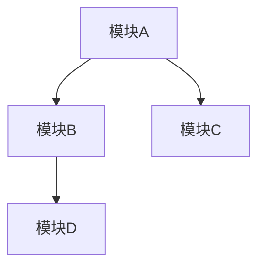
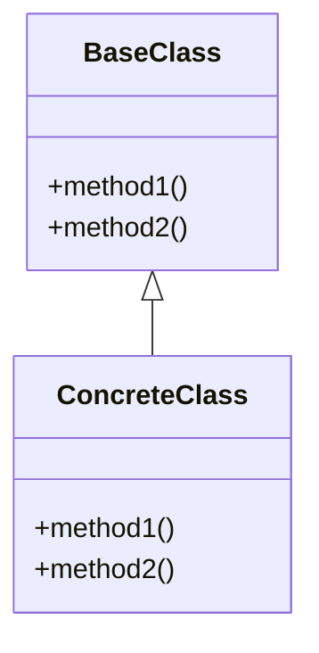
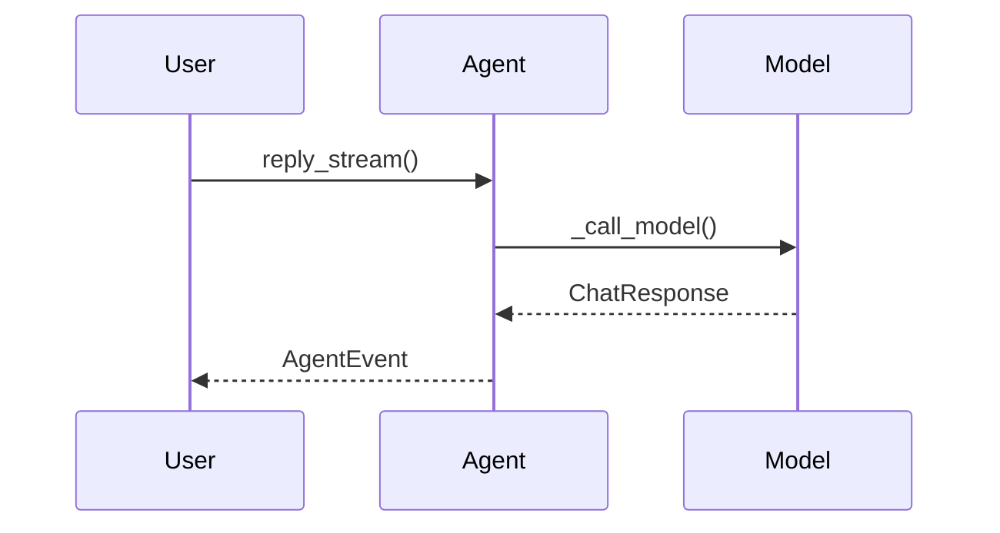

# AgentScope 2.0 代码深度分析计划

## 一、项目概览

**项目名称**: AgentScope 2.0
**项目定位**: 生产就绪、易于使用的 AI Agent 框架，支持日益增强的模型能力，内置微调支持
**核心设计理念**: 利用模型的推理和工具使用能力，而非通过严格的提示词和固执的编排来约束它们
**技术栈**: Python 3.11+ / FastAPI / Pydantic / OpenTelemetry / Redis / Docker / E2B
**许可证**: Apache-2.0
**来源**: 阿里巴巴通义实验室 SysML 团队

---

## 二、分析文件输出规划

所有分析文件将保存在 `/workspace/ReadCode/` 目录下，按以下结构组织：

```
ReadCode/
├── 01_项目架构总览.md          # 整体架构、模块关系、设计理念
├── 02_核心Agent系统.md         # Agent类、ReAct循环、事件流
├── 03_模型系统.md              # 模型抽象、多提供商支持、格式化器
├── 04_工具系统.md              # Toolkit、内置工具、权限检查
├── 05_消息与事件系统.md         # 消息类型、内容块、事件驱动
├── 06_权限系统.md              # 权限引擎、规则、上下文
├── 07_中间件系统.md            # 中间件架构、追踪、工具卸载
├── 08_状态与上下文管理.md       # Agent状态、上下文压缩、卸载
├── 09_工作空间系统.md          # 本地/Docker/E2B工作空间
├── 10_凭证与安全.md            # 凭证工厂、API密钥管理
├── 11_技能与MCP.md             # 技能系统、MCP协议集成
├── 12_应用服务层.md            # FastAPI服务、路由、会话管理
├── 13_前端WebUI.md             # React前端、组件架构
├── 14_嵌入与向量化.md          # 嵌入模型、缓存
├── 15_测试体系.md              # 测试策略、覆盖范围
```

---

## 三、详细分析内容规划

### 文件 1: 项目架构总览

**目标**: 从宏观角度理解整个项目的组织结构和设计哲学

**分析内容**:
1. **项目目录结构详解**
   - `src/agentscope/` - 核心库源码
   - `examples/` - 示例应用（agent_service、web_ui）
   - `tests/` - 测试套件
   - `scripts/` - 辅助脚本
   - `docs/` - 文档

2. **核心模块依赖关系图**
   - Agent → Model / Tool / Middleware / State / Permission / Workspace
   - App → Router → Service → Manager → Storage
   - Message → Block → Formatter → Model
   - Event → Agent → Middleware → Protocol

3. **设计理念深度解析**
   - "为日益增强的Agent式LLM而设计"的含义
   - 利用模型推理能力 vs 约束模型的设计取舍
   - 生产就绪性的体现（多租户、多会话、OTel）

4. **技术选型分析**
   - Python 3.11+ 的必要性（async/await、类型系统）
   - FastAPI 作为服务框架
   - Pydantic 作为数据验证
   - OpenTelemetry 作为可观测性
   - Redis 作为存储后端

5. **包管理与依赖分析**
   - pyproject.toml 依赖分组（models/service/storage/workspace/full/dev）
   - 可选依赖的设计意图

**需要配置的图表**:
- 图 1-1：项目整体架构图（模块依赖关系）
- 图 1-2：核心模块依赖关系图
- 图 1-3：技术栈分层图
- 图 1-4：包依赖分组关系图

**需要读取的文件**:
- `/workspace/README.md`
- `/workspace/pyproject.toml`
- `/workspace/src/agentscope/__init__.py`
- `/workspace/src/agentscope/_version.py`
- `/workspace/src/agentscope/_logging.py`

---

### 文件 2: 核心Agent系统

**目标**: 深入理解Agent类的完整生命周期和ReAct循环

**分析内容**:
1. **Agent类架构**
   - 构造函数参数详解（name, system_prompt, model, toolkit, middlewares, state, offloader, configs）
   - 配置系统：ModelConfig / ContextConfig / ReActConfig

2. **ReAct循环核心流程**
   - `_reply` → `_reply_impl` 主流程
   - Step 1: 检查输入事件（`_check_incoming_event`）
   - Step 2: 处理事件或消息（`_handle_incoming_event` / `_handle_incoming_messages`）
   - Step 3: 推理-行动循环
     - `_check_next_action` 决策逻辑（exit/reasoning/acting）
     - `_reasoning` → `_reasoning_impl` 推理阶段
     - `_batch_tool_calls` 工具调用分批策略
     - `_execute_sequential_tool_calls` / `_execute_concurrent_tool_calls`
   - Step 4: 最大迭代处理

3. **流式事件机制**
   - `reply_stream` vs `reply` 的区别
   - 事件类型体系：ReplyStart/End, ModelCallStart/End, TextBlock*, ThinkingBlock*, ToolCall*, ToolResult*, RequireUserConfirm, RequireExternalExecution, ExceedMaxIters

4. **工具执行生命周期**
   - `_execute_tool_call` 完整流程
   - 输入验证 → 权限检查 → 执行 → 结果处理
   - Human-in-the-loop 机制（确认/拒绝/外部执行）

5. **上下文管理**
   - `_save_to_context` 消息追加策略
   - `_prepare_model_input` 模型输入准备
   - `_get_system_prompt` 系统提示词构建

6. **并发工具执行**
   - asyncio.Queue + sentinel 模式
   - ExceptionGroup 错误收集

**需要配置的图表**:
- 图 2-1：Agent类架构全景图
- 图 2-2：ReAct循环流程图
- 图 2-3：工具执行生命周期时序图
- 图 2-4：流式事件类型层次图
- 图 2-5：工具调用状态机图（ToolCallState）
- 图 2-6：并发工具执行时序图
- 图 2-7：Agent核心概念关系总结图

**需要读取的文件**:
- `/workspace/src/agentscope/agent/_agent.py`
- `/workspace/src/agentscope/agent/_config.py`
- `/workspace/src/agentscope/agent/_utils.py`
- `/workspace/src/agentscope/agent/__init__.py`

---

### 文件 3: 模型系统

**目标**: 理解多LLM提供商的统一抽象和实现

**分析内容**:
1. **模型基类 ChatModelBase**
   - 核心接口：`__call__` / `_call_api` / `count_tokens` / `generate_structured_output`
   - 重试机制：`max_retries` + `_get_retryable_exceptions`
   - 流式 vs 非流式响应
   - Token计数策略（字节/4估算）

2. **结构化输出机制**
   - `_call_api_with_structured_output` 默认实现
   - 通过工具调用模拟结构化输出
   - Pydantic模型 / JSON Schema 支持

3. **具体模型实现**
   - OpenAI Chat（`_openai_chat/_model.py`）
   - OpenAI Response（`_openai_response/_model.py`）
   - DashScope / Anthropic / Gemini / DeepSeek / Moonshot / Ollama / xAI
   - 各实现的差异点

4. **模型卡片系统**
   - YAML配置文件（`_models/*.yaml`）
   - ModelCard 数据结构
   - `list_models` 类方法

5. **响应类型**
   - ChatResponse / StructuredResponse
   - ChatUsage / ModelUsage
   - 内容块类型（Text/Thinking/ToolCall/Data）

6. **格式化器系统**
   - FormatterBase 统一接口
   - 各提供商格式化器（OpenAI/DashScope/Anthropic/Gemini等）
   - 消息格式转换流程：Msg → Formatter → Provider API Format

**需要配置的图表**:
- 图 3-1：模型系统架构全景图
- 图 3-2：ChatModelBase类继承图
- 图 3-3：模型调用流程时序图（含重试和回退）
- 图 3-4：结构化输出实现流程图
- 图 3-5：格式化器类继承图
- 图 3-6：消息格式转换数据流图
- 图 3-7：模型卡片与YAML配置关系图

**需要读取的文件**:
- `/workspace/src/agentscope/model/_base.py`
- `/workspace/src/agentscope/model/_model_response.py`
- `/workspace/src/agentscope/model/_model_card.py`
- `/workspace/src/agentscope/model/_model_usage.py`
- `/workspace/src/agentscope/model/_openai_chat/_model.py`
- `/workspace/src/agentscope/model/_dashscope/_model.py`
- `/workspace/src/agentscope/model/_openai_chat/_models/gpt-4o.yaml`
- `/workspace/src/agentscope/formatter/_formatter_base.py`
- `/workspace/src/agentscope/formatter/_openai_formatter.py`

---

### 文件 4: 工具系统

**目标**: 理解工具注册、调用、权限检查的完整机制

**分析内容**:
1. **工具协议 ToolBase**
   - 核心属性：name, description, input_schema, is_concurrency_safe, is_read_only, is_external_tool, is_state_injected, is_mcp
   - 权限方法：check_permissions, check_read_only, match_rule, generate_suggestions
   - 路径安全：_path_in_allowed_working_path, _is_dangerous_path

2. **Toolkit 工具包**
   - 工具注册与管理
   - 工具分组机制（basic/advanced/skill等）
   - 工具调用流程：call_tool
   - 工具Schema生成：get_tool_schemas

3. **内置工具详解**
   - **Bash**: 命令执行、安全检查、bash_parser解析
   - **Read**: 文件读取、行号支持、缓存
   - **Write**: 文件写入、危险路径检查
   - **Edit**: 搜索替换编辑、diff生成
   - **Glob**: 文件模式匹配
   - **Grep**: 内容搜索（基于ripgrep）
   - **Skill**: 技能调用工具
   - **Meta**: 元信息工具

4. **任务工具**
   - TaskToolBase 基类
   - CreateTask / GetTask / ListTask / UpdateTask
   - 任务状态管理

5. **工具适配器**
   - 函数工具适配（`_FunctionTool`）
   - MCP工具适配（`MCPTool`）
   - 将任意可调用对象转换为ToolBase

6. **工具响应**
   - ToolChunk（流式中间结果）
   - ToolResponse（最终结果）
   - ToolChoice（工具选择策略）

**需要配置的图表**:
- 图 4-1：工具系统架构全景图
- 图 4-2：ToolBase类继承图
- 图 4-3：Toolkit工具注册与调用流程图
- 图 4-4：工具分组机制示意图
- 图 4-5：Bash工具权限检查流程图
- 图 4-6：工具适配器转换数据流图
- 图 4-7：工具调用完整时序图（从Agent到执行）

**需要读取的文件**:
- `/workspace/src/agentscope/tool/_base.py`
- `/workspace/src/agentscope/tool/_toolkit.py`
- `/workspace/src/agentscope/tool/_tool_group.py`
- `/workspace/src/agentscope/tool/_types.py`
- `/workspace/src/agentscope/tool/_response.py`
- `/workspace/src/agentscope/tool/_adapters.py`
- `/workspace/src/agentscope/tool/_constants.py`
- `/workspace/src/agentscope/tool/_utils.py`
- `/workspace/src/agentscope/tool/_builtin/_bash.py`
- `/workspace/src/agentscope/tool/_builtin/_bash_parser.py`
- `/workspace/src/agentscope/tool/_builtin/_edit.py`
- `/workspace/src/agentscope/tool/_builtin/_read.py`
- `/workspace/src/agentscope/tool/_builtin/_write.py`
- `/workspace/src/agentscope/tool/_builtin/_glob.py`
- `/workspace/src/agentscope/tool/_builtin/_grep.py`
- `/workspace/src/agentscope/tool/_builtin/_skill.py`
- `/workspace/src/agentscope/tool/_task/_task_tool_base.py`
- `/workspace/src/agentscope/tool/_task/_create_task.py`

---

### 文件 5: 消息与事件系统

**目标**: 理解消息传递和事件驱动架构

**分析内容**:
1. **消息类型体系**
   - Msg 基类（role, name, content, usage）
   - UserMsg / AssistantMsg / SystemMsg
   - 消息内容：str vs list[Block]

2. **内容块系统**
   - TextBlock - 文本内容
   - ThinkingBlock - 思维链内容
   - ToolCallBlock - 工具调用（id, name, input, state）
   - ToolResultBlock - 工具结果（id, name, output, state）
   - DataBlock - 多模态数据（Base64Source / URLSource）
   - ToolCallState / ToolResultState 状态枚举

3. **事件系统**
   - AgentEvent 基类
   - 生命周期事件：ReplyStart/End, ModelCallStart/End
   - 文本事件：TextBlockStart/Delta/End
   - 思维事件：ThinkingBlockStart/Delta/End
   - 工具调用事件：ToolCallStart/Delta/End
   - 工具结果事件：ToolResultStart/TextDelta/DataDelta/End
   - 交互事件：RequireUserConfirm, UserConfirmResult, RequireExternalExecution, ExternalExecutionResult
   - 数据事件：DataBlockStart/Delta/End
   - 异常事件：ExceedMaxIters

4. **事件流设计**
   - 异步生成器模式
   - 事件与消息的转换
   - 流式响应到事件的映射

**需要配置的图表**:
- 图 5-1：消息与事件系统架构全景图
- 图 5-2：Msg类继承图
- 图 5-3：内容块（Block）类型层次图
- 图 5-4：事件类型层次图
- 图 5-5：消息-事件转换数据流图
- 图 5-6：流式响应到事件映射时序图

**需要读取的文件**:
- `/workspace/src/agentscope/message/_base.py`
- `/workspace/src/agentscope/message/_block.py`
- `/workspace/src/agentscope/event/_event.py`

---

### 文件 6: 权限系统

**目标**: 理解细粒度的权限控制机制

**分析内容**:
1. **权限引擎 PermissionEngine**
   - 权限检查流程
   - 规则匹配算法
   - 决策生成（ALLOW/DENY/ASK/PASSTHROUGH）

2. **权限规则 PermissionRule**
   - 规则结构（tool_name, rule_content, behavior, source）
   - 规则来源（user/suggested/system）
   - 规则匹配：match_rule 方法

3. **权限上下文 PermissionContext**
   - 工作目录（working_directories）
   - 权限模式（PermissionMode）
   - 上下文传递机制

4. **权限决策 PermissionDecision**
   - 行为类型（ALLOW/DENY/ASK/PASSTHROUGH）
   - 建议规则（suggested_rules）
   - 决策消息

5. **权限模式**
   - 不同权限模式的行为差异
   - Human-in-the-loop 集成

**需要配置的图表**:
- 图 6-1：权限系统架构全景图
- 图 6-2：权限检查流程图
- 图 6-3：权限规则匹配算法流程图
- 图 6-4：权限决策状态机图
- 图 6-5：权限上下文传递数据流图
- 图 6-6：Human-in-the-loop权限交互时序图

**需要读取的文件**:
- `/workspace/src/agentscope/permission/_engine.py`
- `/workspace/src/agentscope/permission/_rule.py`
- `/workspace/src/agentscope/permission/_types.py`
- `/workspace/src/agentscope/permission/_context.py`
- `/workspace/src/agentscope/permission/_decision.py`

---

### 文件 7: 中间件系统

**目标**: 理解中间件架构和扩展机制

**分析内容**:
1. **中间件基类 MiddlewareBase**
   - 钩子点：on_reply, on_reasoning, on_acting, on_model_call, on_system_prompt, on_compress_context
   - 中间件链执行模式（责任链模式）
   - is_implemented 检查机制

2. **中间件在Agent中的注册与执行**
   - 按钩子点分类存储
   - execute_chain 递归执行
   - next_handler 传递机制

3. **追踪中间件（Tracing）**
   - OpenTelemetry 集成
   - 属性提取（_attributes.py）
   - 数据转换（_converter.py）
   - Span创建与管理

4. **工具卸载中间件（ToolOffloadMiddleware）**
   - 将工具调用代理到远程环境
   - Docker/E2B 工作空间集成
   - 异步执行与结果回传

5. **AG-UI协议中间件**
   - AG-UI 协议实现
   - 事件到SSE的转换

**需要配置的图表**:
- 图 7-1：中间件系统架构全景图
- 图 7-2：MiddlewareBase类层次图
- 图 7-3：中间件责任链执行时序图
- 图 7-4：Agent中中间件注册与分类图
- 图 7-5：Tracing中间件OpenTelemetry集成流程图
- 图 7-6：ToolOffloadMiddleware工具卸载时序图
- 图 7-7：AG-UI协议事件转换数据流图

**需要读取的文件**:
- `/workspace/src/agentscope/middleware/_base.py`
- `/workspace/src/agentscope/middleware/_tracing/_trace.py`
- `/workspace/src/agentscope/middleware/_tracing/_attributes.py`
- `/workspace/src/agentscope/middleware/_tracing/_converter.py`
- `/workspace/src/agentscope/middleware/_tracing/_setup.py`
- `/workspace/src/agentscope/app/_middleware/_tool_offload_middleware.py`
- `/workspace/src/agentscope/app/_middleware/_protocol/_agui.py`
- `/workspace/src/agentscope/app/_middleware/_protocol/_base.py`

---

### 文件 8: 状态与上下文管理

**目标**: 理解Agent状态管理和上下文压缩机制

**分析内容**:
1. **AgentState**
   - 会话ID（session_id）
   - 上下文消息列表（context）
   - 压缩摘要（summary）
   - 工具上下文（tool_context）
   - 权限上下文（permission_context）
   - 回复ID与迭代计数

2. **上下文压缩**
   - 触发条件：token数超过阈值
   - 压缩流程：split → compress → update summary
   - 保留策略：reserve_ratio
   - 边界消息处理
   - 工具调用-结果配对保护

3. **工具结果压缩**
   - `_split_tool_result_for_compression`
   - 按token截断
   - 文本块按比例截断
   - 卸载提示信息

4. **任务状态**
   - Task 状态管理
   - 任务创建/更新/获取

5. **卸载机制**
   - 上下文卸载到文件系统
   - 工具结果卸载
   - Offloader 接口

**需要配置的图表**:
- 图 8-1：状态与上下文管理架构全景图
- 图 8-2：AgentState数据结构图
- 图 8-3：上下文压缩流程图
- 图 8-4：上下文分割策略示意图
- 图 8-5：工具结果截断流程图
- 图 8-6：卸载机制数据流图

**需要读取的文件**:
- `/workspace/src/agentscope/state/_state.py`
- `/workspace/src/agentscope/state/_task.py`
- `/workspace/src/agentscope/agent/_config.py`
- `/workspace/src/agentscope/workspace/_offload_protocol.py`

---

### 文件 9: 工作空间系统

**目标**: 理解多环境工作空间抽象

**分析内容**:
1. **工作空间基类**
   - Offloader 接口（offload_context, offload_tool_result）
   - Workspace 基类

2. **本地工作空间**
   - LocalWorkspace 实现
   - 文件系统操作

3. **Docker工作空间**
   - DockerWorkspace 实现
   - Dockerfile模板系统
   - 容器生命周期管理

4. **E2B工作空间**
   - E2BWorkspace 实现
   - 云端沙箱环境
   - Bootstrap脚本

5. **MCP网关**
   - MCPGatewayApp
   - 工具调用的网关代理

6. **网关客户端**
   - GatewayClient
   - 与工作空间的通信

**需要配置的图表**:
- 图 9-1：工作空间系统架构全景图
- 图 9-2：工作空间类继承图
- 图 9-3：本地/Docker/E2B工作空间对比图
- 图 9-4：Docker工作空间生命周期时序图
- 图 9-5：E2B工作空间交互时序图
- 图 9-6：MCP网关代理架构图

**需要读取的文件**:
- `/workspace/src/agentscope/workspace/_base.py`
- `/workspace/src/agentscope/workspace/_local_workspace.py`
- `/workspace/src/agentscope/workspace/_offload_protocol.py`
- `/workspace/src/agentscope/workspace/_docker/_docker_workspace.py`
- `/workspace/src/agentscope/workspace/_docker/_make_dockerfile.py`
- `/workspace/src/agentscope/workspace/_e2b/_e2b_workspace.py`
- `/workspace/src/agentscope/workspace/_mcp_gateway/_mcp_gateway_app.py`
- `/workspace/src/agentscope/workspace/_gateway_client.py`
- `/workspace/src/agentscope/workspace/_utils.py`

---

### 文件 10: 凭证与安全

**目标**: 理解API凭证管理和安全机制

**分析内容**:
1. **凭证基类 CredentialBase**
   - 凭证接口定义
   - API密钥管理

2. **凭证工厂 CredentialFactory**
   - 工厂模式实现
   - 按类型创建凭证
   - 自定义凭证注册

3. **具体凭证实现**
   - OpenAICredential
   - DashScopeCredential
   - AnthropicCredential
   - GeminiCredential
   - DeepSeekCredential
   - MoonshotCredential
   - OllamaCredential
   - XAICredential

4. **安全设计**
   - 凭证隔离
   - 环境变量读取
   - 多租户凭证管理

**需要配置的图表**:
- 图 10-1：凭证系统架构全景图
- 图 10-2：CredentialBase类继承图
- 图 10-3：CredentialFactory工厂模式流程图
- 图 10-4：凭证在模型调用中的传递数据流图

**需要读取的文件**:
- `/workspace/src/agentscope/credential/_base.py`
- `/workspace/src/agentscope/credential/_factory.py`
- `/workspace/src/agentscope/credential/_openai.py`
- `/workspace/src/agentscope/credential/_dashscope.py`
- `/workspace/src/agentscope/credential/_anthropic.py`

---

### 文件 11: 技能与MCP

**目标**: 理解技能系统和MCP协议集成

**分析内容**:
1. **技能基类 SkillBase**
   - 技能定义与接口
   - 技能描述与参数

2. **本地技能加载器**
   - 从本地路径加载技能
   - 技能发现与注册
   - frontmatter解析

3. **MCP客户端**
   - MCP协议实现
   - SSE / Streamable HTTP 传输
   - 工具发现与调用

4. **MCP配置**
   - 服务器配置结构
   - 连接参数管理

5. **技能与工具的关系**
   - 技能如何转换为工具
   - SkillTool 桥接

**需要配置的图表**:
- 图 11-1：技能与MCP系统架构全景图
- 图 11-2：SkillBase类层次图
- 图 11-3：技能加载与注册流程图
- 图 11-4：MCP客户端交互时序图
- 图 11-5：技能到工具的转换数据流图

**需要读取的文件**:
- `/workspace/src/agentscope/skill/_base.py`
- `/workspace/src/agentscope/skill/_local_loader.py`
- `/workspace/src/agentscope/mcp/_mcp_client.py`
- `/workspace/src/agentscope/mcp/_config.py`

---

### 文件 12: 应用服务层

**目标**: 理解FastAPI服务架构和API设计

**分析内容**:
1. **应用工厂 create_app**
   - FastAPI应用创建
   - 路由注册
   - 中间件配置
   - 生命周期管理

2. **路由层**
   - agent_router - Agent CRUD
   - chat_router - 聊天交互
   - session_router - 会话管理
   - credential_router - 凭证管理
   - model_router - 模型查询
   - schedule_router - 定时任务
   - workspace_router - 工作空间
   - background_task_router - 后台任务

3. **服务层**
   - AgentService - Agent组装与执行
   - ChatService - 聊天逻辑

4. **管理器**
   - SessionManager - 会话生命周期
   - WorkspaceManager - 工作空间管理
   - BackgroundTaskManager - 后台任务
   - SchedulerManager - 定时调度

5. **存储层**
   - StorageBase 抽象
   - RedisStorage 实现
   - 数据模型（Agent/Session/Credential/Schedule/User）

6. **Schema层**
   - 请求/响应模型定义
   - Pydantic模型验证

7. **依赖注入**
   - FastAPI依赖系统
   - 存储与工作空间注入

**需要配置的图表**:
- 图 12-1：应用服务层架构全景图
- 图 12-2：FastAPI应用创建与配置流程图
- 图 12-3：路由-服务-管理器-存储分层架构图
- 图 12-4：聊天请求处理时序图
- 图 12-5：会话管理生命周期时序图
- 图 12-6：存储层类继承图
- 图 12-7：数据模型关系图（ER图）

**需要读取的文件**:
- `/workspace/src/agentscope/app/_app.py`
- `/workspace/src/agentscope/app/_deps.py`
- `/workspace/src/agentscope/app/_lifespan.py`
- `/workspace/src/agentscope/app/_types.py`
- `/workspace/src/agentscope/app/_router/_agent.py`
- `/workspace/src/agentscope/app/_router/_chat.py`
- `/workspace/src/agentscope/app/_router/_session.py`
- `/workspace/src/agentscope/app/_service/_agent.py`
- `/workspace/src/agentscope/app/_service/_chat.py`
- `/workspace/src/agentscope/app/_manager/_session_manager.py`
- `/workspace/src/agentscope/app/_manager/_workspace_manager.py`
- `/workspace/src/agentscope/app/_manager/_background_task_manager.py`
- `/workspace/src/agentscope/app/_manager/_scheduler/_scheduler_manager.py`
- `/workspace/src/agentscope/app/storage/_base.py`
- `/workspace/src/agentscope/app/storage/_redis_storage.py`
- `/workspace/src/agentscope/app/storage/_model/_agent.py`
- `/workspace/src/agentscope/app/storage/_model/_session.py`
- `/workspace/src/agentscope/app/_schema/_agent.py`
- `/workspace/src/agentscope/app/_schema/_chat.py`

---

### 文件 13: 前端WebUI

**目标**: 理解前端架构和与后端的交互

**分析内容**:
1. **技术栈**
   - React + TypeScript + Vite
   - shadcn/ui 组件库
   - TanStack Query（数据获取）
   - i18next（国际化）

2. **页面结构**
   - Chat页面 - 聊天交互
   - Setup页面 - Agent配置
   - Schedule页面 - 定时任务
   - Credential页面 - 凭证管理

3. **核心组件**
   - ChatContent / MessageBubble - 聊天内容
   - ToolRenderers - 工具结果渲染（Bash/Edit/Read/Write/Glob/Grep）
   - AgentDialog - Agent配置对话框
   - WorkspaceDrawer - 工作空间抽屉
   - SchemaForm - 动态表单

4. **Hooks**
   - useChat - 聊天逻辑
   - useAgents - Agent管理
   - useSessions - 会话管理
   - useMessages - 消息管理

5. **API层**
   - HTTP客户端封装
   - SSE事件流处理
   - 类型定义

6. **后端服务**
   - Express/Fastify 代理
   - SSE转发

**需要配置的图表**:
- 图 13-1：前端WebUI架构全景图
- 图 13-2：前端组件层次图
- 图 13-3：页面路由结构图
- 图 13-4：聊天交互时序图（前端→后端→Agent）
- 图 13-5：SSE事件流处理数据流图
- 图 13-6：Hooks数据流图

**需要读取的文件**:
- `/workspace/examples/web_ui/frontend/package.json`
- `/workspace/examples/web_ui/frontend/src/App.tsx`
- `/workspace/examples/web_ui/frontend/src/main.tsx`
- `/workspace/examples/web_ui/frontend/src/api/client.ts`
- `/workspace/examples/web_ui/frontend/src/api/chat.ts`
- `/workspace/examples/web_ui/frontend/src/hooks/useChat.ts`
- `/workspace/examples/web_ui/frontend/src/pages/chat/index.tsx`
- `/workspace/examples/web_ui/frontend/src/components/chat/ChatContent.tsx`
- `/workspace/examples/web_ui/backend/src/index.ts`
- `/workspace/examples/web_ui/backend/package.json`

---

### 文件 14: 嵌入与向量化

**目标**: 理解嵌入模型系统

**分析内容**:
1. **嵌入基类 EmbeddingBase**
   - 统一接口
   - 响应类型

2. **缓存机制**
   - CacheBase 抽象
   - FileCache 文件缓存

3. **具体实现**
   - OpenAI / DashScope / Gemini / Ollama 嵌入
   - 多模态嵌入

**需要配置的图表**:
- 图 14-1：嵌入系统架构全景图
- 图 14-2：EmbeddingBase类继承图
- 图 14-3：缓存机制流程图

**需要读取的文件**:
- `/workspace/src/agentscope/embedding/_embedding_base.py`
- `/workspace/src/agentscope/embedding/_cache_base.py`
- `/workspace/src/agentscope/embedding/_file_cache.py`
- `/workspace/src/agentscope/embedding/_embedding_response.py`
- `/workspace/src/agentscope/embedding/_openai_embedding.py`

---

### 文件 15: 测试体系

**目标**: 理解测试策略和覆盖范围

**分析内容**:
1. **测试框架**
   - pytest 配置
   - 测试组织方式

2. **测试覆盖**
   - Agent基础测试
   - 模型测试（各提供商）
   - 格式化器测试
   - 工具测试（内置工具）
   - 权限测试
   - 中间件测试
   - 工作空间测试
   - 存储测试

3. **测试工具**
   - utils.py 辅助函数
   - test_template.py 模板

**需要配置的图表**:
- 图 15-1：测试体系架构全景图
- 图 15-2：测试覆盖范围矩阵图
- 图 15-3：测试文件与源码模块映射图

**需要读取的文件**:
- `/workspace/tests/test_template.py`
- `/workspace/tests/utils.py`
- `/workspace/tests/agent_basic_test.py`
- `/workspace/tests/toolkit_test.py`
- `/workspace/tests/permission_engine_test.py`
- `/workspace/tests/middleware_test.py`

---

## 四、实施步骤

### 阶段 1: 基础架构分析（文件 1）
1. 读取项目配置和入口文件
2. 绘制模块依赖关系
3. 总结设计理念

### 阶段 2: 核心系统分析（文件 2-6）
4. 深入分析Agent类和ReAct循环
5. 分析模型系统和格式化器
6. 分析工具系统和内置工具
7. 分析消息与事件系统
8. 分析权限系统

### 阶段 3: 扩展系统分析（文件 7-11）
9. 分析中间件系统
10. 分析状态与上下文管理
11. 分析工作空间系统
12. 分析凭证与安全
13. 分析技能与MCP

### 阶段 4: 应用层分析（文件 12-15）
14. 分析应用服务层
15. 分析前端WebUI
16. 分析嵌入系统
17. 分析测试体系

---

## 五、写作规范

### 5.1 总-分-总陈述结构

每篇文章严格遵循"总-分-总"的思路进行陈述：

1. **总（开篇概述）**：
   - 本模块是什么——一句话定义
   - 本模块解决什么问题——核心痛点与设计目标
   - 本模块在整体架构中的位置——与上下游模块的关系概览
   - 配一张**模块全景图**，让读者先建立整体印象

2. **分（逐层展开）**：
   - 按子模块/功能点逐个深入
   - 每个子模块内部也遵循"先总后分"：先说设计意图，再说实现细节
   - 关键流程配**流程图/时序图**，数据结构配**类图**，模块关系配**依赖图**
   - 代码片段引用关键实现，标注文件路径与行号

3. **总（总结升华）**：
   - 回顾本模块的核心设计决策与取舍
   - 本模块的扩展点与定制方式
   - 与其他模块的协作关系总结
   - 配一张**核心概念关系图**，帮助读者形成闭环理解

### 5.2 图表配置规范

每篇文章必须包含以下类型的图（使用 Mermaid 语法绘制，直接嵌入 Markdown）：

| 图表类型 | 使用场景 | 最少数量 |
|---------|---------|---------|
| **架构/模块关系图** | 展示模块在整体中的位置、与其他模块的依赖 | 每篇至少1张 |
| **类图/继承图** | 展示核心类的继承关系、接口实现 | 涉及类继承时必须配 |
| **流程图/时序图** | 展示核心执行流程、调用链路 | 每篇至少1张 |
| **状态机图** | 展示状态转换逻辑（如工具调用状态、权限决策） | 涉及状态流转时必须配 |
| **数据流图** | 展示数据在各层之间的流转 | 涉及数据转换时必须配 |

**图表命名规范**：
- 每张图使用有意义的标题，格式：`图 X-X：[描述]`
- 图表编号按文章内顺序递增

**Mermaid 图表示例**：







---

## 六、分析方法论

1. **自顶向下**: 先理解整体架构，再深入每个模块
2. **追踪数据流**: 从用户输入到最终输出的完整路径
3. **模式识别**: 识别设计模式（工厂、策略、责任链、观察者等）
4. **对比分析**: 比较不同提供商的实现差异
5. **接口抽象**: 关注抽象接口和具体实现的关系

---

## 七、假设与决策

1. **假设**: 读者有Python异步编程和LLM基础概念
2. **决策**: 按模块划分文件，而非按功能点，便于独立阅读
3. **决策**: 每个文件严格遵循"总-分-总"结构：开篇概述 → 逐层展开 → 总结升华
4. **决策**: 每篇文章必须配置 Mermaid 图表（架构图、类图、流程图、状态机图、数据流图）
5. **决策**: 重点关注核心流程，对辅助工具类简要说明
6. **决策**: 代码引用使用文件路径+行号，便于定位
