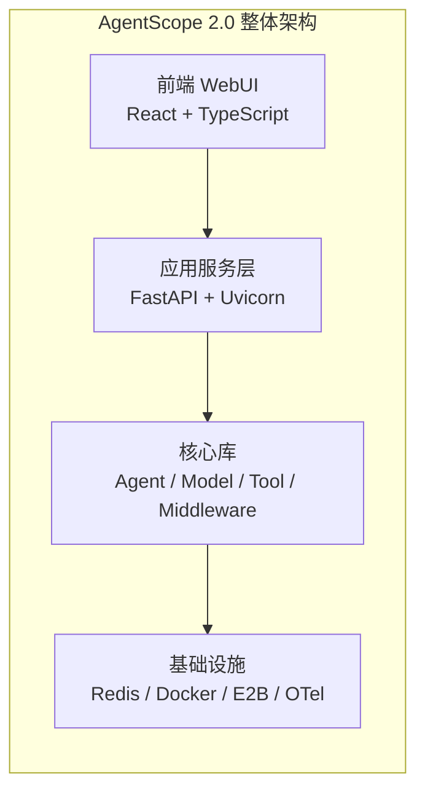
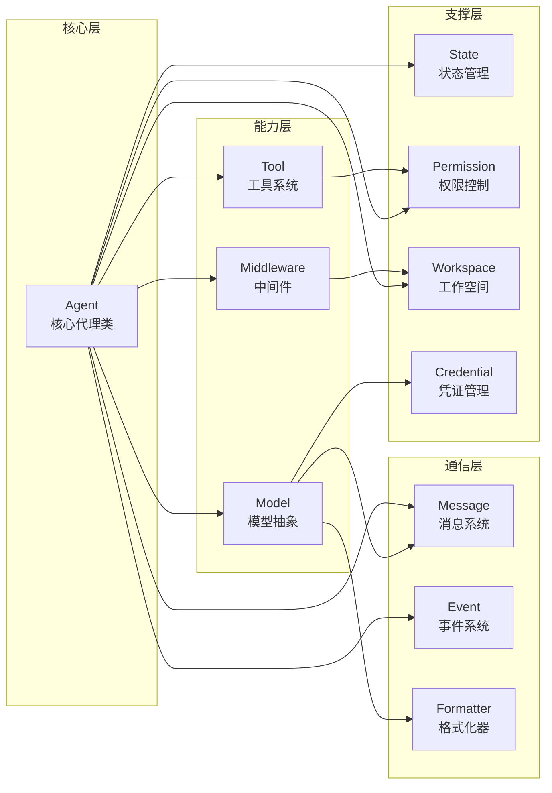
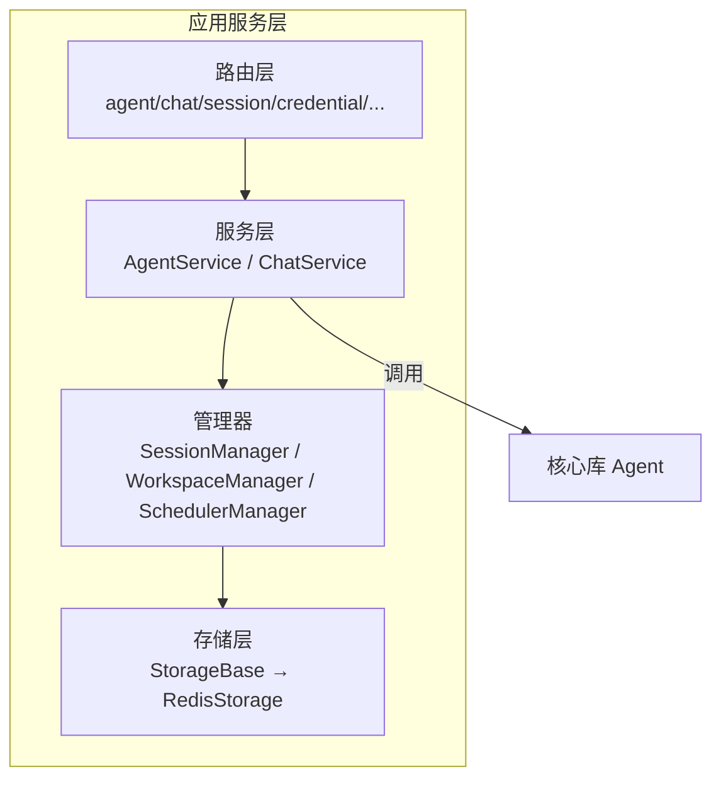
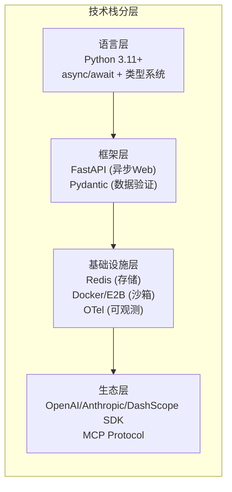
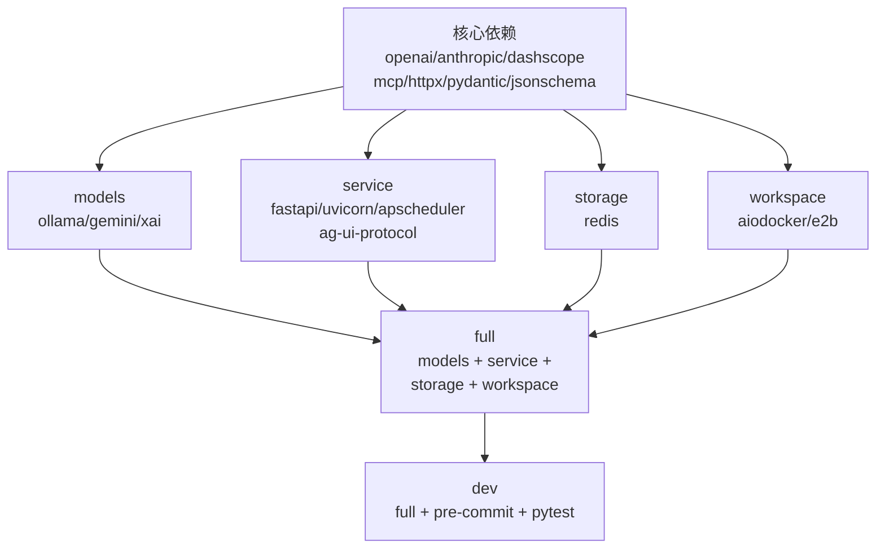
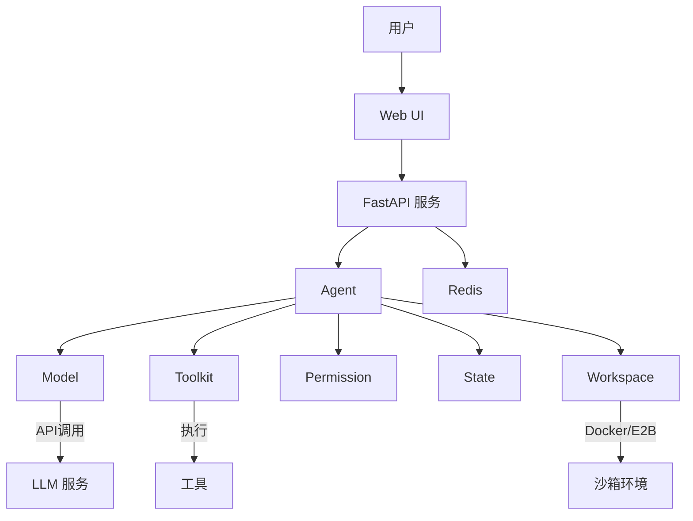

# AgentScope 2.0 项目架构总览

## 总：开篇概述

AgentScope 2.0 是阿里巴巴通义实验室 SysML 团队开源的生产就绪型 AI Agent 框架。它的核心设计理念是：**利用模型日益增强的推理和工具使用能力，而非通过严格的提示词和固执的编排来约束它们**。这意味着框架不会替模型做决策，而是提供必要的抽象和基础设施，让模型自主推理、选择工具、执行操作。

**核心痛点与设计目标**：
- **简单性**：5分钟内构建Agent，内置ReAct、工具、技能、人机协作、记忆、规划
- **可扩展性**：大量生态集成，内置MCP和A2A支持，消息中枢实现灵活编排
- **生产就绪**：支持本地部署、云Serverless、K8s集群，内置OTel可观测性

**技术栈**：Python 3.11+ / FastAPI / Pydantic / OpenTelemetry / Redis / Docker / E2B



*图 1-1：AgentScope 2.0 项目整体架构图*

---

## 分：逐层展开

### 1. 项目目录结构

```
agentscope/
├── src/agentscope/          # 核心库源码
│   ├── agent/               # Agent核心类与配置
│   ├── model/               # 模型抽象与多提供商实现
│   ├── tool/                # 工具协议、工具包、内置工具
│   ├── message/             # 消息类型与内容块
│   ├── event/               # 事件系统
│   ├── permission/          # 权限引擎与规则
│   ├── middleware/          # 中间件基类与追踪
│   ├── state/               # Agent状态管理
│   ├── workspace/           # 工作空间（本地/Docker/E2B）
│   ├── credential/          # 凭证管理
│   ├── formatter/           # 消息格式化器
│   ├── skill/               # 技能系统
│   ├── mcp/                 # MCP协议客户端
│   ├── embedding/           # 嵌入模型
│   ├── app/                 # 应用服务层（FastAPI）
│   │   ├── _router/         # API路由
│   │   ├── _service/        # 业务服务
│   │   ├── _manager/        # 管理器（会话/工作空间/调度）
│   │   ├── _middleware/     # 应用中间件（工具卸载/AG-UI）
│   │   ├── _schema/         # 请求/响应模型
│   │   └── storage/         # 存储层（Redis）
│   └── types/               # 公共类型定义
├── examples/                # 示例应用
│   ├── agent_service/       # Agent服务示例
│   └── web_ui/              # Web UI（前端+后端）
├── tests/                   # 测试套件
├── scripts/                 # 辅助脚本
└── docs/                    # 文档
```

### 2. 核心模块依赖关系

AgentScope 的核心模块围绕 **Agent** 这个中心概念组织，各模块之间有清晰的依赖关系：



*图 1-2：核心模块依赖关系图*

**依赖关系解读**：
- **Agent 是中心**：所有模块都直接或间接为 Agent 服务
- **三层架构**：核心层（Agent）→ 能力层（Model/Tool/Middleware）→ 支撑层（State/Permission/Workspace/Credential）
- **通信桥梁**：Message 和 Event 是模块间通信的核心抽象，Formatter 负责消息格式转换

### 3. 应用服务层架构

应用服务层采用经典的分层架构，将核心库能力通过 FastAPI 暴露为 HTTP/SSE 服务：



*图 1-3：应用服务层分层架构*

### 4. 设计理念深度解析

#### 4.1 "为日益增强的Agent式LLM而设计"

传统Agent框架往往采用**编排式**设计——开发者预定义工作流，模型只是工作流中的一个节点。AgentScope 2.0 采用了截然不同的思路：

| 维度 | 编排式框架 | AgentScope 2.0 |
|------|-----------|----------------|
| 控制流 | 开发者预定义 | 模型自主决策 |
| 工具选择 | 框架指定 | 模型推理选择 |
| 提示词 | 严格约束 | 最小化引导 |
| 错误处理 | 框架兜底 | 模型自我修正 |
| 灵活性 | 受限 | 高度灵活 |

#### 4.2 ReAct 范式

AgentScope 采用 **ReAct（Reasoning + Acting）** 范式作为核心执行循环：
1. **Reasoning**：模型接收上下文，推理下一步行动
2. **Acting**：执行工具调用，获取结果
3. **循环**：将结果反馈给模型，继续推理，直到任务完成

这与传统的纯推理或纯工具调用模式不同，它让模型在推理和行动之间自然切换。

#### 4.3 生产就绪性

- **多租户**：通过 Storage 抽象支持用户隔离
- **多会话**：SessionManager 管理并发会话
- **可观测性**：内置 OpenTelemetry 追踪
- **安全隔离**：Docker/E2B 沙箱工作空间
- **权限控制**：细粒度的权限引擎

### 5. 技术选型分析



*图 1-3：技术栈分层图*

**关键选型理由**：
- **Python 3.11+**：原生 async/await 支持、完善的类型系统、taskgroup 和 ExceptionGroup
- **FastAPI**：原生异步、自动 OpenAPI 文档、依赖注入系统
- **Pydantic**：数据验证与序列化、JSON Schema 生成（用于工具定义）
- **OpenTelemetry**：厂商无关的可观测性标准
- **Redis**：高性能键值存储，适合会话和状态管理

### 6. 包管理与依赖分析



*图 1-4：包依赖分组关系图*

**设计意图**：
- **核心依赖最小化**：只包含必需的 SDK 和工具库
- **可选依赖分组**：按功能域划分，用户按需安装
- **dev 包含全部**：开发环境一键安装所有依赖

---

## 总：总结升华

### 核心设计决策

1. **Agent 中心化**：所有模块围绕 Agent 组织，Agent 是唯一的执行主体
2. **模型自主性**：框架不替模型做决策，提供工具和上下文，让模型自主推理
3. **事件驱动**：通过异步事件流实现实时交互和流式输出
4. **分层抽象**：核心库 → 应用服务 → 前端UI，每层可独立使用
5. **可插拔扩展**：中间件、工具、模型、工作空间均可自定义扩展

### 扩展点

| 扩展点 | 方式 | 示例 |
|--------|------|------|
| 模型 | 继承 ChatModelBase | 自定义私有模型 |
| 工具 | 继承 ToolBase 或函数适配 | 业务特定工具 |
| 中间件 | 继承 MiddlewareBase | 审计日志、认证 |
| 工作空间 | 继承 WorkspaceManagerBase | K8s 工作空间 |
| 凭证 | 继承 CredentialBase + 注册 | 企业SSO集成 |
| 存储 | 继承 StorageBase | MySQL/PostgreSQL |

### 模块协作全景



*图 1-5：模块协作全景图*

AgentScope 2.0 的架构哲学可以概括为：**给模型足够的自由度和工具，同时通过权限系统和中间件提供安全护栏**。这种设计使得随着模型能力的提升，Agent 的表现也会自然提升，而无需修改框架代码。
