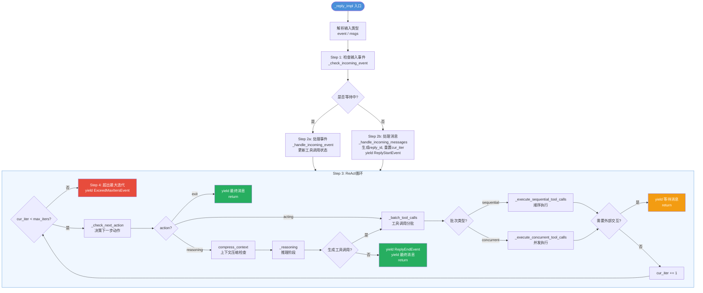
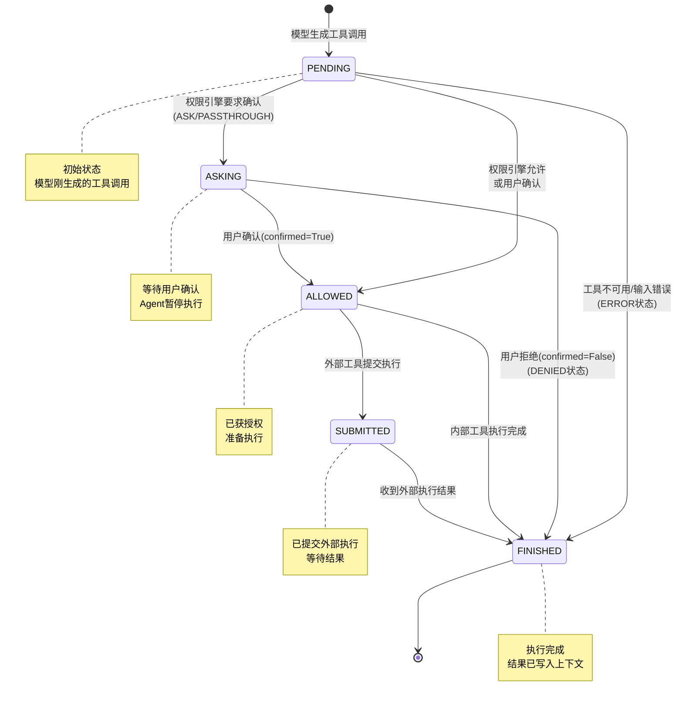
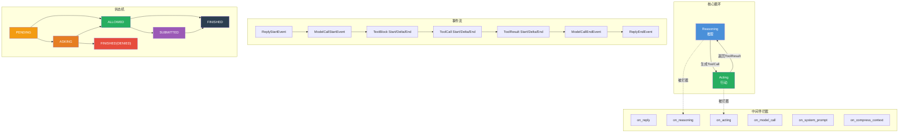

# AgentScope 2.0 核心Agent系统

## 总：开篇概述

Agent类是AgentScope框架的核心，是整个框架的**唯一执行主体**。它解决了一个根本问题：**如何让LLM自主推理、选择工具、执行操作，形成完整的ReAct（Reasoning-Acting）循环**。

在AgentScope的整体架构中，Agent处于中心位置，它依赖但不直接管理以下子系统：

- **Model**：大语言模型，提供推理能力
- **Toolkit**：工具集，提供与外部世界交互的能力
- **Middleware**：中间件，提供可插拔的行为拦截与增强
- **State**：状态管理，维护对话上下文与执行状态
- **PermissionEngine**：权限引擎，控制工具执行的安全性
- **Offloader**：卸载器，管理超长上下文的压缩与持久化

> **配图 2-1：Agent类架构全景图**

```mermaid
graph TB
    Agent["Agent<br/>核心执行主体"]

    subgraph 依赖子系统
        Model["Model (ChatModelBase)<br/>大语言模型推理"]
        Toolkit["Toolkit<br/>工具注册与调度"]
        Middleware["Middleware (MiddlewareBase)<br/>行为拦截与增强"]
        State["AgentState<br/>对话上下文与执行状态"]
        Permission["PermissionEngine<br/>权限检查与决策"]
        Offloader["Offloader<br/>上下文卸载与持久化"]
    end

    Agent --> Model
    Agent --> Toolkit
    Agent --> Middleware
    Agent --> State
    Agent --> Permission
    Agent --> Offloader

    subgraph 配置层
        ModelConfig["ModelConfig<br/>fallback_model, max_retries"]
        ContextConfig["ContextConfig<br/>trigger_ratio, reserve_ratio,<br/>compression_prompt, summary_schema,<br/>tool_result_limit"]
        ReActConfig["ReActConfig<br/>max_iters, stop_on_reject"]
    end

    Agent --> ModelConfig
    Agent --> ContextConfig
    Agent --> ReActConfig

    style Agent fill:#4A90D9,color:#fff,stroke:#2C5F8A
    style Model fill:#67B7D1,color:#fff,stroke:#3A8BA3
    style Toolkit fill:#67B7D1,color:#fff,stroke:#3A8BA3
    style Middleware fill:#67B7D1,color:#fff,stroke:#3A8BA3
    style State fill:#67B7D1,color:#fff,stroke:#3A8BA3
    style Permission fill:#67B7D1,color:#fff,stroke:#3A8BA3
    style Offloader fill:#67B7D1,color:#fff,stroke:#3A8BA3
    style ModelConfig fill:#A8D8B9,color:#333,stroke:#6BAF7D
    style ContextConfig fill:#A8D8B9,color:#333,stroke:#6BAF7D
    style ReActConfig fill:#A8D8B9,color:#333,stroke:#6BAF7D
```



---

## 分：逐层展开

### 1. Agent类架构

#### 1.1 构造函数参数详解

Agent的构造函数定义于 `_agent.py` 第97-110行，接受以下核心参数：

| 参数 | 类型 | 说明 |
|------|------|------|
| `name` | `str` | Agent标识符，用于消息归属和日志追踪 |
| `system_prompt` | `str` | 系统提示词，运行时可被中间件动态修改 |
| `model` | `ChatModelBase` | 核心推理模型，提供LLM调用能力 |
| `toolkit` | `Toolkit \| None` | 工具集，作为工具/MCP/技能的唯一注册源 |
| `middlewares` | `list[MiddlewareBase] \| None` | 中间件列表，按钩子点自动分类存储 |
| `state` | `AgentState \| None` | Agent状态，未提供时自动创建新实例 |
| `offloader` | `Offloader \| None` | 上下文卸载器，用于压缩和持久化 |
| `model_config` | `ModelConfig` | 模型配置（回退模型、重试次数） |
| `context_config` | `ContextConfig` | 上下文配置（压缩阈值、工具结果限制） |
| `react_config` | `ReActConfig` | ReAct循环配置（最大迭代次数） |

构造函数中还隐式创建了 `PermissionEngine`（第153行），它基于 `state.permission_context` 初始化，负责工具调用的权限决策。

#### 1.2 配置系统详解

三个配置类均定义于 `_config.py`，使用Pydantic BaseModel实现类型安全的配置管理：

**ModelConfig**（第150-176行）：
- `fallback_model: ChatModelBase | None`：主模型失败后的回退模型
- `max_retries: int = 0`：每个模型的重试次数（0表示仅调用一次，不重试）

**ContextConfig**（第56-125行）：
- `trigger_ratio: float = 0.8`：当token数超过上下文窗口的80%时触发压缩
- `reserve_ratio: float = 0.1`：压缩时保留最近10%的上下文
- `compression_prompt: str`：指导压缩模型生成摘要的提示词
- `summary_schema: dict`：结构化摘要的JSON Schema（默认使用 `SummarySchema`）
- `tool_result_limit: int = 3000`：工具结果的最大token数，超出则截断

**ReActConfig**（第128-148行）：
- `max_iters: int = 20`：ReAct循环的最大迭代次数
- `stop_on_reject: bool = False`：工具调用被拒绝时是否停止推理

#### 1.3 中间件分类存储机制

中间件在构造时通过 `is_implemented()` 方法自动检测已实现的钩子，并分类存储到六个独立列表（第167-185行）：

| 列表 | 钩子方法 | 拦截点 | 模式 |
|------|----------|--------|------|
| `_reply_middlewares` | `on_reply` | 整个reply流程 | 洋葱模式 |
| `_reasoning_middlewares` | `on_reasoning` | 推理阶段 | 洋葱模式 |
| `_acting_middlewares` | `on_acting` | 工具执行阶段 | 洋葱模式 |
| `_model_call_middlewares` | `on_model_call` | 模型API调用 | 洋葱模式 |
| `_system_prompt_middlewares` | `on_system_prompt` | 系统提示词获取 | 管道模式 |
| `_compress_context_middlewares` | `on_compress_context` | 上下文压缩 | 洋葱模式 |

> **洋葱模式**：中间件形成链式调用，每个中间件可以 `before → next_handler → after` 地包裹后续逻辑。
> **管道模式**：中间件按顺序依次变换数据（如系统提示词字符串），前一个的输出是后一个的输入。

---

### 2. ReAct循环核心流程

ReAct循环是Agent的核心执行逻辑，实现在 `_reply_impl` 方法中（第542-685行）。该方法是一个异步生成器，逐步yield事件和消息。

> **配图 2-2：ReAct循环流程图**



#### Step 1: 检查输入事件（_check_incoming_event）

定义于第858-947行。该方法检查Agent当前是否在等待外部事件（用户确认或外部执行结果），并与传入的事件进行匹配验证：

- 如果Agent在等待确认/执行结果但未收到事件 → 抛出 `ValueError`
- 如果收到事件但Agent不在等待状态 → 抛出 `ValueError`
- 如果事件中的tool_call_id与等待中的不匹配 → 抛出 `ValueError`
- 返回 `True` 表示继续上一次的reply，`False` 表示开始新的reply

#### Step 2: 处理事件或消息

- **_handle_incoming_event**（第949-1048行）：处理 `UserConfirmResultEvent`（更新工具调用状态为ALLOWED或DENIED）和 `ExternalExecutionResultEvent`（直接追加执行结果到上下文）
- **_handle_incoming_messages**（第1050-1076行）：验证并追加新消息到上下文，拒绝system角色消息和包含tool_call/tool_result/thinking块的消息

#### Step 3: 推理-行动循环

**_check_next_action 决策逻辑**（第2218-2312行）：

该方法通过检查最后一条消息中的工具调用状态，决定下一步动作：

| 条件 | 动作 | 说明 |
|------|------|------|
| 有可执行工具调用（PENDING/ALLOWED） | `"acting"` | 执行工具 |
| 无可执行调用 + 有等待中调用（ASKING/SUBMITTED） | `"exit"` | 等待外部事件 |
| 无可执行调用 + 无等待中调用 | `"reasoning"` | 调用模型推理 |

**_reasoning → _reasoning_impl 推理阶段**（第687-856行）：

1. yield `ModelCallStartEvent`
2. 调用 `_prepare_model_input` 准备模型输入
3. 调用 `_call_model` 执行模型推理
4. 将流式响应转换为事件（TextBlock/ThinkingBlock/ToolCallBlock的Start/Delta/End事件）
5. 将完整响应保存到上下文
6. 若无工具调用，直接yield最终消息并结束

**_batch_tool_calls 工具调用分批策略**（第1078-1115行）：

根据工具的 `is_concurrency_safe` 属性将工具调用分为sequential和concurrent两种批次：
- 并发安全工具 → `concurrent` 批次
- 非并发安全工具 → `sequential` 批次
- 相邻同类型批次合并

#### Step 4: 最大迭代处理

当循环超过 `max_iters` 时（第675-685行），yield `ExceedMaxItersEvent` 和一条提示消息，告知用户已达到最大迭代次数。

---

### 3. 流式事件机制

#### 3.1 reply_stream vs reply

Agent提供两种回复方式：

- **reply_stream**（第191-214行）：异步生成器，逐步yield `AgentEvent`，适合实时展示Agent的推理和执行过程
- **reply**（第216-252行）：消费所有流式事件，仅返回最终的 `Msg` 对象

两者底层共享同一个 `_reply` 方法，区别仅在于 `reply_stream` 过滤掉 `Msg` 类型只返回事件，而 `reply` 只保留最后的 `Msg`。

#### 3.2 事件类型体系

所有事件类型定义于 `event/_event.py`，继承自 `EventBase`（包含 `id` 和 `created_at` 字段）。

> **配图 2-4：流式事件类型层次图**

```mermaid
classDiagram
    class EventBase {
        +str id
        +str created_at
    }

    class ReplyStartEvent {
        +str session_id
        +str reply_id
        +str name
        +str role
    }
    class ReplyEndEvent {
        +str session_id
        +str reply_id
    }

    class ModelCallStartEvent {
        +str reply_id
        +str model_name
    }
    class ModelCallEndEvent {
        +str reply_id
        +int input_tokens
        +int output_tokens
    }

    class TextBlockStartEvent {
        +str reply_id
        +str block_id
    }
    class TextBlockDeltaEvent {
        +str reply_id
        +str block_id
        +str delta
    }
    class TextBlockEndEvent {
        +str reply_id
        +str block_id
    }

    class ThinkingBlockStartEvent {
        +str reply_id
        +str block_id
    }
    class ThinkingBlockDeltaEvent {
        +str reply_id
        +str block_id
        +str delta
    }
    class ThinkingBlockEndEvent {
        +str reply_id
        +str block_id
    }

    class DataBlockStartEvent {
        +str reply_id
        +str block_id
        +str media_type
    }
    class DataBlockDeltaEvent {
        +str reply_id
        +str block_id
        +str data
        +str media_type
    }
    class DataBlockEndEvent {
        +str reply_id
        +str block_id
    }

    class ToolCallStartEvent {
        +str reply_id
        +str tool_call_id
        +str tool_call_name
    }
    class ToolCallDeltaEvent {
        +str reply_id
        +str tool_call_id
        +str delta
    }
    class ToolCallEndEvent {
        +str reply_id
        +str tool_call_id
    }

    class ToolResultStartEvent {
        +str reply_id
        +str tool_call_id
        +str tool_call_name
    }
    class ToolResultTextDeltaEvent {
        +str reply_id
        +str tool_call_id
        +str delta
    }
    class ToolResultDataDeltaEvent {
        +str reply_id
        +str tool_call_id
        +str block_id
        +str media_type
        +str data
        +str url
    }
    class ToolResultEndEvent {
        +str reply_id
        +str tool_call_id
        +ToolResultState state
    }

    class ExceedMaxItersEvent {
        +str reply_id
        +str name
    }

    class RequireUserConfirmEvent {
        +str reply_id
        +list tool_calls
    }
    class RequireExternalExecutionEvent {
        +str reply_id
        +list tool_calls
    }

    class UserConfirmResultEvent {
        +str reply_id
        +list confirm_results
    }
    class ExternalExecutionResultEvent {
        +str reply_id
        +list execution_results
    }

    EventBase <|-- ReplyStartEvent
    EventBase <|-- ReplyEndEvent
    EventBase <|-- ModelCallStartEvent
    EventBase <|-- ModelCallEndEvent
    EventBase <|-- TextBlockStartEvent
    EventBase <|-- TextBlockDeltaEvent
    EventBase <|-- TextBlockEndEvent
    EventBase <|-- ThinkingBlockStartEvent
    EventBase <|-- ThinkingBlockDeltaEvent
    EventBase <|-- ThinkingBlockEndEvent
    EventBase <|-- DataBlockStartEvent
    EventBase <|-- DataBlockDeltaEvent
    EventBase <|-- DataBlockEndEvent
    EventBase <|-- ToolCallStartEvent
    EventBase <|-- ToolCallDeltaEvent
    EventBase <|-- ToolCallEndEvent
    EventBase <|-- ToolResultStartEvent
    EventBase <|-- ToolResultTextDeltaEvent
    EventBase <|-- ToolResultDataDeltaEvent
    EventBase <|-- ToolResultEndEvent
    EventBase <|-- ExceedMaxItersEvent
    EventBase <|-- RequireUserConfirmEvent
    EventBase <|-- RequireExternalExecutionEvent
    EventBase <|-- UserConfirmResultEvent
    EventBase <|-- ExternalExecutionResultEvent
```



事件按生命周期可分为四组：
1. **Reply生命周期**：`ReplyStartEvent` → `ReplyEndEvent`
2. **模型调用生命周期**：`ModelCallStartEvent` → `ModelCallEndEvent`
3. **内容块生命周期**：`Start` → `Delta*` → `End`（Text/Thinking/Data/ToolCall/ToolResult各有独立的三段式事件）
4. **交互事件**：`RequireUserConfirmEvent`、`RequireExternalExecutionEvent`（输出）、`UserConfirmResultEvent`、`ExternalExecutionResultEvent`（输入）

---

### 4. 工具执行生命周期

#### 4.1 _execute_tool_call 完整流程

`_execute_tool_call` 方法（第1269-1518行）是单个工具调用的完整生命周期管理器。

> **配图 2-3：工具执行生命周期时序图**

```mermaid
sequenceDiagram
    participant Loop as ReAct循环
    participant Exec as _execute_tool_call
    participant Validate as 输入验证
    participant Perm as PermissionEngine
    participant Acting as _acting (中间件链)
    participant Toolkit as Toolkit.call_tool
    participant Ctx as 上下文管理

    Loop->>Exec: 执行工具调用(tool_call)

    rect rgb(255, 240, 240)
        Note over Exec,Validate: Step 1: 输入验证
        Exec->>Validate: check_tool_available + 解析+校验input
        alt 验证失败
            Validate-->>Exec: AgentOrientedException
            Exec->>Ctx: 保存错误结果(DENIED/ERROR)
            Exec-->>Loop: yield ToolResult*事件
        end
    end

    rect rgb(255, 255, 230)
        Note over Exec,Perm: Step 2: 权限检查
        Exec->>Perm: check_permission(tool, parsed_input)
        Perm-->>Exec: PermissionDecision
    end

    alt ASK / PASSTHROUGH
        Exec->>Ctx: 更新状态为ASKING
        Exec-->>Loop: yield RequireUserConfirmEvent
    else DENY
        Exec->>Ctx: 保存拒绝结果
        Exec-->>Loop: yield ToolResult*事件(DENIED)
    else ALLOW
        Exec->>Ctx: 更新状态为ALLOWED
        Exec->>Exec: yield ToolResultStartEvent

        alt 外部工具(is_external_tool)
            Exec->>Ctx: 更新状态为SUBMITTED
            Exec-->>Loop: yield RequireExternalExecutionEvent
        else 内部工具
            rect rgb(230, 255, 230)
                Note over Exec,Toolkit: Step 4: 执行工具
                Exec->>Acting: _acting(tool_call)
                Acting->>Toolkit: call_tool(tool_call, state)
                Toolkit-->>Acting: ToolChunk / ToolResponse
                Acting-->>Exec: ToolChunk / ToolResponse
            end

            rect rgb(230, 240, 255)
                Note over Exec,Ctx: Step 5: 结果处理
                Exec->>Exec: _split_tool_result_for_compression
                Exec->>Ctx: 保存截断后的结果
                Exec->>Ctx: 更新状态为FINISHED
                Exec-->>Loop: yield ToolResultEndEvent
            end
        end
    end
```

#### 4.2 Human-in-the-loop 机制

Agent支持两种外部交互模式：

1. **RequireUserConfirmEvent**（第1377-1381行）：当权限引擎返回 `ASK` 或 `PASSTHROUGH` 行为时，Agent暂停执行，等待用户确认。用户可通过 `UserConfirmResultEvent` 返回确认/拒绝结果，并可选附带权限规则。

2. **RequireExternalExecutionEvent**（第1408-1421行）：当工具标记为 `is_external_tool` 时，Agent将工具调用提交给外部执行器，等待 `ExternalExecutionResultEvent` 返回执行结果。

这两种机制使得Agent可以在关键操作前暂停，实现安全的Human-in-the-loop控制。

#### 4.3 工具调用状态机

`ToolCallState` 定义于 `message/_block.py` 第95-102行，包含五种状态。

> **配图 2-5：工具调用状态机图**



---

### 5. 上下文管理

#### 5.1 _save_to_context 消息追加策略

`_save_to_context` 方法（第2152-2207行）实现了智能的消息追加逻辑：

- 若上下文为空 → 创建新的 `AssistantMsg`，使用 `reply_id` 作为消息ID
- 若最后一条消息是当前Agent的assistant消息 → 将blocks追加到该消息的content中（合并同一轮回复的所有内容块），并累加token用量
- 否则 → 创建新的 `AssistantMsg`

这种设计确保**一次reply对应一条AssistantMsg**，便于事件与消息的ID对应关系。

#### 5.2 _prepare_model_input 模型输入准备

`_prepare_model_input` 方法（第1973-2001行）按以下顺序组装模型输入：

1. **系统提示词**：`SystemMsg`，内容来自 `_get_system_prompt()`
2. **压缩摘要**：若存在 `state.summary`，追加为 `UserMsg`
3. **对话上下文**：`state.context` 中的所有消息
4. **工具Schema**：通过 `toolkit.get_tool_schemas()` 获取当前激活工具组的Schema

#### 5.3 _get_system_prompt 系统提示词构建

`_get_system_prompt` 方法（第1956-1971行）构建过程：

1. 以构造函数中的 `_system_prompt` 为基础
2. 追加Toolkit中的技能指令（`get_skill_instructions()`）
3. 依次通过 `_system_prompt_middlewares` 管道变换（每个中间件接收前一个的输出字符串）

---

### 6. 并发工具执行

#### 6.1 asyncio.Queue + sentinel 模式

`_execute_concurrent_tool_calls` 方法（第1164-1250行）使用经典的异步并发模式：

1. 创建 `asyncio.Queue` 作为事件收集队列
2. 每个工具调用通过 `_into_queue` 包装为独立协程，将事件推入队列
3. 使用 `asyncio.gather(*tasks, return_exceptions=True)` 并发执行所有协程
4. gather完成后放入 `sentinel` 对象标记结束
5. 主循环从队列中取出事件yield，遇到sentinel时退出

关键设计：sentinel在gather**之后**放入队列，保证所有 `_into_queue` 中的 `queue.put` 都已完成，确保事件流的完整性。

#### 6.2 ExceptionGroup 错误收集

当并发执行中部分工具调用失败时（第1243-1250行）：
- `return_exceptions=True` 确保一个失败不会取消其他任务
- 所有任务完成后，收集异常并通过 `ExceptionGroup` 一次性抛出
- 调用者可以检查每个独立的失败原因

> **配图 2-6：并发工具执行时序图**

```mermaid
sequenceDiagram
    participant Loop as ReAct循环
    participant Conc as _execute_concurrent_tool_calls
    participant Queue as asyncio.Queue
    participant W1 as Worker 1<br/>(_into_queue)
    participant W2 as Worker 2<br/>(_into_queue)
    participant Gather as asyncio.gather

    Loop->>Conc: 执行并发工具调用

    Conc->>Gather: create_task(_run_all)
    Gather->>W1: _into_queue(tool_call_1, queue)
    Gather->>W2: _into_queue(tool_call_2, queue)

    par 并发执行
        W1->>Queue: put(event_1a)
        W1->>Queue: put(event_1b)
        W1->>Queue: put(event_1c)
    and
        W2->>Queue: put(event_2a)
        W2->>Queue: put(event_2b)
    end

    Gather-->>Gather: 所有任务完成
    Gather->>Queue: put(sentinel)

    loop 从队列取事件
        Conc->>Queue: get()
        Queue-->>Conc: event
        Conc->>Loop: yield event
    end
    Conc->>Queue: get() → sentinel
    Conc->>Gather: await results

    alt 有异常
        Conc-->>Loop: raise ExceptionGroup
    else 全部成功
        Conc-->>Loop: 完成
    end
```

---

### 7. 模型调用机制

#### 7.1 _call_model 方法：重试 + 回退模型

`_call_model` 方法（第2003-2125行）实现了两层容错机制：

1. **重试层**：对每个模型最多尝试 `max_retries + 1` 次
2. **回退层**：主模型全部重试失败后，切换到 `fallback_model` 继续重试

```
主模型 → 重试max_retries次 → 失败 → 回退模型 → 重试max_retries次 → 失败 → 抛出异常
```

#### 7.2 中间件包装的模型调用链

当存在 `_model_call_middlewares` 时（第2046-2095行），实际的模型调用被中间件链包裹。每个中间件可以：
- 修改 `messages`、`tools`、`tool_choice` 参数
- 替换 `current_model`（例如路由到不同模型）
- 记录调用日志和性能指标
- 实现缓存、限流等横切关注点

中间件链通过递归的 `execute_chain` 函数实现，每个中间件调用 `next_handler` 传递到下一层，最终到达原始的 `model()` 调用。

---

## 总：总结升华

### 核心设计决策

AgentScope 2.0的Agent系统围绕四个核心设计决策构建：

1. **ReAct范式**：将LLM的推理与行动统一在循环中，模型生成工具调用 → 执行工具 → 观察结果 → 继续推理，直至任务完成或达到迭代上限。这种范式使Agent能够处理需要多步操作的复杂任务。

2. **事件驱动**：整个执行过程通过异步生成器逐步yield事件，实现了流式输出、实时监控和Human-in-the-loop交互。事件类型覆盖了Reply、模型调用、内容块、工具调用/结果等完整生命周期。

3. **中间件可插拔**：六个钩子点（reply、reasoning、acting、model_call、system_prompt、compress_context）提供了细粒度的行为拦截能力。洋葱模式保证before/after逻辑的对称性，管道模式适合数据变换。

4. **并发安全**：通过 `_ToolCallBatch` 分批策略区分并发安全/非安全工具，使用 `asyncio.Queue + sentinel` 模式保证事件流完整性，`ExceptionGroup` 收集并发错误。

### 扩展点

| 扩展方式 | 说明 | 示例 |
|----------|------|------|
| 自定义中间件 | 继承 `MiddlewareBase`，实现需要的钩子方法 | 日志中间件、缓存中间件、限流中间件 |
| 自定义工具 | 注册到 `Toolkit`，支持并发安全标记和外部工具 | 文件操作工具、API调用工具 |
| 自定义权限规则 | 通过 `PermissionEngine.add_rule()` 添加 | 基于工具名、参数值的细粒度控制 |
| 自定义上下文压缩 | 通过 `ContextConfig` 调整压缩策略 | 修改摘要Schema、压缩提示词 |
| 自定义Offloader | 实现 `Offloader` 接口 | 文件系统持久化、数据库存储 |

> **配图 2-7：Agent核心概念关系总结图**



AgentScope 2.0的Agent系统通过ReAct循环、事件驱动、中间件可插拔和并发安全四大设计决策，构建了一个既灵活又可靠的LLM Agent执行框架。开发者可以通过中间件、工具和权限规则的扩展点，在不修改核心代码的前提下定制Agent行为，实现从简单对话到复杂多步操作的广泛场景覆盖。
