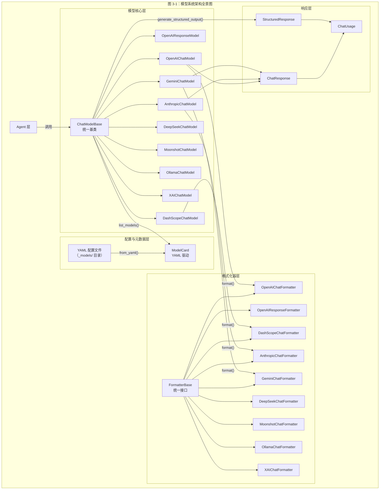
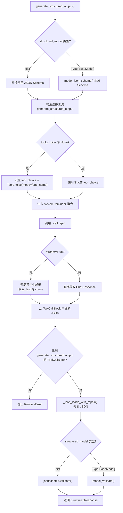
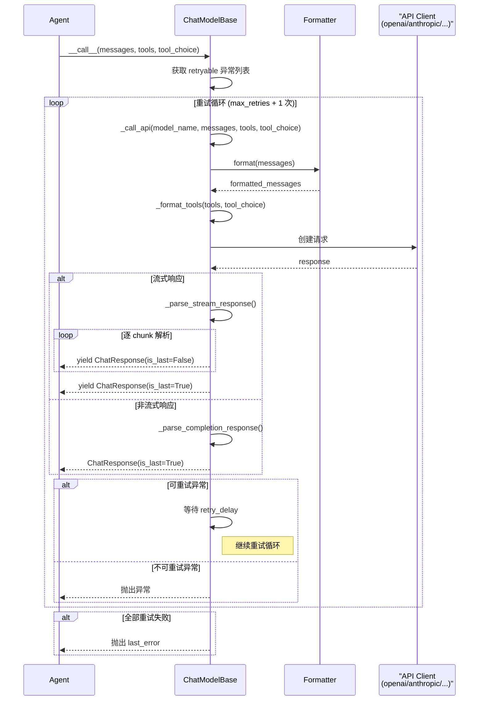
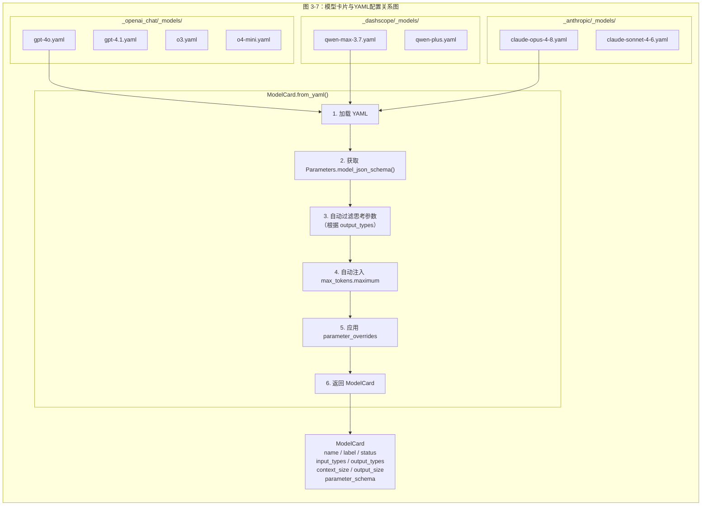
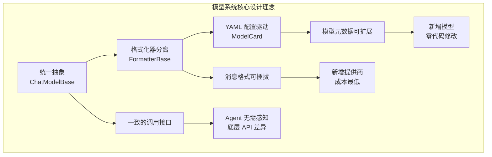

# AgentScope 2.0 模型系统

## 总：开篇概述

模型（Model）模块是 Agent 的"大脑"，负责与各种大语言模型（LLM）提供商通信，将用户的意图转化为模型调用，并将模型输出统一为框架内部可处理的结构。AgentScope 2.0 的模型系统面对的核心挑战是：**不同 LLM 提供商的 API 格式、认证方式、参数体系、流式协议各不相同**，而框架需要为上层 Agent 提供一致的调用接口。

模型系统通过三层抽象解决这一问题：

1. **统一基类** `ChatModelBase`：定义标准调用接口与重试机制
2. **格式化器** `FormatterBase`：将框架内部 `Msg` 消息转换为各提供商 API 所需格式
3. **模型卡片** `ModelCard`：通过 YAML 配置驱动模型元数据与参数管理



核心源码文件分布：

| 模块 | 路径 |
|------|------|
| 模型基类 | `src/agentscope/model/_base.py` |
| 模型响应 | `src/agentscope/model/_model_response.py` |
| 模型卡片 | `src/agentscope/model/_model_card.py` |
| 用量统计 | `src/agentscope/model/_model_usage.py` |
| 格式化器基类 | `src/agentscope/formatter/_formatter_base.py` |
| OpenAI 格式化器 | `src/agentscope/formatter/_openai_formatter.py` |

---

## 分：逐层展开

### 1. 模型基类 ChatModelBase

`ChatModelBase` 是所有模型实现的抽象基类，定义了模型调用的统一契约。它不依赖任何特定的 LLM SDK，而是通过子类注入具体的 API 客户端。

> 源码：`src/agentscope/model/_base.py`，第 35–570 行

#### 1.1 核心接口

| 方法 | 类型 | 说明 |
|------|------|------|
| `__call__` | 公共 | 带重试的模型调用入口 |
| `_call_api` | 抽象 | 子类必须实现的底层 API 调用 |
| `count_tokens` | 公共 | Token 计数（字节/4 估算） |
| `generate_structured_output` | 公共 | 生成结构化输出 |
| `_call_api_with_structured_output` | 可覆写 | 结构化输出的默认实现 |
| `list_models` | 类方法 | 列出可用模型卡片 |
| `_get_retryable_exceptions` | 类方法 | 声明可重试的异常类型 |
| `_validate_tool_choice` | 公共 | 校验 tool_choice 参数 |

#### 1.2 重试机制

`__call__` 方法（第 157–217 行）实现了统一的重试逻辑：

```python
# _base.py 第 181-213 行
retryable = tuple(self._get_retryable_exceptions())
last_error: Exception | None = None
for attempt in range(self.max_retries + 1):
    try:
        return await self._call_api(...)
    except Exception as e:
        if not isinstance(e, retryable):
            raise  # 不可重试的异常立即抛出
        last_error = e
        if attempt < self.max_retries:
            await asyncio.sleep(self.retry_delay)
```

关键设计决策：
- **最大尝试次数** = `max_retries + 1`（默认 4 次）
- **选择性重试**：只有 `_get_retryable_exceptions()` 返回的异常类型才触发重试，其他异常立即抛出
- **延迟策略**：固定延迟 `retry_delay`（默认 1.0 秒），未采用指数退避
- **SDK 懒加载**：子类在覆写 `_get_retryable_exceptions()` 时才导入对应 SDK，保持 SDK 为可选依赖

各提供商的可重试异常对比：

| 模型实现 | 可重试异常 | SDK |
|----------|-----------|-----|
| `OpenAIChatModel` | `APIConnectionError`, `APITimeoutError`, `RateLimitError`, `InternalServerError` | `openai` |
| `OpenAIResponseModel` | 同上 | `openai` |
| `DashScopeChatModel` | 同上 | `openai`（兼容接口） |
| `DeepSeekChatModel` | 同上 | `openai`（兼容接口） |
| `MoonshotChatModel` | 同上 | `openai`（兼容接口） |
| `AnthropicChatModel` | `APIConnectionError`, `APITimeoutError`, `RateLimitError`, `InternalServerError` | `anthropic` |
| `GeminiChatModel` | `APIError`（含 4xx/5xx） | `google.genai.errors` |
| `OllamaChatModel` | `ConnectError`, `ReadTimeout`, `RemoteProtocolError` | `httpx` |
| `XAIChatModel` | `RpcError`（含 gRPC 全部错误） | `grpc` |

#### 1.3 流式 vs 非流式响应

`_call_api` 的返回类型为 `ChatResponse | AsyncGenerator[ChatResponse, None]`，由 `self.stream` 参数控制：

- **非流式**（`stream=False`）：返回单个 `ChatResponse`，`is_last=True`
- **流式**（`stream=True`）：返回异步生成器，逐步 yield `ChatResponse`（`is_last=False`），最后 yield 一个 `is_last=True` 的完整响应

流式响应的解析模式在所有实现中保持一致：使用累加器（`acc_text`, `acc_thinking`, `acc_tool_calls`）逐步拼接 delta 内容，最终在流结束时 yield 完整的累积结果。

#### 1.4 Token 计数策略

`count_tokens` 方法（第 296–371 行）采用**字节/4 估算**策略：

```python
# _base.py 第 368-369 行
acc_text = "".join(acc_texts)
cnt += int(len(acc_text.encode("utf-8")) / 4 + 0.5)
```

- 文本内容：UTF-8 字节数 ÷ 4（四舍五入）
- Base64 多模态数据：原始数据长度 ÷ 4
- URL 多模态数据：仅计入 URL 字符串本身（不下载）
- 工具 JSON Schema：序列化后计入文本
- 子类可覆写此方法提供更精确的 tokenizer 实现

#### 1.5 类继承体系

```mermaid
classDiagram
    direction TB

    class ChatModelBase {
        +credential: CredentialBase
        +model: str
        +stream: bool
        +max_retries: int
        +retry_delay: float
        +context_size: int
        +parameters: BaseModel
        +__call__(messages, tools, tool_choice) ChatResponse
        #_call_api(model_name, messages, tools, tool_choice)* ChatResponse
        +count_tokens(messages, tools) int
        +generate_structured_output(messages, structured_model) StructuredResponse
        #_call_api_with_structured_output(model_name, messages, structured_model) StructuredResponse
        +list_models(custom_yaml_dir) list~ModelCard~
        #_get_retryable_exceptions() tuple
        #_validate_tool_choice(tool_choice, tools)
    }

    class OpenAIChatModel {
        +type: openai_chat
        +formatter: OpenAIChatFormatter
        +_call_api()
        +_get_retryable_exceptions()
        +_format_tools()
    }

    class OpenAIResponseModel {
        +type: openai_response
        +formatter: OpenAIResponseFormatter
        +_call_api()
        +_get_retryable_exceptions()
        +_format_tools()
    }

    class DashScopeChatModel {
        +type: dashscope_chat
        +formatter: DashScopeChatFormatter
        +_call_api()
        +_call_api_with_structured_output()
        +_format_tools()
    }

    class AnthropicChatModel {
        +type: anthropic_chat
        +formatter: AnthropicChatFormatter
        +_call_api()
        +_call_api_with_structured_output()
        +_format_tools()
    }

    class GeminiChatModel {
        +type: gemini_chat
        +formatter: GeminiChatFormatter
        +_call_api()
        +_get_retryable_exceptions()
        +_format_tools()
    }

    class DeepSeekChatModel {
        +type: deepseek_chat
        +formatter: DeepSeekChatFormatter
        +_call_api()
        +_call_api_with_structured_output()
        +_format_tools()
    }

    class MoonshotChatModel {
        +type: moonshot_chat
        +formatter: MoonshotChatFormatter
        +_call_api()
        +_call_api_with_structured_output()
        +_format_tools()
    }

    class OllamaChatModel {
        +type: ollama_chat
        +formatter: OllamaChatFormatter
        +_call_api()
        +_get_retryable_exceptions()
        +_format_tools()
    }

    class XAIChatModel {
        +type: xai_chat
        +formatter: XAIChatFormatter
        +_call_api()
        +_get_retryable_exceptions()
        +_format_tools()
    }

    ChatModelBase <|-- OpenAIChatModel
    ChatModelBase <|-- OpenAIResponseModel
    ChatModelBase <|-- DashScopeChatModel
    ChatModelBase <|-- AnthropicChatModel
    ChatModelBase <|-- GeminiChatModel
    ChatModelBase <|-- DeepSeekChatModel
    ChatModelBase <|-- MoonshotChatModel
    ChatModelBase <|-- OllamaChatModel
    ChatModelBase <|-- XAIChatModel
```



> 图 3-2：ChatModelBase 类继承图

---

### 2. 结构化输出机制

结构化输出（Structured Output）是让 LLM 返回符合预定义 Schema 的 JSON 数据的关键能力。AgentScope 采用了一种**通过工具调用模拟结构化输出**的巧妙设计，作为不支持原生结构化输出的 API 的通用降级方案。

#### 2.1 默认实现原理

`_call_api_with_structured_output` 方法（`_base.py` 第 438–570 行）的核心思路：

1. **构造虚拟工具**：将目标 Schema 包装为一个名为 `generate_structured_output` 的工具
2. **强制工具调用**：通过 `tool_choice` 强制模型调用该工具
3. **注入引导指令**：在消息末尾插入 `<system-reminder>` 提示，确保模型遵循
4. **提取与验证**：从工具调用结果中提取 JSON，用 `jsonschema` 或 Pydantic 验证

```python
# _base.py 第 483-486 行
func_name = "generate_structured_output"
if tool_choice is None:
    tool_choice = ToolChoice(mode=func_name)
instruction = (
    "<system-reminder>Now you **MUST** call the tool named "
    f"'{func_name}' to generate the structured output required "
    "by the user. DON'T do anything else.</system-reminder>"
)
```

#### 2.2 思考模式的兼容处理

部分提供商在思考模式（Thinking Mode）下不支持强制 `tool_choice`，此时需要降级为 `auto` 模式：

| 模型 | 思考模式下的处理 |
|------|-----------------|
| `DashScopeChatModel` | `tool_choice` 降级为 `ToolChoice(mode="auto")`，依赖注入的 system-reminder 引导 |
| `AnthropicChatModel` | 同上，Anthropic 思考模式仅支持 `auto`/`none` |
| `DeepSeekChatModel` | 同上，思考模式下拒绝 `required`/对象形式 `tool_choice` |
| `MoonshotChatModel` | 同上 |

> 源码参考：`_dashscope/_model.py` 第 544–590 行、`_anthropic/_model.py` 第 513–564 行

#### 2.3 流程图



> 图 3-4：结构化输出实现流程图

---

### 3. 具体模型实现

#### 3.1 OpenAI Chat 模型实现详解

`OpenAIChatModel`（`src/agentscope/model/_openai_chat/_model.py`）是最核心的模型实现，也是其他 OpenAI 兼容提供商的参考模板。

**初始化**（第 93–142 行）：
- 使用 `OpenAICredential` 认证
- 默认 `context_size=128000`
- 默认使用 `OpenAIChatFormatter`
- 支持 `client_kwargs` 传递额外客户端参数

**参数体系**（第 35–88 行）：

| 参数 | 类型 | 默认值 | 说明 |
|------|------|--------|------|
| `max_tokens` | `int \| None` | `None` | 最大输出 Token 数 |
| `thinking_enable` | `bool` | `False` | 是否启用推理模式 |
| `reasoning_effort` | `Literal` | `None` | 推理深度（none/minimal/low/medium/high/xhigh） |
| `temperature` | `float \| None` | `None` | 采样温度 |
| `top_p` | `float \| None` | `None` | Top-P 采样 |
| `parallel_tool_calls` | `bool` | `True` | 是否允许并行工具调用 |

**API 调用流程**（第 155–253 行）：
1. 创建 `openai.AsyncClient`
2. 通过 `self.formatter.format(messages)` 格式化消息
3. 组装请求参数（model, messages, stream, max_tokens, temperature 等）
4. 处理推理模式参数（`reasoning_effort`）
5. 格式化工具与 tool_choice
6. 流式时设置 `stream_options={"include_usage": True}`
7. 调用 `client.chat.completions.create(**kwargs)`
8. 根据流式/非流式分别解析响应

**工具格式化**（第 517–554 行）：
- `tool_choice.mode` 为字面量（auto/none/required）时直接传递
- `tool_choice.mode` 为具体工具名时，转换为 `{"type": "function", "function": {"name": mode}}`
- `tool_choice.tools` 非空时，过滤工具列表仅保留指定工具

#### 3.2 DashScope 模型实现详解

`DashScopeChatModel`（`src/agentscope/model/_dashscope/_model.py`）通过 OpenAI 兼容接口调用 DashScope API，但有以下差异：

**额外参数**：
- `thinking_budget`：思考预算 Token 数
- `top_k`：Top-K 采样（通过 `extra_body` 传递）

**特殊处理**：
- 思考模式通过 `extra_body` 传递：`{"enable_thinking": True, "thinking_budget": N}`
- `tool_choice="required"` 不完全支持，降级为 `"auto"` 并发出警告
- 覆写了 `_call_api_with_structured_output`，思考模式下将 `tool_choice` 降级为 `auto`

#### 3.3 各实现差异点对比

| 特性 | OpenAI Chat | OpenAI Response | DashScope | Anthropic | Gemini | DeepSeek | Moonshot | Ollama | xAI |
|------|:-----------:|:---------------:|:---------:|:---------:|:------:|:--------:|:--------:|:------:|:---:|
| SDK | openai | openai | openai | anthropic | google-genai | openai | openai | ollama | xai_sdk |
| 协议 | REST | REST | REST(兼容) | REST | REST | REST(兼容) | REST(兼容) | REST | gRPC |
| 思考模式 | reasoning_effort | reasoning | extra_body | thinking | thinking_config | extra_body | extra_body | think | reasoning_effort |
| 结构化输出覆写 | ✗ | ✗ | ✓(auto降级) | ✓(auto降级) | ✗ | ✓(auto降级) | ✓(auto降级) | ✗ | ✗ |
| 音频输入 | ✓ | ✗ | ✓ | ✗ | ✗ | ✗ | ✗ | ✗ | ✗ |
| 音频输出 | ✓ | ✗ | ✓ | ✗ | ✗ | ✗ | ✗ | ✗ | ✗ |
| tool_choice | 完整 | allowed_tools | 降级required | type映射 | function_calling_config | 完整 | 完整 | 不支持 | required_tool |
| 默认context_size | 128000 | 200000 | 131072 | 200000 | 1048576 | 65536 | 131072 | 32768 | 131072 |

#### 3.4 模型调用流程时序图



> 图 3-3：模型调用流程时序图（含重试和回退）

---

### 4. 模型卡片系统

模型卡片（ModelCard）系统通过 YAML 配置文件管理模型元数据，实现了**配置与代码分离**的设计。

> 源码：`src/agentscope/model/_model_card.py`

#### 4.1 YAML 配置文件结构

以 `gpt-4o.yaml` 为例（`src/agentscope/model/_openai_chat/_models/gpt-4o.yaml`）：

```yaml
name: gpt-4o              # 模型标识符
label: GPT-4o             # 前端展示标签
status: active            # 状态：active / deprecated / sunset

input_types:              # 支持的输入类型
  - text/plain
  - image/jpeg
  - image/png
  - image/gif
  - image/webp

output_types:             # 支持的输出类型
  - text/plain

context_size: 128000      # 上下文窗口大小
output_size: 16384        # 最大输出 Token 数

parameter_overrides:      # 参数覆盖规则
  max_tokens:
    maximum: 16384        # 限制 max_tokens 上限
  thinking_enable:
    hidden: true          # 隐藏不支持的功能
  reasoning_effort:
    hidden: true
```

对比 `o3.yaml`（推理模型）：

```yaml
output_types:
  - text/plain
  - application/x-thinking    # 支持思考输出

parameter_overrides:
  max_tokens:
    maximum: 100000           # 更大的输出上限
  # thinking_enable 和 reasoning_effort 未隐藏 → 可用
```

#### 4.2 ModelCard 数据结构

`ModelCard`（`_model_card.py` 第 11–150 行）的核心字段：

| 字段 | 类型 | 说明 |
|------|------|------|
| `type` | `Literal["chat_model"]` | 卡片类型 |
| `name` | `str` | 模型名称 |
| `label` | `str` | 前端展示标签 |
| `status` | `Literal["active", "deprecated", "sunset"]` | 模型状态 |
| `deprecated_at` | `datetime \| None` | 弃用日期 |
| `input_types` | `list[str]` | 支持的输入类型 |
| `output_types` | `list[str]` | 支持的输出类型 |
| `context_size` | `int` | 上下文窗口大小 |
| `output_size` | `int` | 最大输出 Token 数 |
| `parameter_schema` | `dict` | 合并后的参数 JSON Schema |
| `parameters_overrides` | `dict` | 原始覆盖配置 |

#### 4.3 from_yaml 合并逻辑

`ModelCard.from_yaml()` 方法（第 72–150 行）实现了参数 Schema 的智能合并：

1. **获取基础 Schema**：从 `parameter_class.model_json_schema()` 获取
2. **自动过滤**：若 `output_types` 不含 `application/x-thinking`，移除 `thinking_enable` 和 `thinking_budget`
3. **自动注入**：将 `output_size` 设为 `max_tokens` 的 `maximum` 约束
4. **应用覆盖**：
   - `hidden: true` → 移除该参数
   - `null` → 移除该参数
   - `dict` → 与基础 Schema 浅合并（`{**base, **override}`）

#### 4.4 list_models 类方法

`list_models`（`_base.py` 第 110–155 行）通过反射定位子类的 `_models/` 目录：

```python
# _base.py 第 129-130 行
subclass_file = Path(inspect.getfile(cls))
yaml_dir = subclass_file.parent / "_models"
```

这意味着每个模型实现的 YAML 文件自动与其源码同目录，实现了**配置就近原则**。



---

### 5. 响应类型

模型系统的响应层定义了三种核心数据结构，统一了不同提供商的输出格式。

> 源码：`src/agentscope/model/_model_response.py`、`src/agentscope/model/_model_usage.py`

#### 5.1 ChatResponse

`ChatResponse`（`_model_response.py` 第 20–49 行）是模型调用的标准返回类型：

| 字段 | 类型 | 说明 |
|------|------|------|
| `content` | `Sequence[TextBlock \| ToolCallBlock \| ThinkingBlock \| DataBlock]` | 内容块序列 |
| `is_last` | `bool` | 是否为最终响应 |
| `id` | `str` | 唯一标识符（默认 UUID） |
| `created_at` | `str` | 创建时间（ISO 格式） |
| `type` | `Literal["chat_response"]` | 类型标记 |
| `usage` | `ChatUsage \| None` | Token 用量 |
| `metadata` | `dict` | 扩展元数据 |

**内容块类型**：

| 类型 | 说明 | 典型来源 |
|------|------|---------|
| `TextBlock` | 文本内容 | 所有模型 |
| `ToolCallBlock` | 工具调用 | 函数调用响应 |
| `ThinkingBlock` | 思考/推理过程 | 推理模型（o3, Claude, Qwen 等） |
| `DataBlock` | 多模态数据 | 音频输出等 |

**流式响应约定**：
- `is_last=False`：增量内容（delta），仅包含本次新增的部分
- `is_last=True`：完整累积内容，包含所有已生成的文本/工具调用/思考

#### 5.2 StructuredResponse

`StructuredResponse`（`_model_response.py` 第 52–75 行）用于结构化输出：

| 字段 | 类型 | 说明 |
|------|------|------|
| `content` | `dict` | 结构化输出内容（已验证的 JSON） |
| `id` | `str` | 唯一标识符 |
| `created_at` | `str` | 创建时间 |
| `type` | `Literal["structured_response"]` | 类型标记 |
| `usage` | `ChatUsage \| None` | Token 用量 |
| `metadata` | `dict` | 扩展元数据 |

#### 5.3 ChatUsage

`ChatUsage`（`_model_usage.py` 第 10–32 行）记录 API 调用的资源消耗：

| 字段 | 类型 | 默认值 | 说明 |
|------|------|--------|------|
| `input_tokens` | `int` | — | 输入 Token 数 |
| `output_tokens` | `int` | — | 输出 Token 数 |
| `time` | `float` | — | 调用耗时（秒） |
| `cache_creation_input_tokens` | `int` | `0` | 缓存创建 Token 数 |
| `cache_input_tokens` | `int` | `0` | 缓存命中 Token 数 |
| `type` | `Literal["chat"]` | `"chat"` | 类型标记 |
| `metadata` | `dict \| None` | `None` | 扩展元数据 |

不同提供商的缓存 Token 字段映射：

| 提供商 | 缓存字段 | 来源 |
|--------|---------|------|
| OpenAI | `cache_input_tokens` | `prompt_tokens_details.cached_tokens` |
| Anthropic | `cache_creation_input_tokens` / `cache_input_tokens` | `cache_creation_input_tokens` / `cache_read_input_tokens` |
| Gemini | `cache_input_tokens` | `cached_content_token_count` |
| DeepSeek | `cache_input_tokens` | `prompt_cache_hit_tokens` |
| xAI | `cache_input_tokens` | `cached_prompt_text_tokens` |

---

### 6. 格式化器系统

格式化器（Formatter）是模型系统的关键解耦组件，负责将框架内部的 `Msg` 消息转换为各提供商 API 所需的特定格式。这种设计使得**同一模型实现可以搭配不同的格式化器**，适应不同的对话场景（单 Agent vs 多 Agent）。

> 源码：`src/agentscope/formatter/_formatter_base.py`、`src/agentscope/formatter/_openai_formatter.py`

#### 6.1 FormatterBase 统一接口

`FormatterBase`（`_formatter_base.py` 第 22–217 行）定义了格式化器的核心契约：

| 成员 | 类型 | 说明 |
|------|------|------|
| `input_types` | `list[str]` | 支持的输入媒体类型 |
| `supported_input_media_types` | `property` | 排除 text/plain 和 thinking 后的媒体类型 |
| `format()` | `abstractmethod` | 核心格式化方法 |
| `assert_list_of_msgs()` | `staticmethod` | 输入校验 |
| `convert_tool_result_to_string()` | `method` | 工具结果的文本化降级 |
| `_group_messages()` | `staticmethod` | 消息分组（工具序列 vs Agent 消息） |

**`input_types` 的作用**：控制哪些 `DataBlock` 会被转发到 API。例如：
- `["text/plain", "image/*"]` → 图片 DataBlock 会被格式化，音频会被降级为文本
- `["text/plain", "image/*", "audio/*"]` → 图片和音频都会被格式化

**`convert_tool_result_to_string` 方法**（第 70–173 行）处理工具结果中的多模态数据降级：
- 支持的媒体类型 → 提升为独立的 user 消息（附带标识符）
- 不支持的 URL 数据 → 在文本中嵌入 URL
- 不支持的 Base64 数据 → 保存为本地文件，在文本中嵌入路径

#### 6.2 各提供商格式化器

每个提供商都有两个格式化器变体：

| 格式化器 | 场景 | 说明 |
|----------|------|------|
| `XxxChatFormatter` | 单 Agent 对话 | 使用 `name` 字段区分角色 |
| `XxxMultiAgentFormatter` | 多 Agent 对话 | 将历史对话折叠为 `<history>` 标签 |

#### 6.3 OpenAI 格式化器详解

`OpenAIChatFormatter`（`_openai_formatter.py` 第 198–359 行）的消息转换规则：

| 内容块类型 | OpenAI 格式 |
|-----------|-------------|
| `TextBlock` | `{"type": "text", "text": ...}` |
| `DataBlock`(image) | `{"type": "image_url", "image_url": {"url": ...}}` |
| `DataBlock`(audio) | `{"type": "input_audio", "input_audio": {"data": ..., "format": ...}}` |
| `ToolCallBlock` | `{"id": ..., "type": "function", "function": {"name": ..., "arguments": ...}}` |
| `ToolResultBlock` | `{"role": "tool", "tool_call_id": ..., "content": ...}` |
| `HintBlock` | 拆分为独立的 user 消息 |
| `ThinkingBlock` | 跳过（OpenAI API 不接受历史中的思考内容） |

**`_OpenAIFormatterBase`**（第 27–196 行）提供了共享的数据块格式化逻辑：
- 图片：URL 直接传递，`file://` 路径转 Base64 data URI
- 音频：始终转 Base64，仅支持 wav/mp3 格式
- assistant 角色的音频块被跳过（避免后续调用报错）

#### 6.4 格式化器类继承图

```mermaid
classDiagram
    direction TB

    class FormatterBase {
        +input_types: list~str~
        +supported_input_media_types: list~str~
        +format(msgs)* list~dict~
        +assert_list_of_msgs(msgs)
        +convert_tool_result_to_string(output) tuple
        #_group_messages(msgs) AsyncGenerator
    }

    class _OpenAIFormatterBase {
        #_format_openai_data_block(block, role) dict
        #_format_image_source(source) dict
        #_format_audio_source(source) dict
    }

    class OpenAIChatFormatter {
        +format(msgs) list~dict~
    }

    class OpenAIMultiAgentFormatter {
        +conversation_history_prompt: str
        +format(msgs) list~dict~
        #_format_tool_sequence(msgs)
        #_format_agent_message(msgs, is_first)
        #_format_system_message(msg)
    }

    class DashScopeChatFormatter
    class DashScopeMultiAgentFormatter
    class AnthropicChatFormatter
    class AnthropicMultiAgentFormatter
    class GeminiChatFormatter
    class GeminiMultiAgentFormatter
    class DeepSeekChatFormatter
    class DeepSeekMultiAgentFormatter
    class MoonshotChatFormatter
    class MoonshotMultiAgentFormatter
    class OllamaChatFormatter
    class OllamaMultiAgentFormatter
    class OpenAIResponseFormatter
    class OpenAIResponseMultiAgentFormatter
    class XAIChatFormatter
    class XAIMultiAgentFormatter

    FormatterBase <|-- _OpenAIFormatterBase
    _OpenAIFormatterBase <|-- OpenAIChatFormatter
    _OpenAIFormatterBase <|-- OpenAIMultiAgentFormatter
    FormatterBase <|-- DashScopeChatFormatter
    FormatterBase <|-- DashScopeMultiAgentFormatter
    FormatterBase <|-- AnthropicChatFormatter
    FormatterBase <|-- AnthropicMultiAgentFormatter
    FormatterBase <|-- GeminiChatFormatter
    FormatterBase <|-- GeminiMultiAgentFormatter
    FormatterBase <|-- DeepSeekChatFormatter
    FormatterBase <|-- DeepSeekMultiAgentFormatter
    FormatterBase <|-- MoonshotChatFormatter
    FormatterBase <|-- MoonshotMultiAgentFormatter
    FormatterBase <|-- OllamaChatFormatter
    FormatterBase <|-- OllamaMultiAgentFormatter
    FormatterBase <|-- OpenAIResponseFormatter
    FormatterBase <|-- OpenAIResponseMultiAgentFormatter
    FormatterBase <|-- XAIChatFormatter
    FormatterBase <|-- XAIMultiAgentFormatter
```



> 图 3-5：格式化器类继承图

#### 6.5 消息格式转换数据流图

```mermaid
flowchart LR
    subgraph "框架内部消息"
        Msg["Msg 对象<br/>role / name / content"]
        Msg --> TextBlock
        Msg --> DataBlock
        Msg --> ToolCallBlock
        Msg --> ToolResultBlock
        Msg --> ThinkingBlock
        Msg --> HintBlock
    end

    subgraph "Formatter.format()"
        direction TB
        Validate["assert_list_of_msgs()"]
        Iterate["遍历 content_blocks"]
        Transform["按类型转换"]
        Validate --> Iterate --> Transform
    end

    subgraph "OpenAI API 格式"
        direction TB
        OMsg["{role, name, content}"<br/>"{role, tool_calls}"<br/>"{role: tool, tool_call_id, content}"]
    end

    subgraph "Anthropic API 格式"
        direction TB
        AMsg["{role, content}"<br/>"system 独立参数"]
    end

    subgraph "Gemini API 格式"
        direction TB
        GMsg["{role, parts}"<br/>"function_declarations"]
    end

    TextBlock --> Transform
    DataBlock --> Transform
    ToolCallBlock --> Transform
    ToolResultBlock --> Transform
    ThinkingBlock --> Transform
    HintBlock --> Transform

    Transform -->|"OpenAIChatFormatter"| OMsg
    Transform -->|"AnthropicChatFormatter"| AMsg
    Transform -->|"GeminiChatFormatter"| GMsg
```

> 图 3-6：消息格式转换数据流图

---

## 总：总结升华

### 核心设计决策

AgentScope 2.0 模型系统的设计围绕三个核心决策展开：

**1. 统一抽象——ChatModelBase 作为唯一契约**

所有模型实现共享同一基类接口，上层 Agent 只需调用 `__call__` / `generate_structured_output` / `count_tokens`，无需关心底层 API 差异。重试机制在基类中统一实现，避免了每个子类重复编写。

**2. 格式化器分离——消息转换与 API 调用解耦**

格式化器作为独立组件注入模型实现，使得：
- 同一模型可搭配不同格式化器（单 Agent / 多 Agent）
- 新增提供商只需实现格式化器 + 模型子类
- 消息格式转换逻辑可独立测试和复用

**3. YAML 配置驱动——模型元数据与代码分离**

模型卡片通过 YAML 文件管理，实现了：
- 新增模型无需修改代码，只需添加 YAML 文件
- 参数 Schema 自动合并（基础 Schema + 覆盖规则）
- 智能过滤（思考参数根据 output_types 自动隐藏/显示）

### 扩展点

| 扩展需求 | 实现方式 |
|----------|---------|
| 新增 LLM 提供商 | 继承 `ChatModelBase`，实现 `_call_api` 和 `_format_tools`，创建对应 `Formatter` 和 `_models/` YAML |
| 自定义消息格式 | 继承 `FormatterBase`，实现 `format` 方法 |
| 原生结构化输出 | 覆写 `_call_api_with_structured_output`，直接调用 API 的结构化输出能力 |
| 精确 Token 计数 | 覆写 `count_tokens`，使用对应 tokenizer |
| 自定义重试策略 | 覆写 `_get_retryable_exceptions`，声明提供商特定的可重试异常 |



> 总结图：模型系统核心设计理念
