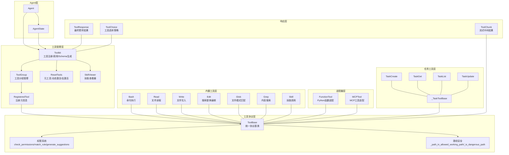
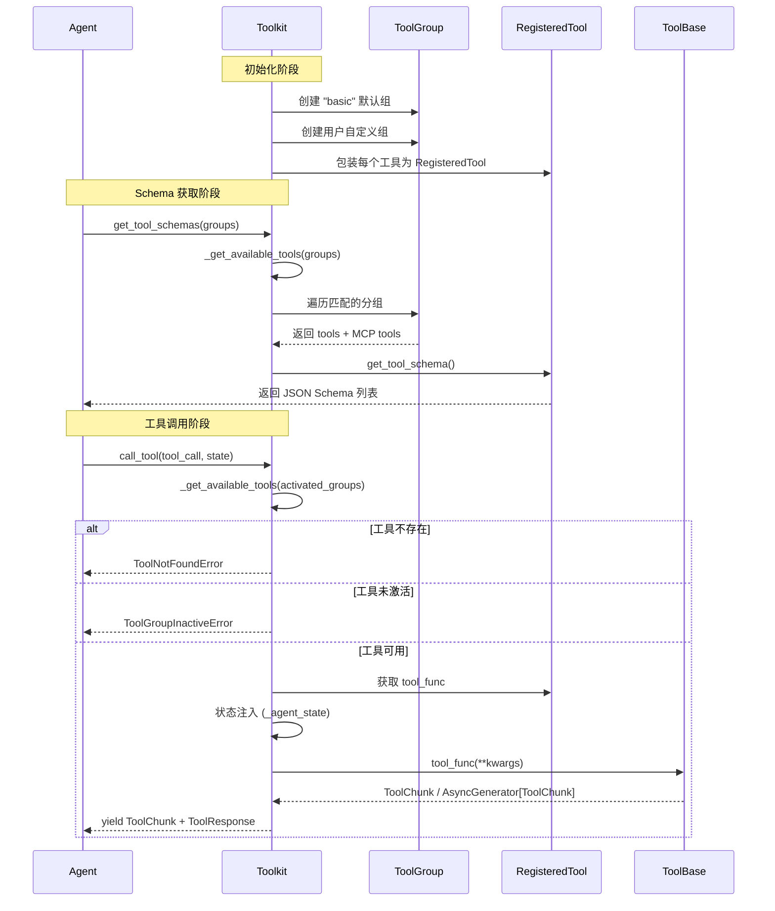
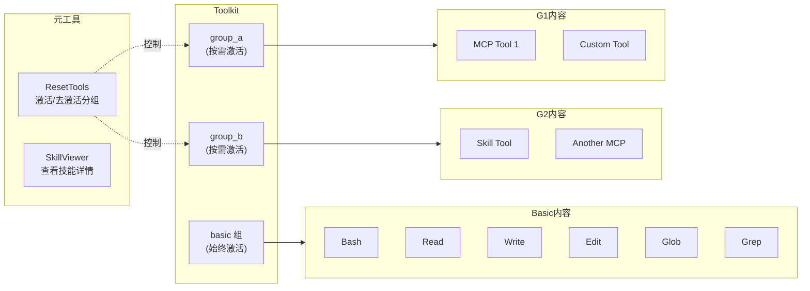
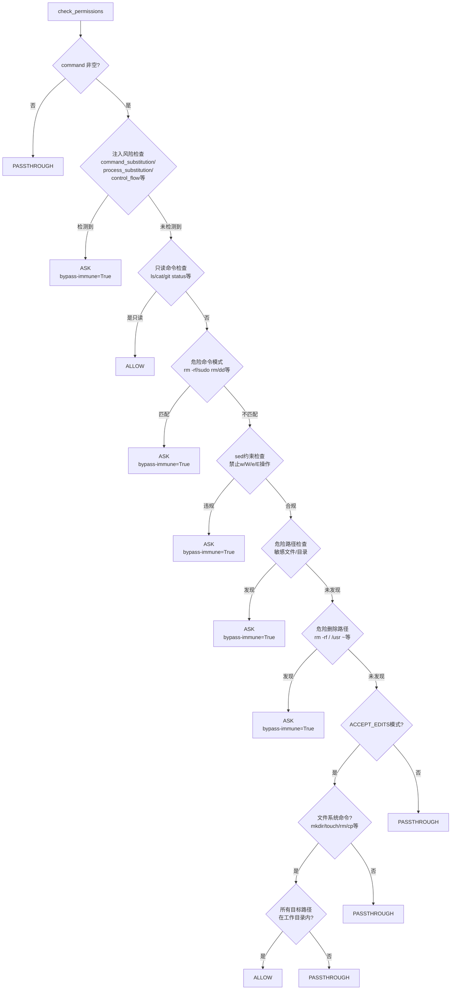
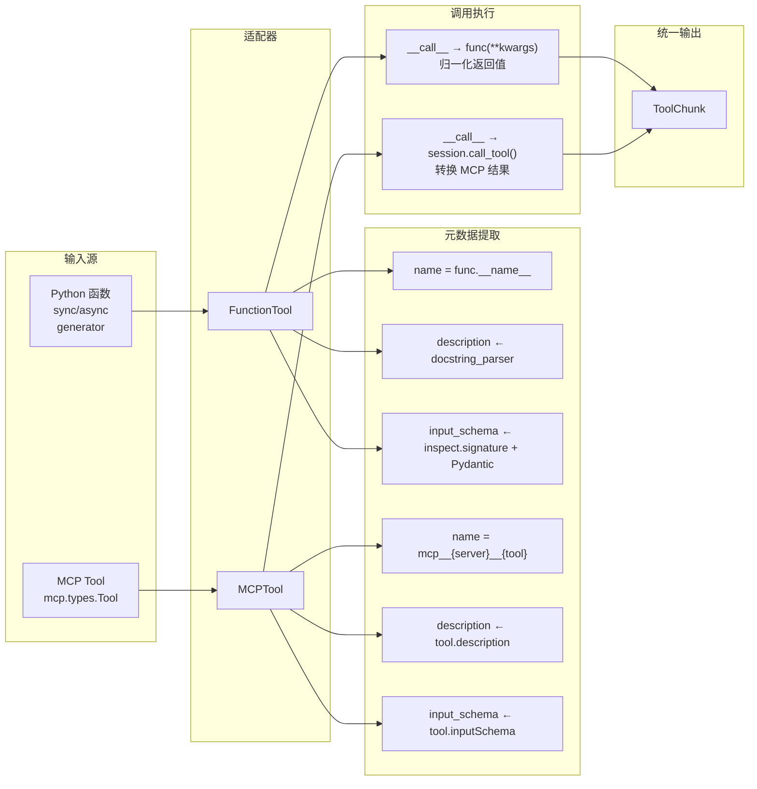
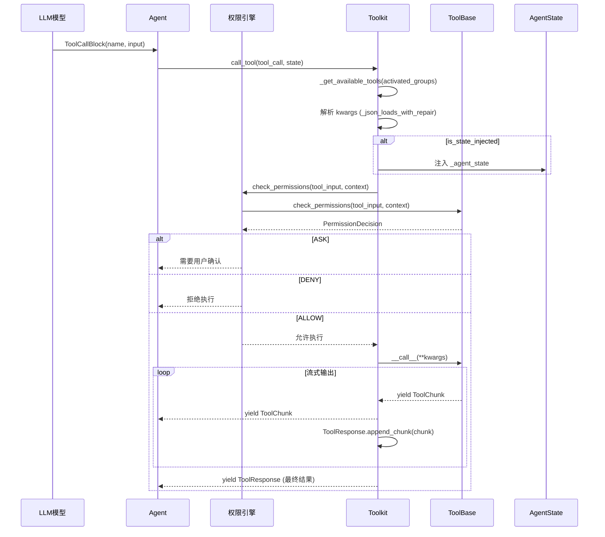
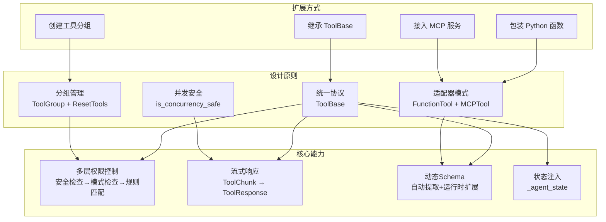

# AgentScope 2.0 工具系统

## 总：开篇概述

Tool 模块是 Agent 的"双手"，负责与外部世界的一切交互——无论是执行命令、读写文件、搜索代码，还是调用外部 API 和 MCP 服务。AgentScope 2.0 的工具系统围绕以下核心问题展开设计：

| 问题 | 解决方案 |
|------|----------|
| 工具接口不统一 | 定义 `ToolBase` 统一协议，所有工具遵循相同接口 |
| 权限控制粗粒度 | 多层权限检查（安全检查 → 模式检查 → 规则匹配）+ bypass-immune 机制 |
| 并发安全性未知 | `is_concurrency_safe` 标记 + 工具分组激活/去激活 |
| 工具发现与注册 | `Toolkit` 集中管理 + `ToolGroup` 分组 + `RegisteredTool` 元信息 |
| 异构工具接入 | 适配器模式（`FunctionTool` / `MCPTool`）将任意可调用对象转为 `ToolBase` |

**配图 4-1：工具系统架构全景图**



---

## 分：逐层展开

### 1. 工具协议 ToolBase

`ToolBase` 是整个工具系统的基石，定义了所有工具必须遵循的统一协议。它是一个抽象基类（ABC），位于 `_base.py`（第 35 行）。

#### 1.1 核心属性详解

```python
# _base.py:38-61
class ToolBase(ABC):
    name: str                           # 工具名称，呈现给 Agent
    description: str                    # 面向 Agent 的工具描述
    input_schema: dict[str, Any]        # 输入 Schema，遵循 JSON Schema 格式
    is_concurrency_safe: bool           # 是否并发安全
    is_read_only: bool                  # 是否只读（影响权限检查）
    is_external_tool: bool = False      # 是否外部工具（不需要实现 __call__）
    is_state_injected: bool = False     # 是否需要注入 AgentState
    is_mcp: bool = False                # 是否 MCP 工具
    mcp_name: str | None = None         # 所属 MCP 服务器名称
```

各属性的设计意图：

- **`name` / `description` / `input_schema`**：构成工具的"身份卡片"，供 LLM 理解和调用。`input_schema` 严格遵循 JSON Schema 格式，确保与 OpenAI Function Calling 等协议兼容。
- **`is_concurrency_safe`**：标记工具是否可被多个 Agent 并发调用。例如 `Read`（只读）和 `Glob`（只读）标记为 `True`，而 `Bash`（有副作用）和 `Edit`（修改文件）标记为 `False`。
- **`is_read_only`**：静态只读标记，用于权限引擎的快速判断。但注意 Bash 工具重写了 `check_read_only` 方法实现动态判断。
- **`is_external_tool`**：外部工具不执行实际调用，而是产生一个外部工具调用事件，由上层处理。
- **`is_state_injected`**：当为 `True` 时，`Toolkit.call_tool` 会自动注入 `_agent_state` 参数（`_toolkit.py:302-307`），使工具能访问 Agent 的状态上下文。
- **`is_mcp` / `mcp_name`**：标识 MCP 工具，影响权限检查逻辑和命名规则（MCP 工具名格式为 `mcp__{server_name}__{tool_name}`）。

#### 1.2 权限方法

ToolBase 定义了三个权限相关方法，形成"检查 → 匹配 → 建议"的完整链路：

**`check_permissions(tool_input, context) -> PermissionDecision`**（抽象方法，`_base.py:70-76`）

每个工具必须实现此方法，返回权限决策。决策类型包括：
- `ALLOW`：允许执行
- `ASK`：需要用户确认
- `PASSTHROUGH`：交由权限引擎继续规则匹配

**`check_read_only(tool_input) -> bool`**（`_base.py:78-100`）

动态判断本次调用是否只读。默认返回静态属性 `is_read_only`，但 Bash 等工具会重写此方法——例如 `ls -la` 是只读的，而 `rm -rf /` 不是。

**`match_rule(rule_content, tool_input) -> bool`**（`_base.py:102-133`）

判断权限规则是否匹配当前工具调用。默认逻辑：
- `rule_content is None`：工具名级别规则，匹配所有调用
- `rule_content` 非空：需要子类重写以支持细粒度匹配

**`generate_suggestions(tool_input) -> List[PermissionRule]`**（`_base.py:135-168`）

为当前工具调用生成建议的权限规则。默认生成一条工具名级别的允许规则，子类可重写以提供更精细的建议（如文件工具建议父目录的 glob 模式）。

#### 1.3 路径安全

ToolBase 提供两个路径安全检查方法，被文件操作类工具（Write、Edit、Bash）复用：

**`_path_in_allowed_working_path(file_path, context) -> bool`**（`_base.py:170-220`）

检查文件路径是否在允许的工作目录内。工作目录包括当前目录和 `PermissionContext.working_directories` 中的目录。使用 `os.path.realpath` 处理符号链接，确保 macOS 的 `/tmp` → `/private/tmp` 等别名正确比较。

**`_is_dangerous_path(file_path) -> bool`**（`_base.py:222-271`）

检查路径是否危险（敏感文件或目录）。判断逻辑：
1. 文件名匹配危险文件列表（如 `.bashrc`、`.env`）——大小写不敏感
2. 路径中任一段匹配危险目录（如 `.git`、`.ssh`）——大小写不敏感

危险文件和目录列表定义在 `_constants.py`（第 4-53 行），包括 shell 配置文件、SSH 配置、凭证文件、环境变量文件等。

**配图 4-2：ToolBase 类继承图**

```mermaid
classDiagram
    class ToolBase {
        <<abstract>>
        +name: str
        +description: str
        +input_schema: dict
        +is_concurrency_safe: bool
        +is_read_only: bool
        +is_external_tool: bool
        +is_state_injected: bool
        +is_mcp: bool
        +mcp_name: str|None
        +dangerous_files: list
        +dangerous_directories: list
        +check_permissions(tool_input, context)* PermissionDecision
        +check_read_only(tool_input) bool
        +match_rule(rule_content, tool_input) bool
        +generate_suggestions(tool_input) List~PermissionRule~
        +_path_in_allowed_working_path(file_path, context) bool
        +_is_dangerous_path(file_path) bool
        +__call__(*args, **kwargs) ToolChunk|AsyncGenerator
    }

    class Bash {
        +is_read_only = False
        +is_concurrency_safe = False
        +_bash_parser: BashCommandParser
        +check_read_only(tool_input) bool
        +check_permissions(tool_input, context) PermissionDecision
        +match_rule(rule_content, tool_input) bool
        +generate_suggestions(tool_input) List
    }

    class Read {
        +is_read_only = True
        +is_concurrency_safe = True
        +is_state_injected = True
        +_max_line_characters: int
        +check_permissions(tool_input, context) PermissionDecision
        +match_rule(rule_content, tool_input) bool
        +generate_suggestions(tool_input) List
    }

    class Write {
        +is_read_only = False
        +is_concurrency_safe = False
        +is_state_injected = True
        +check_permissions(tool_input, context) PermissionDecision
        +match_rule(rule_content, tool_input) bool
        +generate_suggestions(tool_input) List
    }

    class Edit {
        +is_read_only = False
        +is_concurrency_safe = False
        +is_state_injected = True
        +check_permissions(tool_input, context) PermissionDecision
        +match_rule(rule_content, tool_input) bool
        +generate_suggestions(tool_input) List
    }

    class Glob {
        +is_read_only = True
        +is_concurrency_safe = True
        +check_permissions(tool_input, context) PermissionDecision
        +match_rule(rule_content, tool_input) bool
        +generate_suggestions(tool_input) List
    }

    class Grep {
        +is_read_only = True
        +is_concurrency_safe = True
        +_rg_path: str
        +check_permissions(tool_input, context) PermissionDecision
        +match_rule(rule_content, tool_input) bool
        +generate_suggestions(tool_input) List
    }

    class SkillViewer {
        +name = "Skill"
        +is_read_only = True
        +is_concurrency_safe = True
        +is_state_injected = True
        +check_permissions() PermissionDecision
    }

    class FunctionTool {
        +is_external_tool = False
        +is_mcp = False
        +_func: Function
        +check_permissions() PermissionDecision
        +__call__(**kwargs) ToolChunk|AsyncGenerator
    }

    class MCPTool {
        +is_mcp = True
        +is_state_injected = False
        +_tool: mcp.types.Tool
        +_client_gen / _session
        +check_permissions() PermissionDecision
        +__call__(**kwargs) ToolChunk
    }

    class _TaskToolBase {
        +is_concurrency_safe = True
        +is_state_injected = True
        +check_permissions() PermissionDecision
    }

    class ResetTools {
        +name = "reset_tools"
        +is_state_injected = True
        +groups: list~ToolGroup~
        +input_schema: dict (动态生成)
        +check_permissions() PermissionDecision
    }

    ToolBase <|-- Bash
    ToolBase <|-- Read
    ToolBase <|-- Write
    ToolBase <|-- Edit
    ToolBase <|-- Glob
    ToolBase <|-- Grep
    ToolBase <|-- SkillViewer
    ToolBase <|-- FunctionTool
    ToolBase <|-- MCPTool
    ToolBase <|-- _TaskToolBase
    ToolBase <|-- ResetTools
    _TaskToolBase <|-- TaskCreate
    _TaskToolBase <|-- TaskGet
    _TaskToolBase <|-- TaskList
    _TaskToolBase <|-- TaskUpdate
```



---

### 2. Toolkit 工具包

`Toolkit` 是工具系统的中央管理器，负责工具的注册、分组、Schema 生成和调用调度。定义在 `_toolkit.py`（第 66 行）。

#### 2.1 工具注册与管理机制

Toolkit 的初始化（`_toolkit.py:88-169`）接受四类输入：

```python
def __init__(
    self,
    tools: list[ToolBase] | None = None,           # Python 工具对象
    skills_or_loaders: Sequence[...] | None = None, # 技能目录/加载器
    mcps: list[MCPClient] | None = None,            # MCP 客户端
    tool_groups: list[ToolGroup] | None = None,      # 工具分组
)
```

初始化时自动创建一个名为 `"basic"` 的默认工具组，将 `tools`、`skills_or_loaders`、`mcps` 归入其中。`"basic"` 组始终处于激活状态，无需额外操作。

此外，Toolkit 还内置两个元工具：
- **`ResetTools`**（`_toolkit.py:156-163`）：元工具，允许 Agent 动态激活/去激活工具分组
- **`SkillViewer`**（`_toolkit.py:165-169`）：技能查看器，允许 Agent 查看已注册技能的详情

#### 2.2 工具分组机制

`ToolGroup`（`_tool_group.py:10`）将相关工具、MCP 客户端和技能组织在一起，Agent 可通过 `ResetTools` 元工具动态激活或去激活分组。

```python
class ToolGroup:
    name: Literal["basic"] | str    # 分组名称，"basic" 为保留名
    description: str                # 面向 Agent 的分组描述
    instructions: str | None        # 激活时返回的使用指南
    tools: list[ToolBase]           # 工具列表
    skills_or_loaders: list[...]    # 技能列表
    mcps: list[MCPClient]           # MCP 客户端列表
```

关键约束：
- `"basic"` 组始终激活，不可被去激活
- 非 `"basic"` 组必须有 `description`（`_tool_group.py:71-76`）
- 有状态 MCP 客户端必须在初始化前已连接（`_toolkit.py:146-151`）

**配图 4-3：Toolkit 工具注册与调用流程图**



#### 2.3 工具调用流程

`call_tool` 方法（`_toolkit.py:225-388`）是工具调用的核心入口：

1. **查找工具**：根据 `activated_groups` 获取可用工具字典
2. **错误处理**：工具不存在返回 `ToolNotFoundError`，工具未激活返回 `ToolGroupInactiveError`
3. **参数解析**：使用 `_json_loads_with_repair` 修复可能的 JSON 格式问题
4. **状态注入**：若 `is_state_injected=True` 且非 MCP/外部工具，注入 `_agent_state`
5. **执行调用**：支持同步/异步函数、同步/异步生成器四种返回类型
6. **结果累积**：每个 `ToolChunk` 被 `ToolResponse.append_chunk` 累积
7. **异常处理**：区分 MCP 错误、开发者错误、Agent 错误和取消中断
8. **最终返回**：在 `finally` 块中 yield 完整的 `ToolResponse`

#### 2.4 工具 Schema 生成

`get_tool_schemas` 方法（`_toolkit.py:171-223`）生成供 LLM 使用的工具 Schema 列表。每个 `RegisteredTool` 的 `get_tool_schema` 方法（`_types.py:56-153`）执行以下步骤：

1. 深拷贝 `input_schema` 并移除 `title` 字段（避免误导 LLM）
2. 构建标准 Function Calling 格式：`{type: "function", function: {name, description, parameters}}`
3. 若有 `extended_model`，合并其 Schema 到原始 Schema（检查字段冲突和 `$defs` 冲突）

**配图 4-4：工具分组机制示意图**



---

### 3. 内置工具详解

#### 3.1 Bash：命令执行工具

Bash 是最复杂的内置工具，位于 `_builtin/_bash.py`（第 41 行），其权限检查逻辑尤为精细。

**核心属性**：
- `is_read_only = False`：静态标记为非只读
- `is_concurrency_safe = False`：不可并发调用
- `is_state_injected = False`：不需要状态注入

**动态只读判断**（`_bash.py:181-196`）：

Bash 重写了 `check_read_only` 方法，委托给 `BashCommandParser.is_read_only_command` 进行动态判断。例如 `ls -la` 是只读的，`rm -rf /` 不是。

**七层权限检查**（`_bash.py:198-385`）：

```
0. 注入风险检查 → bypass-immune ASK
1. 只读命令检查 → ALLOW
2. 危险命令模式检查 → bypass-immune ASK
3. sed 约束检查 → bypass-immune ASK
4. 危险路径检查 → bypass-immune ASK
5. 危险删除路径检查 → bypass-immune ASK
6. ACCEPT_EDITS 模式自动允许 → ALLOW
7. PASSTHROUGH → 交由权限引擎
```

"bypass-immune" 标记意味着这些安全决策不能被 ALLOW 规则覆盖，确保关键安全检查始终生效。

**命令执行**（`_bash.py:662-762`）：

使用 `asyncio.create_subprocess_shell` 执行命令，支持超时控制（默认 120 秒，最大 600 秒），输出截断为 30000 字符。

**BashCommandParser**（`_bash_parser.py:136`）：

基于 tree-sitter-bash 的精确语法分析器，提供：
- **只读命令判断**（`is_read_only_command`）：维护 `READ_ONLY_COMMANDS` 集合（包括 git、docker、gh 等只读子命令），复合命令要求所有子命令都只读
- **文件路径提取**（`extract_file_paths`）：从 AST 中提取文件操作命令的目标路径
- **命令前缀提取**（`extract_command_prefixes`）：提取"命令+子命令"前缀用于权限规则建议
- **注入风险检查**（`check_injection_risk`）：检测命令替换 `$(...)`、进程替换 `<(...)`、控制流等不可静态分析的节点类型
- **危险命令检查**（`check_dangerous_command`）：匹配 `DANGEROUS_COMMANDS` 列表（`rm -rf`、`sudo rm`、`dd` 等）
- **sed 约束检查**（`check_sed_constraints`）：白名单允许行打印和替换操作，黑名单禁止写操作（w/W）和执行操作（e/E）

**配图 4-5：Bash 工具权限检查流程图**



#### 3.2 Read：文件读取工具

位于 `_builtin/_read.py`（第 21 行）。

**核心属性**：
- `is_read_only = True`：只读工具
- `is_concurrency_safe = True`：可并发调用
- `is_state_injected = True`：需要状态注入（用于文件缓存）

**缓存机制**（`_read.py:217-237`）：

当 `_agent_state` 可用时，Read 工具会：
1. 先检查 `tool_context.get_cache(file_path)` 是否有缓存
2. 若有缓存，直接使用缓存的行数据
3. 若无缓存，从磁盘读取后调用 `tool_context.cache_file()` 写入缓存

这一缓存机制与 Edit 工具联动——Edit 在执行前会检查文件是否已被 Read 读取（通过缓存判断），确保 Agent 在修改文件前已了解其内容。

**行号格式**（`_read.py:245-259`）：

输出采用 `cat -n` 格式：6 字符右对齐行号 + 制表符 + 内容。超长行（默认 >2000 字符）会被截断并附加 `[truncated]` 后缀。

**权限规则匹配**（`_read.py:105-134`）：

使用 `fnmatch` 将 `rule_content` 作为 glob 模式匹配 `file_path`，建议规则为父目录的 `**` 模式。

#### 3.3 Write：文件写入工具

位于 `_builtin/_write.py`（第 27 行）。

**核心属性**：
- `is_read_only = False`：非只读
- `is_concurrency_safe = False`：不可并发
- `is_state_injected = True`：需要状态注入（用于读取前检查）

**安全机制**（`_write.py:91-147`）：

权限检查分三层：
1. **危险路径检查**（bypass-immune）：敏感文件/目录必须用户确认
2. **ACCEPT_EDITS 模式**：工作目录内的文件自动允许
3. **PASSTHROUGH**：交由权限引擎规则匹配

**写入前读取检查**（`_write.py:234-247`）：

如果目标文件已存在，Write 会检查缓存中是否有该文件的读取记录。若没有，返回错误："You must read the file first before writing to it." 这防止了 Agent 在不了解文件内容的情况下覆盖文件。

**自动创建目录**（`_write.py:249-251`）：

写入前自动创建父目录（`os.makedirs(parent_dir, exist_ok=True)`），确保路径存在。

#### 3.4 Edit：搜索替换编辑工具

位于 `_builtin/_edit.py`（第 26 行）。

**核心属性**：
- `is_read_only = False`：非只读
- `is_concurrency_safe = False`：不可并发
- `is_state_injected = True`：需要状态注入（用于读取前检查和缓存）

**编辑逻辑**（`_edit.py:235-386`）：

1. 验证 `file_path` 为绝对路径
2. 检查文件存在性
3. 检查 `old_string != new_string`
4. 从缓存或磁盘获取文件内容
5. 检查文件是否已被 Read（通过缓存判断）
6. 统计 `old_string` 出现次数
7. 若出现 0 次，返回错误
8. 若出现多次且 `replace_all=False`，返回错误（要求更精确的匹配）
9. 执行替换并写回文件

**权限规则匹配**（`_edit.py:171-199`）：

与 Read/Write 相同，使用 `fnmatch` glob 模式匹配 `file_path`。

#### 3.5 Glob：文件模式匹配工具

位于 `_builtin/_glob.py`（第 19 行）。

**核心属性**：
- `is_read_only = True`：只读
- `is_concurrency_safe = True`：可并发
- `is_state_injected = False`：不需要状态注入

**自实现 glob 匹配**（`_glob.py:149-264`）：

Glob 工具自行实现了 glob 模式匹配，而非依赖 Python 标准库的 `glob` 模块。核心算法：
- `glob_part_to_regex`：将 glob 部分（如 `*.py`）转换为正则表达式
- `match_parts`：递归匹配路径各段，支持 `**` 通配符（匹配任意层目录）
- `collect_all`：递归收集目录下所有文件

结果按修改时间降序排列（`_glob.py:295-298`），最新的文件排在前面。

#### 3.6 Grep：内容搜索工具

位于 `_builtin/_grep.py`（第 42 行）。

**核心属性**：
- `is_read_only = True`：只读
- `is_concurrency_safe = True`：可并发
- `is_state_injected = False`：不需要状态注入

**基于 ripgrep 实现**（`_grep.py:258-298`）：

Grep 工具封装了 `rg`（ripgrep）命令行工具，通过 `asyncio.create_subprocess_exec` 异步执行。默认参数：
- `--hidden`：搜索隐藏文件
- 排除 VCS 目录（`.git`、`.svn`、`.hg` 等）
- `--max-columns 500`：限制行长度
- 默认 `head_limit = 250`：限制结果数量

支持三种输出模式：`files_with_matches`（默认，仅文件路径）、`content`（匹配行+行号）、`count`（匹配计数）。

**超时保护**（`_grep.py:273-285`）：

搜索操作有 30 秒超时限制，超时后终止子进程并返回 `RipgrepTimeoutError`。

#### 3.7 Skill：技能调用工具

位于 `_builtin/_skill.py`（第 18 行），实际名为 `SkillViewer`。

**核心属性**：
- `name = "Skill"`
- `is_read_only = True`：只读
- `is_concurrency_safe = True`：可并发
- `is_state_injected = True`：需要状态注入（获取激活分组中的技能）

SkillViewer 不直接执行技能，而是返回技能的 Markdown 文档，供 Agent 阅读后自行使用工具和资源完成技能描述的任务。这种设计将"技能发现"与"技能执行"分离，保持了工具系统的简洁性。

---

### 4. 任务工具

任务工具为 Agent 提供结构化的任务管理能力，位于 `_task/` 目录下。

#### 4.1 TaskToolBase 基类

位于 `_task/_task_tool_base.py`（第 14 行）。

```python
class _TaskToolBase(ToolBase):
    is_concurrency_safe: bool = True
    is_read_only: bool = False
    is_state_injected: bool = True
    is_external_tool: bool = False
    is_mcp: bool = False
```

所有任务工具共享以下特征：
- 并发安全（任务操作在内存中完成，无 I/O 竞争）
- 需要状态注入（任务数据存储在 `AgentState.tasks_context` 中）
- 权限始终允许（`check_permissions` 返回 `ALLOW`）

#### 4.2 四个任务工具

| 工具 | 文件 | 功能 |
|------|------|------|
| `TaskCreate` | `_create_task.py:25` | 创建任务，设置 subject/description/metadata |
| `TaskGet` | `_get_task.py:18` | 按 ID 获取任务详情，包括依赖关系 |
| `TaskList` | `_list_task.py:16` | 列出所有任务的摘要信息 |
| `TaskUpdate` | `_update_task.py:54` | 更新任务状态/标题/描述/依赖/所有者 |

#### 4.3 任务状态管理

任务状态遵循 `pending → in_progress → completed` 工作流，还支持 `deleted` 状态永久删除任务。

**依赖关系**（`_update_task.py:269-290`）：

任务支持 `blocks` / `blocked_by` 双向依赖关系。`TaskUpdate` 通过 `_update_block_relation` 静态方法维护双向一致性——当 A blocks B 时，自动在 B 的 `blocked_by` 中添加 A，在 A 的 `blocks` 中添加 B。

**删除级联**（`_update_task.py:218-232`）：

删除任务时，会从所有其他任务的 `blocks` 和 `blocked_by` 列表中移除被删除任务的 ID。

---

### 5. 工具适配器

适配器模式是工具系统的关键扩展机制，将异构的可调用对象统一转换为 `ToolBase` 协议。

#### 5.1 FunctionTool：Python 函数适配

位于 `_adapters.py`（第 30 行）。

```python
class FunctionTool(ToolBase):
    def __init__(
        self,
        func: Function,
        name: str | None = None,
        description: str | None = None,
        is_concurrency_safe: bool = True,
        is_read_only: bool = False,
        is_state_injected: bool = False,
    )
```

**自动元数据提取**：

- `name`：默认使用函数名 `func.__name__`
- `description`：使用 `docstring_parser` 从 docstring 中提取（`_utils.py:46-65`）
- `input_schema`：从函数签名和 docstring 中自动生成（`_utils.py:68-159`），通过 `inspect.signature` 获取参数信息，结合 docstring 中的参数描述构建 Pydantic 模型

**返回值归一化**（`_adapters.py:104-159`）：

FunctionTool 的 `__call__` 方法将各种返回类型统一归一化为 `ToolChunk`：
- 同步/异步函数 → 直接返回值转为 `ToolChunk`
- 同步/异步生成器 → 逐个 yield `ToolChunk`
- 非 `ToolChunk` 类型 → 尝试 JSON 序列化，失败则 `str()` 转换

**权限默认行为**（`_adapters.py:85-102`）：

返回 `ASK` 决策，要求用户显式允许自定义函数工具的执行。

#### 5.2 MCPTool：MCP 工具适配

位于 `_adapters.py`（第 162 行）。

```python
class MCPTool(ToolBase):
    is_mcp: bool = True
    is_state_injected: bool = False  # MCP 工具禁止状态注入
```

**命名规则**（`_adapters.py:202`）：

MCP 工具名格式为 `mcp__{mcp_name}__{tool.name}`，避免不同 MCP 服务器间的工具名冲突。

**Schema 保留**（`_adapters.py:208-213`）：

完整保留 MCP 工具的 `inputSchema`（包括 `$defs`、`anyOf`、`oneOf`），确保嵌套类型定义不会丢失。

**双模式连接**（`_adapters.py:265-296`）：

- **无状态客户端**：每次调用创建临时会话（`client_gen`），调用后关闭
- **有状态客户端**：使用已有会话（`session`），保持连接

**MCP 结果转换**（`_adapters.py:306-370`）：

将 MCP 的内容类型转换为 AgentScope 的 Block 类型：
- `TextContent` → `TextBlock`
- `ImageContent` / `AudioContent` → `DataBlock(Base64Source)`
- `EmbeddedResource(TextResourceContents)` → `TextBlock`
- `ResourceContents` → `DataBlock(URLSource)`

**权限策略**（`_adapters.py:242-263`）：

- 只读 MCP 工具（`annotations.readOnlyHint=True`）→ `ALLOW`
- 非只读 MCP 工具 → `ASK`

**配图 4-6：工具适配器转换数据流图**



---

### 6. 工具响应

工具响应系统定义了工具执行结果的标准化表示，位于 `_response.py` 和 `_types.py`。

#### 6.1 ToolChunk：流式中间结果

位于 `_response.py`（第 11 行）。

```python
class ToolChunk(BaseModel):
    content: List[TextBlock | DataBlock]   # 内容块列表
    state: ToolResultState = RUNNING       # 执行状态
    is_last: bool = True                   # 是否最后一个 chunk
    metadata: dict = {}                    # 元数据
    id: str = uuid4().hex                  # 唯一标识
```

ToolChunk 是工具执行的增量结果，支持流式输出。`content` 可以包含文本块（`TextBlock`）和数据块（`DataBlock`，用于图片、音频等多模态数据）。相同 `id` 的块会被合并。

#### 6.2 ToolResponse：最终累积结果

位于 `_response.py`（第 33 行）。

```python
class ToolResponse(BaseModel):
    content: List[TextBlock | DataBlock] = []  # 完整结果
    state: Literal[ERROR, DENIED, INTERRUPTED, SUCCESS] = SUCCESS
    metadata: dict = {}
    id: str = uuid4().hex
```

ToolResponse 是工具调用的最终结果，通过 `append_chunk` 方法（`_response.py:55-143`）逐步累积 ToolChunk：

1. **内容合并**：相同 `id` 的 TextBlock 追加文本，相同 `id` 的 DataBlock 追加 Base64 数据
2. **状态升级**：只保留最差状态（ERROR > INTERRUPTED > DENIED > SUCCESS）
3. **元数据合并**：`metadata.update(chunk.metadata)`
4. **连续 TextBlock 合并**：后处理阶段将相邻的 TextBlock 合并为一个

#### 6.3 ToolChoice：工具选择策略

位于 `_types.py`（第 178 行）。

```python
class ToolChoice(BaseModel):
    mode: Literal["auto", "none", "required"] | str
    tools: list[str] | None = None
```

支持四种模式：
- `"auto"`：模型自行决定是否调用工具
- `"none"`：禁止调用任何工具
- `"required"`：必须调用至少一个工具
- `str`（工具名）：必须调用指定工具（强制单工具调用）

`tools` 字段可选地过滤可用工具列表，同时作为 `mode=str` 时的验证白名单。

**配图 4-7：工具调用完整时序图**



---

## 总：总结升华

### 核心设计决策

AgentScope 2.0 工具系统的设计体现了四个核心决策：

| 决策 | 体现 | 价值 |
|------|------|------|
| **统一协议** | `ToolBase` 抽象基类定义统一接口 | 所有工具可互换使用，Agent 无需关心底层实现 |
| **分组管理** | `ToolGroup` + `ResetTools` 元工具 | Agent 可按需激活工具，节省上下文空间 |
| **适配器模式** | `FunctionTool` / `MCPTool` | 零成本接入异构工具源（Python 函数、MCP 服务） |
| **并发安全标记** | `is_concurrency_safe` 属性 | 多 Agent 并发场景下的安全保障 |

### 扩展点

工具系统提供了清晰的扩展路径：

1. **自定义工具**：继承 `ToolBase`，实现 `check_permissions` 和 `__call__`
2. **函数工具**：通过 `FunctionTool` 包装任意 Python 函数，自动提取 Schema
3. **MCP 工具**：通过 `MCPTool` 接入 MCP 生态，自动转换结果格式
4. **工具分组**：创建 `ToolGroup` 组织相关工具，Agent 可动态激活
5. **权限规则**：通过 `match_rule` / `generate_suggestions` 实现细粒度权限控制
6. **Schema 扩展**：通过 `RegisteredTool.extended_model` 动态扩展工具参数

### 总结图



AgentScope 2.0 的工具系统通过"统一协议 + 分组管理 + 适配器模式"的三层架构，在保持接口简洁的同时实现了强大的扩展能力。权限系统的 bypass-immune 机制和路径安全检查为 Agent 的自主操作提供了坚实的安全保障，而流式响应和状态注入机制则为复杂的多轮工具调用场景提供了灵活的基础设施。
