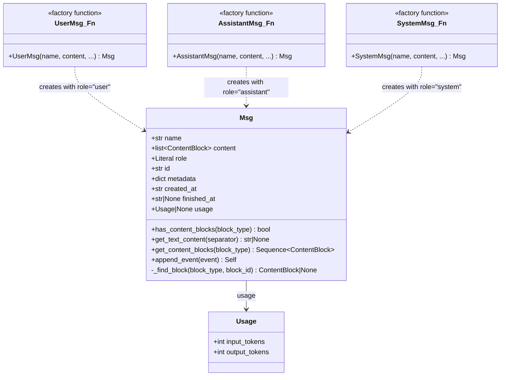
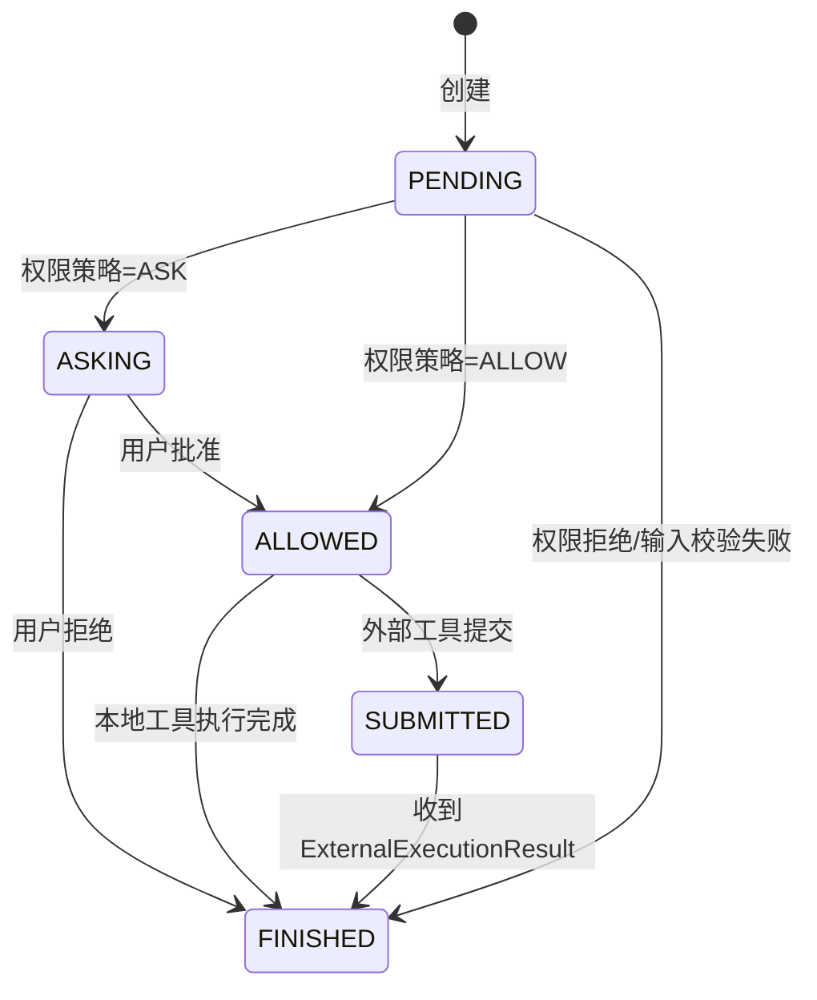
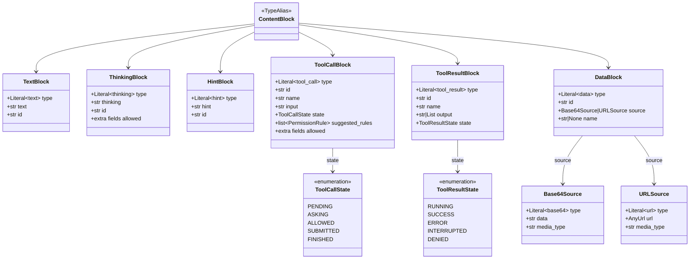
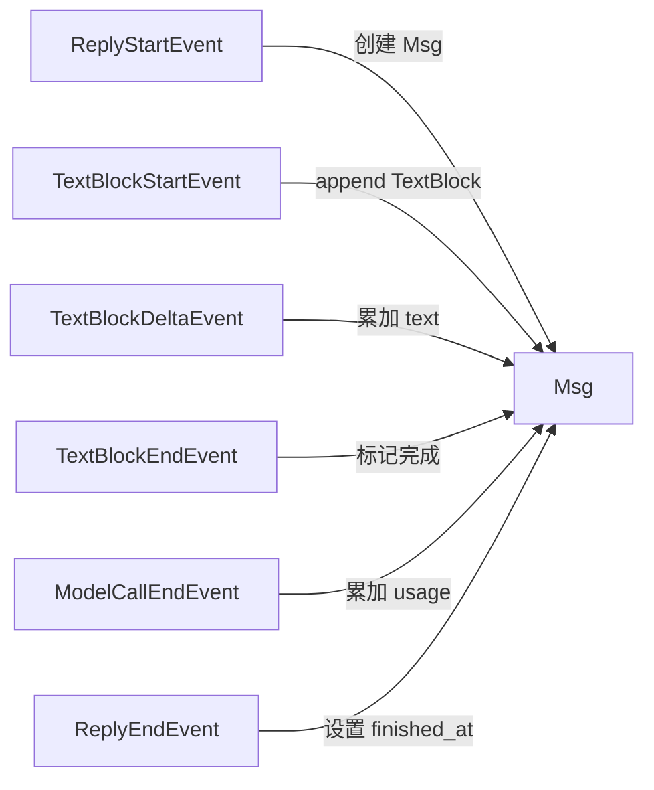
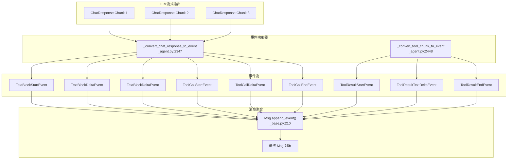
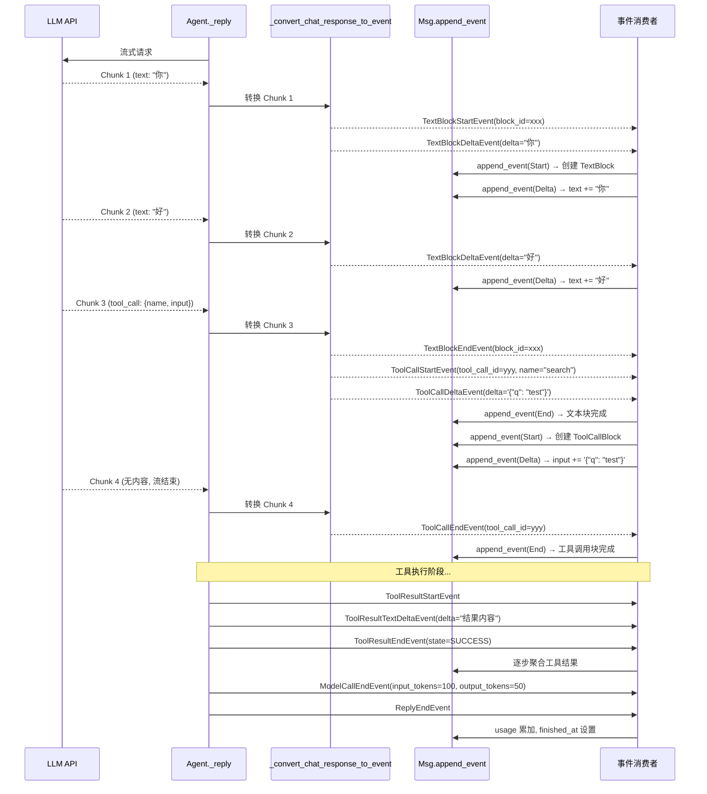
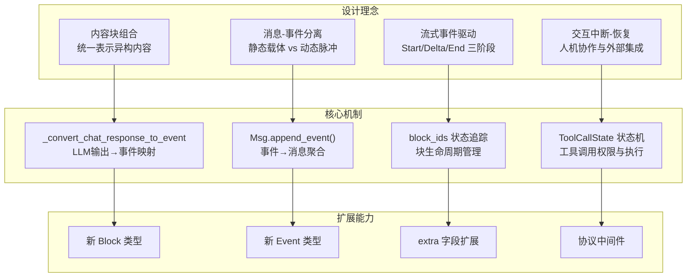

# AgentScope 2.0 消息与事件系统

## 总：开篇概述

在 AgentScope 2.0 中，**Message（消息）** 与 **Event（事件）** 构成了整个框架的"神经系统"，负责 Agent 内部各模块之间的通信与协调。如果说 Agent 是大脑，那么 Message 就是神经递质——承载信息的静态载体，而 Event 则是神经脉冲——驱动信息动态流转的信号。

**核心问题与解决思路：**

| 问题 | 解决方案 |
|------|----------|
| 消息格式不统一 | 引入 `Msg` 基类 + 内容块（Block）组合模式，统一文本、工具调用、多模态等异构内容 |
| 多模态数据表示 | `DataBlock` 支持 `Base64Source` / `URLSource` 双源，覆盖内嵌与引用两种场景 |
| 流式响应驱动 | 事件驱动的异步生成器模式，将 LLM 流式输出映射为结构化事件序列 |
| 人机交互中断 | `RequireUserConfirm` / `RequireExternalExecution` 等交互事件，支持暂停-恢复式对话 |

**配图 5-1：消息与事件系统架构全景图**

```mermaid
graph TB
    subgraph 消息层["消息层 (Message)"]
        Msg["Msg<br/>消息基类"]
        UserMsg["UserMsg<br/>用户消息"]
        AssistantMsg["AssistantMsg<br/>助手消息"]
        SystemMsg["SystemMsg<br/>系统消息"]
    end

    subgraph 内容块层["内容块层 (Content Block)"]
        TextBlock["TextBlock<br/>文本"]
        ThinkingBlock["ThinkingBlock<br/>思维链"]
        ToolCallBlock["ToolCallBlock<br/>工具调用"]
        ToolResultBlock["ToolResultBlock<br/>工具结果"]
        DataBlock["DataBlock<br/>多模态数据"]
        HintBlock["HintBlock<br/>提示"]
    end

    subgraph 事件层["事件层 (Event)"]
        direction TB
        LifeCycle["生命周期事件<br/>ReplyStart/End<br/>ModelCallStart/End"]
        StreamEvents["流式内容事件<br/>Text/Thinking/Data<br/>Block Start/Delta/End"]
        ToolEvents["工具事件<br/>ToolCall/ToolResult<br/>Start/Delta/End"]
        InteractEvents["交互事件<br/>RequireUserConfirm<br/>RequireExternalExecution"]
        ExceptionEvents["异常事件<br/>ExceedMaxIters"]
    end

    Msg --> TextBlock
    Msg --> ThinkingBlock
    Msg --> ToolCallBlock
    Msg --> ToolResultBlock
    Msg --> DataBlock
    Msg --> HintBlock

    Msg -.->|"append_event()"| LifeCycle
    Msg -.->|"append_event()"| StreamEvents
    Msg -.->|"append_event()"| ToolEvents
    Msg -.->|"append_event()"| InteractEvents

    LifeCycle -->|"聚合为"| Msg
    StreamEvents -->|"聚合为"| Msg
    ToolEvents -->|"聚合为"| Msg
    InteractEvents -->|"聚合为"| Msg

    UserMsg ---|role="user"| Msg
    AssistantMsg ---|role="assistant"| Msg
    SystemMsg ---|role="system"| Msg
```

---

## 分：逐层展开

### 1. 消息类型体系

#### 1.1 Msg 基类

`Msg` 是 AgentScope 中所有消息的统一基类，定义于 `src/agentscope/message/_base.py:65`。它采用 Pydantic `BaseModel` 实现，天然支持序列化与校验。

```python
class Msg(BaseModel):
    name: str                                    # 发送者名称
    content: list[ContentBlock]                  # 消息内容（内容块列表）
    role: Literal["user", "assistant", "system"] # 发送者角色
    id: str                                      # 消息唯一标识（UUID）
    metadata: dict                               # 附加元数据
    created_at: str                              # 创建时间（ISO 8601）
    finished_at: str | None                      # 完成时间
    usage: Usage | None                          # Token 用量信息
```

关键设计要点：

- **`content` 字段统一为 `list[ContentBlock]`**（`_base.py:71`）：无论消息包含纯文本还是多模态数据，底层都是内容块的列表，实现了表示的统一性。
- **`role` 字段约束内容类型**（`_base.py:86-96`）：通过 `model_validator`，在构造时自动校验不同角色允许的内容块类型——`user` 仅允许 `text` 和 `data`，`system` 仅允许 `text`，`assistant` 不受限。
- **`usage` 字段追踪 Token 消耗**（`_base.py:83`）：类型为 `Usage | None`，其中 `Usage` 包含 `input_tokens` 和 `output_tokens` 两个字段（`_base.py:56-62`），在流式过程中通过 `MODEL_CALL_END` 事件累加。

#### 1.2 工厂函数：UserMsg / AssistantMsg / SystemMsg

这三个并非子类，而是工厂函数（`_base.py:431-573`），返回 `Msg` 实例并设置对应的 `role`：

| 工厂函数 | role 值 | 允许的内容块 | finished_at 默认值 |
|----------|---------|-------------|-------------------|
| `UserMsg` | `"user"` | `TextBlock`, `DataBlock` | 等于 `created_at` |
| `AssistantMsg` | `"assistant"` | 所有 `ContentBlock` 类型 | `None`（流式构建中） |
| `SystemMsg` | `"system"` | `TextBlock` | 等于 `created_at` |

注意 `AssistantMsg` 的 `finished_at` 默认为 `None`——因为助手消息是在流式事件中逐步构建的，直到收到 `REPLY_END` 事件才设置完成时间（`_base.py:238-239`）。

#### 1.3 内容的双模式表示

`content` 字段支持两种输入模式，通过 `_to_blocks` 辅助函数（`_base.py:49-53`）实现自动转换：

```python
def _to_blocks(content: str | list) -> list:
    if isinstance(content, str):
        return [TextBlock(text=content)]
    return content
```

- **字符串模式**：传入 `str` 时自动包装为 `[TextBlock(text=content)]`
- **列表模式**：传入 `list[ContentBlock]` 时直接使用

#### 1.4 消息查询方法

`Msg` 提供了丰富的查询接口：

- **`has_content_blocks(block_type)`**（`_base.py:98-120`）：检查是否包含指定类型的内容块
- **`get_text_content(separator)`**（`_base.py:122-125`）：提取所有 `TextBlock` 的文本并拼接
- **`get_content_blocks(block_type)`**（`_base.py:176-197`）：按类型过滤内容块，支持类型安全的重载
- **`_find_block(block_type, block_id)`**（`_base.py:199-208`）：按类型和 ID 查找特定内容块

**配图 5-2：Msg 类继承图**



---

### 2. 内容块系统

内容块（Content Block）是消息的原子组成单元，定义于 `src/agentscope/message/_block.py`。每种内容块对应一种语义类型，通过 `type` 字段进行区分。

#### 2.1 TextBlock — 文本内容

```python
class TextBlock(BaseModel):          # _block.py:11-19
    type: Literal["text"] = "text"
    text: str                         # 文本内容
    id: str                           # 唯一标识
```

最基本的块类型，承载纯文本信息。在流式场景中，`text` 字段通过 `TextBlockDeltaEvent` 逐步累加。

#### 2.2 ThinkingBlock — 思维链内容

```python
class ThinkingBlock(BaseModel):       # _block.py:22-37
    model_config = ConfigDict(extra="allow")  # 允许扩展字段
    type: Literal["thinking"] = "thinking"
    thinking: str                      # 思维链内容
    id: str
```

用于承载 LLM 的"思考过程"（如 Anthropic 的 Extended Thinking）。通过 `extra="allow"` 配置，支持供应商特定的扩展字段（如 `signature`），无需子类化即可适配不同模型。

#### 2.3 HintBlock — 提示内容

```python
class HintBlock(BaseModel):           # _block.py:40-51
    type: Literal["hint"] = "hint"
    hint: str                          # 提示内容
    id: str
```

用于在推理-行动循环（ReAct Loop）中向 LLM 提供指令或提示。当传递给 LLM API 时，`HintBlock` 会被转换为用户消息。

#### 2.4 ToolCallBlock — 工具调用

```python
class ToolCallBlock(BaseModel):       # _block.py:105-149
    model_config = ConfigDict(use_enum_values=True, extra="allow")
    type: Literal["tool_call"] = "tool_call"
    id: str                            # 工具调用唯一标识
    name: str                          # 工具名称
    input: str                         # 工具参数（JSON 字符串）
    state: ToolCallState = ToolCallState.PENDING
    suggested_rules: list[PermissionRule] = []
```

**ToolCallState 状态机**（`_block.py:95-103`）是工具调用的核心状态管理：



状态转换的触发点：
- `PENDING → ASKING`：由 `REQUIRE_USER_CONFIRM` 事件触发（`_base.py:396-404`）
- `ASKING → ALLOWED/FINISHED`：由 `USER_CONFIRM_RESULT` 事件触发（`_base.py:406-415`）
- `ALLOWED → SUBMITTED`：由 `REQUIRE_EXTERNAL_EXECUTION` 事件触发（`_base.py:417-422`）

#### 2.5 ToolResultBlock — 工具结果

```python
class ToolResultBlock(BaseModel):     # _block.py:162-177
    model_config = ConfigDict(use_enum_values=True)
    type: Literal["tool_result"] = "tool_result"
    id: str                            # 对应工具调用的 ID
    name: str                          # 工具名称
    output: str | List[TextBlock | DataBlock]  # 输出内容
    state: ToolResultState = ToolResultState.RUNNING
```

**ToolResultState 枚举**（`_block.py:152-160`）：

| 状态 | 含义 |
|------|------|
| `RUNNING` | 正在执行中 |
| `SUCCESS` | 执行成功 |
| `ERROR` | 执行出错 |
| `INTERRUPTED` | 执行被中断 |
| `DENIED` | 权限被拒绝 |

`output` 字段支持两种模式：简单字符串或 `TextBlock/DataBlock` 列表，后者支持工具返回多模态内容（如生成的图片）。

#### 2.6 DataBlock — 多模态数据

```python
class DataBlock(BaseModel):           # _block.py:81-92
    type: Literal["data"] = "data"
    id: str
    source: Base64Source | URLSource   # 数据源
    name: str | None = None
```

**数据源的双模式设计**：

```python
class Base64Source(BaseModel):        # _block.py:54-62
    type: Literal["base64"] = "base64"
    data: str                          # Base64 编码数据
    media_type: str                    # MIME 类型

class URLSource(BaseModel):           # _block.py:65-78
    type: Literal["url"] = "url"
    url: AnyUrl                        # RFC 3986 URI
    media_type: str
```

- **`Base64Source`**：内嵌模式，将二进制数据编码为 Base64 字符串直接携带
- **`URLSource`**：引用模式，通过 URL 指向外部资源

两种模式通过 `media_type` 字段统一描述 MIME 类型（如 `image/png`、`audio/mpeg`），使消费者无需关心数据来源即可正确处理。

#### 2.7 ContentBlock 联合类型

```python
ContentBlock: TypeAlias = (           # _block.py:180-187
    TextBlock | ThinkingBlock | HintBlock
    | ToolCallBlock | ToolResultBlock | DataBlock
)

ContentBlockTypes: TypeAlias = Literal[  # _block.py:189-196
    "text", "thinking", "hint",
    "tool_call", "tool_result", "data",
]
```

`ContentBlock` 是所有内容块的联合类型别名，`ContentBlockTypes` 是对应的字面量类型，用于类型安全的过滤和查询。

**配图 5-3：内容块（Block）类型层次图**



---

### 3. 事件系统

事件系统定义于 `src/agentscope/event/_event.py`，是 AgentScope 实现流式响应和人机交互的核心机制。所有事件都继承自 `EventBase`（`_event.py:53-61`），携带 `id` 和 `created_at` 元数据。

#### 3.1 EventType 枚举

`EventType`（`_event.py:14-50`）定义了全部 22 种事件类型，按功能可分为以下几类：

#### 3.2 生命周期事件

| 事件 | 字段 | 含义 |
|------|------|------|
| `ReplyStartEvent` | `session_id`, `reply_id`, `name`, `role` | 一次 Agent 回复开始 |
| `ReplyEndEvent` | `session_id`, `reply_id` | 一次 Agent 回复结束 |
| `ModelCallStartEvent` | `reply_id`, `model_name` | 一次模型调用开始 |
| `ModelCallEndEvent` | `reply_id`, `input_tokens`, `output_tokens` | 一次模型调用结束 |

生命周期事件构成了 Agent 执行的骨架。`ReplyStartEvent` 在 `_reply` 方法中发出（`_agent.py:585-589`），`ReplyEndEvent` 在推理完成时发出（`_agent.py:615-618`）。一次 Reply 可能包含多次 ModelCall（ReAct 循环中），每次 ModelCall 的 Token 消耗通过 `ModelCallEndEvent` 累加到 `Msg.usage`。

#### 3.3 文本事件

| 事件 | 额外字段 | 含义 |
|------|---------|------|
| `TextBlockStartEvent` | `block_id` | 文本块开始 |
| `TextBlockDeltaEvent` | `block_id`, `delta` | 文本增量 |
| `TextBlockEndEvent` | `block_id` | 文本块结束 |

遵循 **Start → Delta* → End** 的三阶段模式，与 SSE 流式输出天然契合。

#### 3.4 思维事件

| 事件 | 额外字段 | 含义 |
|------|---------|------|
| `ThinkingBlockStartEvent` | `block_id` | 思维块开始 |
| `ThinkingBlockDeltaEvent` | `block_id`, `delta` | 思维增量 |
| `ThinkingBlockEndEvent` | `block_id` | 思维块结束 |

结构与文本事件完全对称，便于统一处理。

#### 3.5 工具调用事件

| 事件 | 额外字段 | 含义 |
|------|---------|------|
| `ToolCallStartEvent` | `tool_call_id`, `tool_call_name` | 工具调用开始 |
| `ToolCallDeltaEvent` | `tool_call_id`, `delta` | 参数增量（JSON 片段） |
| `ToolCallEndEvent` | `tool_call_id` | 工具调用结束 |

注意 `ToolCallDeltaEvent` 的 `delta` 是 JSON 字符串片段，在 `Msg.append_event` 中逐步拼接到 `ToolCallBlock.input`（`_base.py:318-327`）。

#### 3.6 工具结果事件

| 事件 | 额外字段 | 含义 |
|------|---------|------|
| `ToolResultStartEvent` | `tool_call_id`, `tool_call_name` | 工具结果开始 |
| `ToolResultTextDeltaEvent` | `tool_call_id`, `delta` | 文本结果增量 |
| `ToolResultDataDeltaEvent` | `tool_call_id`, `block_id`, `media_type`, `data`, `url` | 多模态结果增量 |
| `ToolResultEndEvent` | `tool_call_id`, `state` | 工具结果结束 |

工具结果事件比工具调用事件更复杂，因为结果可能包含文本和多模态数据两种类型。`ToolResultDataDeltaEvent` 通过 `data`（Base64）和 `url` 互斥字段支持两种数据源（`_event.py:307-310`）。

#### 3.7 交互事件

| 事件 | 额外字段 | 含义 |
|------|---------|------|
| `RequireUserConfirmEvent` | `reply_id`, `tool_calls` | 请求用户确认工具调用 |
| `UserConfirmResultEvent` | `reply_id`, `confirm_results` | 用户确认结果 |
| `RequireExternalExecutionEvent` | `reply_id`, `tool_calls` | 请求外部执行工具 |
| `ExternalExecutionResultEvent` | `reply_id`, `execution_results` | 外部执行结果 |

交互事件实现了 **暂停-恢复** 模式：

1. Agent 在执行工具前检查权限，若需确认则发出 `RequireUserConfirmEvent`
2. 调用方（如 Web 前端）收集用户确认后，通过 `UserConfirmResultEvent` 恢复执行
3. 若工具需外部执行，发出 `RequireExternalExecutionEvent`
4. 外部系统执行完毕后，通过 `ExternalExecutionResultEvent` 返回结果

`ConfirmResult`（`_event.py:365-376`）结构包含 `confirmed`（是否批准）、`tool_call`（对应的工具调用）和 `rules`（权限规则，仅在批准时有效）。

#### 3.8 异常事件

| 事件 | 额外字段 | 含义 |
|------|---------|------|
| `ExceedMaxItersEvent` | `reply_id`, `name` | 超出最大迭代次数 |

当 ReAct 循环超过 `max_iters` 限制时触发，标志着 Agent 无法在给定迭代内完成任务。

#### 3.9 数据事件

| 事件 | 额外字段 | 含义 |
|------|---------|------|
| `DataBlockStartEvent` | `block_id`, `media_type` | 数据块开始 |
| `DataBlockDeltaEvent` | `block_id`, `data`, `media_type` | 数据增量（Base64） |
| `DataBlockEndEvent` | `block_id` | 数据块结束 |

用于流式传输多模态数据，`data` 字段为 Base64 编码的增量片段。

**配图 5-4：事件类型层次图**

```mermaid
classDiagram
    class EventBase {
        +str id
        +str created_at
    }

    class ReplyStartEvent {
        +Literal type
        +str session_id
        +str reply_id
        +str name
        +Literal role
    }

    class ReplyEndEvent {
        +Literal type
        +str session_id
        +str reply_id
    }

    class ModelCallStartEvent {
        +Literal type
        +str reply_id
        +str model_name
    }

    class ModelCallEndEvent {
        +Literal type
        +str reply_id
        +int input_tokens
        +int output_tokens
    }

    class TextBlockStartEvent {
        +Literal type
        +str reply_id
        +str block_id
    }

    class TextBlockDeltaEvent {
        +Literal type
        +str reply_id
        +str block_id
        +str delta
    }

    class TextBlockEndEvent {
        +Literal type
        +str reply_id
        +str block_id
    }

    class ThinkingBlockStartEvent {
        +Literal type
        +str reply_id
        +str block_id
    }

    class ThinkingBlockDeltaEvent {
        +Literal type
        +str reply_id
        +str block_id
        +str delta
    }

    class ThinkingBlockEndEvent {
        +Literal type
        +str reply_id
        +str block_id
    }

    class ToolCallStartEvent {
        +Literal type
        +str reply_id
        +str tool_call_id
        +str tool_call_name
    }

    class ToolCallDeltaEvent {
        +Literal type
        +str reply_id
        +str tool_call_id
        +str delta
    }

    class ToolCallEndEvent {
        +Literal type
        +str reply_id
        +str tool_call_id
    }

    class ToolResultStartEvent {
        +Literal type
        +str reply_id
        +str tool_call_id
        +str tool_call_name
    }

    class ToolResultTextDeltaEvent {
        +Literal type
        +str reply_id
        +str tool_call_id
        +str delta
    }

    class ToolResultDataDeltaEvent {
        +Literal type
        +str reply_id
        +str tool_call_id
        +str block_id
        +str media_type
        +str|None data
        +str|None url
    }

    class ToolResultEndEvent {
        +Literal type
        +str reply_id
        +str tool_call_id
        +ToolResultState state
    }

    class DataBlockStartEvent {
        +Literal type
        +str reply_id
        +str block_id
        +str media_type
    }

    class DataBlockDeltaEvent {
        +Literal type
        +str reply_id
        +str block_id
        +str data
        +str media_type
    }

    class DataBlockEndEvent {
        +Literal type
        +str reply_id
        +str block_id
    }

    class ExceedMaxItersEvent {
        +Literal type
        +str reply_id
        +str name
    }

    class RequireUserConfirmEvent {
        +Literal type
        +str reply_id
        +list~ToolCallBlock~ tool_calls
    }

    class RequireExternalExecutionEvent {
        +Literal type
        +str reply_id
        +list~ToolCallBlock~ tool_calls
    }

    class UserConfirmResultEvent {
        +Literal type
        +str reply_id
        +list~ConfirmResult~ confirm_results
    }

    class ExternalExecutionResultEvent {
        +Literal type
        +str reply_id
        +list~ToolResultBlock~ execution_results
    }

    EventBase <|-- ReplyStartEvent : 生命周期
    EventBase <|-- ReplyEndEvent : 生命周期
    EventBase <|-- ModelCallStartEvent : 生命周期
    EventBase <|-- ModelCallEndEvent : 生命周期
    EventBase <|-- TextBlockStartEvent : 文本流式
    EventBase <|-- TextBlockDeltaEvent : 文本流式
    EventBase <|-- TextBlockEndEvent : 文本流式
    EventBase <|-- ThinkingBlockStartEvent : 思维流式
    EventBase <|-- ThinkingBlockDeltaEvent : 思维流式
    EventBase <|-- ThinkingBlockEndEvent : 思维流式
    EventBase <|-- ToolCallStartEvent : 工具调用流式
    EventBase <|-- ToolCallDeltaEvent : 工具调用流式
    EventBase <|-- ToolCallEndEvent : 工具调用流式
    EventBase <|-- ToolResultStartEvent : 工具结果流式
    EventBase <|-- ToolResultTextDeltaEvent : 工具结果流式
    EventBase <|-- ToolResultDataDeltaEvent : 工具结果流式
    EventBase <|-- ToolResultEndEvent : 工具结果流式
    EventBase <|-- DataBlockStartEvent : 数据流式
    EventBase <|-- DataBlockDeltaEvent : 数据流式
    EventBase <|-- DataBlockEndEvent : 数据流式
    EventBase <|-- ExceedMaxItersEvent : 异常
    EventBase <|-- RequireUserConfirmEvent : 交互
    EventBase <|-- RequireExternalExecutionEvent : 交互
    EventBase <|-- UserConfirmResultEvent : 交互
    EventBase <|-- ExternalExecutionResultEvent : 交互
```



---

### 4. 事件流设计

#### 4.1 异步生成器模式

Agent 的 `reply_stream` 方法（`_agent.py:191-214`）返回 `AsyncGenerator[AgentEvent, None]`，这是事件流的核心抽象：

```python
async def reply_stream(self, inputs=...) -> AsyncGenerator[AgentEvent, None]:
    async for chunk in self._reply(inputs=inputs):
        if not isinstance(chunk, Msg):
            yield chunk
```

调用方可以通过 `async for event in agent.reply_stream()` 逐步消费事件，实现真正的流式体验。而 `reply` 方法（`_agent.py:216-252`）则消费全部事件并返回最终的 `Msg`。

#### 4.2 事件与消息的转换

`Msg.append_event` 方法（`_base.py:210-428`）是事件到消息的桥梁——它将流式事件逐步应用到消息对象上，实现"事件流 → 静态消息"的聚合：



转换规则的核心逻辑（`_base.py:237-428`）：

| 事件类型 | 对 Msg 的操作 |
|---------|-------------|
| `REPLY_END` | 设置 `finished_at` |
| `MODEL_CALL_END` | 初始化/累加 `usage` |
| `TEXT_BLOCK_START` | 追加空 `TextBlock` |
| `TEXT_BLOCK_DELTA` | 累加 `TextBlock.text` |
| `THINKING_BLOCK_START` | 追加空 `ThinkingBlock` |
| `THINKING_BLOCK_DELTA` | 累加 `ThinkingBlock.thinking` |
| `TOOL_CALL_START` | 追加 `ToolCallBlock(input="")` |
| `TOOL_CALL_DELTA` | 累加 `ToolCallBlock.input` |
| `TOOL_RESULT_START` | 追加 `ToolResultBlock(output=[], state=RUNNING)` |
| `TOOL_RESULT_TEXT_DELTA` | 追加/累加 `ToolResultBlock.output` 中的 `TextBlock` |
| `TOOL_RESULT_DATA_DELTA` | 追加 `DataBlock` 到 `ToolResultBlock.output` |
| `TOOL_RESULT_END` | 设置 `ToolResultBlock.state` |
| `DATA_BLOCK_START` | 追加空 `DataBlock`（Base64Source） |
| `DATA_BLOCK_DELTA` | 累加 `DataBlock.source.data` |
| `REQUIRE_USER_CONFIRM` | 设置 `ToolCallBlock.state=ASKING` |
| `USER_CONFIRM_RESULT` | 设置 `ToolCallBlock.state=ALLOWED/FINISHED` |
| `REQUIRE_EXTERNAL_EXECUTION` | 设置 `ToolCallBlock.state=SUBMITTED` |
| `EXTERNAL_EXECUTION_RESULT` | 追加 `ToolResultBlock` |

#### 4.3 流式响应到事件的映射

`_convert_chat_response_to_event`（`_agent.py:2347-2446`）是将 LLM 流式输出（`ChatResponse` chunk）转换为事件的映射器。其核心逻辑是：

1. **分类**：将 chunk 中的内容块分为 `text_blocks`、`thinking_blocks`、`tool_call_blocks` 三类
2. **状态追踪**：通过 `block_ids` 字典追踪当前活跃的块 ID，用于判断是新块开始还是已有块的增量
3. **Start/Delta/End 三阶段生成**：
   - 当某类型块首次出现且无对应 `block_id` 时，生成 `Start` 事件
   - 后续出现同类型块时，生成 `Delta` 事件
   - 当某类型块不再出现但 `block_id` 仍存在时，生成 `End` 事件

```python
# 文本块处理示例（_agent.py:2373-2395）
if text_blocks:
    if not block_ids.get("text"):          # 首次出现 → Start
        block_ids["text"] = uuid.uuid4().hex
        yield TextBlockStartEvent(...)
    yield TextBlockDeltaEvent(...)          # 始终 → Delta
elif block_ids.get("text"):                # 不再出现但之前有 → End
    yield TextBlockEndEvent(...)
    block_ids["text"] = None
```

工具调用的处理略有不同——每个工具调用有独立的 `tool_call_id`，通过 `block_ids["tools"]` 列表追踪（`_agent.py:2420-2446`）。

`_convert_tool_chunk_to_event`（`_agent.py:2448-2484`）处理工具执行结果的转换，将 `TextBlock` 映射为 `ToolResultTextDeltaEvent`，将 `DataBlock` 映射为 `ToolResultDataDeltaEvent`。

**配图 5-5：消息-事件转换数据流图**



**配图 5-6：流式响应到事件映射时序图**



---

## 总：总结升华

### 核心设计决策

1. **消息-事件分离**：`Msg` 是数据的静态快照，`AgentEvent` 是数据的动态脉冲。二者通过 `append_event` 桥接，实现了"流式构建、静态消费"的双模式。这种分离使得同一个 Agent 既能以流式方式向前端推送实时进度，又能以同步方式返回完整消息。

2. **内容块组合模式**：`Msg.content` 采用 `list[ContentBlock]` 的组合设计，每种语义内容（文本、思维链、工具调用、多模态数据）对应一种 Block 类型。这比传统的 `content: str` 设计更具表达力，同时保持了向后兼容（通过 `_to_blocks` 自动转换）。

3. **流式事件驱动**：所有内容块的事件都遵循 **Start → Delta* → End** 三阶段模式，与 LLM 的流式输出天然对齐。`_convert_chat_response_to_event` 中的 `block_ids` 状态追踪机制，确保了块的生命周期正确管理。

4. **交互事件的中断-恢复**：`RequireUserConfirm` / `RequireExternalExecution` 等交互事件实现了协作式中断，Agent 可以暂停执行等待外部输入，再通过对应的结果事件恢复。这使得人机协作和外部系统集成成为可能。

### 扩展点

| 扩展点 | 方式 | 示例 |
|--------|------|------|
| 新的内容块类型 | 在 `_block.py` 中添加新的 Block 类，更新 `ContentBlock` 联合类型 | 视频块、表格块 |
| 新的事件类型 | 在 `_event.py` 中添加新的事件类和 `EventType` 枚举值，在 `append_event` 中添加处理分支 | 进度事件、日志事件 |
| 供应商扩展字段 | 利用 `ThinkingBlock` 和 `ToolCallBlock` 的 `extra="allow"` 配置 | Anthropic `signature`、OpenAI `call_id` |
| 协议适配 | 通过 `ProtocolMiddlewareBase` 将 `AgentEvent` 流转换为不同协议格式 | AGUI、A2A |
| 新的数据源类型 | 扩展 `DataBlock.source` 的联合类型 | 文件路径源、流式源 |

### 总结图



AgentScope 2.0 的消息与事件系统，通过"消息为体、事件为用"的设计哲学，在保持数据模型简洁性的同时，赋予了框架强大的流式处理与人机交互能力。这种设计不仅适用于当前的 LLM Agent 场景，也为未来更复杂的多模态、多 Agent 协作场景预留了充分的扩展空间。
