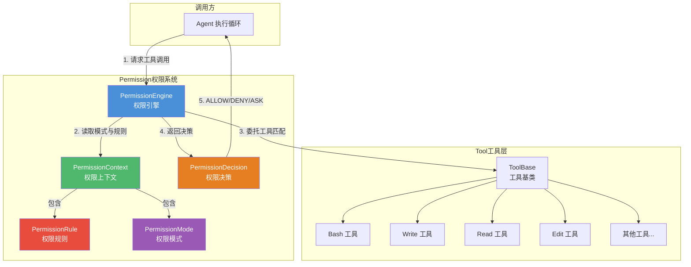
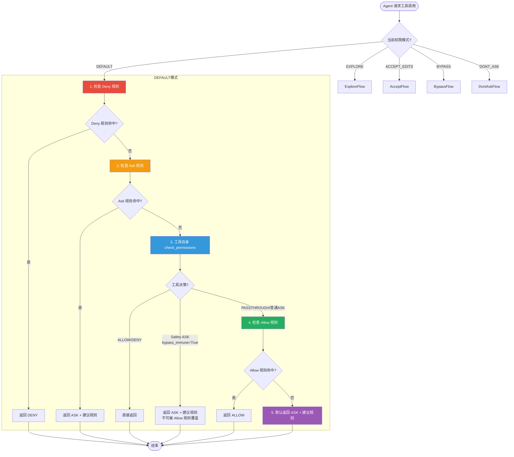
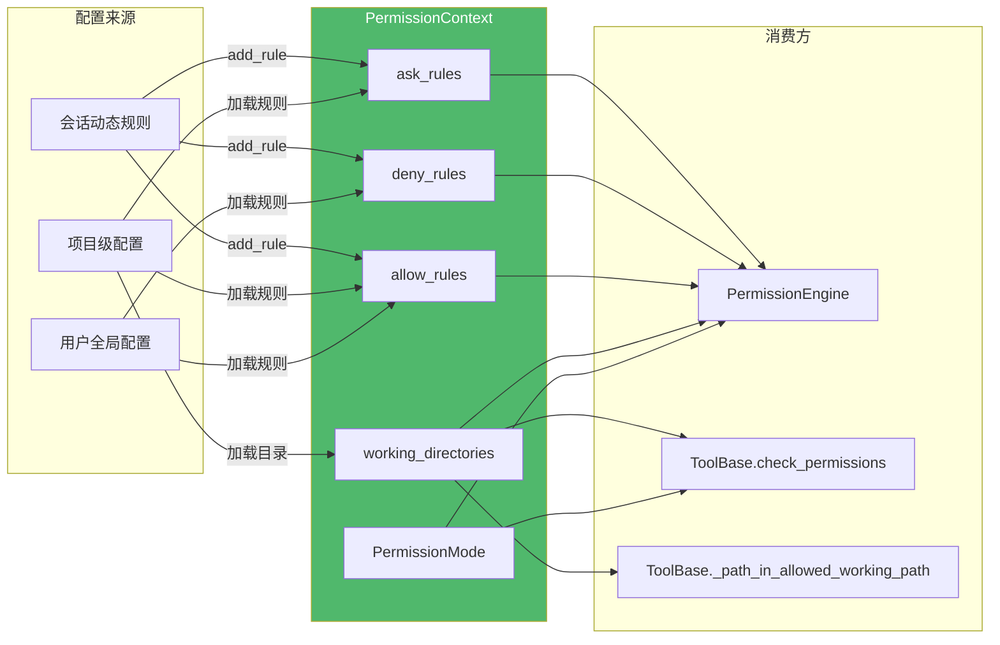
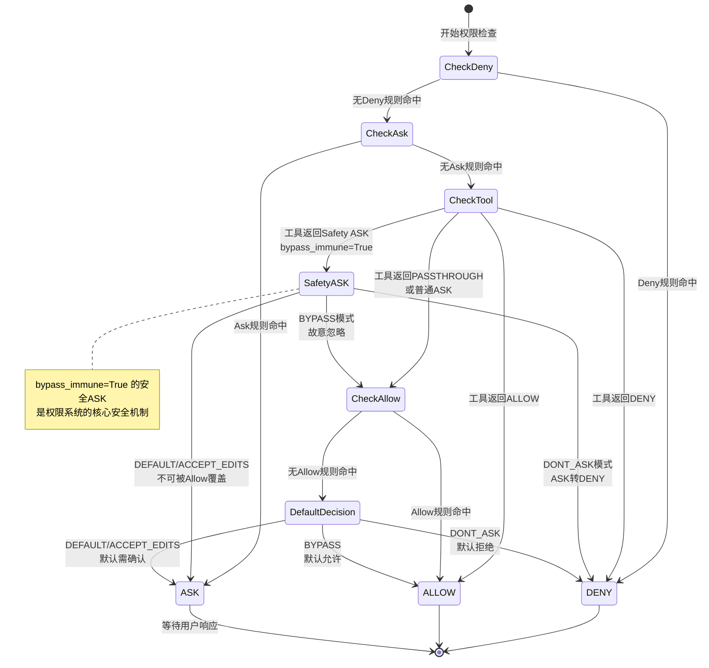
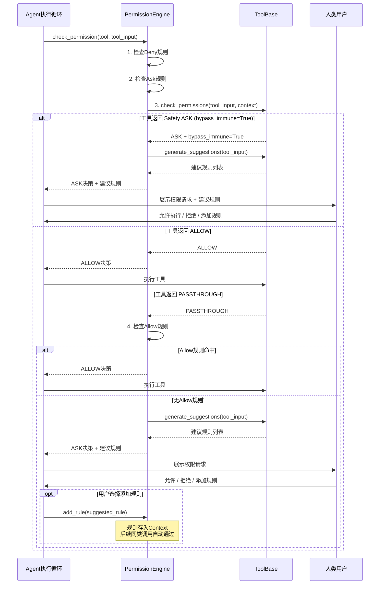
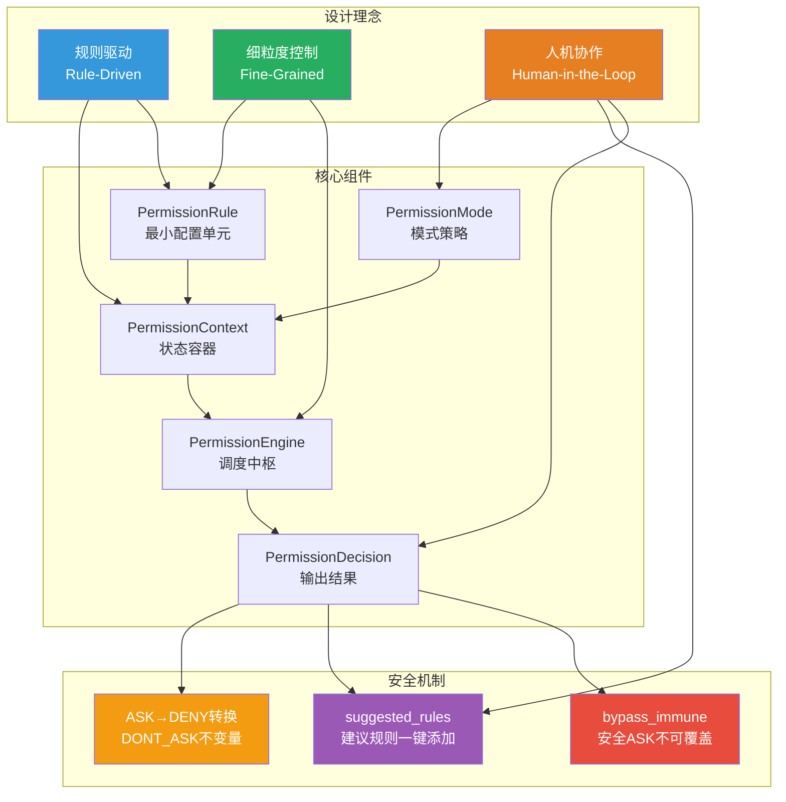

# AgentScope 2.0 权限系统

## 总：开篇概述

Permission 模块是 AgentScope 2.0 中 Agent 的**安全护栏**，负责在 Agent 调用工具（Tool）时进行细粒度的权限控制。当 LLM 驱动的 Agent 拥有执行 Bash 命令、读写文件等能力时，权限系统确保每一次工具调用都经过安全审查，防止 Agent 的自主行为造成不可控的损害。

**解决的核心问题：**

1. **细粒度权限控制** — 不是简单的"允许/禁止工具"，而是深入到工具调用的参数级别（如允许 `git status` 但禁止 `rm -rf /`，允许写 `src/**` 但禁止写 `~/.bashrc`）
2. **Human-in-the-loop** — 对于不确定的操作，系统可以暂停执行并请求人类确认，实现人机协作的安全决策
3. **规则化权限管理** — 通过可配置的规则体系（ALLOW/DENY/ASK），将权限策略从硬编码中解耦，支持用户自定义、项目级配置和运行时动态添加

**配图 6-1：权限系统架构全景图**



权限系统的核心流程如上图所示：Agent 发起工具调用请求 → PermissionEngine 根据当前 PermissionContext 中的模式和规则进行评估 → 委托工具自身的匹配逻辑进行细粒度判断 → 生成 PermissionDecision 返回给调用方。五个核心组件各司其职，共同构成一个规则驱动、细粒度、人机协作的安全控制体系。

---

## 分：逐层展开

### 1. 权限引擎 PermissionEngine

PermissionEngine 是权限系统的**调度中枢**，负责协调规则匹配、工具检查和模式策略，最终输出权限决策。

> 源码位置：`/workspace/src/agentscope/permission/_engine.py`

#### 1.1 核心结构

PermissionEngine 持有一个 `PermissionContext` 实例作为其状态容器：

```python
# _engine.py:32-46
class PermissionEngine:
    def __init__(self, context: PermissionContext) -> None:
        self.context = context
```

引擎本身**无状态**，所有规则和模式信息都存储在 Context 中，这种设计使得引擎可以轻松替换上下文或共享状态。

#### 1.2 权限检查流程（check_permission）

`check_permission` 是引擎的入口方法，它根据当前权限模式将请求分派到对应的模式检查方法：

```python
# _engine.py:76-114
async def check_permission(self, tool, tool_input) -> PermissionDecision:
    mode = self.context.mode
    if mode == PermissionMode.DEFAULT:
        return await self._check_default(tool, tool_input)
    if mode == PermissionMode.EXPLORE:
        return await self._check_explore(tool, tool_input)
    if mode == PermissionMode.ACCEPT_EDITS:
        return await self._check_accept_edits(tool, tool_input)
    if mode == PermissionMode.BYPASS:
        return await self._check_bypass(tool, tool_input)
    if mode == PermissionMode.DONT_ASK:
        return await self._check_dont_ask(tool, tool_input)
```

这种**策略模式**的设计使得每种模式的评估逻辑自包含、可独立阅读，避免了大量 if-else 嵌套。

#### 1.3 规则添加（add_rule）

`add_rule` 方法根据规则的行为类型将其分类存储到 Context 的三个字典中：

```python
# _engine.py:48-74
def add_rule(self, rule: PermissionRule) -> None:
    if rule.behavior == PermissionBehavior.ALLOW:
        self.context.allow_rules[rule.tool_name].append(rule)
    elif rule.behavior == PermissionBehavior.DENY:
        self.context.deny_rules[rule.tool_name].append(rule)
    elif rule.behavior == PermissionBehavior.ASK:
        self.context.ask_rules[rule.tool_name].append(rule)
```

规则以 `tool_name` 为键分组存储，查询时只需检索对应工具的规则列表，避免全量遍历。

#### 1.4 规则匹配算法

引擎的 `_rule_matches` 方法将匹配策略**委托给工具自身**：

```python
# _engine.py:634-662
def _rule_matches(self, tool, rule, input_data) -> bool:
    if not rule.rule_content:
        return True  # 空 rule_content 匹配所有调用
    return tool.match_rule(rule.rule_content, input_data)
```

不同工具实现不同的匹配策略：
- **Bash**：子串/前缀通配符匹配命令字符串
- **Write/Read/Edit**：glob 模式匹配文件路径
- **其他工具**：工具名级别匹配（`rule_content=None` 时匹配所有）

#### 1.5 建议规则生成

当决策为 ASK 时，引擎会调用 `_generate_suggestions` 生成建议规则，帮助用户一键添加后续免确认的权限：

```python
# _engine.py:664-694
def _generate_suggestions(self, tool, tool_input) -> List[PermissionRule]:
    return tool.generate_suggestions(tool_input)
```

同样委托给工具自身，例如 Bash 会提取命令前缀（`npm run` → `npm run:*`），文件工具会提取目录（`src/file.py` → `src/**`）。

**配图 6-2：权限检查流程图（以 DEFAULT 模式为例）**



---

### 2. 权限规则 PermissionRule

PermissionRule 是权限系统的**最小配置单元**，定义了一条具体的权限策略。

> 源码位置：`/workspace/src/agentscope/permission/_rule.py`

#### 2.1 规则结构

```python
# _rule.py:8-35
class PermissionRule(BaseModel):
    tool_name: str       # 规则适用的工具名（如 "Bash", "Write"）
    rule_content: str | None  # 过滤模式，语义随工具类型变化
    behavior: PermissionBehavior  # 行为：ALLOW / DENY / ASK
    source: str          # 规则来源标识
```

四个字段各司其职：

| 字段 | 说明 | 示例 |
|------|------|------|
| `tool_name` | 规则关联的工具 | `"Bash"`, `"Write"`, `"Read"` |
| `rule_content` | 细粒度过滤模式 | `"git:*"`, `"src/**"`, `None` |
| `behavior` | 匹配后的行为 | `ALLOW`, `DENY`, `ASK` |
| `source` | 规则来源追踪 | `"userSettings"`, `"projectSettings"`, `"suggested"` |

#### 2.2 rule_content 的语义

`rule_content` 的匹配语义取决于 `tool_name`：

- **Bash 工具**：子串模式匹配命令。如 `rule_content="npm install"` 匹配 `"npm install express"`
- **Write/Read/Edit 工具**：glob 模式匹配文件路径。如 `rule_content="src/**"` 匹配 `"src/main.py"`
- **其他工具**：`rule_content=None` 表示工具名级别规则，匹配该工具的所有调用

#### 2.3 规则来源（source）

`source` 字段用于追踪规则的来源，支持以下来源类型：

- `"userSettings"` — 用户全局配置
- `"projectSettings"` — 项目级配置
- `"suggested"` — 系统自动生成的建议规则（由 `_generate_suggestions` 产生）
- `"session"` — 当前会话中动态添加

#### 2.4 规则匹配：match_rule 方法

规则的匹配逻辑由 `ToolBase.match_rule` 实现，基类提供默认行为：

```python
# _base.py:102-133
def match_rule(self, rule_content, tool_input) -> bool:
    # None rule_content = 工具名级别规则，匹配所有调用
    return rule_content is None
```

具体工具（Bash、Write、Read 等）覆写此方法实现各自的匹配策略。引擎在 `_rule_matches` 中先检查空规则，再委托工具匹配：

```python
# _engine.py:634-662
def _rule_matches(self, tool, rule, input_data) -> bool:
    if not rule.rule_content:
        return True
    return tool.match_rule(rule.rule_content, input_data)
```

**配图 6-3：权限规则匹配算法流程图**

```mermaid
flowchart TD
    Start([开始规则匹配]) --> CheckContent{rule_content<br/>是否为空?}
    CheckContent -->|是 None/空字符串| MatchAll[✅ 匹配成功<br/>工具名级别规则]
    CheckContent -->|非空| DelegateTool[委托工具的 match_rule 方法]

    DelegateTool --> ToolType{工具类型?}

    ToolType -->|Bash| BashMatch[子串/前缀通配符匹配<br/>rule_content in command<br/>或 command.startswith]
    ToolType -->|Write/Read/Edit| GlobMatch[glob 模式匹配<br/>fnmatch(file_path, rule_content)]
    ToolType -->|Grep/Glob| PathMatch[基于搜索路径匹配]
    ToolType -->|其他工具<br/>_FunctionTool/MCPTool| DefaultMatch[❌ 默认返回 False<br/>仅支持工具名级别匹配]

    BashMatch --> Result{匹配结果}
    GlobMatch --> Result
    PathMatch --> Result
    DefaultMatch --> Result

    Result -->|True| MatchSuccess[✅ 规则命中]
    Result -->|False| MatchFail[❌ 规则未命中]

    style MatchAll fill:#27AE60,color:#fff
    style MatchSuccess fill:#27AE60,color:#fff
    style MatchFail fill:#E74C3C,color:#fff
    style DefaultMatch fill:#95A5A6,color:#fff
```

---

### 3. 权限上下文 PermissionContext

PermissionContext 是权限系统的**状态容器**，承载了权限模式、工作目录和所有规则配置。

> 源码位置：`/workspace/src/agentscope/permission/_context.py`

#### 3.1 上下文结构

```python
# _context.py:24-46
class PermissionContext(BaseModel):
    mode: PermissionMode = PermissionMode.DEFAULT
    working_directories: dict[str, AdditionalWorkingDirectory] = Field(default_factory=dict)
    allow_rules: dict[str, list[PermissionRule]] = Field(default_factory=dict)
    deny_rules: dict[str, list[PermissionRule]] = Field(default_factory=dict)
    ask_rules: dict[str, list[PermissionRule]] = Field(default_factory=dict)
```

上下文包含以下核心信息：

| 字段 | 类型 | 说明 |
|------|------|------|
| `mode` | `PermissionMode` | 当前权限模式，默认 DEFAULT |
| `working_directories` | `dict[str, AdditionalWorkingDirectory]` | 工作目录映射，键为路径 |
| `allow_rules` | `dict[str, list[PermissionRule]]` | 允许规则，按工具名分组 |
| `deny_rules` | `dict[str, list[PermissionRule]]` | 拒绝规则，按工具名分组 |
| `ask_rules` | `dict[str, list[PermissionRule]]` | 询问规则，按工具名分组 |

#### 3.2 工作目录（working_directories）

```python
# _context.py:9-21
class AdditionalWorkingDirectory(BaseModel):
    path: str    # 绝对路径
    source: str  # 来源标识
```

工作目录在 `ACCEPT_EDITS` 模式下至关重要——该模式自动允许对工作目录内文件的写操作。`source` 字段追踪目录权限的来源（如 `"userSettings"` 或 `"session"`），确保可审计性。

工具基类提供了路径检查方法：

```python
# _base.py:170-174
def _path_in_allowed_working_path(self, file_path, context) -> bool:
    """检查文件路径是否在允许的工作目录内"""
```

#### 3.3 权限模式（PermissionMode）

五种权限模式定义了系统在不同场景下的安全策略：

```python
# _types.py:18-85
class PermissionMode(Enum):
    DEFAULT = "default"           # 默认模式，每次操作都需确认
    ACCEPT_EDITS = "accept_edits" # 自动接受工作目录内的编辑
    EXPLORE = "explore"           # 只读模式，禁止所有修改
    BYPASS = "bypass"             # 绕过模式，跳过安全检查
    DONT_ASK = "dont_ask"         # 无人值守模式，ASK 转 DENY
```

#### 3.4 上下文传递机制

PermissionContext 作为 Pydantic BaseModel，天然支持序列化/反序列化，可以在以下场景间传递：

- **初始化时**：从用户配置/项目配置加载
- **运行时**：通过 `PermissionEngine.add_rule` 动态修改
- **工具调用时**：传递给 `tool.check_permissions(tool_input, context)` 供工具参考

**配图 6-5：权限上下文传递数据流图**



---

### 4. 权限决策 PermissionDecision

PermissionDecision 是权限检查的**输出结果**，承载了决策行为、原因说明和建议规则。

> 源码位置：`/workspace/src/agentscope/permission/_decision.py`

#### 4.1 决策结构

```python
# _decision.py:11-68
@dataclass
class PermissionDecision:
    behavior: PermissionBehavior         # 决策行为
    message: str                         # 人类可读的消息
    decision_reason: str | None = None   # 决策原因
    updated_input: dict[str, Any] | None = None  # 修改后的输入（如路径清洗）
    suggested_rules: list[PermissionRule] | None = None  # 建议规则
    bypass_immune: bool = False          # 是否绕过免疫（安全 ASK）
```

#### 4.2 行为类型（PermissionBehavior）

```python
# _types.py:88-102
class PermissionBehavior(Enum):
    ALLOW = "allow"           # 允许执行
    DENY = "deny"             # 拒绝执行
    ASK = "ask"               # 请求用户确认
    PASSTHROUGH = "passthrough"  # 交由引擎继续评估
```

四种行为的语义：

| 行为 | 含义 | 产生场景 |
|------|------|----------|
| `ALLOW` | 允许工具执行 | Allow 规则命中、工具自身允许、BYPASS 兜底 |
| `DENY` | 拒绝工具执行 | Deny 规则命中、EXPLORE 模式下修改操作、DONT_ASK 兜底 |
| `ASK` | 需要用户确认 | Ask 规则命中、默认兜底、工具安全检查 |
| `PASSTHROUGH` | 交由引擎继续 | 工具自身不做决策，让引擎继续规则匹配 |

#### 4.3 bypass_immune：安全 ASK 的不可覆盖性

`bypass_immune` 是权限系统中最精巧的设计之一。当工具检测到危险操作（如 `rm -rf /`、写入 `~/.bashrc`、命令注入模式）时，会设置 `bypass_immune=True`，表示该 ASK 决策**不可被 Allow 规则覆盖**：

```python
# _decision.py:33-67
# bypass_immune 的各模式处理：
# DEFAULT / ACCEPT_EDITS: 被尊重 — Allow 规则无法覆盖
# EXPLORE: 不适用（引擎通过 check_read_only 决策，不调用 check_permissions）
# BYPASS: 故意忽略 — BYPASS 的契约是"用户已选择退出安全提示"
# DONT_ASK: 转换为 DENY（无用户可用）
```

引擎通过 `_is_safety_ask` 方法识别安全 ASK：

```python
# _engine.py:527-551
@staticmethod
def _is_safety_ask(decision: PermissionDecision) -> bool:
    return (
        decision.behavior == PermissionBehavior.ASK
        and decision.bypass_immune
    )
```

#### 4.4 建议规则（suggested_rules）

当决策为 ASK 时，`suggested_rules` 提供用户可以一键添加的规则，避免后续重复确认。例如：

- Bash 执行 `npm run build` → 建议添加 `{"tool_name": "Bash", "rule_content": "npm run:*", "behavior": "ALLOW"}`
- Write 写入 `src/main.py` → 建议添加 `{"tool_name": "Write", "rule_content": "src/**", "behavior": "ALLOW"}`

#### 4.5 DONT_ASK 模式的 ASK→DENY 转换

在无人值守场景下，`_convert_ask_to_deny` 将所有 ASK 决策转换为 DENY，同时保留原始原因和建议规则：

```python
# _engine.py:487-525
@staticmethod
def _convert_ask_to_deny(tool, ask_decision) -> PermissionDecision:
    return PermissionDecision(
        behavior=PermissionBehavior.DENY,
        message=f"Permission denied for {tool.name} (dont_ask mode - ASK converted to DENY, user not available)",
        decision_reason=f"DONT_ASK mode converted ASK to DENY. Original reason: {ask_decision.decision_reason}",
        suggested_rules=ask_decision.suggested_rules,
    )
```

**配图 6-4：权限决策状态机图**



---

### 5. 权限模式

五种权限模式为不同使用场景提供了差异化的安全策略。每种模式在引擎中都有独立的 `_check_<mode>` 方法，确保策略逻辑自包含且可独立审查。

> 源码位置：`/workspace/src/agentscope/permission/_types.py:18-85`，`/workspace/src/agentscope/permission/_engine.py`

#### 5.1 DEFAULT 模式

**最安全的模式**，每次操作都需要显式授权，除非 Allow 规则命中或工具自身返回 ALLOW。

评估顺序（`_engine.py:116-187`）：
1. Deny 规则 → DENY
2. Ask 规则 → ASK（附带建议规则）
3. 工具 `check_permissions` → ALLOW/DENY 直接返回；Safety ASK 不可覆盖；PASSTHROUGH 继续
4. Allow 规则 → ALLOW
5. 默认 → ASK（附带建议规则）

#### 5.2 EXPLORE 模式

**只读模式**，所有修改操作被一概拒绝。适用于代码探索和方案规划阶段。

评估顺序（`_engine.py:189-249`）：
1. Deny 规则 → DENY
2. Ask 规则 → ASK
3. `tool.check_read_only` → True 则 ALLOW，False 则 DENY

关键设计：**不调用 `tool.check_permissions`，也不查询 Allow 规则**。EXPLORE 的只读保证不能被用户配置的规则所绕过。

#### 5.3 ACCEPT_EDITS 模式

**开发迭代模式**，自动允许工作目录内的文件编辑，其他操作遵循正常流程。

评估顺序（`_engine.py:251-335`）：
1. Deny 规则 → DENY
2. Ask 规则 → ASK
3. `tool.check_read_only` → True 则 ALLOW（快速路径）
4. 工具 `check_permissions` → 工作目录内的写操作自动 ALLOW
5. Allow 规则 → ALLOW
6. 默认 → ASK

与 DEFAULT 的关键区别：增加了只读快速路径（步骤3）和工作目录自动允许（步骤4）。

#### 5.4 BYPASS 模式

**完全信任模式**，跳过所有安全提示。仅适用于沙箱/容器环境。

评估顺序（`_engine.py:337-410`）：
1. Deny 规则 → DENY
2. Ask 规则 → ASK（尊重用户显式意图）
3. 工具 `check_permissions` → ALLOW/DENY 直接返回；**所有 ASK（包括 Safety ASK）被忽略**
4. Allow 规则 → ALLOW
5. 默认 → ALLOW

关键设计：BYPASS 模式**故意忽略 `bypass_immune`**，这是其"用户已选择退出安全提示"契约的一部分。如需在无人值守时仍保持安全，应使用 DONT_ASK。

#### 5.5 DONT_ASK 模式

**无人值守模式**，所有 ASK 决策转换为 DENY。适用于定时任务和后台执行。

评估顺序（`_engine.py:412-485`）：
1. Deny 规则 → DENY
2. Ask 规则 → DENY（转换，保留建议规则）
3. 工具 `check_permissions` → ALLOW/DENY 直接返回；Safety ASK → DENY（转换）
4. Allow 规则 → ALLOW
5. 默认 → DENY

**不变量**：此方法**永远不会返回 ASK**——所有可能产生 ASK 的路径都被转换为 DENY。

#### 5.6 模式对比总结

| 特性 | DEFAULT | EXPLORE | ACCEPT_EDITS | BYPASS | DONT_ASK |
|------|---------|---------|--------------|--------|----------|
| 只读操作 | 需确认/Allow规则 | 自动ALLOW | 自动ALLOW | 自动ALLOW | 需Allow规则 |
| 工作目录写操作 | 需确认 | DENY | 自动ALLOW | 自动ALLOW | 需Allow规则 |
| 其他写操作 | 需确认 | DENY | 需确认 | 自动ALLOW | DENY |
| Safety ASK处理 | 不可覆盖 | 不适用 | 不可覆盖 | 忽略 | 转为DENY |
| 默认决策 | ASK | — | ASK | ALLOW | DENY |
| 适用场景 | 默认安全 | 代码探索 | 快速开发 | 沙箱环境 | 无人值守 |

**配图 6-6：Human-in-the-loop 权限交互时序图**



---

## 总：总结升华

### 核心设计决策

AgentScope 2.0 权限系统的设计体现了三个核心决策：

1. **规则驱动（Rule-Driven）** — 权限策略通过 `PermissionRule` 配置而非硬编码。规则按行为分类存储（allow/deny/ask），按工具名分组索引，兼顾了灵活性和查询效率。规则的 `source` 字段确保了可审计性。

2. **细粒度控制（Fine-Grained Control）** — 不是粗粒度的"允许/禁止工具"，而是深入到工具调用的参数级别。通过将匹配逻辑委托给工具自身（`tool.match_rule`），每种工具可以实现最适合的匹配策略：Bash 用子串匹配、文件工具用 glob 匹配、其他工具用工具名级别匹配。

3. **人机协作（Human-in-the-Loop）** — `ASK` 决策和 `suggested_rules` 机制实现了优雅的人机协作：系统在不确定时暂停请求人类确认，同时提供一键添加规则的建议，让用户可以逐步建立信任白名单。`bypass_immune` 机制确保危险操作始终需要人类确认，而五种权限模式则适应了从最严格到最宽松的不同场景。

### 扩展点

权限系统的设计预留了清晰的扩展点：

| 扩展点 | 方式 | 说明 |
|--------|------|------|
| 新增权限模式 | 添加 `PermissionMode` 枚举值 + `_check_<mode>` 方法 | 模式策略自包含，互不影响 |
| 新增工具匹配策略 | 覆写 `ToolBase.match_rule` | 每种工具可自定义匹配语义 |
| 新增建议规则策略 | 覆写 `ToolBase.generate_suggestions` | 自定义建议规则的生成逻辑 |
| 新增规则来源 | 使用不同的 `source` 值 | 规则来源可追踪、可审计 |
| 动态权限调整 | 运行时调用 `engine.add_rule` | 支持会话级别的权限动态变更 |

### 总结图



AgentScope 2.0 的权限系统通过"规则驱动 + 细粒度控制 + 人机协作"三位一体的设计，在安全性和易用性之间取得了精妙的平衡。五种权限模式覆盖了从严格交互到无人值守的全场景，`bypass_immune` 机制确保了安全底线不可逾越，而 `suggested_rules` 则让权限配置在交互中自然生长——这正是工程化安全系统的成熟标志。
