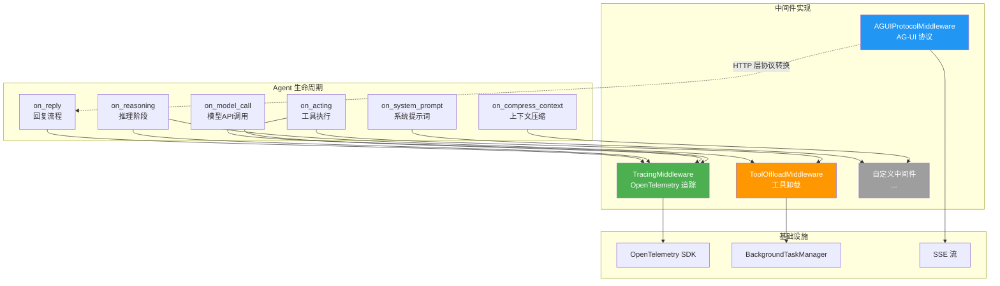
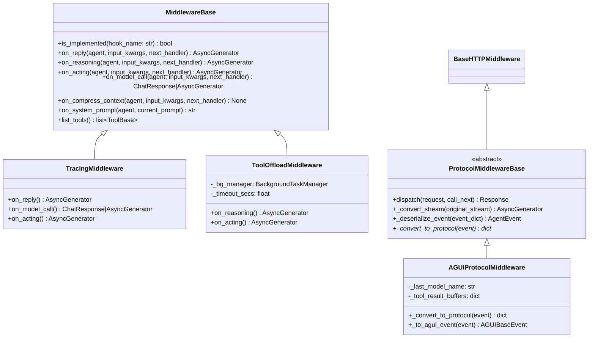
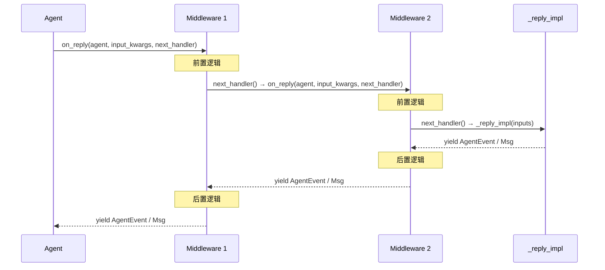
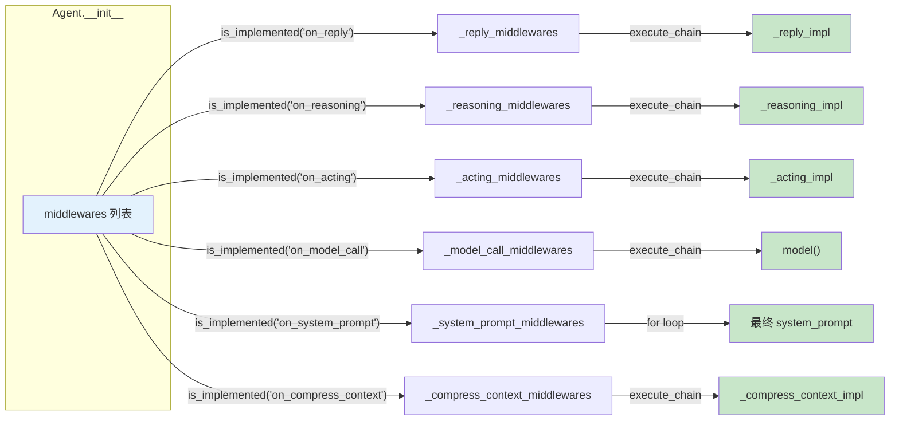
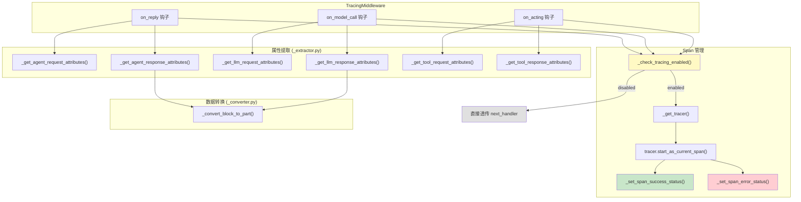
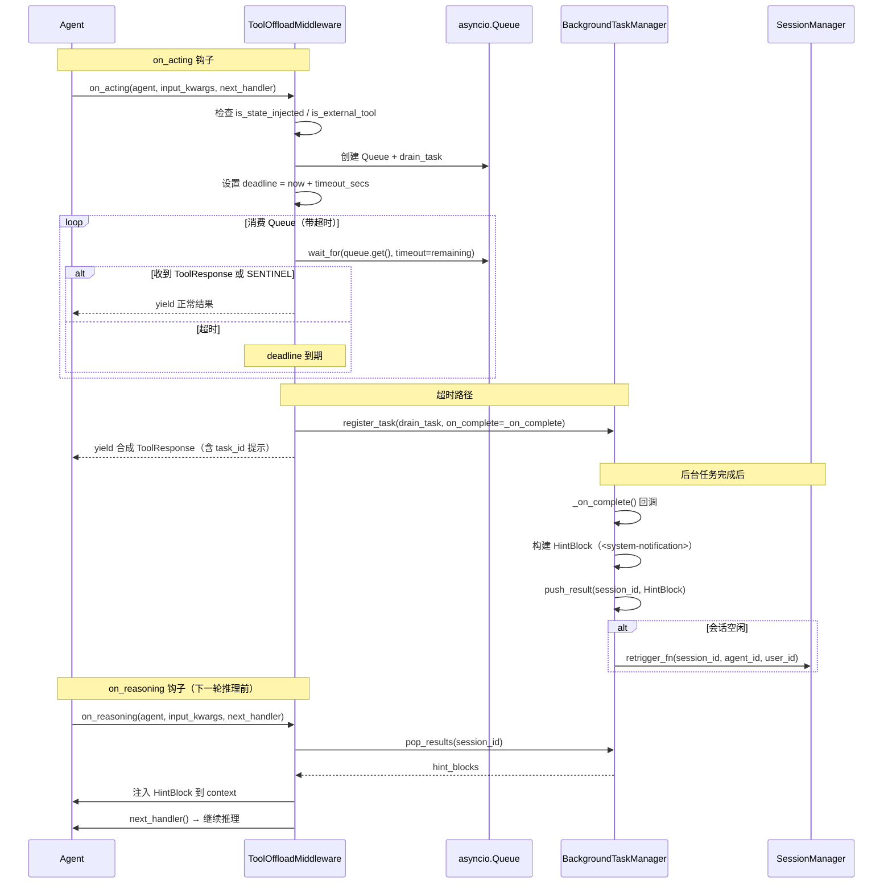
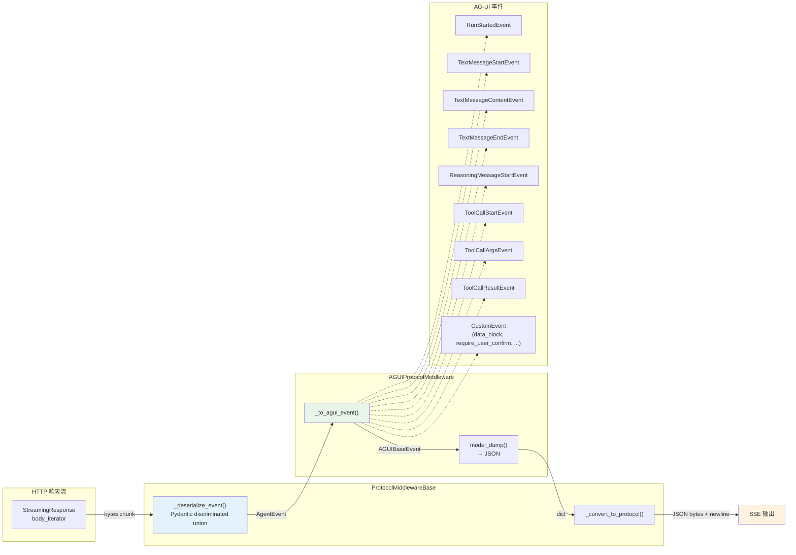
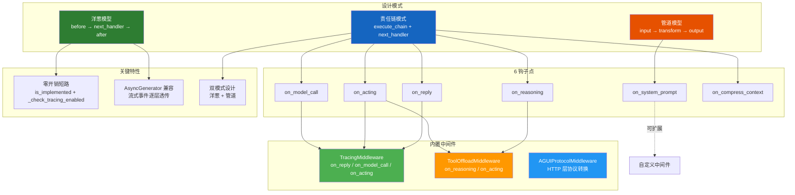

# AgentScope 2.0 中间件系统

## 总：开篇概述

Middleware 模块是 AgentScope 2.0 中 Agent 的**插件系统**，允许开发者在不修改 Agent 源码的情况下，通过拦截关键执行点来扩展和定制 Agent 行为。这一设计借鉴了面向切面编程（AOP）的思想，将横切关注点（如追踪、日志、协议转换、工具卸载等）从核心业务逻辑中分离出来，实现了**可插拔扩展**。

中间件系统解决的核心问题：

- **横切关注点分离**：将追踪、日志、权限检查等非核心逻辑从 Agent 主流程中剥离
- **可插拔扩展**：通过组合不同的中间件实例，灵活定制 Agent 行为
- **AOP 编程**：在 6 个关键钩子点上提供拦截能力，实现"洋葱模型"和"管道模型"两种拦截模式

中间件系统定义了 **6 个钩子点**，覆盖 Agent 生命周期的核心环节：

| 钩子点 | 拦截目标 | 模式 |
|--------|---------|------|
| `on_reply` | 整个回复流程 | 洋葱模型 |
| `on_reasoning` | 推理/模型调用阶段 | 洋葱模型 |
| `on_acting` | 单个工具执行 | 洋葱模型 |
| `on_model_call` | 原始模型 API 调用 | 洋葱模型 |
| `on_system_prompt` | 系统提示词转换 | 管道模型 |
| `on_compress_context` | 上下文压缩 | 洋葱模型 |

**配图 7-1：中间件系统架构全景图**



---

## 分：逐层展开

### 1. 中间件基类 MiddlewareBase

#### 1.1 钩子点定义与接口

`MiddlewareBase` 是所有中间件的抽象基类，定义于 `/workspace/src/agentscope/middleware/_base.py`（第 12 行）。它声明了 6 个钩子方法，每个方法默认抛出 `RuntimeError`，子类只需覆盖所需钩子即可：

```python
# _base.py:65-89 — on_reply 钩子
async def on_reply(self, agent, input_kwargs, next_handler) -> AsyncGenerator:
    raise RuntimeError(f"{type(self).__name__} does not implement on_reply")
    yield  # 使方法成为 AsyncGenerator

# _base.py:91-112 — on_reasoning 钩子
async def on_reasoning(self, agent, input_kwargs, next_handler) -> AsyncGenerator:
    raise RuntimeError(...)

# _base.py:114-158 — on_acting 钩子
async def on_acting(self, agent, input_kwargs, next_handler) -> AsyncGenerator:
    raise RuntimeError(...)

# _base.py:160-186 — on_model_call 钩子
async def on_model_call(self, agent, input_kwargs, next_handler):
    raise RuntimeError(...)

# _base.py:188-208 — on_compress_context 钩子
async def on_compress_context(self, agent, input_kwargs, next_handler) -> None:
    raise RuntimeError(...)

# _base.py:210-230 — on_system_prompt 钩子（管道模式）
async def on_system_prompt(self, agent, current_prompt) -> str:
    raise RuntimeError(...)
```

值得注意的是，`on_system_prompt` 采用**管道/Transformer 模式**，而非洋葱模型——它接收当前提示词字符串，返回转换后的字符串，多个中间件按顺序串联执行。其余 5 个钩子均采用**洋葱/Onion 模式**，通过 `next_handler` 传递控制权，允许在调用前后执行逻辑。

#### 1.2 is_implemented 检查机制

`is_implemented` 方法（`_base.py:52-63`）通过比较子类方法与基类方法是否为同一对象，来判断某个钩子是否被覆盖实现：

```python
# _base.py:52-63
def is_implemented(self, hook_name: str) -> bool:
    base_method = getattr(MiddlewareBase, hook_name, None)
    sub_method = getattr(type(self), hook_name, None)
    return base_method is not sub_method
```

这种基于**对象同一性**的检测方式比基于异常捕获更高效，且在 Agent 初始化时只需执行一次，即可将中间件分类到对应的钩子列表中。

#### 1.3 两种执行模式

**洋葱模型（Onion Pattern）**：适用于 `on_reply`、`on_reasoning`、`on_acting`、`on_model_call`、`on_compress_context`。中间件在调用 `next_handler` 前后均可执行逻辑，形成"请求进入→逐层包裹→响应返回→逐层剥离"的洋葱结构。

**管道模型（Transformer/Pipeline Pattern）**：仅适用于 `on_system_prompt`。中间件按顺序对字符串进行变换，每个中间件接收上一个的输出作为输入，无 `next_handler`，无前后逻辑。

**配图 7-2：MiddlewareBase 类层次图**



---

### 2. 中间件在 Agent 中的注册与执行

#### 2.1 按钩子点分类存储

Agent 在初始化时（`/workspace/src/agentscope/agent/_agent.py`，第 167-185 行），将传入的中间件列表按 `is_implemented` 检测结果分类到 6 个独立列表中：

```python
# _agent.py:167-185
middlewares = middlewares or []
self._reply_middlewares = [
    _ for _ in middlewares if _.is_implemented("on_reply")
]
self._reasoning_middlewares = [
    _ for _ in middlewares if _.is_implemented("on_reasoning")
]
self._acting_middlewares = [
    _ for _ in middlewares if _.is_implemented("on_acting")
]
self._model_call_middlewares = [
    _ for _ in middlewares if _.is_implemented("on_model_call")
]
self._system_prompt_middlewares = [
    _ for _ in middlewares if _.is_implemented("on_system_prompt")
]
self._compress_context_middlewares = [
    _ for _ in middlewares if _.is_implemented("on_compress_context")
]
```

这种设计意味着**同一个中间件实例可以同时出现在多个钩子列表中**（如 `TracingMiddleware` 同时实现 `on_reply`、`on_model_call`、`on_acting`），且分类只在初始化时执行一次，运行时零开销。

#### 2.2 execute_chain 递归执行

每个钩子点都通过 `execute_chain` 闭包实现**责任链模式**的递归执行。以 `on_reply` 为例（`_agent.py:497-540`）：

```python
# _agent.py:505-539 — _reply 中的 execute_chain
async def execute_chain(
    index: int = 0,
    inputs: ... = inputs,
) -> AsyncGenerator[AgentEvent | Msg, None]:
    if index >= len(self._reply_middlewares):
        # 链尾：执行原始 _reply_impl
        async for item in self._reply_impl(inputs=inputs):
            yield item
    else:
        mw = self._reply_middlewares[index]
        input_kwargs = {"inputs": inputs}

        async def next_handler(**kwargs) -> AsyncGenerator:
            async for item in execute_chain(index + 1, **kwargs):
                yield item

        async for item in mw.on_reply(
            agent=self,
            input_kwargs=input_kwargs,
            next_handler=next_handler,
        ):
            yield item
```

核心机制：

1. **递归终止**：当 `index` 超出中间件列表长度时，调用原始实现（如 `_reply_impl`）
2. **next_handler 传递**：每次递归构造一个 `next_handler`，它内部调用 `execute_chain(index + 1)`，将控制权传递给下一个中间件
3. **AsyncGenerator 兼容**：所有洋葱模型钩子都通过 `async for item in ... yield item` 逐层透传异步生成器事件

`on_model_call` 的 execute_chain（`_agent.py:2054-2094`）稍有不同，因为它返回的是 `ChatResponse | AsyncGenerator[ChatResponse, None]` 而非 AsyncGenerator，使用 `return await` 而非 `async for ... yield`。

`on_system_prompt` 则采用简单的顺序管道（`_agent.py:1967-1969`）：

```python
# _agent.py:1967-1969
for mw in self._system_prompt_middlewares:
    result = await mw.on_system_prompt(self, result)
```

#### 2.3 next_handler 传递机制

`next_handler` 是责任链的核心纽带。它是一个 `Callable[..., AsyncGenerator]`（洋葱模型）或 `Callable[..., Awaitable]`（`on_model_call`/`on_compress_context`），中间件通过调用它将控制权传递给下游。中间件可以选择：

- **透传**：直接 `async for item in next_handler(): yield item`
- **拦截前/后逻辑**：在调用 `next_handler` 前后插入自定义逻辑
- **短路**：不调用 `next_handler`，直接返回自定义结果
- **变换**：对 `next_handler` 产出的事件进行修改后再 yield

**配图 7-3：中间件责任链执行时序图**



**配图 7-4：Agent 中中间件注册与分类图**



---

### 3. 追踪中间件（Tracing）

#### 3.1 OpenTelemetry 集成

`TracingMiddleware`（`/workspace/src/agentscope/middleware/_tracing/_trace.py`，第 116 行）是 AgentScope 内置的追踪中间件，基于 OpenTelemetry 标准实现，覆盖了 `on_reply`、`on_model_call`、`on_acting` 三个钩子点。

关键设计：当追踪未启用时（`_check_tracing_enabled()` 返回 `False`，`_trace.py:58-69`），所有钩子直接透传到 `next_handler`，实现**近零开销**的短路：

```python
# _trace.py:58-69
def _check_tracing_enabled() -> bool:
    try:
        from opentelemetry.sdk.trace import TracerProvider
    except ImportError:
        return False
    return isinstance(otel_trace.get_tracer_provider(), TracerProvider)
```

Tracer 的获取通过 `_get_tracer()`（`/workspace/src/agentscope/middleware/_tracing/_setup.py`，第 11-17 行）完成，使用 AgentScope 的版本号作为 tracer 版本：

```python
# _setup.py:11-17
def _get_tracer() -> Tracer:
    from opentelemetry import trace
    from ..._version import __version__
    return trace.get_tracer("agentscope", __version__)
```

#### 3.2 属性提取（_attributes.py）

`SpanAttributes`（`/workspace/src/agentscope/middleware/_tracing/_attributes.py`，第 8 行）定义了所有追踪属性常量，分为以下几类：

- **GenAI 通用属性**：`GEN_AI_CONVERSATION_ID`、`GEN_AI_OPERATION_NAME`、`GEN_AI_PROVIDER_NAME`
- **请求属性**：`GEN_AI_REQUEST_MODEL`、`GEN_AI_REQUEST_TEMPERATURE`、`GEN_AI_REQUEST_MAX_TOKENS` 等
- **响应属性**：`GEN_AI_RESPONSE_ID`、`GEN_AI_RESPONSE_FINISH_REASONS`
- **用量属性**：`GEN_AI_USAGE_INPUT_TOKENS`、`GEN_AI_USAGE_OUTPUT_TOKENS`
- **Agent 属性**：`GEN_AI_AGENT_ID`、`GEN_AI_AGENT_NAME`、`GEN_AI_AGENT_DESCRIPTION`
- **工具属性**：`GEN_AI_TOOL_CALL_ID`、`GEN_AI_TOOL_NAME`、`GEN_AI_TOOL_CALL_ARGUMENTS`、`GEN_AI_TOOL_CALL_RESULT`
- **AgentScope 扩展属性**：`AGENTSCOPE_REPLY_ID`、`AGENTSCOPE_HITL_PENDING_TOOLS`、`AGENTSCOPE_EXTERNAL_EXECUTION_PENDING_TOOLS`、`AGENTSCOPE_CACHE_INPUT_TOKENS` 等

`OperationNameValues`（`_attributes.py:155`）定义了三种操作名称：`CHAT`（模型调用）、`INVOKE_AGENT`（Agent 回复）、`EXECUTE_TOOL`（工具执行）。

`ProviderNameValues`（`_attributes.py:168`）映射了各模型提供商名称：OpenAI、Anthropic、DashScope、DeepSeek、Ollama、GCP Gemini、Moonshot、Azure OpenAI、AWS Bedrock、xAI 等。

#### 3.3 数据转换（_converter.py）

`_converter.py`（`/workspace/src/agentscope/middleware/_tracing/_converter.py`）负责将 AgentScope 的 `ContentBlock` 转换为 OpenTelemetry GenAI 标准格式：

- `TextBlock` → `{"type": "text", "content": ...}`
- `ThinkingBlock` → `{"type": "reasoning", "content": ...}`
- `ToolCallBlock` → `{"type": "tool_call", "id": ..., "name": ..., "arguments": ...}`
- `ToolResultBlock` → `{"type": "tool_call_response", "id": ..., "response": ...}`
- `DataBlock` → 根据 source 类型转换为 `{"type": "uri", ...}` 或 `{"type": "blob", ...}`，并自动推导 modality（image/audio/video）

`_extractor.py`（`/workspace/src/agentscope/middleware/_tracing/_extractor.py`）则负责从各组件中提取属性：

- `_get_llm_request_attributes`（第 168 行）：从模型实例和参数中提取请求属性
- `_get_llm_response_attributes`（第 312 行）：从 ChatResponse 中提取响应属性
- `_get_agent_request_attributes`（第 432 行）：从 Agent 实例中提取请求属性
- `_get_agent_response_attributes`（第 500 行）：从 Agent 响应消息中提取属性
- `_get_tool_request_attributes`（第 521 行）：从工具调用中提取属性
- `_get_tool_response_attributes`（第 589 行）：从工具响应中提取属性

#### 3.4 Span 创建与管理

TracingMiddleware 在三个钩子中创建和管理 Span：

**on_reply**（`_trace.py:136-241`）：创建 `invoke_agent` Span，追踪整个回复流程。特殊处理包括：
- 为外部执行结果创建合成的 `execute_tool` Span（第 166-191 行）
- 捕获 `ReplyStartEvent` 中的 `reply_id`（第 202-203 行）
- 追踪 HITL（人机交互）和外部执行的挂起工具（第 204-209 行）
- 在 finally 中设置 Span 状态和响应属性（第 217-241 行）

**on_model_call**（`_trace.py:246-294`）：创建 `chat` Span，追踪模型 API 调用。对于流式响应，使用 `_trace_async_generator_wrapper`（第 85-108 行）包装，在最后一个 chunk 处捕获响应属性后关闭 Span。

**on_acting**（`_trace.py:299-348`）：创建 `execute_tool` Span，追踪工具执行。记录最后一个 item 的属性后关闭 Span。

**配图 7-5：Tracing 中间件 OpenTelemetry 集成流程图**



---

### 4. 工具卸载中间件（ToolOffloadMiddleware）

#### 4.1 设计动机与核心思路

`ToolOffloadMiddleware`（`/workspace/src/agentscope/app/_middleware/_tool_offload_middleware.py`，第 21 行）解决了一个实际问题：某些工具调用（如长时间运行的代码执行、网络请求）可能耗时很长，阻塞 Agent 的 ReAct 循环。该中间件允许将超时的工具调用卸载到后台执行，Agent 可以继续处理其他任务。

核心流程：
1. 在 `on_acting` 中为工具调用设置超时
2. 超时后将任务注册到 `BackgroundTaskManager`，不取消运行中的任务
3. 立即返回一个合成的 `ToolResponse`，告知 Agent 工具已移至后台
4. 后台任务完成后，通过 `on_reasoning` 将结果注入 Agent 上下文

#### 4.2 on_acting：超时检测与卸载

`on_acting`（`_tool_offload_middleware.py:166-406`）的实现分为三个阶段：

**阶段一：守卫检查**（第 217-223 行）——具有 `is_state_injected` 或 `is_external_tool` 标记的工具不会被卸载，因为它们涉及 Agent 状态的并发访问或需要人工确认：

```python
# _tool_offload_middleware.py:217-223
tool = await agent.toolkit.get_tool(tool_call.name)
if tool is not None and (tool.is_state_injected or tool.is_external_tool):
    async for item in next_handler(**input_kwargs):
        yield item
    return
```

**阶段二：带超时的执行**（第 228-282 行）——将 `next_handler` 包装为 asyncio Task，通过 Queue 传递输出，设置滚动截止时间：

```python
# _tool_offload_middleware.py:228-282
queue: asyncio.Queue = asyncio.Queue()

async def _drain_to_queue() -> None:
    try:
        async for item in next_handler(**input_kwargs):
            await queue.put(item)
    except Exception as exc:
        await queue.put(exc)
    finally:
        await queue.put(_QUEUE_SENTINEL)

drain_task = asyncio.create_task(_drain_to_queue())
deadline = loop.time() + self._timeout_secs
```

**阶段三：超时卸载**（第 284-406 行）——超时后注册到 `BackgroundTaskManager`，设置 `_on_complete` 回调，返回合成 `ToolResponse`：

```python
# _tool_offload_middleware.py:300-349 — _on_complete 回调
async def _on_complete() -> None:
    # 排空队列，构建 <system-notification> 消息
    hint_text = (
        f"<system-notification>\n"
        f"Background task for tool '{tool_name}' has completed.\n"
        f"Result:\n{result_text}\n"
        f"</system-notification>"
    )
    self._bg_manager.push_result(session_id, HintBlock(hint=hint_text))
    # 如果会话空闲，重新触发 Agent 回复
    if not self._session_manager.is_running(session_id):
        asyncio.create_task(self._retrigger_fn(...))
```

#### 4.3 on_reasoning：结果注入

`on_reasoning`（`_tool_offload_middleware.py:106-164`）在推理前从 `BackgroundTaskManager` 中弹出已完成的后台结果，以 `HintBlock` 形式注入到 Agent 上下文的最后一条 Assistant 消息中：

```python
# _tool_offload_middleware.py:130-161
hint_blocks = self._bg_manager.pop_results(agent.state.session_id)
if hint_blocks:
    if len(agent.state.context) > 0:
        last_msg = agent.state.context[-1]
        if last_msg.role == "assistant" and last_msg.name == agent.name:
            last_msg.content.extend(hint_blocks)
        else:
            agent.state.context.append(
                AssistantMsg(id=agent.state.reply_id, name=agent.name,
                             content=list(hint_blocks))
            )
```

**配图 7-6：ToolOffloadMiddleware 工具卸载时序图**



---

### 5. AG-UI 协议中间件

#### 5.1 协议中间件基类

`ProtocolMiddlewareBase`（`/workspace/src/agentscope/app/_middleware/_protocol/_base.py`，第 16 行）是协议转换中间件的抽象基类，继承自 Starlette 的 `BaseHTTPMiddleware` 和 Python 的 `ABC`。

它工作在 **HTTP 层**而非 Agent 层，拦截 FastAPI 的 `StreamingResponse`，将其中的 `AgentEvent` 流转换为特定协议格式：

核心流程（`_base.py:46-78`）：

1. **dispatch** 方法拦截 HTTP 请求/响应
2. 检测响应是否为 `StreamingResponse`
3. 如果是，用 `_convert_stream` 包装原始流
4. `_convert_stream`（第 80-123 行）逐 chunk 反序列化为 `AgentEvent`，再调用子类的 `_convert_to_protocol` 转换为协议格式
5. 反序列化使用 Pydantic 的 discriminated union（`_base.py:125-145`），根据 `type` 字段自动选择正确的 `AgentEvent` 子类

```python
# _base.py:125-145
def _deserialize_event(self, event_dict: dict) -> AgentEvent:
    from pydantic import Field, TypeAdapter
    from typing import Annotated
    adapter = TypeAdapter(
        Annotated[AgentEvent, Field(discriminator="type")],
    )
    return adapter.validate_python(event_dict)
```

#### 5.2 AG-UI 协议实现

`AGUIProtocolMiddleware`（`/workspace/src/agentscope/app/_middleware/_protocol/_agui.py`，第 43 行）实现了 AgentScope 事件到 AG-UI 协议的转换。

核心方法 `_to_agui_event`（第 70-257 行）是一个大型映射函数，将 AgentScope 的 `AgentEvent` 子类逐一映射到 AG-UI 的对应事件类型：

| AgentScope 事件 | AG-UI 事件 |
|----------------|-----------|
| `ReplyStartEvent` | `RunStartedEvent` |
| `ReplyEndEvent` | `RunFinishedEvent` |
| `ExceedMaxItersEvent` | `RunErrorEvent` |
| `ModelCallStartEvent` | `StepStartedEvent` |
| `ModelCallEndEvent` | `StepFinishedEvent` |
| `TextBlockStartEvent` | `TextMessageStartEvent` |
| `TextBlockDeltaEvent` | `TextMessageContentEvent` |
| `TextBlockEndEvent` | `TextMessageEndEvent` |
| `ThinkingBlockStartEvent` | `ReasoningMessageStartEvent` |
| `ThinkingBlockDeltaEvent` | `ReasoningMessageContentEvent` |
| `ThinkingBlockEndEvent` | `ReasoningMessageEndEvent` |
| `ToolCallStartEvent` | `ToolCallStartEvent` |
| `ToolCallDeltaEvent` | `ToolCallArgsEvent` |
| `ToolCallEndEvent` | `ToolCallEndEvent` |
| `ToolResultEndEvent` | `ToolCallResultEvent` |
| `RequireUserConfirmEvent` | `CustomEvent("require_user_confirm")` |
| `RequireExternalExecutionEvent` | `CustomEvent("require_external_execution")` |
| `DataBlock*Event` | `CustomEvent("data_block_*")` |

对于 AG-UI 原生不支持的事件类型（如 `ToolResultStartEvent`、`DataBlockDeltaEvent`、`RequireUserConfirmEvent` 等），使用 `CustomEvent` 包装，保留原始数据。

特殊处理：`ToolResultTextDeltaEvent` 的内容会被缓冲到 `_tool_result_buffers`（第 187-193 行），在 `ToolResultEndEvent` 时合并为完整内容传给 `ToolCallResultEvent`（第 203-210 行）。

**配图 7-7：AG-UI 协议事件转换数据流图**



---

## 总：总结升华

### 核心设计决策

1. **责任链模式**：通过 `execute_chain` 闭包 + `next_handler` 回调实现递归的责任链，每个中间件可以独立决定是否传递控制权、如何处理事件流。这种设计天然兼容 `AsyncGenerator`，使得流式事件可以逐层透传。

2. **6 钩子点精确定位**：钩子点的选择覆盖了 Agent 生命周期的关键环节——从整体回复（`on_reply`）到推理（`on_reasoning`）、工具执行（`on_acting`）、模型调用（`on_model_call`）、提示词构建（`on_system_prompt`）和上下文压缩（`on_compress_context`），每个钩子点都有明确的职责边界。

3. **双模式设计**：洋葱模型（5 个钩子）适用于需要前后逻辑的场景（如追踪、超时检测），管道模型（`on_system_prompt`）适用于纯变换场景（如提示词注入），两种模式各司其职。

4. **零开销短路**：`is_implemented` 在初始化时分类，`_check_tracing_enabled` 在运行时检测，未启用的中间件几乎无性能损耗。

5. **异步生成器兼容**：所有洋葱模型钩子都基于 `AsyncGenerator`，与 Agent 的流式事件系统完美契合，中间件可以逐事件拦截和变换。

### 扩展点

开发者可以通过继承 `MiddlewareBase` 实现自定义中间件，只需覆盖感兴趣的钩子方法即可。典型的扩展场景包括：

- **日志中间件**：在 `on_reply` 中记录请求/响应
- **限流中间件**：在 `on_model_call` 中实现速率限制
- **缓存中间件**：在 `on_model_call` 中实现响应缓存
- **提示词增强中间件**：在 `on_system_prompt` 中动态注入上下文信息
- **安全审计中间件**：在 `on_acting` 中记录工具调用审计日志
- **协议适配中间件**：继承 `ProtocolMiddlewareBase` 实现新的协议转换（如 A2A）

### 总结图


