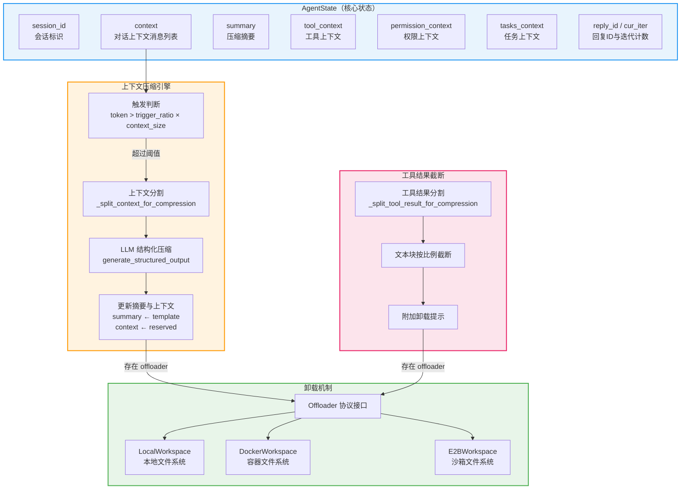
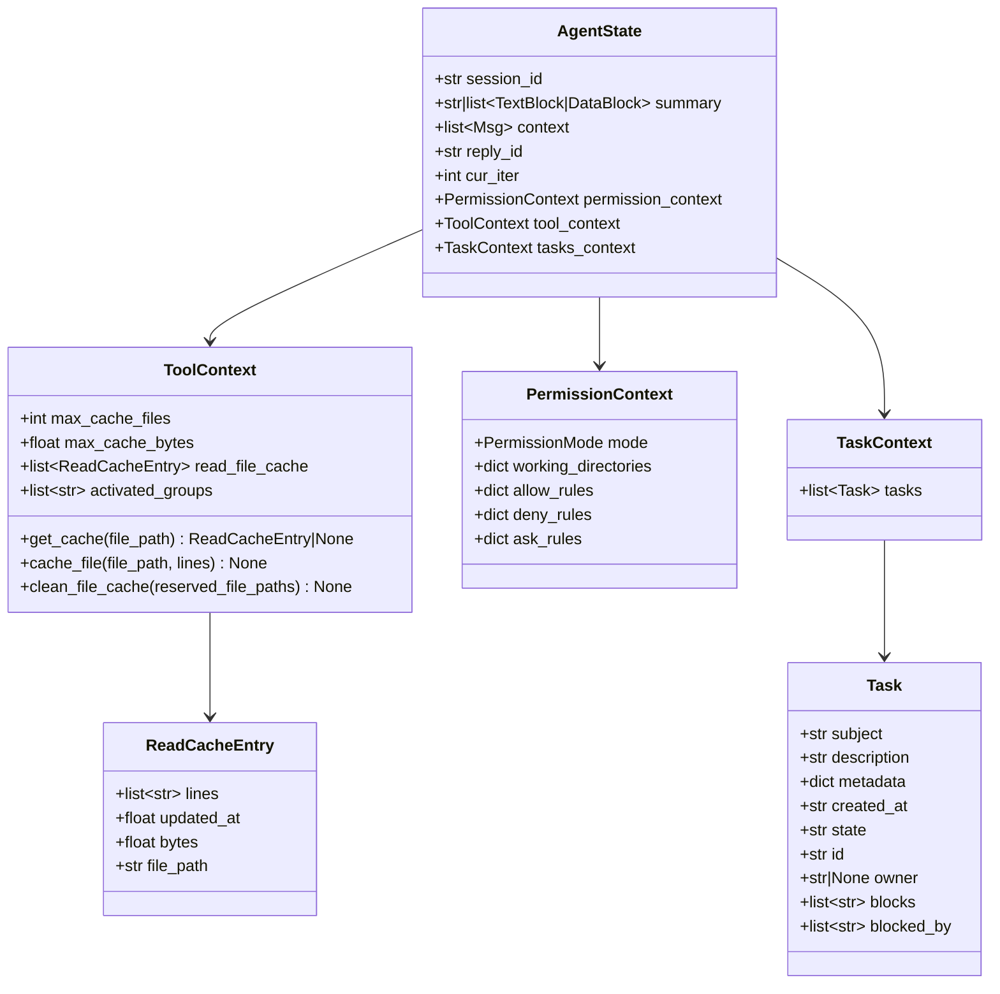
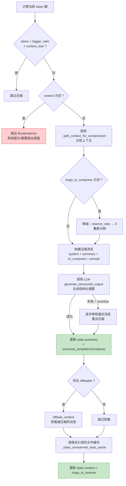
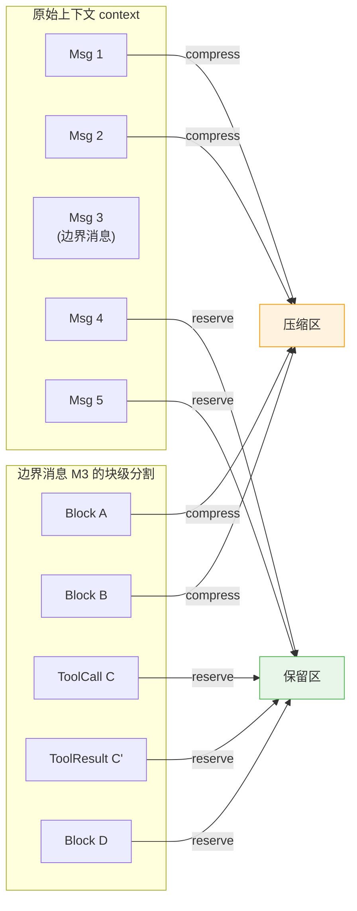
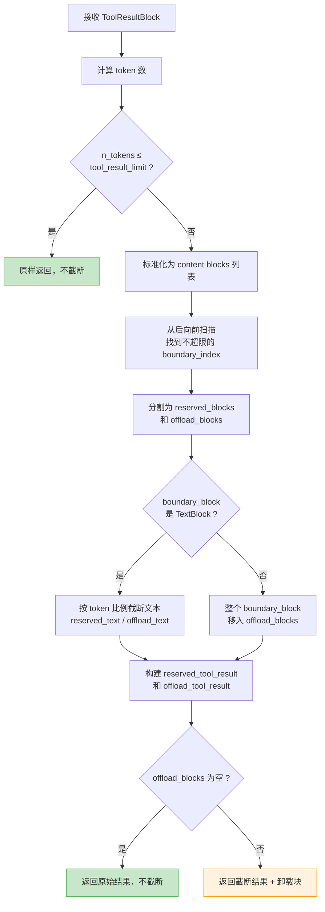
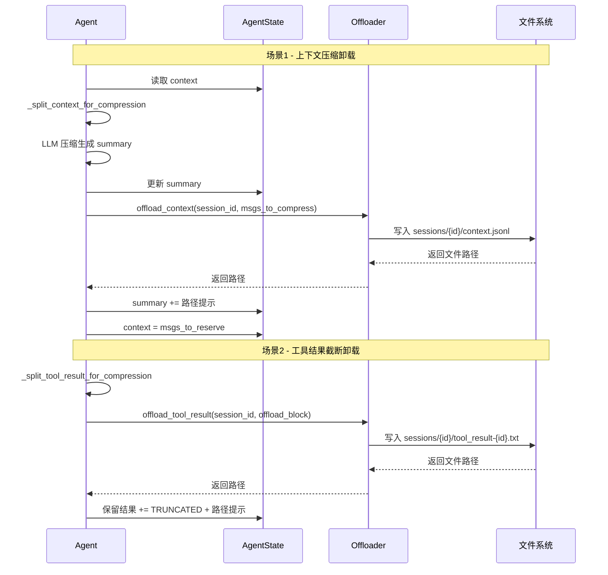
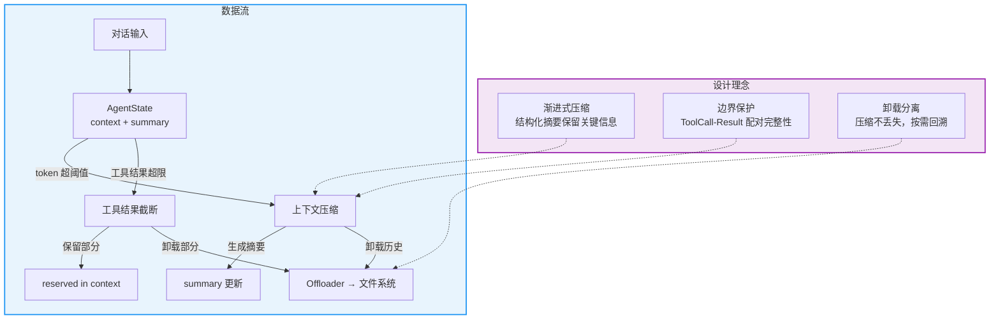

# AgentScope 2.0 状态与上下文管理

## 总：开篇概述

State 模块是 Agent 的"记忆系统"，贯穿 Agent 的整个生命周期，负责管理对话上下文、工具状态、权限上下文等核心数据。在长对话场景中，上下文窗口有限，Agent 必须在"记住什么"与"遗忘什么"之间做出精确决策——这正是状态与上下文管理模块要解决的核心问题。

**解决的核心问题：**

| 问题 | 描述 |
|------|------|
| 长对话上下文管理 | 对话轮次增多后，token 数超出模型上下文窗口 |
| 上下文压缩 | 将历史对话压缩为结构化摘要，保留关键信息 |
| 工具结果截断 | 工具返回结果过长时，按 token 预算截断并卸载 |
| 状态卸载 | 被压缩/截断的内容持久化到文件系统，供 Agent 按需回溯 |

**配图 8-1：状态与上下文管理架构全景图**



---

## 分：逐层展开

### 1. AgentState：Agent 的核心状态容器

`AgentState` 是整个状态管理体系的中心，定义在 `src/agentscope/state/_state.py` 第 140 行。它是一个 Pydantic `BaseModel`，可以被序列化/反序列化，从而支持状态的持久化与恢复。

**核心字段：**

| 字段 | 类型 | 说明 | 源码位置 |
|------|------|------|----------|
| `session_id` | `str` | 会话唯一标识，默认 UUID | `_state.py:143` |
| `context` | `list[Msg]` | 未压缩的对话上下文 | `_state.py:150` |
| `summary` | `str \| list[TextBlock \| DataBlock]` | 压缩后的历史摘要 | `_state.py:147` |
| `reply_id` | `str` | 当前回复的 ID | `_state.py:152` |
| `cur_iter` | `int` | 当前推理-行动循环迭代次数 | `_state.py:155` |
| `permission_context` | `PermissionContext` | 权限上下文 | `_state.py:161` |
| `tool_context` | `ToolContext` | 工具上下文（缓存等） | `_state.py:170` |
| `tasks_context` | `TaskContext` | 任务上下文 | `_state.py:175` |

**配图 8-2：AgentState 数据结构图**



#### 1.1 ToolContext：工具缓存管理

`ToolContext`（`_state.py:23`）管理工具执行过程中的缓存状态，核心是**文件读取缓存**（`read_file_cache`）和**工具组激活状态**（`activated_groups`）。

- **LRU 缓存淘汰**：当缓存文件数超过 `max_cache_files`（默认 100）或缓存字节数超过 `max_cache_bytes`（默认 25000）时，移除最旧的缓存条目（`_state.py:91-101`）
- **缓存有效性校验**：通过 `aiofiles.os.path.getmtime` 检查文件修改时间，若文件已被修改则缓存失效（`_state.py:52-62`）
- **缓存清理**：`clean_file_cache` 方法在上下文压缩后被调用，仅保留仍在上下文中被引用的文件缓存（`_state.py:113-131`）

#### 1.2 PermissionContext：权限上下文

`PermissionContext`（`permission/_context.py:24`）记录当前 Agent 的权限状态，包括：

- `mode`：权限模式（DEFAULT 等）
- `working_directories`：允许操作的工作目录
- `allow_rules` / `deny_rules` / `ask_rules`：按工具名组织的允许/拒绝/询问规则

---

### 2. 上下文压缩

上下文压缩是 AgentScope 2.0 应对长对话的核心机制，实现在 `src/agentscope/agent/_agent.py` 的 `_compress_context_impl` 方法（第 300 行）。

#### 2.1 触发条件

压缩的触发由 `ContextConfig`（`agent/_config.py:56`）中的 `trigger_ratio` 控制：

```python
# _agent.py:320
threshold = cfg.trigger_ratio * self.model.context_size
if estimated_tokens < threshold:
    return  # 不需要压缩
```

- `trigger_ratio` 默认值为 `0.8`，即当 token 数达到上下文窗口的 80% 时触发压缩
- `trigger_ratio` 上限为 `0.9`，预留至少 10% 的空间给压缩响应

#### 2.2 压缩流程

**配图 8-3：上下文压缩流程图**



#### 2.3 保留策略

`reserve_ratio`（默认 `0.1`）控制压缩后保留的最近上下文比例。分割时，系统计算 `reserve_ratio × context_size` 作为保留 token 预算，从最新消息向前扫描，直到保留部分不超过该预算。

#### 2.4 边界消息处理（_split_context_for_compression）

`_split_context_for_compression`（`_agent.py:1676`）是上下文分割的核心算法，采用**两级粒度**的分割策略：

1. **消息级分割**：从最新消息向前扫描，找到保留 token 预算内的消息边界（`_agent.py:1706-1716`）
2. **块级分割**：对边界消息（boundary message）进一步按内容块（content block）粒度分割（`_agent.py:1732-1744`）

**配图 8-4：上下文分割策略示意图**



#### 2.5 工具调用-结果配对保护

在边界消息的块级分割中，系统确保不会将 `ToolCallBlock` 和对应的 `ToolResultBlock` 拆分到不同区域（`_agent.py:1746-1761`）：

```python
# _agent.py:1750-1761
remain_result_ids = {}
for i in range(len(boundary_msg_content) - 1, block_index, -1):
    block = boundary_msg_content[i]
    if isinstance(block, ToolResultBlock):
        remain_result_ids[block.id] = i
    elif isinstance(block, ToolCallBlock):
        remain_result_ids.pop(block.id, None)

if remain_result_ids:
    block_index = max(remain_result_ids.values())
```

逻辑：如果保留区中存在 `ToolResultBlock` 但没有对应的 `ToolCallBlock`，则将该 `ToolResultBlock` 及其之前的块也移入压缩区，保证配对完整性。

#### 2.6 结构化摘要生成

压缩使用 LLM 的 `generate_structured_output` 能力，按照 `SummarySchema`（`_config.py:9`）生成结构化摘要：

| 字段 | 最大长度 | 说明 |
|------|----------|------|
| `task_overview` | 300 | 用户核心请求与成功标准 |
| `current_state` | 300 | 已完成的工作 |
| `important_discoveries` | 300 | 技术约束、决策与错误 |
| `next_steps` | 200 | 后续行动与阻塞项 |
| `context_to_preserve` | 300 | 用户偏好与领域细节 |

摘要通过 `summary_template`（`_config.py:90`）格式化后存入 `state.summary`，在后续对话中作为系统信息注入。

---

### 3. 工具结果压缩

工具执行结果可能非常长（如读取大文件），需要在写入上下文前进行截断。`_split_tool_result_for_compression`（`_agent.py:1805`）实现了这一机制。

#### 3.1 截断触发

当工具结果的 token 数超过 `tool_result_limit`（默认 3000，`_config.py:117`）时触发截断。

#### 3.2 截断流程

**配图 8-5：工具结果截断流程图**



#### 3.3 文本块按比例截断

对于边界处的 `TextBlock`，系统按 token 比例计算截断位置（`_agent.py:1882-1898`）：

```python
# _agent.py:1882-1894
token_delta = cur_tokens_plus - cur_tokens
remaining_token_budget = self.context_config.tool_result_limit - cur_tokens
if token_delta <= 0:
    reserved_tokens = len(truncated_text) if remaining_token_budget > 0 else 0
else:
    reserved_tokens = int(
        remaining_token_budget / token_delta * len(truncated_text),
    )
```

这里采用**线性比例估算**：用边界块的 token 数与字符数的比值，估算在剩余 token 预算内可保留的字符数。

#### 3.4 卸载提示信息

截断后，系统在保留的工具结果中附加提示信息（`_agent.py:1451-1472`）：

```
<<<TRUNCATED>>>
<system-reminder>The remaining content has been omitted for limited context.
You can refer to the file in '{path}' for the truncated content if needed.
</system-reminder>
```

如果存在 `offloader`，还会提供被卸载内容的文件路径，Agent 可通过读取该文件回溯完整结果。

---

### 4. 任务状态

`Task` 类（`src/agentscope/state/_task.py:10`）管理 Agent 的任务状态，是 `TaskContext` 的核心组成。

**Task 数据模型：**

| 字段 | 类型 | 说明 | 源码位置 |
|------|------|------|----------|
| `id` | `str` | 任务唯一标识（UUID） | `_task.py:28` |
| `subject` | `str` | 任务主题 | `_task.py:12` |
| `description` | `str` | 任务描述 | `_task.py:15` |
| `metadata` | `dict[str, Any]` | 附加元数据 | `_task.py:18` |
| `created_at` | `str` | 创建时间（ISO 格式） | `_task.py:21` |
| `state` | `Literal["pending", "in_progress", "completed"]` | 任务状态 | `_task.py:24` |
| `owner` | `str \| None` | 任务拥有者 | `_task.py:30` |
| `blocks` | `list[str]` | 被此任务阻塞的任务 ID 列表 | `_task.py:33` |
| `blocked_by` | `list[str]` | 阻塞此任务的任务 ID 列表 | `_task.py:36` |

任务状态支持三种生命周期阶段：`pending`（待处理）→ `in_progress`（进行中）→ `completed`（已完成），并通过 `blocks` / `blocked_by` 字段支持任务间的依赖关系建模。

`TaskContext`（`_state.py:133`）作为 `AgentState` 的子字段，以列表形式维护所有任务实例，为 Agent 的任务规划与执行提供状态追踪能力。

---

### 5. 卸载机制

卸载机制负责将压缩/截断后的内容持久化到文件系统，使 Agent 在需要时可以回溯完整的历史信息。

#### 5.1 Offloader 协议接口

`Offloader`（`src/agentscope/workspace/_offload_protocol.py:8`）是一个 `Protocol` 类，定义了两个异步方法：

| 方法 | 参数 | 返回值 | 说明 |
|------|------|--------|------|
| `offload_context` | `session_id, msgs` | `str` | 卸载压缩的上下文消息 |
| `offload_tool_result` | `session_id, tool_result` | `str` | 卸载截断的工具结果 |

返回值为卸载文件的路径或标识符，Agent 可据此回溯内容。

#### 5.2 卸载实现

AgentScope 提供了三种 Workspace 实现，均支持卸载：

- **LocalWorkspace**（`workspace/_local_workspace.py:478`）：卸载到本地文件系统 `sessions/{session_id}/context.jsonl`
- **DockerWorkspace**（`workspace/_docker/_docker_workspace.py:678`）：卸载到容器内文件系统
- **E2BWorkspace**（`workspace/_e2b/_e2b_workspace.py:568`）：卸载到 E2B 沙箱文件系统

以 `LocalWorkspace.offload_context` 为例（`_local_workspace.py:478`）：

1. 构建路径 `{workdir}/sessions/{session_id}/context.jsonl`
2. 深拷贝消息列表，处理内联 `DataBlock`（Base64 数据提取为文件引用）
3. 将每条消息序列化为 JSON 行，追加写入 JSONL 文件

#### 5.3 卸载触发点

卸载在两个场景中被触发：

1. **上下文压缩后**（`_agent.py:472-481`）：压缩完成后，若存在 offloader，将 `msgs_to_compress` 卸载，并在摘要中附加路径提示
2. **工具结果截断后**（`_agent.py:1450-1468`）：截断后，若存在 offloader 且有卸载内容，将 `offload_tool_result_block` 卸载，并在保留结果中附加路径提示

**配图 8-6：卸载机制数据流图**



---

## 总：总结升华

### 核心设计决策

AgentScope 2.0 的状态与上下文管理体现了三个核心设计决策：

1. **渐进式压缩**：不是一次性丢弃历史，而是通过 LLM 生成结构化摘要，将关键信息以 `task_overview → current_state → important_discoveries → next_steps → context_to_preserve` 五维度保留，确保 Agent 在压缩后仍能"无缝续接"工作。

2. **边界保护**：在上下文分割时，通过两级粒度（消息级 → 块级）精确控制分割点，并特别保护 `ToolCall-ToolResult` 配对的完整性，避免 Agent 在推理时遇到"有结果无调用"的语义断裂。

3. **卸载分离**：被压缩/截断的内容不是简单丢弃，而是通过 `Offloader` 协议持久化到文件系统，Agent 可通过文件路径按需回溯。这种"压缩但不丢失"的设计在信息完整性与上下文效率之间取得了平衡。

### 扩展点

| 扩展点 | 机制 | 说明 |
|--------|------|------|
| 自定义压缩策略 | `ContextConfig` | 调整 `trigger_ratio`、`reserve_ratio`、`compression_prompt` |
| 自定义摘要结构 | `SummarySchema` | 修改结构化输出的字段定义 |
| 自定义卸载目标 | `Offloader` Protocol | 实现新的 Workspace 类型（如云存储） |
| 压缩中间件 | `on_compress_context` | 在压缩前后注入自定义逻辑 |
| 工具结果限制 | `tool_result_limit` | 调整工具结果的 token 上限 |

### 总结图



AgentScope 2.0 的状态与上下文管理，本质上是在有限上下文窗口约束下，为 Agent 构建了一套"记忆的遗忘与回溯"机制——通过结构化压缩保留工作连续性，通过边界保护维护语义完整性，通过卸载分离实现信息可追溯性。这三者的协同，使得 Agent 能够在长任务场景中持续高效地工作。
