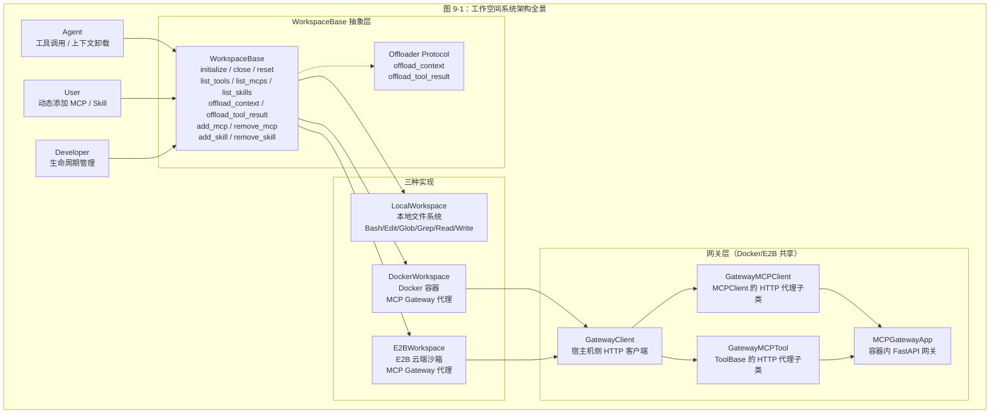
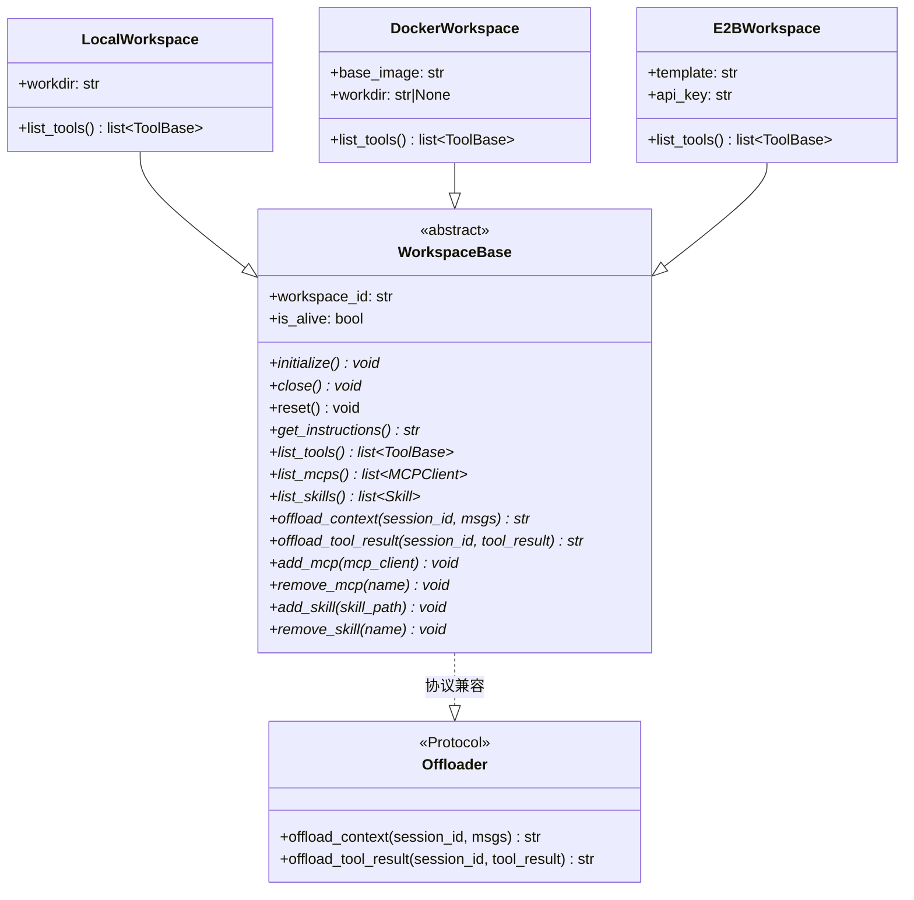
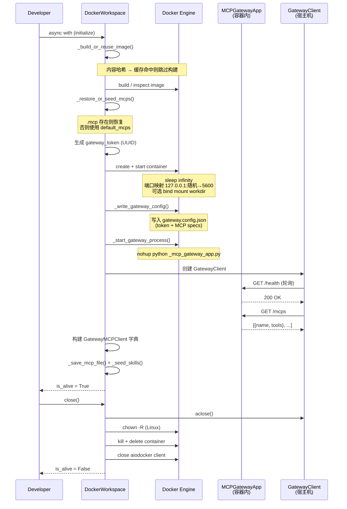
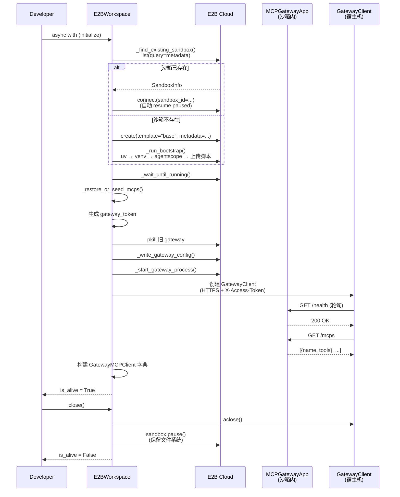
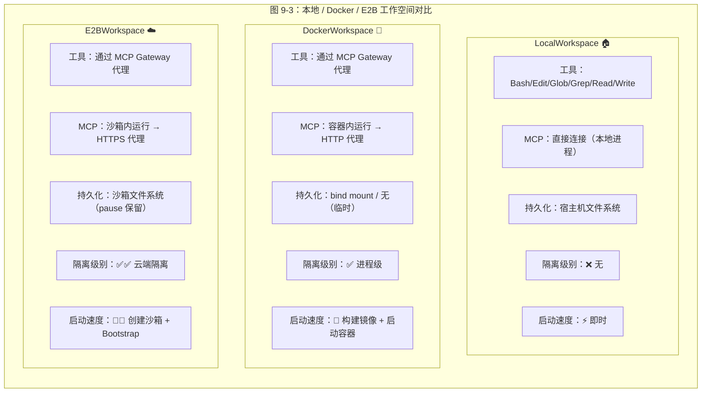
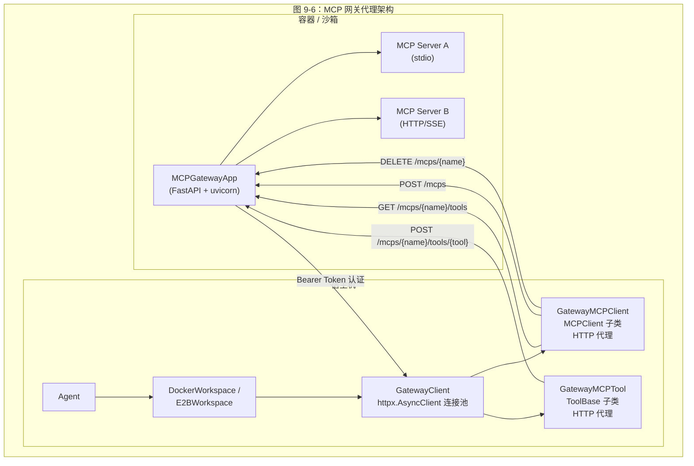
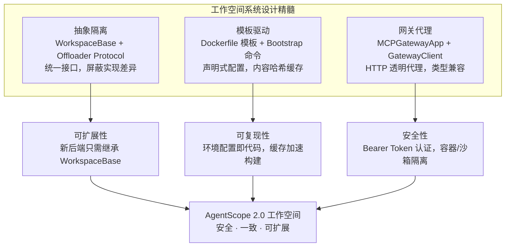

# AgentScope 2.0 工作空间系统

## 总：开篇概述

工作空间（Workspace）模块是 AgentScope 2.0 中 Agent 的**执行环境**，为 Agent 提供安全隔离的工具执行空间。它不仅仅是一个文件目录，而是一个完整的运行时沙箱——承载资源（Skills）、工具（MCPs）、上下文卸载（Offload）三大核心能力。

**解决的核心问题：**

1. **安全隔离**——Agent 执行的代码（Bash 命令、文件读写等）可能对宿主机造成破坏，工作空间将其限制在受控环境中
2. **环境一致性**——不同 Agent 需要不同的运行时依赖（Python 包、Node.js 等），工作空间通过模板化构建确保环境可复现
3. **远程执行**——将工具调用代理到远程容器/云端沙箱执行，宿主机无需安装所有依赖

**三种实现：**

- `LocalWorkspace`——本地文件系统，零隔离，适合开发调试
- `DockerWorkspace`——Docker 容器，进程级隔离，适合生产部署
- `E2BWorkspace`——E2B 云端沙箱，最高级别隔离，适合多租户场景



---

## 分：逐层展开

### 1. 工作空间基类与接口

#### 1.1 Offloader 协议

`Offloader` 是一个 Python `Protocol` 类（即结构化子类型），定义了上下文卸载的最小接口。任何实现了 `offload_context` 和 `offload_tool_result` 两个异步方法的对象，都可以作为 Offloader 使用。

> 源码：`src/agentscope/workspace/_offload_protocol.py` 第 8-45 行

```python
class Offloader(Protocol):
    async def offload_context(self, session_id: str, msgs: list[Msg]) -> str: ...
    async def offload_tool_result(self, session_id: str, tool_result: ToolResultBlock) -> str: ...
```

**设计意图：** 将"卸载"能力从 Workspace 中解耦为独立协议，使得非 Workspace 组件也能实现卸载逻辑。`WorkspaceBase` 的 `offload_context` 和 `offload_tool_result` 抽象方法与 `Offloader` 协议签名完全一致，保证了接口兼容性。

#### 1.2 WorkspaceBase 基类

`WorkspaceBase` 是所有工作空间实现的抽象基类，定义了三大类消费者（Agent、User、Developer）所需的方法契约。

> 源码：`src/agentscope/workspace/_base.py` 第 36-203 行

**核心状态：**

| 属性 | 类型 | 说明 |
|------|------|------|
| `workspace_id` | `str` | 唯一标识，未指定时自动生成 UUID |
| `is_alive` | `bool` | 生命周期标记 |

**方法分组：**

| 消费者 | 方法 | 说明 |
|--------|------|------|
| Developer | `initialize()` / `close()` / `reset()` | 生命周期管理 |
| Developer | `__aenter__` / `__aexit__` | `async with` 上下文管理器 |
| Agent | `get_instructions()` | 返回工作空间特有的系统提示片段 |
| Agent | `list_tools()` / `list_mcps()` / `list_skills()` | 工具与资源发现 |
| Agent | `offload_context()` / `offload_tool_result()` | 上下文卸载 |
| User | `add_mcp()` / `remove_mcp()` | 动态 MCP 管理 |
| User | `add_skill()` / `remove_skill()` | 动态 Skill 管理 |

**生命周期协议：** `__aenter__` 调用 `initialize()` 并设置 `is_alive=True`，`__aexit__` 调用 `close()` 并设置 `is_alive=False`。`reset()` 是可选的——默认为空操作，子类按需覆盖以清除用户状态。



> 图 9-2：工作空间类继承图

---

### 2. 本地工作空间

`LocalWorkspace` 是最简单的工作空间实现，直接在宿主机文件系统上操作，无任何隔离。它是开发调试的首选，也是理解工作空间核心逻辑的最佳入口。

> 源码：`src/agentscope/workspace/_local_workspace.py` 第 118-1067 行

#### 2.1 目录布局

```
{workdir}/
├── .mcp          # 持久化的 MCP 客户端配置（JSON 数组）
├── .skills       # Skill 索引文件（JSON）
├── data/         # 卸载的多模态文件（图片等）
├── skills/       # Skill 子目录
└── sessions/     # 每会话的上下文和工具结果文件
```

#### 2.2 初始化流程

`initialize()` 方法（第 178-304 行）执行以下步骤：

1. **创建工作目录**——`os.makedirs(self.workdir, exist_ok=True)`
2. **恢复或播种 MCP**——检查 `.mcp` 文件是否存在：存在则从磁盘恢复，否则使用 `default_mcps` 并持久化
3. **连接有状态 MCP**——对每个 `is_stateful and not is_connected` 的 MCP 调用 `connect()`
4. **播种 Skill**——遍历 `skill_paths`，验证、去重（SHA-256 哈希）、解决名称冲突后复制到 `skills/` 目录

**幂等性保证：** 如果 `is_alive` 已为 `True`，`initialize()` 直接返回（第 187-188 行）。

#### 2.3 Skill 管理与索引

LocalWorkspace 实现了一套精细的 Skill 索引系统：

- **索引文件** `.skills`（第 43-58 行定义的 `_SkillsFile` 类型）：记录每个 Skill 目录的哈希值和 Agent 面向名称
- **去重机制**：通过 `SKILL.md` 内容的 SHA-256 哈希判断是否已存在（第 431-433 行）
- **冲突解决**：Agent 面向名称冲突时追加数字后缀（如 `"web-scraper (1)"`），目录名冲突同理
- **增量协调**：`list_skills()` 通过比较 `skills_dir` 的 `mtime` 检测手动增删，触发 `_reconcile_skills_dir()` 增量更新索引（第 714-809 行）

#### 2.4 上下文卸载

**offload_context**（第 478-531 行）：将消息列表以 JSONL 格式追加到 `sessions/{session_id}/context.jsonl`。内联的 Base64 `DataBlock` 会被提取到 `data/` 目录，替换为 `file://` URL 引用，保持 JSONL 行大小可控。

**offload_tool_result**（第 533-592 行）：将工具结果写入 `sessions/{session_id}/tool_result-{id}.txt`。文件名冲突时追加 `(1)`、`(2)` 等后缀。

**DataBlock 卸载**（第 437-476 行）：以 Base64 数据的 SHA-256 全摘要为文件名，同内容自动去重——相同哈希保证内容相同，无需读取比较。

#### 2.5 内置工具

`list_tools()` 返回六个本地文件系统工具（第 653-662 行）：

```python
return [Bash(), Edit(), Glob(), Grep(), Read(), Write()]
```

这是 LocalWorkspace 与 Docker/E2B 的关键区别——后者不提供任何内置工具，所有工具通过 MCP Gateway 代理。

---

### 3. Docker 工作空间

`DockerWorkspace` 将工作空间运行在 Docker 容器内，实现进程级隔离。MCP 服务器在容器内部运行，宿主机通过 HTTP Gateway 代理与之交互。

> 源码：`src/agentscope/workspace/_docker/_docker_workspace.py` 第 127-1229 行

#### 3.1 核心架构

```
┌─────────────────────────────────────────────────┐
│                   宿主机                         │
│  DockerWorkspace ──→ GatewayClient ──HTTP──→    │
│       │              GatewayMCPClient            │
│       │              GatewayMCPTool              │
└──────────────────────────┬──────────────────────┘
                           │ HTTP (端口映射)
┌──────────────────────────▼──────────────────────┐
│                Docker 容器                       │
│  MCPGatewayApp (FastAPI)                        │
│    ├── MCP Server A (stdio)                     │
│    ├── MCP Server B (HTTP)                      │
│    └── ...                                      │
│  /workspace/                                    │
│    ├── data/  skills/  sessions/                │
└─────────────────────────────────────────────────┘
```

#### 3.2 Dockerfile 模板系统

Docker 工作空间采用**模板驱动的镜像构建**，通过内容哈希实现缓存复用。

> 源码：`src/agentscope/workspace/_docker/_make_dockerfile.py` 第 1-275 行

**模板文件组成：**

| 模板文件 | 用途 |
|----------|------|
| `Dockerfile.template` | 主模板，定义基础镜像、uv 安装、venv 创建 |
| `Dockerfile.node_from.template` | Node.js FROM 阶段（可选） |
| `Dockerfile.node_copy.template` | Node.js COPY 阶段（可选） |
| `Dockerfile.install_pypi.template` | PyPI 发布版安装 |
| `Dockerfile.install_src.template` | 源码开发版安装 |

**两种安装模式：**

- **Released 模式**——宿主机的 agentscope 来自 site-packages，容器从 PyPI 安装同版本
- **Dev 模式**——宿主机运行源码检出，将项目树复制到构建上下文，通过 `uv pip install /tmp/agentscope_src` 安装

**镜像标签计算**（第 168-193 行）：`compute_image_tag()` 对 Dockerfile 文本 + 所有 COPY 文件内容取 SHA-256 哈希，生成 `agentscope-workspace:<12hex>` 标签。标签命中本地缓存则跳过构建。

**容器内路径常量**（第 47-65 行）：

| 常量 | 值 | 说明 |
|------|-----|------|
| `CONTAINER_WORKDIR` | `/workspace` | 容器内工作目录 |
| `CONTAINER_DATA_DIR` | `/workspace/data` | 卸载数据目录 |
| `CONTAINER_SKILLS_DIR` | `/workspace/skills` | Skill 目录 |
| `CONTAINER_SESSIONS_DIR` | `/workspace/sessions` | 会话目录 |
| `GATEWAY_HOME` | `/root/.agentscope` | Gateway 主目录 |
| `GATEWAY_SCRIPT` | `/root/.agentscope/_mcp_gateway_app.py` | Gateway 脚本路径 |
| `GATEWAY_CONFIG` | `/root/.agentscope/gateway.config.json` | Gateway 配置路径 |

#### 3.3 容器生命周期管理



> 图 9-4：Docker 工作空间生命周期时序图

**initialize() 七步流程**（第 230-293 行）：

1. 构建/复用镜像（`_build_or_reuse_image`）
2. 恢复/播种 MCP（`_restore_or_seed_mcps`）
3. 生成 Gateway Bearer Token（`uuid.uuid4().hex`）
4. 创建并启动容器（`_create_and_start_container`）
5. 写入 Gateway 配置 + 启动 Gateway 进程
6. 轮询 `/health` 等待 Gateway 就绪（指数退避，最长 30 秒）
7. 拉取 Gateway 侧 MCP 视图，构建 `GatewayMCPClient` 实例

**close() 的 Linux 特殊处理**（第 358-366 行）：Linux 原生 Docker 保留容器内的文件所有权——容器内 root 进程写入的文件在宿主机上也是 root 所有，非 root 宿主用户无法删除。`close()` 在销毁容器前执行 `chown -R` 修正权限。

#### 3.4 容器 I/O 原语

DockerWorkspace 封装了三个底层 I/O 方法：

- **`_exec(command, timeout)`**（第 1050-1121 行）：通过 `docker exec` 在容器内执行命令，捕获 stdout/stderr/exit_code
- **`_read(path)`**（第 1123-1171 行）：通过 `get_archive` 获取容器内文件，解析 tar 流返回字节
- **`_write(path, data)`**（第 1173-1193 行）：通过 `put_archive` 将字节写入容器内文件

---

### 4. E2B 工作空间

`E2BWorkspace` 将工作空间运行在 E2B 云端沙箱中，实现最高级别的隔离。架构上与 DockerWorkspace 镜像对称，但将 Docker 引擎替换为 E2B SDK。

> 源码：`src/agentscope/workspace/_e2b/_e2b_workspace.py` 第 143-1034 行

#### 4.1 核心差异

| 特性 | DockerWorkspace | E2BWorkspace |
|------|----------------|--------------|
| 执行后端 | 本地 Docker Engine | E2B 云端 SDK |
| 持久化 | 宿主机 `workdir` bind mount | 沙箱文件系统（pause 保留） |
| 网络访问 | `127.0.0.1:<host_port>` | E2B 代理 `sandbox.get_host(port)` + `X-Access-Token` |
| 环境准备 | Dockerfile 镜像构建 | Bootstrap Shell 命令序列 |
| 关闭行为 | kill + delete 容器 | pause 沙箱（保留文件系统） |
| 重新连接 | 重新创建容器 | 通过 metadata 查找并 resume |

#### 4.2 Bootstrap 脚本

E2B 没有 Dockerfile 镜像构建阶段，而是通过 Shell 命令序列在首次创建沙箱时安装依赖。

> 源码：`src/agentscope/workspace/_e2b/_bootstrap.py` 第 1-190 行

**Bootstrap 命令序列**（`bootstrap_commands()`，第 122-162 行）：

1. `mkdir -p` 创建目录布局
2. `curl` 安装 uv（落位到 `$HOME/.local/bin`，因为沙箱用户无 sudo）
3. `uv venv` 创建 Gateway 虚拟环境
4. `uv pip install` 安装 Gateway 基础依赖
5. 安装 agentscope（released 模式从 PyPI，dev 模式从上传的源码 tarball）

**幂等性标记**：`GATEWAY_SCRIPT` 文件的存在性作为 Bootstrap 是否已完成的检测标记（`_e2b_workspace.py` 第 280 行）。如果脚本文件不存在（首次创建或上次 Bootstrap 中断），则重新运行——每步命令本身是幂等的（`mkdir -p`、`uv venv` 等）。

**沙箱内路径常量**（第 57-72 行）：

| 常量 | 值 | 说明 |
|------|-----|------|
| `SANDBOX_WORKDIR` | `/home/user/workspace` | 沙箱内工作目录（注意：user 非 root） |
| `GATEWAY_HOME` | `/home/user/.agentscope` | Gateway 主目录 |
| `UV_BIN` | `/home/user/.local/bin/uv` | uv 安装路径 |
| `METADATA_WORKSPACE_ID_KEY` | `agentscope.workspace.id` | E2B metadata 中的 workspace_id 键 |

#### 4.3 沙箱生命周期



> 图 9-5：E2B 工作空间交互时序图

**沙箱重连机制**（`_attach_or_create_sandbox`，第 646-688 行）：

1. 通过 `AsyncSandbox.list(query=SandboxQuery(metadata={...}))` 查找已有沙箱
2. 找到则 `AsyncSandbox.connect(sandbox_id=...)` 重连（自动 resume paused 状态）
3. 未找到则 `AsyncSandbox.create(...)` 创建新沙箱并运行 Bootstrap
4. 多个候选沙箱时选择 `started_at` 最新的，并记录警告

**E2B 代理认证**（`_sandbox_proxy_headers`，第 775-787 行）：E2B 的边缘代理通过 `X-Access-Token` 头控制对非默认端口的访问，token 来自沙箱对象的 `traffic_access_token` 属性。

---

### 5. 三种工作空间对比



| 维度 | LocalWorkspace | DockerWorkspace | E2BWorkspace |
|------|---------------|----------------|--------------|
| **隔离级别** | 无 | 进程级（容器） | 云端级（远程沙箱） |
| **内置工具** | Bash/Edit/Glob/Grep/Read/Write | 无（全通过 MCP） | 无（全通过 MCP） |
| **MCP 运行位置** | 宿主机本地 | 容器内 | 云端沙箱内 |
| **MCP 通信方式** | 直接调用 | HTTP（端口映射） | HTTPS（E2B 代理） |
| **持久化方式** | 宿主机 workdir | bind mount 或临时 | 沙箱文件系统 |
| **环境准备** | 无 | Dockerfile 镜像构建 | Bootstrap Shell 命令 |
| **关闭行为** | 关闭 MCP 连接 | kill + delete 容器 | pause 沙箱 |
| **重连能力** | 重新 initialize | 重新创建容器 | metadata 查找 + resume |
| **Skill 管理** | 哈希索引 + 增量协调 | tar 上传 + 目录扫描 | 逐文件上传 + 目录扫描 |
| **适用场景** | 开发调试 | 生产部署 | 多租户 / 最高安全 |

---

### 6. MCP 网关

MCP 网关是 DockerWorkspace 和 E2BWorkspace 共享的核心组件，解决了"宿主机如何与容器/沙箱内的 MCP 服务器交互"的问题。

#### 6.1 MCPGatewayApp

`MCPGatewayApp` 是运行在容器/沙箱内部的 FastAPI 应用，作为 MCP 服务器的 HTTP 代理。

> 源码：`src/agentscope/workspace/_mcp_gateway/_mcp_gateway_app.py` 第 1-242 行

**端点设计：**

| 方法 | 路径 | 认证 | 说明 |
|------|------|------|------|
| GET | `/health` | 无 | 存活探针 |
| GET | `/mcps` | Bearer | 列出所有已注册 MCP |
| POST | `/mcps` | Bearer | 注册新 MCP（body: MCPClient.model_dump()） |
| DELETE | `/mcps/{name}` | Bearer | 注销 MCP |
| GET | `/mcps/{name}/tools` | Bearer | 获取上游工具 Schema |
| POST | `/mcps/{name}/tools/{tool}` | Bearer | 调用上游工具 |

**认证机制**（第 60-73 行）：除 `/health` 外所有端点需要 `Authorization: Bearer <token>` 头。Token 在 `initialize()` 时生成，通过配置文件传入容器——**永不落盘**。

**启动流程**（`_run` 函数，第 196-225 行）：

1. 读取 `--config` 指定的 JSON 配置文件
2. 初始化 `_State`（clients 字典 + token + asyncio.Lock）
3. `_connect_initial()` 连接配置中的所有 MCP 服务器
4. 启动 uvicorn 服务

**关键设计决策——独立脚本调用**：Gateway 脚本通过路径直接调用（`python /path/to/_mcp_gateway_app.py`），而非 `python -m agentscope.workspace._mcp_gateway`。这是为了避免 Python 自动导入 `agentscope.workspace.__init__`，后者会拉入 skill/tool/local_workspace/docker_workspace 等重量级模块及其传递依赖。

#### 6.2 GatewayClient

`GatewayClient` 是宿主机侧的网关外观，封装了与 MCPGatewayApp 的 HTTP 交互。

> 源码：`src/agentscope/workspace/_gateway_client.py` 第 450-634 行

**核心职责：**

- 管理 `httpx.AsyncClient` 连接池，所有派生的 `GatewayMCPClient` 和 `GatewayMCPTool` 共享
- `health()` 探测网关就绪状态
- `list_mcps()` 拉取已注册 MCP 列表，构建 `GatewayMCPClient` 实例
- `make_client()` 从 spec 构建 `GatewayMCPClient`，通过 `attach()` 注入传输状态

#### 6.3 GatewayMCPClient

`GatewayMCPClient` 继承自 `MCPClient`，将所有 MCP 协议操作替换为 HTTP 调用。

> 源码：`src/agentscope/workspace/_gateway_client.py` 第 187-444 行

**方法映射：**

| MCPClient 方法 | GatewayMCPClient 实现 |
|----------------|----------------------|
| `model_post_init` | 空操作（跳过父类的 stdio/HTTP 客户端初始化） |
| `connect()` | `POST /mcps` 注册并启动上游 |
| `close()` | `DELETE /mcps/{name}` 注销上游 |
| `list_raw_tools()` | `GET /mcps/{name}/tools` 拉取上游工具列表 |
| `get_tool()` | 从缓存中查找并包装为 `GatewayMCPTool` |

**`attach()` 方法**（第 221-267 行）：将网关传输状态（URL、Token、HTTP 客户端、超时）注入到 `GatewayMCPClient` 实例中。这是唯一的外部注入路径，封装了所有 `PrivateAttr` 写入。

#### 6.4 GatewayMCPTool

`GatewayMCPTool` 继承自 `ToolBase`，将工具调用替换为 HTTP POST。

> 源码：`src/agentscope/workspace/_gateway_client.py` 第 43-181 行

**调用流程**（`__call__`，第 136-181 行）：

1. 构造 URL：`/mcps/{mcp_name}/tools/{tool_name}`
2. 发送 POST 请求，body 为 `{"arguments": kwargs}`
3. 成功（2xx）：从响应中提取 `chunk` 字段，重建 `ToolChunk`
4. 失败（4xx/5xx）：返回 `ToolChunk(state=ERROR)`，Agent 循环可据此推理失败原因

**权限策略**（第 116-134 行）：与 `MCPTool` 保持一致——只读工具自动允许，其他工具需用户确认。



---

## 总：总结升华

### 核心设计决策

1. **抽象隔离**——`WorkspaceBase` 通过抽象方法统一了三种实现的接口，消费者（Agent/User/Developer）无需关心底层是本地目录、Docker 容器还是云端沙箱。`Offloader` Protocol 进一步将卸载能力解耦为独立协议。

2. **模板驱动**——DockerWorkspace 的 Dockerfile 模板系统和 E2BWorkspace 的 Bootstrap 命令序列，都遵循"声明式配置 + 内容哈希缓存"的模式，确保环境可复现且构建可跳过。

3. **网关代理**——MCPGatewayApp + GatewayClient + GatewayMCPClient + GatewayMCPTool 构成完整的 HTTP 代理链，将容器/沙箱内的 MCP 服务器透明地暴露给宿主机。`GatewayMCPClient` 继承 `MCPClient`、`GatewayMCPTool` 继承 `ToolBase`，保证了类型兼容性——上层代码无法区分本地 MCP 和远程 MCP。

### 扩展点

| 扩展方向 | 实现方式 |
|----------|----------|
| 新的执行后端（如 Kubernetes Pod） | 继承 `WorkspaceBase`，实现所有抽象方法 |
| 新的 MCP 传输协议 | `GatewayMCPClient` 已覆盖 HTTP 代理，新协议只需在 Gateway 侧适配 |
| 自定义 Skill 索引策略 | 覆盖 `list_skills()` / `add_skill()` / `remove_skill()` |
| 自定义卸载存储 | 实现 `Offloader` Protocol，或覆盖 `offload_context()` / `offload_tool_result()` |
| 自定义 Gateway 认证 | 修改 `_make_auth_dep()` 或注入 `extra_headers` |

### 总结



工作空间系统的本质是**为 Agent 构建一个受控的执行边界**。从 LocalWorkspace 的零隔离开发体验，到 DockerWorkspace 的进程级安全隔离，再到 E2BWorkspace 的云端级多租户隔离，三种实现覆盖了从开发到生产的完整光谱。而 MCP 网关代理架构则巧妙地解决了跨边界工具调用的难题——通过继承兼容的 HTTP 代理，让上层代码在完全无感知的情况下，将工具执行从本地切换到远程容器甚至云端沙箱。
