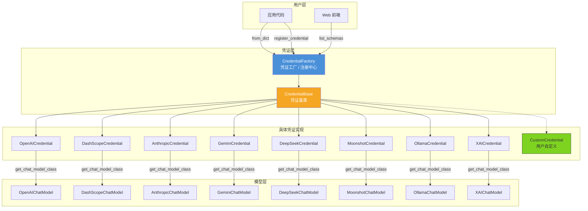
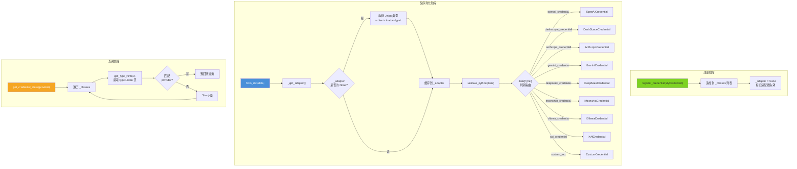
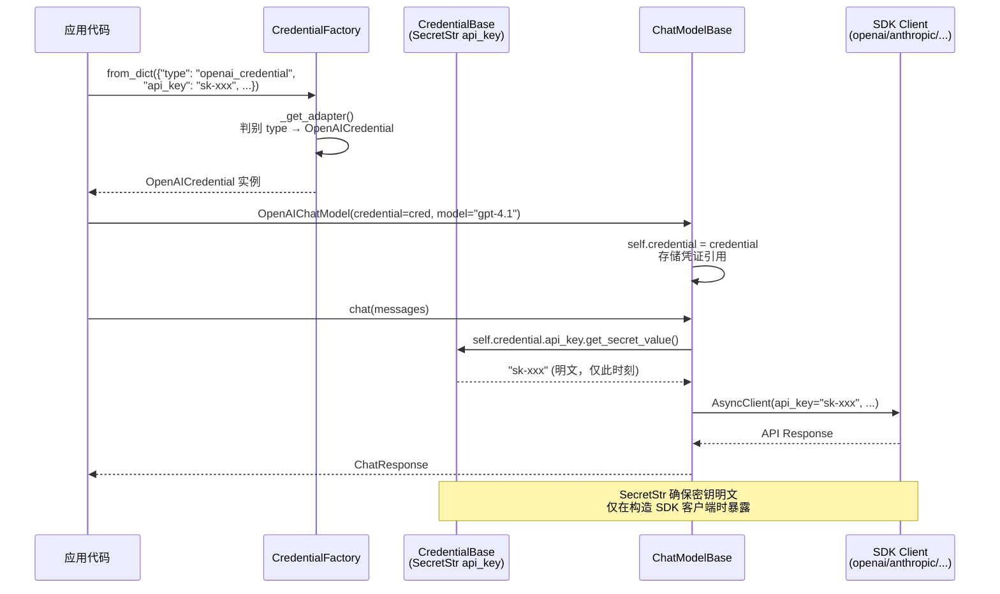
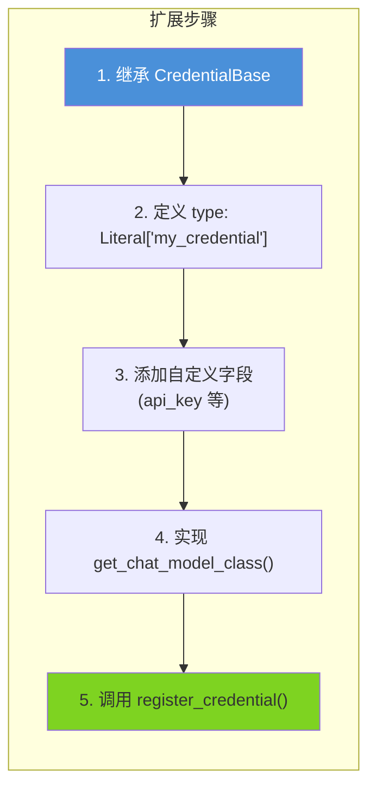
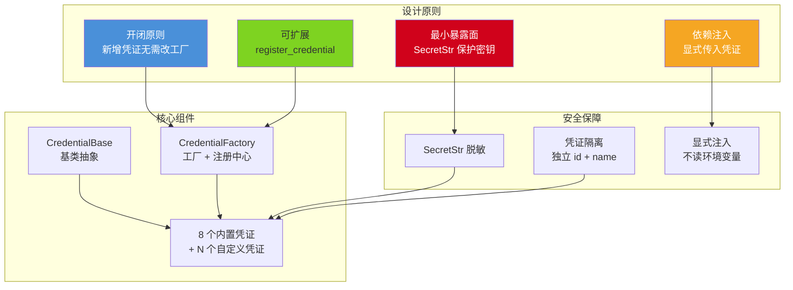

# AgentScope 2.0 凭证与安全

## 总：开篇概述

Credential 模块是 AgentScope 2.0 中 Agent 的"身份认证中心"，负责管理与各大 LLM 提供商的 API 密钥及连接配置。在多模型、多提供商的 Agent 系统中，凭证管理面临三大核心挑战：

1. **统一凭证接口**：不同提供商的认证参数各异（有的只需 API Key，有的需要 Organization ID，有的只需 Host 地址），如何用一套统一接口屏蔽差异？
2. **多提供商凭证管理**：一个 Agent 可能同时调用 OpenAI、Anthropic、DashScope 等多个提供商的模型，如何高效管理多套凭证？
3. **安全密钥存储**：API Key 等敏感信息如何在内存和序列化过程中得到保护？

Credential 模块通过**基类抽象 + 工厂模式 + Pydantic SecretStr** 的组合设计，优雅地解决了上述问题。

**配图 10-1：凭证系统架构全景图**



---

## 分：逐层展开

### 1. 凭证基类 CredentialBase

`CredentialBase` 是所有凭证类型的抽象基类，继承自 Pydantic 的 `BaseModel`，定义了凭证的通用结构。

> 源码位置：`src/agentscope/credential/_base.py`

#### 1.1 凭证接口定义

```python
# _base.py 第12-23行
class CredentialBase(BaseModel):
    """The credential base class."""

    id: str = Field(
        default_factory=lambda: uuid.uuid4().hex,
        description="The credential id",
    )

    name: str = Field(
        default="",
        description="User-facing display name for this credential.",
    )
```

基类定义了两个通用字段：

| 字段 | 类型 | 说明 |
|------|------|------|
| `id` | `str` | 凭证唯一标识，自动生成 UUID hex，用于凭证的持久化和检索 |
| `name` | `str` | 用户可读的显示名称，便于在 UI 中区分不同凭证 |

#### 1.2 凭证与模型的绑定关系

基类通过两个类方法建立了凭证与模型之间的双向绑定：

```python
# _base.py 第25-50行
@classmethod
def get_chat_model_class(cls) -> Type["ChatModelBase"]:
    """Return the ChatModelBase subclass that consumes this credential."""
    raise NotImplementedError(
        f"{cls.__name__} must implement ``get_chat_model_class``.",
    )

@classmethod
def list_models(cls) -> list["ModelCard"]:
    """List the candidate chat models available under this credential."""
    return cls.get_chat_model_class().list_models()
```

- **`get_chat_model_class()`**：抽象方法，子类必须实现，返回该凭证对应的 `ChatModelBase` 子类。例如 `OpenAICredential` 返回 `OpenAIChatModel`。
- **`list_models()`**：提供默认实现，委托给 `get_chat_model_class()` 返回的模型类来列举可用模型。这意味着通过一个凭证实例即可查询该提供商下所有可用模型。

这种设计使得凭证不仅仅是"钥匙"，更是"入口"——从凭证可以直接导航到对应的模型类和模型列表。

#### 1.3 Pydantic BaseModel 的选择

选择 Pydantic `BaseModel` 作为基类带来了多重好处：

- **数据验证**：自动校验字段类型和约束
- **序列化/反序列化**：支持 `model_dump()` 和 `model_validate()`，便于持久化存储
- **JSON Schema 生成**：通过 `model_json_schema()` 可为前端动态生成表单
- **SecretStr 支持**：敏感字段可使用 `SecretStr` 类型，序列化时自动脱敏

---

### 2. 凭证工厂 CredentialFactory

`CredentialFactory` 是凭证系统的中枢，采用工厂模式 + 注册表模式，负责凭证类型的注册、查找与反序列化。

> 源码位置：`src/agentscope/credential/_factory.py`

#### 2.1 工厂模式实现

```python
# _factory.py 第36-46行
class CredentialFactory:
    _classes: list[Type[CredentialBase]] = [
        AnthropicCredential,
        DashScopeCredential,
        DeepSeekCredential,
        GeminiCredential,
        MoonshotCredential,
        OllamaCredential,
        OpenAICredential,
        XAICredential,
    ]
    _adapter: TypeAdapter[CredentialBase] | None = None
```

工厂维护两个核心状态：

| 属性 | 类型 | 说明 |
|------|------|------|
| `_classes` | `list[Type[CredentialBase]]` | 已注册的凭证类型列表，8 个内置类型预注册 |
| `_adapter` | `TypeAdapter[CredentialBase] \| None` | Pydantic 类型适配器，懒加载构建，用于带判别器的反序列化 |

#### 2.2 按类型创建凭证（from_dict）

```python
# _factory.py 第48-56行
@classmethod
def _get_adapter(cls) -> TypeAdapter[CredentialBase]:
    if cls._adapter is None:
        union = Annotated[
            Union[tuple(cls._classes)],
            Field(discriminator="type"),
        ]
        cls._adapter = TypeAdapter(union)
    return cls._adapter

# _factory.py 第71-81行
@classmethod
def from_dict(cls, data: dict) -> CredentialBase:
    """Deserialize a credential dict (from storage) to a typed instance."""
    return cls._get_adapter().validate_python(data)
```

`from_dict` 是工厂的核心方法，其工作原理：

1. 构建 `Union[AnthropicCredential, DashScopeCredential, ...]` 联合类型
2. 使用 `Field(discriminator="type")` 指定 `type` 字段作为判别器
3. Pydantic 根据 `data["type"]` 的值（如 `"openai_credential"`）自动路由到对应的凭证类
4. 调用对应类的构造器完成反序列化

例如，输入 `{"type": "openai_credential", "api_key": "sk-xxx"}` 将自动创建 `OpenAICredential` 实例。

#### 2.3 自定义凭证注册（register_credential）

```python
# _factory.py 第58-69行
@classmethod
def register_credential(cls, credential_cls: Type[CredentialBase]) -> None:
    """Register a custom CredentialBase subclass."""
    cls._classes.append(credential_cls)
    cls._adapter = None  # invalidate so it's rebuilt on next use
```

注册机制的关键设计：

- **追加而非替换**：`_classes.append()` 保留所有已有类型，新类型追加到末尾
- **惰性重建**：注册后将 `_adapter` 置为 `None`，下次调用 `_get_adapter()` 时才重建 Union 类型，避免每次注册都重建适配器
- **判别器约束**：自定义凭证类必须定义 `type: Literal["unique_type"]` 字段，Pydantic 用它做判别

#### 2.4 按提供商查找凭证类（get_credential_class）

```python
# _factory.py 第83-106行
@classmethod
def get_credential_class(cls, provider: str) -> Type[CredentialBase] | None:
    """Return the credential class for the given provider type, or None."""
    for c in cls._classes:
        hints = get_type_hints(c)
        type_hint = hints.get("type")
        if type_hint is None:
            continue
        args = get_args(type_hint)
        if args and args[0] == provider:
            return c
    return None
```

该方法通过反射机制，遍历所有已注册的凭证类，检查其 `type` 字段的 `Literal` 值是否匹配目标 `provider`。例如 `get_credential_class("openai_credential")` 返回 `OpenAICredential`。

#### 2.5 前端表单 Schema 生成（list_schemas）

```python
# _factory.py 第108-114行
@classmethod
def list_schemas(cls) -> list[dict]:
    """Return JSON schemas for all registered credential types."""
    return [c.model_json_schema() for c in cls._classes]
```

利用 Pydantic 的 `model_json_schema()` 为每种凭证类型生成 JSON Schema，前端可据此动态渲染凭证配置表单——不同提供商显示不同的字段。

**配图 10-3：CredentialFactory 工厂模式流程图**



---

### 3. 具体凭证实现

所有具体凭证类都继承自 `CredentialBase`，通过 `type: Literal["xxx_credential"]` 字段声明自己的类型标识，并实现 `get_chat_model_class()` 方法绑定对应的模型类。

**配图 10-2：CredentialBase 类继承图**

```mermaid
classDiagram
    class CredentialBase {
        +str id
        +str name
        +get_chat_model_class() Type~ChatModelBase~
        +list_models() list~ModelCard~
    }

    class OpenAICredential {
        +Literal type = openai_credential
        +SecretStr api_key
        +str|None organization
        +str|None base_url
        +get_chat_model_class() OpenAIChatModel
    }

    class DashScopeCredential {
        +Literal type = dashscope_credential
        +SecretStr api_key
        +str base_url = https://dashscope.aliyuncs.com/compatible-mode/v1
        +get_chat_model_class() DashScopeChatModel
    }

    class AnthropicCredential {
        +Literal type = anthropic_credential
        +SecretStr api_key
        +str|None base_url
        +get_chat_model_class() AnthropicChatModel
    }

    class GeminiCredential {
        +Literal type = gemini_credential
        +SecretStr api_key
        +get_chat_model_class() GeminiChatModel
    }

    class DeepSeekCredential {
        +Literal type = deepseek_credential
        +SecretStr api_key
        +str base_url = https://api.deepseek.com
        +get_chat_model_class() DeepSeekChatModel
    }

    class MoonshotCredential {
        +Literal type = moonshot_credential
        +SecretStr api_key
        +str base_url = https://api.moonshot.cn/v1
        +get_chat_model_class() MoonshotChatModel
    }

    class OllamaCredential {
        +Literal type = ollama_credential
        +str|None host
        +get_chat_model_class() OllamaChatModel
    }

    class XAICredential {
        +Literal type = xai_credential
        +SecretStr api_key
        +str api_host = api.x.ai
        +get_chat_model_class() XAIChatModel
    }

    CredentialBase <|-- OpenAICredential
    CredentialBase <|-- DashScopeCredential
    CredentialBase <|-- AnthropicCredential
    CredentialBase <|-- GeminiCredential
    CredentialBase <|-- DeepSeekCredential
    CredentialBase <|-- MoonshotCredential
    CredentialBase <|-- OllamaCredential
    CredentialBase <|-- XAICredential
```



#### 3.1 OpenAICredential

> 源码位置：`src/agentscope/credential/_openai.py` 第13-47行

```python
class OpenAICredential(CredentialBase):
    model_config = ConfigDict(title="OpenAI API")

    type: Literal["openai_credential"] = "openai_credential"
    api_key: SecretStr = Field(description="The OpenAI API key.")
    organization: str | None = Field(default=None, description="The OpenAI organization ID.")
    base_url: str | None = Field(default=None, description="The base URL for the OpenAI API.")
```

**特点**：
- 字段最丰富的凭证之一，除 `api_key` 外还支持 `organization`（多组织场景）和 `base_url`（兼容端点）
- `base_url` 为 `None` 时使用 OpenAI 官方默认地址，非 `None` 时可指向任何 OpenAI 兼容端点（如 Azure OpenAI、vLLM 等）
- `organization` 字段用于 OpenAI 的多组织账户场景

#### 3.2 DashScopeCredential

> 源码位置：`src/agentscope/credential/_dashscope.py` 第15-42行

```python
_DASHSCOPE_BASE_URL = "https://dashscope.aliyuncs.com/compatible-mode/v1"

class DashScopeCredential(CredentialBase):
    model_config = ConfigDict(title="DashScope API")
    type: Literal["dashscope_credential"] = "dashscope_credential"
    api_key: SecretStr = Field(description="The DashScope API key.")
    base_url: str = Field(default=_DASHSCOPE_BASE_URL, ...)
```

**特点**：
- `base_url` 有默认值（DashScope 的 OpenAI 兼容模式端点），且为必填字段（非 Optional）
- 使用阿里云 DashScope 的 OpenAI 兼容模式，底层复用 OpenAI SDK

#### 3.3 AnthropicCredential

> 源码位置：`src/agentscope/credential/_anthropic.py` 第13-37行

```python
class AnthropicCredential(CredentialBase):
    model_config = ConfigDict(title="Anthropic API")
    type: Literal["anthropic_credential"] = "anthropic_credential"
    api_key: SecretStr = Field(description="The Anthropic API key")
    base_url: str | None = Field(default=None, ...)
```

**特点**：
- 结构简洁，仅需 `api_key` 和可选的 `base_url`
- 使用 Anthropic 原生 SDK（非 OpenAI 兼容模式）

#### 3.4 GeminiCredential

> 源码位置：`src/agentscope/credential/_gemini.py` 第13-31行

```python
class GeminiCredential(CredentialBase):
    model_config = ConfigDict(title="Gemini API")
    type: Literal["gemini_credential"] = "gemini_credential"
    api_key: SecretStr = Field(description="The Google Gemini API key.")
```

**特点**：
- 最简洁的凭证实现之一，仅需 `api_key`
- 无 `base_url` 字段，使用 Google 官方 SDK 的默认端点

#### 3.5 DeepSeekCredential

> 源码位置：`src/agentscope/credential/_deepseek.py` 第15-40行

```python
_DEEPSEEK_BASE_URL = "https://api.deepseek.com"

class DeepSeekCredential(CredentialBase):
    model_config = ConfigDict(title="DeepSeek API")
    type: Literal["deepseek_credential"] = "deepseek_credential"
    api_key: SecretStr = Field(description="The DeepSeek API key.")
    base_url: str = Field(default=_DEEPSEEK_BASE_URL, ...)
```

**特点**：
- 与 DashScope 类似，`base_url` 有默认值
- DeepSeek API 兼容 OpenAI 接口格式

#### 3.6 MoonshotCredential

> 源码位置：`src/agentscope/credential/_moonshot.py` 第15-36行

```python
_MOONSHOT_BASE_URL = "https://api.moonshot.cn/v1"

class MoonshotCredential(CredentialBase):
    type: Literal["moonshot_credential"] = "moonshot_credential"
    api_key: SecretStr = Field(description="The Moonshot AI API key.")
    base_url: str = Field(default=_MOONSHOT_BASE_URL, ...)
```

**特点**：
- 未设置 `model_config` 的 `title`（与其他实现略有不同）
- Moonshot API 同样兼容 OpenAI 接口格式

#### 3.7 OllamaCredential

> 源码位置：`src/agentscope/credential/_ollama.py` 第13-36行

```python
class OllamaCredential(CredentialBase):
    model_config = ConfigDict(title="Ollama API")
    type: Literal["ollama_credential"] = "ollama_credential"
    host: str | None = Field(default=None, description="The Ollama server host URL.")
```

**特点**：
- **唯一不需要 API Key 的凭证**——Ollama 是本地部署模型，无需认证
- 使用 `host` 字段而非 `api_key`，默认为 `None`（对应 `http://localhost:11434`）
- 在模型初始化时，`credential` 参数可选，为 `None` 时自动创建空凭证（见 `src/agentscope/model/_ollama/_model.py` 第97行）

#### 3.8 XAICredential

> 源码位置：`src/agentscope/credential/_xai.py` 第13-41行

```python
class XAICredential(CredentialBase):
    model_config = ConfigDict(title="xAI API")
    type: Literal["xai_credential"] = "xai_credential"
    api_key: SecretStr = Field(description="The xAI API key.")
    api_host: str = Field(default="api.x.ai", ...)
```

**特点**：
- 使用 `api_host` 而非 `base_url`，且值不含协议前缀（仅域名）
- 支持自托管或兼容端点覆盖

#### 3.9 各实现的差异点对比

| 凭证类 | type 标识 | 认证方式 | 端点配置字段 | 端点默认值 | 特殊字段 |
|--------|-----------|----------|-------------|-----------|---------|
| OpenAICredential | `openai_credential` | api_key (SecretStr) | base_url (Optional) | None | organization |
| DashScopeCredential | `dashscope_credential` | api_key (SecretStr) | base_url (必填) | dashscope.aliyuncs.com/compatible-mode/v1 | - |
| AnthropicCredential | `anthropic_credential` | api_key (SecretStr) | base_url (Optional) | None | - |
| GeminiCredential | `gemini_credential` | api_key (SecretStr) | - | - | - |
| DeepSeekCredential | `deepseek_credential` | api_key (SecretStr) | base_url (必填) | api.deepseek.com | - |
| MoonshotCredential | `moonshot_credential` | api_key (SecretStr) | base_url (必填) | api.moonshot.cn/v1 | - |
| OllamaCredential | `ollama_credential` | **无需认证** | host (Optional) | None → localhost:11434 | - |
| XAICredential | `xai_credential` | api_key (SecretStr) | api_host (必填) | api.x.ai | - |

---

### 4. 安全设计

#### 4.1 凭证隔离

每个凭证实例都是独立的 Pydantic 模型对象，拥有唯一的 `id`。在 `ChatModelBase` 中，凭证作为实例属性存储：

```python
# src/agentscope/model/_base.py 第42-43行
credential: CredentialBase
"""The API credential."""

# src/agentscope/model/_base.py 第90行
self.credential = credential
```

这意味着：
- 每个模型实例持有自己的凭证引用，不同模型可以使用不同的凭证
- 凭证与模型是**组合关系**而非继承关系，凭证可独立于模型存在
- 同一凭证实例可被多个模型共享（如多个 OpenAI 模型共用一个 API Key）

#### 4.2 SecretStr 敏感信息保护

所有 API Key 字段均使用 Pydantic 的 `SecretStr` 类型：

```python
# _openai.py 第23-25行
api_key: SecretStr = Field(
    description="The OpenAI API key.",
)
```

`SecretStr` 的安全特性：
- **`repr()` / `str()` 脱敏**：打印或日志输出时显示 `SecretStr('**********')`，不会泄露密钥
- **`model_dump()` 脱敏**：序列化时默认不暴露密钥明文
- **显式获取**：必须调用 `get_secret_value()` 才能获取明文，且该调用可被代码审查追踪

在模型层，创建 API 客户端时才显式提取密钥：

```python
# src/agentscope/model/_openai_chat/_model.py 第187行
"api_key": self.credential.api_key.get_secret_value(),
```

这种设计确保密钥明文只在真正需要时（构造 SDK 客户端）才被提取，而非在整个应用生命周期中裸露。

#### 4.3 环境变量读取策略

AgentScope 2.0 的凭证设计采用了**显式注入优先**的策略：

- 凭证通过构造函数参数显式传入，不自动读取环境变量
- 这与 v1 版本中从 `os.environ` 读取 `OPENAI_API_KEY` 等变量的方式不同
- 好处是凭证来源可追溯、可审计，避免隐式依赖环境变量导致的调试困难
- 如需从环境变量读取，用户可在应用层自行实现：

```python
credential = OpenAICredential(
    api_key=os.environ["OPENAI_API_KEY"],
)
```

#### 4.4 多租户凭证管理

通过 `id` 和 `name` 字段，系统天然支持多租户场景：

- **`id`（自动生成 UUID）**：确保每个凭证实例有全局唯一标识，可用于数据库存储和检索
- **`name`（用户自定义）**：便于在 UI 中区分，如 "生产环境 OpenAI"、"测试环境 Anthropic"
- **`CredentialFactory.from_dict()`**：支持从持久化存储（数据库）中反序列化凭证，实现凭证的持久化管理

**配图 10-4：凭证在模型调用中的传递数据流图**



---

## 总：总结升华

### 核心设计决策

AgentScope 2.0 凭证系统的三大核心设计决策：

1. **工厂模式 + 判别器反序列化**：`CredentialFactory` 使用 Pydantic 的 `Union` + `discriminator` 机制，通过 `type` 字段自动路由到正确的凭证类。新增凭证类型只需定义子类并注册，无需修改工厂逻辑——**开闭原则**的典型应用。

2. **SecretStr 敏感信息保护**：所有 API Key 使用 `SecretStr` 包装，确保密钥在日志、序列化、调试输出中自动脱敏，仅在 `get_secret_value()` 调用时才暴露明文——**最小暴露面**原则。

3. **显式注入 + 可注册扩展**：凭证通过构造函数显式注入模型，不隐式读取环境变量；自定义凭证通过 `register_credential()` 注册，无需侵入框架代码——**依赖注入 + 插件化**思想。

### 扩展点

凭证系统提供了清晰的扩展路径：



只需 5 步即可接入新的 LLM 提供商，无需修改框架核心代码。

### 总结图



AgentScope 2.0 的凭证系统以简洁的基类抽象、灵活的工厂注册、严格的密钥保护，构建了一个既安全又可扩展的凭证管理框架，为多模型、多提供商的 Agent 应用提供了坚实的身份认证基础。
