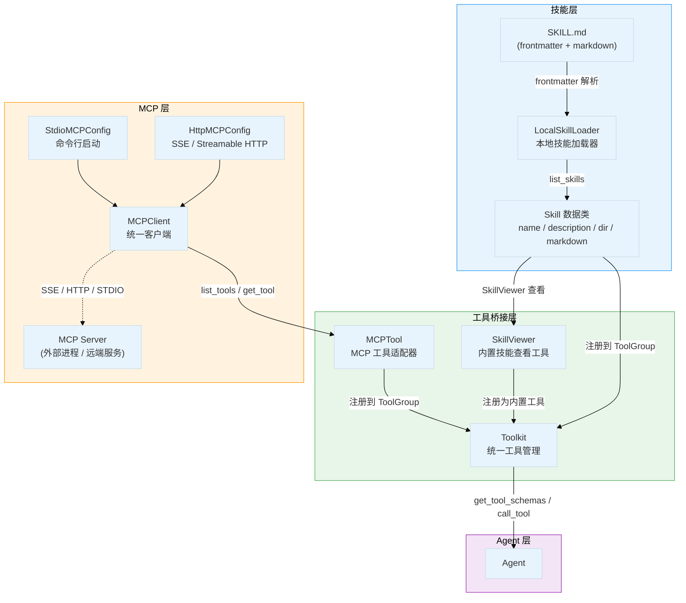
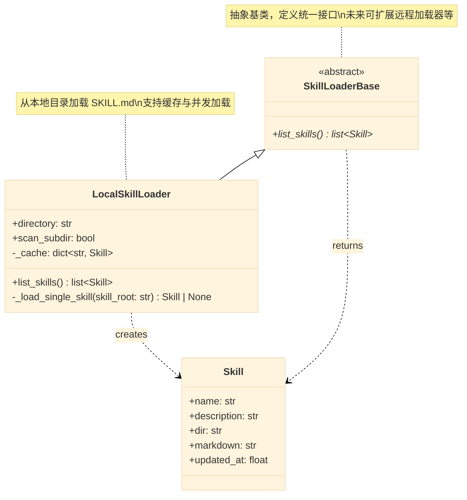
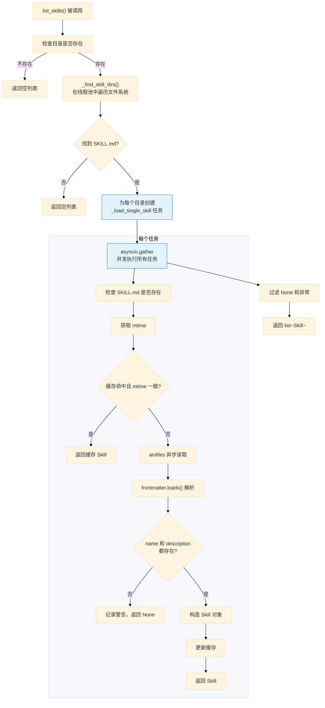
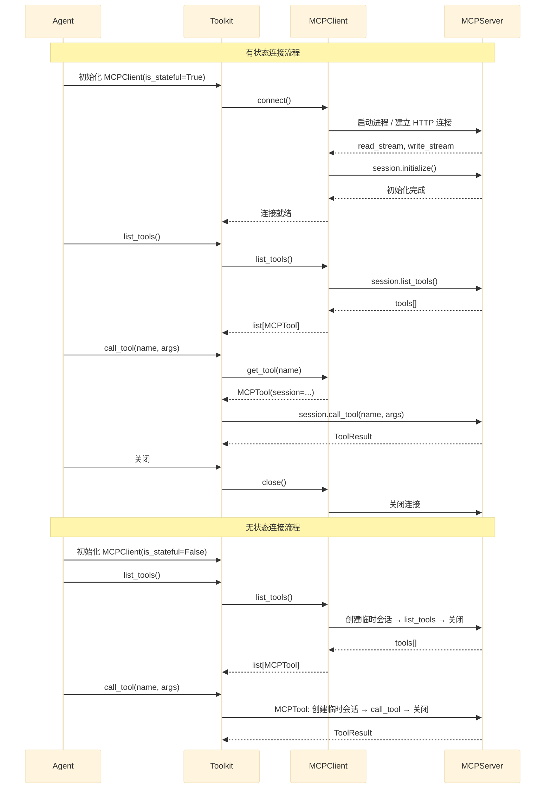
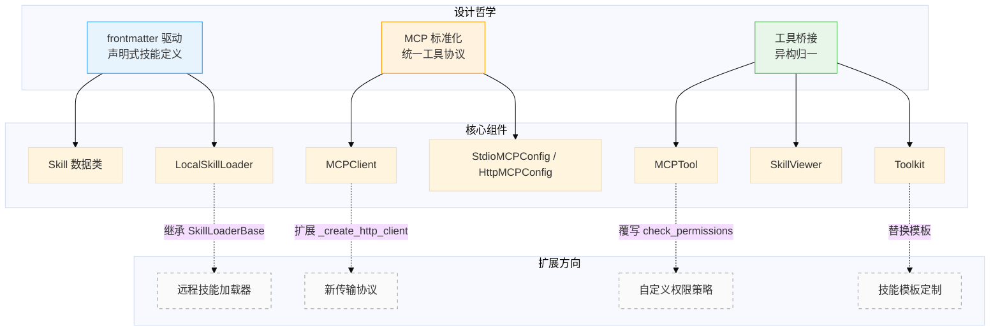

# AgentScope 2.0 技能与MCP

## 总：开篇概述

在 AgentScope 2.0 的架构中，**技能（Skill）**与 **MCP（Model Context Protocol）**共同构成了 Agent 能力扩展的双引擎。Skill 模块是 Agent 的"知识库"，以 Markdown + frontmatter 的形式定义可复用的领域知识与操作指南；MCP 则是 Agent 的"外部工具协议"，通过标准化的客户端-服务器通信机制，让 Agent 能够发现并调用远端或本地进程提供的工具函数。

两者解决的核心问题包括：

- **可复用技能定义**：通过 `SKILL.md` + frontmatter 的声明式方式，将领域知识打包为可分发、可版本化的技能单元，Agent 无需硬编码即可获取新能力
- **MCP 协议集成**：统一支持 STDIO / SSE / Streamable HTTP 三种传输方式，屏蔽底层通信差异，让 Agent 以一致的方式消费外部工具
- **工具生态扩展**：通过 `MCPTool` 适配器和 `SkillViewer` 内置工具，将 MCP 工具与本地技能统一纳入 `Toolkit` 管理体系，实现技能→指令→工具调用的完整闭环



**图 11-1：技能与MCP系统架构全景图**

---

## 分：逐层展开

### 1. 技能基类 SkillBase

技能系统的核心数据结构定义在 `_base.py` 中，由两个关键组件构成：`Skill` 数据类和 `SkillLoaderBase` 抽象基类。

#### 1.1 Skill 数据类

`Skill` 是一个 `@dataclass`，承载单个技能的全部元信息：

```python
# src/agentscope/skill/_base.py:8-20
@dataclass
class Skill:
    name: str           # 技能名称，来自 SKILL.md 的 frontmatter
    description: str    # 技能描述，来自 SKILL.md 的 frontmatter
    dir: str            # 技能所在目录的绝对路径
    markdown: str       # SKILL.md 的正文内容（不含 frontmatter）
    updated_at: float   # SKILL.md 的最后修改时间（mtime），用于缓存判断
```

四个字段各司其职：`name` 和 `description` 供 Agent 识别和选择技能；`dir` 记录技能文件系统位置，便于加载关联资源；`markdown` 是技能的完整指令正文，Agent 通过 `SkillViewer` 工具读取后按指令行事；`updated_at` 支持基于文件修改时间的增量缓存。

#### 1.2 SkillLoaderBase 抽象基类

`SkillLoaderBase` 定义了技能加载器的统一接口：

```python
# src/agentscope/skill/_base.py:23-28
class SkillLoaderBase(ABC):
    @abstractmethod
    async def list_skills(self) -> list[Skill]:
        raise NotImplementedError
```

仅暴露一个异步方法 `list_skills()`，返回当前加载器能发现的所有 `Skill` 对象。这种极简接口设计使得未来可以轻松扩展新的加载源（如远程仓库、数据库等），只需实现 `list_skills()` 即可。



**图 11-2：SkillBase 类层次图**

---

### 2. 本地技能加载器

`LocalSkillLoader` 是 `SkillLoaderBase` 的默认实现，负责从本地文件系统发现并加载技能。

#### 2.1 初始化与配置

```python
# src/agentscope/skill/_local_loader.py:18-30
class LocalSkillLoader(SkillLoaderBase):
    def __init__(self, directory: str, scan_subdir: bool = False) -> None:
        self.directory = os.path.abspath(directory)
        self.scan_subdir = scan_subdir
        self._cache: dict[str, Skill] = {}
```

- `directory`：技能根目录，自动转为绝对路径
- `scan_subdir`：是否递归扫描子目录，默认为 `False`（仅扫描当前目录）
- `_cache`：以目录路径为键的技能缓存字典，避免重复解析

#### 2.2 技能发现：寻找 SKILL.md

`list_skills()` 方法的核心逻辑是找到所有包含 `SKILL.md` 的目录：

```python
# src/agentscope/skill/_local_loader.py:120-134
def _find_skill_dirs() -> list[str]:
    dirs = []
    if os.path.isfile(os.path.join(self.directory, "SKILL.md")):
        dirs.append(self.directory)
    if self.scan_subdir:
        for root, _, filenames in os.walk(self.directory):
            if root == self.directory:
                continue
            if "SKILL.md" in filenames:
                dirs.append(root)
    return dirs
```

约定优于配置：每个技能必须以 `SKILL.md` 作为入口文件。`scan_subdir=False` 时仅检查根目录，`True` 时递归遍历子目录。文件系统遍历通过 `asyncio.to_thread` 放入线程池，避免阻塞事件循环。

#### 2.3 frontmatter 解析

`_load_single_skill()` 是技能加载的核心方法，使用 `python-frontmatter` 库解析 SKILL.md：

```python
# src/agentscope/skill/_local_loader.py:58-84
async with aiofiles.open(skill_md_path, "r", encoding="utf-8") as f:
    content_str = await f.read()
    content = frontmatter.loads(content_str)

name = content.get("name")
description = content.get("description")

if not name or not description:
    logger.warning("SKILL.md in %s is missing required fields ...", skill_root)
    return None

skill = Skill(
    name=str(name),
    description=str(description),
    dir=skill_root,
    markdown=content.content,   # 正文部分（不含 frontmatter）
    updated_at=updated_at,
)
```

一个合法的 `SKILL.md` 示例：

```markdown
---
name: web-scraper
description: Scrape web pages and extract structured data
---

# Web Scraper Skill

## Instructions
1. Use the `Read` tool to fetch the target URL
2. Parse the HTML content...
```

frontmatter 中的 `name` 和 `description` 为必填字段，缺失则跳过该技能并记录警告。`content.content` 提取 YAML frontmatter 之后的 Markdown 正文，作为技能的完整指令。

#### 2.4 缓存机制

基于文件修改时间（`mtime`）的轻量级缓存：

```python
# src/agentscope/skill/_local_loader.py:49-56
updated_at = await aiofiles.ospath.getmtime(skill_md_path)
if skill_root in self._cache:
    cached_skill = self._cache[skill_root]
    if cached_skill.updated_at == updated_at:
        return cached_skill
```

若 `mtime` 未变，直接返回缓存对象；否则重新解析并更新缓存。这种策略在技能目录不频繁变更的场景下高效且安全。

#### 2.5 并发加载

所有技能目录的加载任务通过 `asyncio.gather` 并发执行：

```python
# src/agentscope/skill/_local_loader.py:146-161
tasks = [self._load_single_skill(skill_dir) for skill_dir in skill_dirs]
results = await asyncio.gather(*tasks, return_exceptions=True)

skills: list = []
for i, result in enumerate(results):
    if isinstance(result, Exception):
        logger.warning("Failed to load skill from %s: %s", skill_dirs[i], str(result))
    elif result is not None:
        skills.append(result)
```

`return_exceptions=True` 确保单个技能加载失败不会影响其他技能，异常被捕获并记录为警告。



**图 11-3：技能加载与注册流程图**

---

### 3. MCP客户端

`MCPClient` 是 AgentScope 对 MCP 协议的统一封装，支持有状态（Stateful）和无状态（Stateless）两种连接模式，以及 STDIO / SSE / Streamable HTTP 三种传输方式。

#### 3.1 连接模式：Stateful vs Stateless

```python
# src/agentscope/mcp/_mcp_client.py:68-80
class MCPClient(BaseModel):
    name: str = Field(title="MCP Name")
    is_stateful: bool = Field(title="Stateful")
    mcp_config: StdioMCPConfig | HttpMCPConfig = Field(discriminator="type")
```

- **Stateful（有状态）**：需要显式调用 `connect()` 建立会话，`close()` 关闭连接。STDIO 模式**必须**为有状态。适用于需要维持长连接的场景（如本地文件系统 MCP 服务器）。
- **Stateless（无状态）**：无需 `connect()`，每次工具调用时创建临时会话，调用完毕自动释放。仅 HTTP 模式支持。适用于无状态 REST API 场景。

```python
# src/agentscope/mcp/_mcp_client.py:116-122
def model_post_init(self, __context: Any) -> None:
    if self.mcp_config.type == "stdio_mcp" and not self.is_stateful:
        raise ValueError("STDIO MCP must be stateful (is_stateful=True).")
```

构造时自动校验：STDIO 必须为有状态，`enable_tools` 与 `disable_tools` 不能重叠。

#### 3.2 传输方式

`_initialize_client()` 和 `_create_http_client()` 根据配置类型创建对应的传输层：

**STDIO 传输**（在构造时即创建）：

```python
# src/agentscope/mcp/_mcp_client.py:166-177
if self.mcp_config.type == "stdio_mcp":
    config = self.mcp_config
    self._client = stdio_client(
        StdioServerParameters(
            command=config.command,
            args=config.args or [],
            env=config.env,
            cwd=str(config.cwd) if config.cwd else None,
            encoding="utf-8",
            encoding_error_handler=config.encoding_error_handler,
        ),
    )
```

STDIO 模式通过启动子进程与 MCP 服务器通信，`StdioServerParameters` 携带进程启动参数，在构造时即绑定。

**HTTP 传输**（延迟创建，按需构建）：

```python
# src/agentscope/mcp/_mcp_client.py:179-203
def _create_http_client(self) -> _AsyncGeneratorContextManager[Any]:
    config = self.mcp_config
    if config.url.endswith("/sse") or config.url.endswith("/messages/"):
        return sse_client(url=config.url, headers=config.headers, timeout=config.timeout)
    # StreamableHTTP transport
    http_client = None
    if config.headers or config.timeout:
        http_client = httpx.AsyncClient(headers=config.headers, timeout=config.timeout)
    return streamable_http_client(url=config.url, http_client=http_client)
```

HTTP 传输通过 URL 后缀自动判断协议：以 `/sse` 或 `/messages/` 结尾使用 SSE（Server-Sent Events），否则使用 Streamable HTTP。`httpx.AsyncClient` 仅在需要自定义 headers 或 timeout 时创建。

#### 3.3 连接生命周期

**有状态连接**：

```python
# src/agentscope/mcp/_mcp_client.py:205-244
async def connect(self) -> None:
    if self._client is None and self.mcp_config.type == "http_mcp":
        self._client = self._create_http_client()
    self._stack = AsyncExitStack()
    context = await self._stack.enter_async_context(self._client)
    read_stream, write_stream = context[0], context[1]
    self._session = ClientSession(read_stream, write_stream)
    await self._stack.enter_async_context(self._session)
    await self._session.initialize()
    self._is_connected = True
```

使用 `AsyncExitStack` 管理连接生命周期，确保异常时正确清理资源。`ClientSession` 在 `initialize()` 后即可用于工具发现和调用。

**关闭连接**：

```python
# src/agentscope/mcp/_mcp_client.py:246-284
async def close(self, ignore_errors: bool = True) -> None:
    try:
        await self._stack.aclose()
    except Exception as e:
        if not ignore_errors:
            raise e
    finally:
        self._stack = None
        self._session = None
        self._is_connected = False
```

`ignore_errors=True`（默认）确保关闭过程中的异常不会中断上层逻辑。

#### 3.4 工具发现与调用

**列出工具**：

```python
# src/agentscope/mcp/_mcp_client.py:293-336
async def list_raw_tools(self) -> list[mcp.types.Tool]:
    if not self.is_stateful:
        # 无状态：创建临时会话
        async with self._get_client_gen() as cli:
            read_stream, write_stream = cli[0], cli[1]
            async with ClientSession(read_stream, write_stream) as session:
                await session.initialize()
                res = await session.list_tools()
                self._cached_tools = res.tools
    else:
        # 有状态：使用已有会话
        self._validate_connection()
        res = await self._session.list_tools()
        self._cached_tools = res.tools

    # 应用 enable_tools / disable_tools 过滤
    available_tools: list = self._cached_tools
    if self.enable_tools is not None:
        available_tools = [tool for tool in available_tools if tool.name in self.enable_tools]
    if self.disable_tools is not None:
        available_tools = [_ for _ in available_tools if _.name not in self.disable_tools]
    return available_tools
```

关键设计：`_cached_tools` 保存**未过滤**的完整工具列表，使得 `get_tool()` 可以解析被过滤掉的工具名（用于错误提示），而返回给调用者的是经过 `enable_tools` / `disable_tools` 过滤后的列表。

**获取单个工具**：

```python
# src/agentscope/mcp/_mcp_client.py:354-411
async def get_tool(self, name: str) -> MCPTool:
    if self._cached_tools is None:
        await self.list_raw_tools()
    # 在缓存中查找
    target_tool = None
    for tool in self._cached_tools:
        if tool.name == name:
            target_tool = tool
            break
    if target_tool is None:
        raise ValueError(f"Tool '{name}' not found in MCP server '{self.name}'")
    # 根据连接模式创建 MCPTool
    if not self.is_stateful:
        return MCPTool(mcp_name=self.name, tool=target_tool,
                       client_gen=self._get_client_gen, timeout=self.execution_timeout)
    else:
        return MCPTool(mcp_name=self.name, tool=target_tool,
                       session=self._session, timeout=self.execution_timeout)
```

`MCPTool` 的创建方式因连接模式而异：无状态模式传入 `client_gen`（客户端生成器函数），有状态模式传入 `session`（已有会话）。



**图 11-4：MCP客户端交互时序图**

---

### 4. MCP配置

MCP 配置使用 Pydantic `BaseModel` 定义，通过 `discriminator` 字段实现联合类型的自动分发。

#### 4.1 StdioMCPConfig

```python
# src/agentscope/mcp/_config.py:9-41
class StdioMCPConfig(BaseModel):
    type: Literal["stdio_mcp"] = "stdio_mcp"
    command: str                          # 启动 MCP 服务器的命令
    args: list[str] | None = None         # 命令行参数
    env: dict[str, str] | None = None     # 环境变量
    cwd: str | Path | None = None         # 工作目录
    encoding_error_handler: Literal["strict", "ignore", "replace"] = "strict"
```

`StdioMCPConfig` 用于配置通过子进程启动的 MCP 服务器。`command` 是必填的启动命令（如 `"mcp-server-filesystem"`），`args` 传递命令行参数，`env` 注入环境变量，`cwd` 设置工作目录。`encoding_error_handler` 控制子进程输出解码错误时的处理策略。

#### 4.2 HttpMCPConfig

```python
# src/agentscope/mcp/_config.py:44-64
class HttpMCPConfig(BaseModel):
    type: Literal["http_mcp"] = "http_mcp"
    url: str                              # MCP 服务器 URL
    headers: dict[str, str] | None = None # 自定义 HTTP 头
    timeout: float | None = 30.0          # 请求超时（秒）
```

`HttpMCPConfig` 用于配置通过 HTTP 协议连接的 MCP 服务器。`url` 为必填的服务端地址，`headers` 支持认证等自定义头，`timeout` 默认 30 秒。

#### 4.3 联合类型与判别器

在 `MCPClient` 中，两种配置通过 Pydantic 的 discriminated union 机制自动分发：

```python
# src/agentscope/mcp/_mcp_client.py:82-86
mcp_config: StdioMCPConfig | HttpMCPConfig = Field(
    discriminator="type",
    title="MCP Config",
)
```

`discriminator="type"` 使得 Pydantic 根据 `type` 字段的值（`"stdio_mcp"` 或 `"http_mcp"`）自动选择正确的配置类进行反序列化和校验，无需手动判断类型。

---

### 5. 技能与工具的关系

技能（Skill）和工具（Tool）在 AgentScope 中是两个不同层次的概念：**技能是知识，工具是行动**。技能不能被直接调用，而是通过 `SkillViewer` 工具读取其指令，Agent 按指令使用已有工具完成任务。

#### 5.1 SkillViewer：技能查看器

`SkillViewer` 是一个内置的 `ToolBase` 实现，作为 Agent 访问技能的唯一入口：

```python
# src/agentscope/tool/_builtin/_skill.py:18-61
class SkillViewer(ToolBase):
    name: str = "Skill"
    description = ("Retrieve a skill within the conversation. "
                   "When users asks you to perform tasks, check if any of the "
                   "available skills match. "
                   "Skills provide specialized capabilities and domain knowledge.")
    input_schema = {
        "type": "object",
        "properties": {"skill": {"type": "string", "description": "The exact name of the skill to view."}},
        "required": ["skill"],
    }
    is_state_injected: bool = True   # 需要 AgentState 注入
    is_read_only: bool = True
```

关键设计：`is_state_injected = True`，意味着调用时自动注入 `AgentState`，`SkillViewer` 通过 `_agent_state.tool_context.activated_groups` 获取当前激活的工具组，进而查找对应技能。

调用流程（`src/agentscope/tool/_builtin/_skill.py:86-123`）：

```python
async def __call__(self, skill: str, _agent_state: AgentState) -> ToolChunk:
    skills = await self._get_skills_method(_agent_state.tool_context.activated_groups)
    target_skill = skills.get(skill)
    if not target_skill:
        return ToolChunk(content=[TextBlock(text=f"SkillNotFoundError: Skill '{skill}' not found.")],
                         state=ToolResultState.ERROR)
    return ToolChunk(content=[TextBlock(text=target_skill.markdown)])
```

Agent 调用 `Skill` 工具后，获得技能的完整 Markdown 正文，然后按照正文中的指令使用其他工具完成任务。

#### 5.2 MCPTool：MCP 工具适配器

`MCPTool` 将 MCP 协议层的 `mcp.types.Tool` 适配为 AgentScope 的 `ToolBase` 接口：

```python
# src/agentscope/tool/_adapters.py:162-213
class MCPTool(ToolBase):
    is_mcp: bool = True
    is_state_injected: bool = False

    def __init__(self, mcp_name, tool, client_gen=None, session=None, timeout=None):
        self.mcp_name = mcp_name
        self.name = f"mcp__{self.mcp_name}__{tool.name}"  # 命名规则：mcp__服务器名__工具名
        self.description = tool.description or ""
        _schema = dict(tool.inputSchema) if tool.inputSchema else {}
        _schema.setdefault("type", "object")
        _schema.setdefault("properties", {})
        _schema.setdefault("required", [])
        self.input_schema = _schema
        self.is_read_only = tool.annotations.readOnlyHint if tool.annotations else False
```

命名规则 `mcp__{mcp_name}__{tool_name}` 确保不同 MCP 服务器的同名工具不会冲突。`inputSchema` 完整保留（包括 `$defs`、`anyOf` 等嵌套定义），确保 LLM 能正确解析复杂参数类型。

调用时根据连接模式选择不同路径（`src/agentscope/tool/_adapters.py:265-304`）：

```python
async def __call__(self, **kwargs) -> ToolChunk:
    if self._client_gen:
        # 无状态：创建临时会话
        async with self._client_gen() as cli:
            read_stream, write_stream = cli[0], cli[1]
            async with ClientSession(read_stream, write_stream) as session:
                await session.initialize()
                result = await session.call_tool(self._tool.name, arguments=kwargs, read_timeout_seconds=self._timeout)
    else:
        # 有状态：使用已有会话
        result = await self._session.call_tool(self._tool.name, arguments=kwargs, read_timeout_seconds=self._timeout)
    return ToolChunk(content=self._convert_mcp_content_to_blocks(result.content),
                     state=ToolResultState.ERROR if result.isError else ToolResultState.RUNNING)
```

MCP 返回结果通过 `_convert_mcp_content_to_blocks()` 转换为 AgentScope 的 `TextBlock` / `DataBlock`，支持文本、图片、音频、嵌入资源等多种内容类型。

#### 5.3 Toolkit 统一管理

`Toolkit` 是技能与工具的统一管理中枢，在初始化时将技能和 MCP 客户端注册到 `ToolGroup` 中：

```python
# src/agentscope/tool/_toolkit.py:88-97
class Toolkit:
    def __init__(self, tools=None, skills_or_loaders=None, mcps=None, tool_groups=None, ...):
        self.tool_groups = [
            ToolGroup(name="basic", tools=tools or [],
                      skills_or_loaders=skills_or_loaders or [],
                      mcps=mcps or []),
        ] + (tool_groups or [])
```

技能的注入路径（`src/agentscope/tool/_toolkit.py:476-481`）：

```python
# 当存在已注册技能时，自动注册 SkillViewer 为可用工具
skills = await self._get_available_skills()
if len(skills):
    available_tools[self.builtin_skill_viewer.tool.name] = self.builtin_skill_viewer
```

技能指令模板（`src/agentscope/tool/_toolkit.py:51-63`）：

```python
DEFAULT_SKILL_INSTRUCTION = """
Skills are a collection of instructions, scripts, and resources to extend your capabilities.

**IMPORTANT**: Skills are NOT tools, and you cannot call a skill directly.
To use a skill, you MUST use the `{{ skill_viewer }}` tool to read the skill's
full instructions, and then follow those instructions to use the tools and
resources provided by the skill.

# Available Skills:
<skill>
<name>{{ skill.name }}</name>
<description>{{ skill.description }}</description>
<dir>{{ skill.dir }}</dir>
</skill>
"""
```

这段模板被渲染后注入 Agent 的系统提示，明确告知 Agent：技能不是工具，必须通过 `SkillViewer` 读取指令后按指引使用工具。

```mermaid
%%{init: {"theme": "base"}}%%
flowchart LR
    subgraph 技能来源
        A["SKILL.md 文件<br/>(frontmatter + markdown)"]
    end

    subgraph 加载层
        B["LocalSkillLoader<br/>list_skills()"]
        C["Skill 对象<br/>name / description / markdown"]
    end

    subgraph 注册层
        D["ToolGroup<br/>skills_or_loaders"]
        E["Toolkit<br/>_get_available_skills()"]
    end

    subgraph 桥接层
        F["SkillViewer 工具<br/>(name='Skill')"]
        G["MCPTool 适配器<br/>(name='mcp__X__Y')"]
    end

    subgraph Agent 感知层
        H["系统提示中的<br/>技能指令模板"]
        I["工具 JSON Schema"]
    end

    subgraph 执行层
        J["Agent 调用 Skill 工具"]
        K["获得 markdown 指令"]
        L["按指令调用其他工具<br/>(Bash / Read / MCPTool ...)"]
    end

    A -->|frontmatter 解析| B
    B --> C
    C -->|注册| D
    D --> E

    E -->|有技能时注册| F
    E -->|渲染模板| H
    F -->|暴露为| I

    MCPClient["MCPClient<br/>list_tools()"] -->|get_tool()| G
    G -->|暴露为| I

    J --> F
    F -->|返回 markdown| K
    K --> L

    style A fill:#e8f4fd,stroke:#2196F3
    style F fill:#e8f5e9,stroke:#4CAF50
    style G fill:#fff3e0,stroke:#FF9800
    style L fill:#f3e5f5,stroke:#9C27B0
```

**图 11-5：技能到工具的转换数据流图**

---

## 总：总结升华

### 核心设计决策

| 设计决策 | 体现位置 | 设计意图 |
|---------|---------|---------|
| **frontmatter 驱动** | `SKILL.md` + `python-frontmatter`（`_local_loader.py:65`） | 技能定义与代码解耦，Markdown 可读、可编辑、可版本化 |
| **MCP 标准化** | `MCPClient` 统一封装 STDIO / SSE / Streamable HTTP（`_mcp_client.py:179-203`） | 屏蔽传输差异，Agent 以一致方式消费外部工具 |
| **有状态/无状态双模式** | `is_stateful` 字段 + `client_gen` / `session` 分支（`_mcp_client.py:395-411`） | 兼顾长连接效率与无状态 API 的便捷性 |
| **工具桥接** | `MCPTool` 适配器 + `SkillViewer` 内置工具（`_adapters.py:162` / `_skill.py:18`） | 将异构来源（MCP 工具、本地技能）统一纳入 `ToolBase` 体系 |
| **技能≠工具** | `DEFAULT_SKILL_INSTRUCTION` 模板（`_toolkit.py:51-63`） | 明确语义边界：技能是知识，工具是行动，避免 Agent 混淆 |

### 扩展点

1. **新的技能加载器**：继承 `SkillLoaderBase`，实现 `list_skills()` 即可接入远程仓库、数据库等技能源
2. **新的 MCP 传输方式**：在 `_create_http_client()` 中扩展新的传输协议分支
3. **自定义权限策略**：`MCPTool.check_permissions()` 可被子类覆写，实现细粒度的工具访问控制
4. **技能模板扩展**：`skill_instruction_template` 支持自定义 Jinja2 模板，控制技能在系统提示中的呈现方式



**图 11-6：核心设计决策与扩展方向总览**

AgentScope 2.0 的技能与 MCP 系统遵循"声明优于命令、协议优于实现、桥接优于绑定"的设计原则。技能以 Markdown 为载体、以 frontmatter 为元数据，实现了知识定义与代码的完全解耦；MCP 通过标准化协议统一了外部工具的接入方式，有状态与无状态双模式兼顾了效率与便捷；`MCPTool` 和 `SkillViewer` 两个桥接器将异构来源统一归入 `ToolBase` 体系，使 Agent 无需关心工具的底层来源。这种分层架构既保证了当前功能的完整性，也为未来的生态扩展预留了清晰的接入点。
