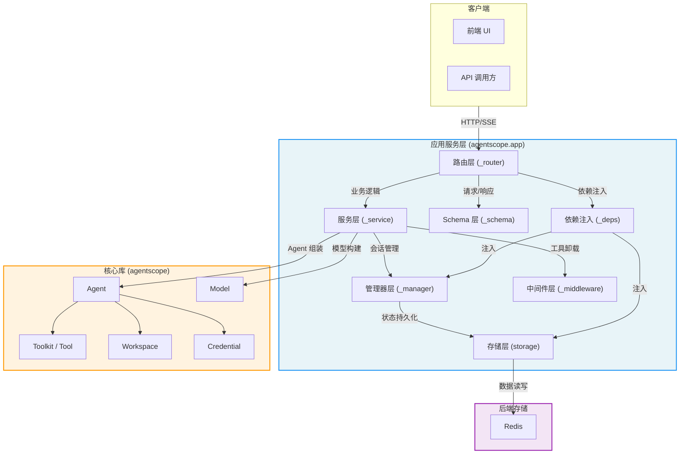
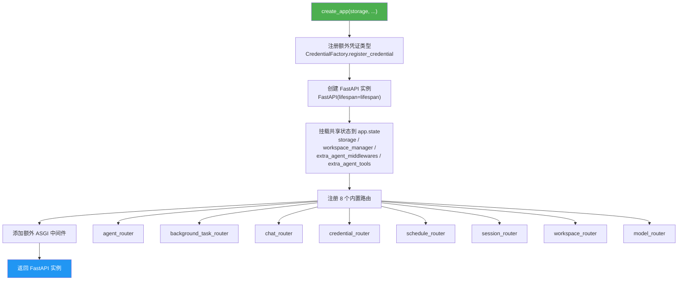
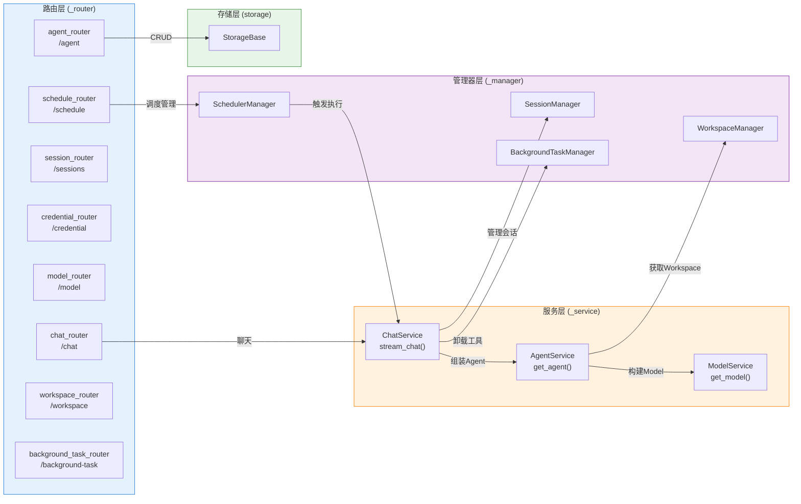
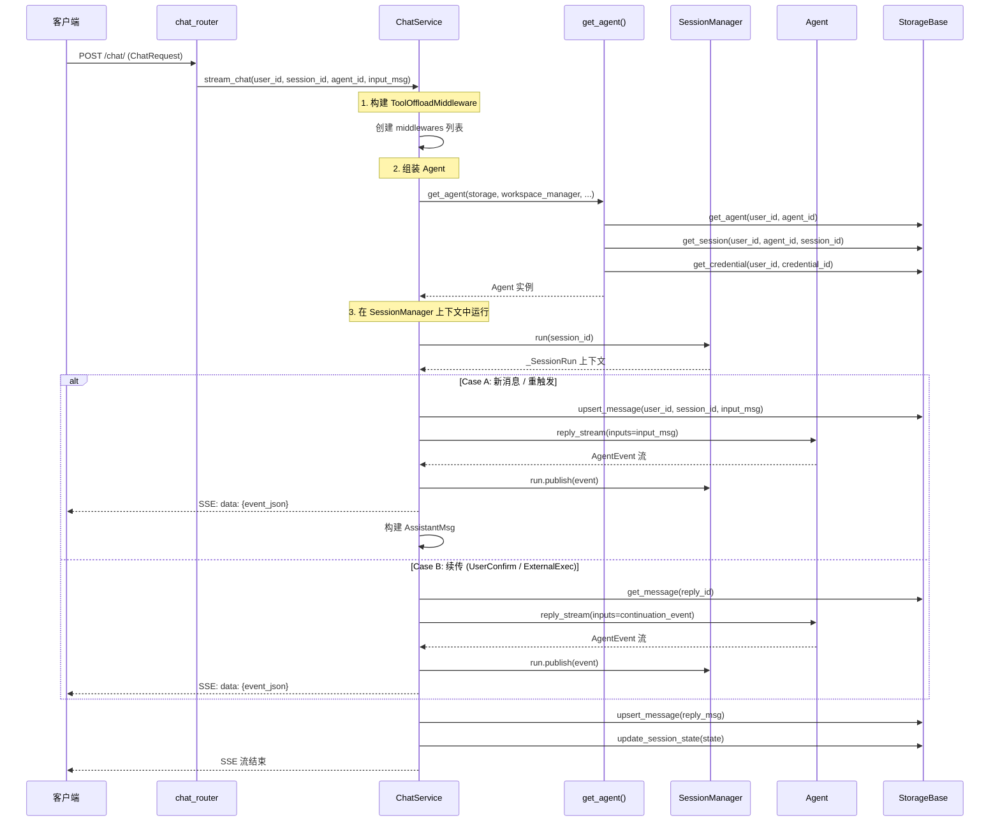
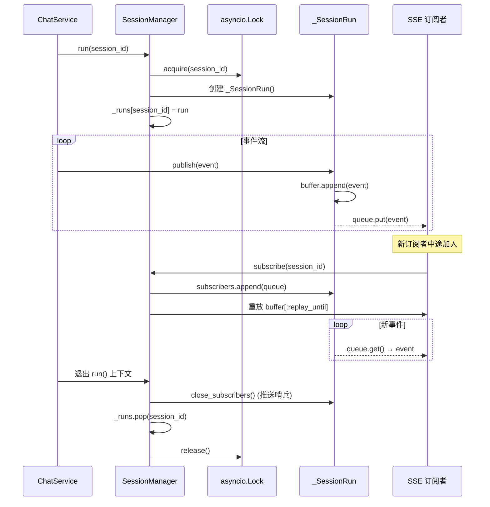
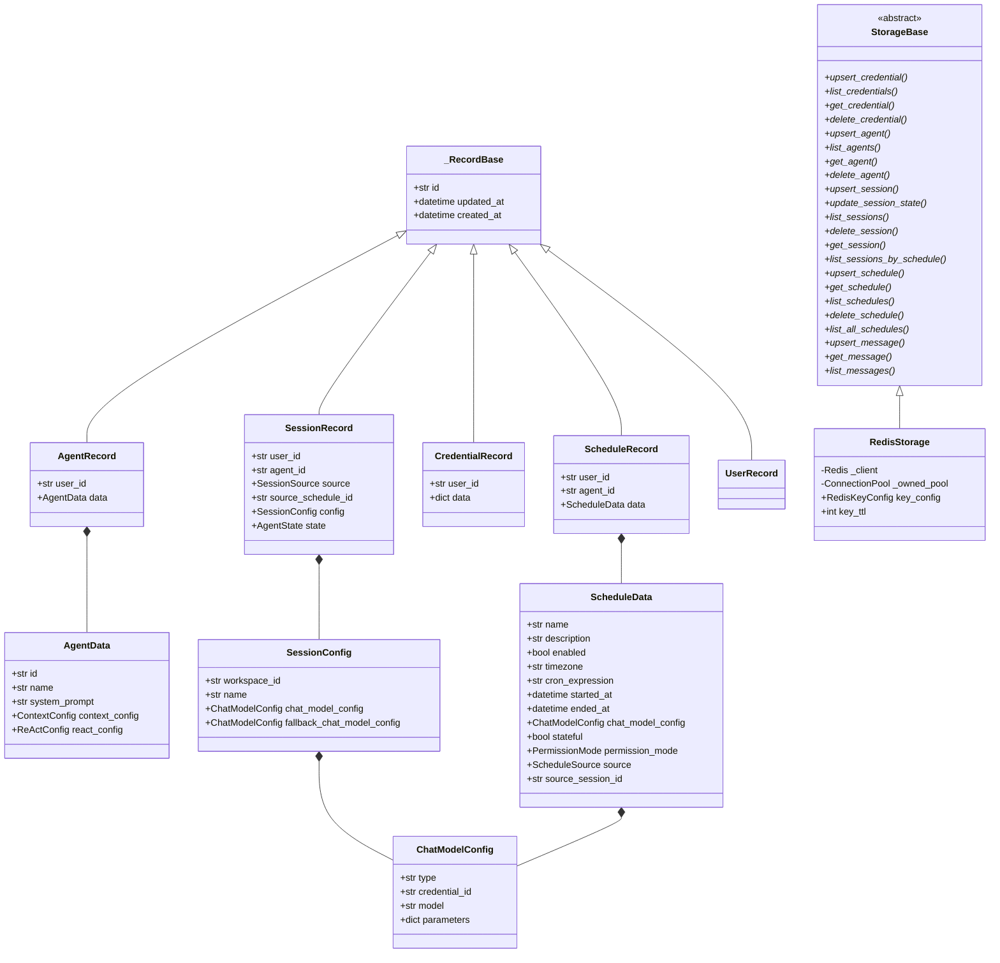
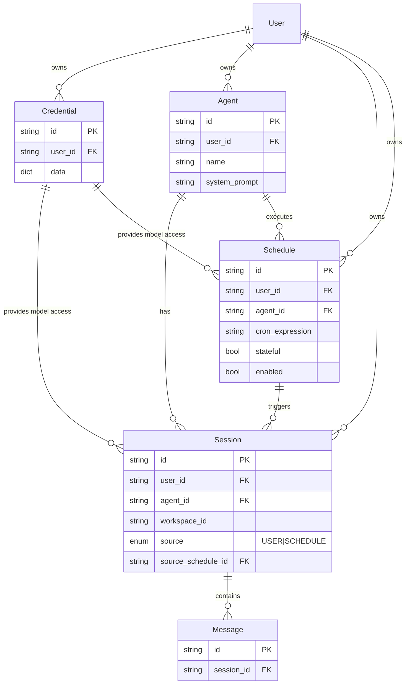
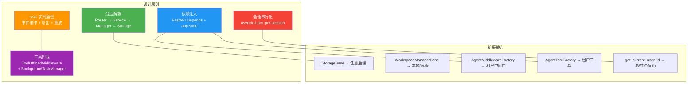

# AgentScope 2.0 应用服务层

## 总：开篇概述

AgentScope 2.0 的 `app` 模块是整个框架的**服务化层**，它将核心库的 Agent 能力通过 FastAPI 暴露为 HTTP/SSE 服务，使多租户、多会话的 Agent 应用可以通过 RESTful API 进行交互。

该层解决的核心问题包括：

- **多租户隔离**：通过 `user_id` 实现用户级别的数据隔离，每个用户的 Agent、会话、凭证互不可见
- **多会话管理**：同一 Agent 可拥有多个独立会话，会话间状态互不干扰，且支持会话级别的并发串行化
- **RESTful API**：提供标准的 CRUD 接口管理 Agent、Session、Credential、Schedule 等资源
- **实时通信**：通过 SSE（Server-Sent Events）实现聊天响应的流式推送，客户端可实时接收 Agent 的推理过程

**配图 12-1：应用服务层架构全景图**



如图 12-1 所示，应用服务层采用**分层架构**，从上到下依次为路由层、服务层、管理器层和存储层。每一层职责清晰、边界分明，通过 FastAPI 的依赖注入系统实现层间解耦。

---

## 分：逐层展开

### 1. 应用工厂 create_app

`create_app` 函数是整个应用服务层的入口，负责创建和配置 FastAPI 应用实例。其定义位于 `_app.py`（`/workspace/src/agentscope/app/_app.py`，第 29–128 行）。

#### 1.1 函数签名与参数

```python
def create_app(
    storage: StorageBase,
    *,
    workspace_manager: WorkspaceManagerBase | None = None,
    extra_credentials: list[Type[CredentialBase]] | None = None,
    extra_middlewares: list[FastAPIMiddleware] | None = None,
    extra_agent_middlewares: AgentMiddlewareFactory | None = None,
    extra_agent_tools: AgentToolFactory | None = None,
    title: str = "AgentScope",
    version: str = "2.0.0",
) -> FastAPI:
```

核心参数说明：

- **`storage`**（必选）：存储后端实例，生命周期由应用的 `lifespan` 管理
- **`workspace_manager`**：工作空间管理器，提供 Agent 运行时的工具、技能和 MCP 资源
- **`extra_credentials`**：额外注册的凭证类型，在应用启动前通过 `CredentialFactory.register_credential` 注册
- **`extra_middlewares`**：额外的 ASGI 中间件
- **`extra_agent_middlewares`**：Agent 中间件工厂，签名为 `(user_id, agent_id, session_id) -> list[MiddlewareBase]`，每次 Agent 调用时按需生成
- **`extra_agent_tools`**：Agent 工具工厂，签名为 `(user_id, agent_id, session_id) -> list[ToolBase]`，支持按租户/用户动态注入工具

#### 1.2 应用创建流程

`create_app` 的执行流程分为四个阶段：

1. **注册凭证类型**（第 101–102 行）：遍历 `extra_credentials`，调用 `CredentialFactory.register_credential`
2. **创建 FastAPI 实例**（第 104 行）：传入 `title`、`version` 和 `lifespan` 上下文管理器
3. **挂载共享状态**（第 107–110 行）：将 `storage`、`workspace_manager`、`extra_agent_middlewares`、`extra_agent_tools` 存入 `app.state`
4. **注册路由**（第 113–123 行）：依次注册 8 个内置路由
5. **添加中间件**（第 126–127 行）：遍历 `extra_middlewares`，调用 `app.add_middleware`

**配图 12-2：FastAPI 应用创建与配置流程图**



#### 1.3 生命周期管理

应用的生命周期由 `_lifespan.py`（`/workspace/src/agentscope/app/_lifespan.py`，第 14–63 行）中的 `lifespan` 异步上下文管理器控制。它使用 `AsyncExitStack` 确保资源的有序初始化和清理：

**启动阶段**（第 36–57 行）：
1. 打开存储连接池（`storage.__aenter__`）
2. 进入工作空间管理器（启动 TTL 清理器等）
3. 创建 `SessionManager` 和 `BackgroundTaskManager`
4. 创建 `SchedulerManager` 并启动 APScheduler
5. 从存储中恢复所有持久化的定时调度

**关闭阶段**（第 61–63 行）：
1. 取消所有进行中的会话（`session_manager.cancel()`）
2. 取消所有后台任务（`background_task_manager.cancel()`）
3. 关闭调度器（`scheduler.shutdown()`）

`AsyncExitStack` 保证了 `storage` 和 `workspace_manager` 的 `__aexit__` 在 `yield` 之后自动调用，即使发生异常也能正确清理资源。

---

### 2. 路由层

路由层是 HTTP 请求的入口，负责参数校验、权限检查和响应格式化。每个路由通过 FastAPI 的 `Depends` 机制注入所需的依赖。

**配图 12-3：路由-服务-管理器-存储分层架构图**



#### 2.1 agent_router — Agent CRUD

定义于 `/workspace/src/agentscope/app/_router/_agent.py`（第 18–209 行），提供 Agent 配置的增删改查：

| 端点 | 方法 | 路径 | 功能 |
|------|------|------|------|
| `get_agent_schema` | GET | `/agent/schema` | 获取 Agent 表单的 JSON Schema 片段 |
| `list_agents` | GET | `/agent/` | 列出当前用户的所有 Agent |
| `create_agent` | POST | `/agent/` | 创建新 Agent 配置 |
| `update_agent` | PATCH | `/agent/{agent_id}` | 部分更新 Agent 配置 |
| `delete_agent` | DELETE | `/agent/{agent_id}` | 删除 Agent 配置 |

值得注意的是 `get_agent_schema`（第 30–71 行）将 `AgentData` 的 Schema 切分为 identity、context_config、react_config 三个独立片段，方便前端分区域渲染表单。同时，它通过 `context_schema.get("properties", {}).pop("summary_schema", None)` 隐藏了不需要用户编辑的 `summary_schema` 字段。

`update_agent`（第 142–180 行）采用 PATCH 语义，仅更新请求体中显式提供的字段。它先从存储中获取现有记录，再通过 `model_copy(update=updates)` 生成更新后的记录，最后调用 `upsert_agent` 持久化。

#### 2.2 chat_router — 聊天交互（SSE 流式）

定义于 `/workspace/src/agentscope/app/_router/_chat.py`（第 27–130 行），是整个应用最核心的端点。

`chat` 端点（第 68–130 行）接收 `ChatRequest`，返回 `StreamingResponse`，媒体类型为 `text/event-stream`。核心逻辑委托给 `_stream_events` 辅助函数（第 34–65 行）：

```python
async def _stream_events(...) -> AsyncGenerator[str, None]:
    service = ChatService(...)
    async for event in service.stream_chat(...):
        yield f"data: {event.model_dump_json()}\n\n"
```

每个 SSE 帧的格式为 `data: <json>\n\n`，其中 `<json>` 是 `AgentEvent` 的序列化结果。响应头设置了 `Cache-Control: no-cache` 和 `X-Accel-Buffering: no`，确保反向代理不会缓冲 SSE 流。

#### 2.3 session_router — 会话管理

定义于 `/workspace/src/agentscope/app/_router/_session.py`（第 23–300 行），提供会话的完整生命周期管理：

| 端点 | 方法 | 路径 | 功能 |
|------|------|------|------|
| `list_sessions` | GET | `/sessions/` | 列出某 Agent 下的所有会话 |
| `create_session` | POST | `/sessions/` | 创建或恢复会话 |
| `delete_session` | DELETE | `/sessions/{session_id}` | 删除会话 |
| `update_session` | PATCH | `/sessions/{session_id}` | 更新会话配置 |
| `list_messages` | GET | `/sessions/{session_id}/messages` | 获取会话消息列表 |

`create_session`（第 100–147 行）实现了**幂等创建**语义：同一 `(user_id, agent_id, workspace_id)` 三元组最多只存在一个会话，重复调用会更新现有会话而非创建副本。

`_ensure_credential_exists`（第 30–55 行）是会话创建和更新时的辅助校验函数，确保引用的凭证确实属于当前用户。

`list_messages`（第 256–300 行）除了返回分页消息外，还通过 `session_manager.is_running(session_id)` 标记会话是否正在运行，前端据此决定是否展示"正在输入"状态。

#### 2.4 其他路由

- **credential_router**（`/credential`）：管理 API 密钥等凭证
- **model_router**（`/model`）：列出可用模型类型
- **schedule_router**（`/schedule`）：管理 Cron 定时调度
- **workspace_router**（`/workspace`）：管理工作空间
- **background_task_router**（`/background-task`）：查询和停止后台任务

---

### 3. 服务层

服务层封装了核心业务逻辑，是路由层和底层管理器/存储之间的桥梁。它确保无论是 HTTP 聊天端点还是定时调度触发，都走完全相同的执行路径。

#### 3.1 AgentService — Agent 组装与执行

`get_agent` 函数定义于 `/workspace/src/agentscope/app/_service/_agent.py`（第 14–152 行），负责将分散的配置数据组装为一个完整的 `Agent` 实例。其执行步骤如下：

1. **获取 Agent 配置**（第 65–70 行）：从存储中读取 `AgentRecord`
2. **获取会话状态**（第 76 行）：从存储中读取 `SessionRecord`
3. **构建模型实例**（第 81–102 行）：通过 `get_model` 解析凭证和配置，创建主模型和可选的回退模型
4. **获取工作空间**（第 113–118 行）：通过 `WorkspaceManager` 获取或创建会话对应的工作空间
5. **解析扩展工厂**（第 123–135 行）：调用 `extra_agent_tools` 和 `extra_agent_middlewares` 工厂，生成用户/会话特定的工具和中间件
6. **组装 Agent**（第 137–152 行）：将所有组件传入 `Agent` 构造函数

`get_model` 函数定义于 `/workspace/src/agentscope/app/_service/_model.py`（第 10–50 行），它从存储中获取凭证记录，通过 `CredentialFactory.from_dict` 反序列化凭证，再调用 `credential.get_chat_model_class()` 获取模型类，最终构建模型实例。

#### 3.2 ChatService — 聊天逻辑

`ChatService` 定义于 `/workspace/src/agentscope/app/_service/_chat.py`（第 30–238 行），是聊天交互的核心编排器。它同时服务于 HTTP 聊天端点和定时调度触发，保证两条路径的消息持久化、中间件装配和状态处理完全一致。

**配图 12-4：聊天请求处理时序图**



`stream_chat` 方法（第 76–238 行）的核心逻辑分为四个阶段：

**阶段 1：构建中间件**（第 118–140 行）

创建 `ToolOffloadMiddleware`，传入 `BackgroundTaskManager`、`SessionManager` 和一个 `_retrigger` 闭包。该闭包在后台任务完成后、会话空闲时自动重新触发 Agent 执行。

**阶段 2：组装 Agent**（第 146–155 行）

调用 `get_agent` 加载配置、会话状态、凭证、模型和工作空间，生成完整的 Agent 实例。

**阶段 3：在会话上下文中运行**（第 160–228 行）

通过 `session_manager.run(session_id)` 获取会话锁和运行上下文，然后根据输入类型分两种情况处理：

- **Case A**（第 163–189 行）：新消息或重触发。先将用户消息持久化，然后调用 `agent.reply_stream`，同时构建 `AssistantMsg` 对象
- **Case B**（第 191–219 行）：续传场景（用户确认或外部执行结果）。先从存储中获取已有的回复消息，将续传事件追加到消息中，然后继续流式推理

每个事件都通过 `run.publish(event)` 广播给所有 SSE 订阅者。

**阶段 4：持久化状态**（第 233–238 行）

运行结束后，将回复消息和更新后的 Agent 状态持久化到存储。

---

### 4. 管理器层

管理器层负责应用运行时的状态管理，包括会话生命周期、工作空间缓存、后台任务和定时调度。

#### 4.1 SessionManager — 会话生命周期

定义于 `/workspace/src/agentscope/app/_manager/_session_manager.py`（第 49–197 行），核心职责：

- **串行化**：每个 `session_id` 同一时刻最多只有一个活跃运行，通过 `asyncio.Lock` 保证
- **事件扇出**：运行期间产生的每个事件都追加到重放缓冲区，并推送到所有 SSE 订阅者队列
- **生命周期**：缓冲区和订阅者列表在运行开始时创建，结束时销毁

内部数据结构 `_SessionRun`（第 21–46 行）维护两个核心字段：

- `buffer: list[AgentEvent]`：已产生的所有事件，用于向中途加入的客户端重放
- `subscribers: list[asyncio.Queue]`：每个活跃 SSE 订阅者对应一个队列

`subscribe` 方法（第 145–184 行）实现了无竞态的重放+订阅切换：先注册队列，再快照缓冲区长度，然后重放已有事件，最后从队列中消费新事件。由于 asyncio 是单线程的，注册队列和快照之间没有 `await`，因此不会遗漏事件。

**配图 12-5：会话管理生命周期时序图**



#### 4.2 WorkspaceManager — 工作空间管理

定义于 `/workspace/src/agentscope/app/_manager/_workspace_manager.py`（第 13–250 行），采用抽象基类 + 具体实现的设计：

- **`WorkspaceManagerBase`**（第 13–76 行）：定义 `get_workspace`、`create_workspace`、`close`、`close_all` 四个抽象方法，并实现 `__aenter__`/`__aexit__` 生命周期管理
- **`LocalWorkspaceManager`**（第 79–250 行）：基于本地文件系统的实现，使用 TTL 缓存管理 Workspace 实例

`LocalWorkspaceManager.get_workspace`（第 128–191 行）采用**三阶段加锁模式**：

1. **Phase 1**（第 149–158 行）：获取锁，检查缓存命中，同时收集过期条目
2. **Phase 2**（第 162–166 行）：释放锁后，并行关闭过期条目（避免慢速 MCP 关闭阻塞其他调用者）
3. **Phase 3**（第 174–191 行）：再次获取锁，双重检查缓存（防止并发创建），创建并初始化 Workspace

缓存条目以 `(workspace, last_access_monotonic)` 元组存储，每次访问更新时间戳。TTL 过期后，条目在下次访问时被清理。

#### 4.3 BackgroundTaskManager — 后台任务

定义于 `/workspace/src/agentscope/app/_manager/_background_task_manager.py`（第 151–334 行），管理长时间运行的工具调用：

- **任务注册**（第 214–303 行）：`register_task` 将 asyncio 任务注册到 `OrderedDict`，并启动一个 `_watch` 协程监控任务完成
- **结果存储**（第 173–208 行）：`push_result`/`pop_results` 提供按 `session_id` 的结果存取，用于 `ToolOffloadMiddleware` 在下次推理时注入后台结果
- **任务停止**（第 62–148 行）：`TaskStop` 工具允许 Agent 通过工具调用停止后台任务
- **取消所有**（第 314–334 行）：`cancel` 在应用关闭时取消所有运行中的任务

`_watch` 协程（第 261–301 行）是关键设计：它在任务正常完成后调用 `on_complete` 回调，在任务被取消时跳过回调，在任务异常时仅记录日志。这确保了后台任务的完成通知不会在取消时误触发。

#### 4.4 SchedulerManager — 定时调度

定义于 `/workspace/src/agentscope/app/_manager/_scheduler/_scheduler_manager.py`（第 24–423 行），基于 APScheduler 的 `AsyncIOScheduler` 实现 Cron 定时调度。

核心方法 `_build_trigger`（第 95–271 行）构建零参数异步协程作为 APScheduler 的触发器。触发器执行时：

1. 检查调度是否启用
2. 根据 `stateful` 标志决定会话策略：
   - **有状态模式**：使用固定 `session_id`（`{schedule_id}_stateful`），复用同一会话
   - **无状态模式**：每次触发创建新会话
3. 创建 `ChatService` 实例并调用 `stream_chat`，排空事件流（fire-and-forget）
4. 捕获所有异常，防止 APScheduler 因失败移除 Job

`restore` 方法（第 338–355 行）在服务启动时从存储中恢复所有启用的调度，确保调度在服务器重启后不丢失。

---

### 5. 存储层

存储层是应用服务层的数据持久化基础，采用抽象基类 + 具体实现的设计，支持灵活替换后端。

#### 5.1 StorageBase 抽象

定义于 `/workspace/src/agentscope/app/storage/_base.py`（第 21–425 行），定义了 25 个抽象方法，覆盖五大领域：

| 领域 | 方法 | 数量 |
|------|------|------|
| 凭证管理 | `upsert_credential`, `list_credentials`, `get_credential`, `delete_credential` | 4 |
| Agent 管理 | `upsert_agent`, `list_agents`, `get_agent`, `delete_agent` | 4 |
| 会话管理 | `upsert_session`, `update_session_state`, `list_sessions`, `delete_session`, `get_session`, `list_sessions_by_schedule` | 6 |
| 调度管理 | `upsert_schedule`, `get_schedule`, `list_schedules`, `delete_schedule`, `list_all_schedules` | 5 |
| 消息持久化 | `upsert_message`, `get_message`, `list_messages` | 3 |

`StorageBase` 同时实现了 `__aenter__`/`__aexit__` 异步上下文管理器协议，允许在 `lifespan` 中通过 `AsyncExitStack` 管理其生命周期。

#### 5.2 RedisStorage 实现

定义于 `/workspace/src/agentscope/app/storage/_redis_storage.py`（第 58–856 行），基于 Redis 的 String、Set、List 数据结构实现所有存储操作。

**键命名规范**（`RedisKeyConfig`，第 31–55 行）：

| 类型 | 键模式 | 数据结构 |
|------|--------|----------|
| 凭证记录 | `agentscope:user:{user_id}:credential:{credential_id}` | String (JSON) |
| 凭证索引 | `agentscope:user:{user_id}:credentials` | Set |
| Agent 记录 | `agentscope:user:{user_id}:agent:{agent_id}` | String (JSON) |
| Agent 索引 | `agentscope:user:{user_id}:agents` | Set |
| 会话记录 | `agentscope:user:{user_id}:session:{session_id}` | String (JSON) |
| 会话索引 | `agentscope:user:{user_id}:agent:{agent_id}:sessions` | Set |
| 消息列表 | `agentscope:user:{user_id}:session:{session_id}:messages` | List |
| 调度记录 | `agentscope:user:{user_id}:schedule:{schedule_id}` | String (JSON) |
| 调度索引 | `agentscope:user:{user_id}:schedules` | Set |
| 全局调度索引 | `agentscope:schedules` | Set |

**关键设计**：

- **滑动 TTL**（第 115–123 行）：每次写入时刷新键的过期时间，空闲数据自动过期
- **索引 + 记录分离**：使用 Redis Set 维护 ID 索引，记录以 JSON String 存储，查询时先读索引再批量获取
- **级联删除**：`delete_agent`（第 425–461 行）会级联删除该 Agent 下的所有会话和调度；`delete_schedule`（第 731–770 行）会级联删除其创建的所有会话
- **消息 Upsert 语义**（第 811–827 行）：如果最后一条消息的 `id` 与新消息相同，则替换（续传场景）；否则追加

**连接池管理**（第 125–165 行）：支持外部传入 `connection_pool` 或内部创建。外部传入的池不会被 `aclose` 关闭，调用方保留其生命周期所有权。

#### 5.3 数据模型

所有数据模型基于 Pydantic `BaseModel`，继承自 `_RecordBase`（`/workspace/src/agentscope/app/storage/_model/_base.py`，第 9–25 行），提供 `id`、`updated_at`、`created_at` 三个公共字段。

**配图 12-6：存储层类继承图**



**配图 12-7：数据模型关系图（ER 图）**



---

### 6. Schema 层与依赖注入

#### 6.1 请求/响应模型定义

Schema 层定义于 `/workspace/src/agentscope/app/_schema/` 目录，使用 Pydantic `BaseModel` 为每个端点提供请求体和响应体的类型定义和数据校验。

核心 Schema 模型：

- **`CreateAgentRequest`**（`_schema/_agent.py`，第 9–24 行）：创建 Agent 的请求体，包含 `name`、`system_prompt`、`context_config`、`react_config`
- **`UpdateAgentRequest`**（`_schema/_agent.py`，第 33–51 行）：部分更新 Agent，所有字段可选（`None` 表示保持不变）
- **`ChatRequest`**（`_schema/_chat.py`，第 10–29 行）：聊天请求体，`input` 字段支持 `Msg | list[Msg] | UserConfirmResultEvent | ExternalExecutionResultEvent | None` 五种类型
- **`CreateSessionRequest`**、**`UpdateSessionRequest`**（`_schema/_session.py`）：会话创建和更新

`UpdateAgentRequest` 的设计遵循 PATCH 语义：`None` 表示"保持不变"，而非"清空"。这与 `UpdateSessionRequest` 中使用 `exclude_unset=True` 的方式形成对比——后者允许客户端区分"省略字段"（保持不变）和"发送 null"（清空），特别适用于清除 `fallback_chat_model_config` 的场景。

#### 6.2 FastAPI 依赖系统

依赖注入定义于 `/workspace/src/agentscope/app/_deps.py`（第 1–142 行），提供 8 个依赖函数：

| 依赖函数 | 返回类型 | 来源 |
|----------|----------|------|
| `get_current_user_id` | `str` | `X-User-ID` 请求头 |
| `get_storage` | `StorageBase` | `app.state.storage` |
| `get_session_manager` | `SessionManager` | `app.state.session_manager` |
| `get_scheduler_manager` | `SchedulerManager` | `app.state.scheduler_manager` |
| `get_workspace_manager` | `WorkspaceManagerBase` | `app.state.workspace_manager` |
| `get_background_task_manager` | `BackgroundTaskManager` | `app.state.background_task_manager` |
| `get_extra_agent_middlewares` | `AgentMiddlewareFactory | None` | `app.state.extra_agent_middlewares` |
| `get_extra_agent_tools` | `AgentToolFactory | None` | `app.state.extra_agent_tools` |

`get_current_user_id`（第 15–41 行）目前从 `X-User-ID` 请求头提取用户身份，代码注释明确标注这是临时方案，未来将替换为 JWT 认证。

`get_workspace_manager`（第 80–98 行）在 `workspace_manager` 为 `None` 时抛出 503 错误，因为工作空间是聊天功能的必要依赖。

#### 6.3 类型别名

定义于 `/workspace/src/agentscope/app/_types.py`（第 1–20 行）：

- **`AgentMiddlewareFactory`**：`Callable[[str, str, str], Awaitable[list[MiddlewareBase]]]`，接收 `(user_id, agent_id, session_id)`，返回中间件列表
- **`AgentToolFactory`**：`Callable[[str, str, str], Awaitable[list[ToolBase]]]`，接收 `(user_id, agent_id, session_id)`，返回工具列表

这两个工厂类型是扩展机制的核心：调用方可以在 `create_app` 时注入工厂函数，在每次 Agent 调用时动态生成租户特定的中间件和工具。

---

## 总：总结升华

### 核心设计决策

1. **分层架构**：路由层 → 服务层 → 管理器层 → 存储层，每层职责单一，通过依赖注入解耦。路由层只做参数校验和响应格式化，服务层编排业务逻辑，管理器层管理运行时状态，存储层负责数据持久化。

2. **依赖注入**：所有跨层依赖通过 FastAPI 的 `Depends` 机制注入，而非在路由中直接构造。这使得每个端点函数的依赖关系显式声明，便于测试和替换。共享状态通过 `app.state` 传递，依赖函数从 `request.app.state` 中读取。

3. **SSE 实时通信**：聊天响应采用 SSE 流式推送，配合 `SessionManager` 的事件缓冲和扇出机制，支持客户端中途加入和断线重连。`_SessionRun` 的"先注册队列，再快照缓冲区"设计保证了无竞态的事件传递。

4. **工具卸载**：`ToolOffloadMiddleware` 将超时的工具调用自动卸载到后台任务，不阻塞 Agent 的推理循环。后台任务完成后，结果通过 `BackgroundTaskManager` 注入到下次推理的上下文中，并在会话空闲时自动重触发 Agent。

5. **会话串行化**：`SessionManager` 通过 `asyncio.Lock` 保证每个会话同一时刻只有一个活跃运行，避免并发写入导致的状态冲突。

### 扩展点

| 扩展点 | 机制 | 说明 |
|--------|------|------|
| 存储后端 | `StorageBase` 抽象 | 可实现 MySQL、PostgreSQL 等后端替代 Redis |
| 工作空间 | `WorkspaceManagerBase` 抽象 | 已有 `LocalWorkspaceManager`，可扩展 Docker/E2B 等远程工作空间 |
| Agent 中间件 | `extra_agent_middlewares` 工厂 | 按租户/会话动态注入认证、审计、隔离等中间件 |
| Agent 工具 | `extra_agent_tools` 工厂 | 按租户/会话动态注入工具，支持多租户工具隔离 |
| 认证方式 | `get_current_user_id` 依赖 | 当前为 Header 临时方案，可替换为 JWT/OAuth |
| ASGI 中间件 | `extra_middlewares` 参数 | 添加 CORS、限流、日志等 ASGI 中间件 |
| 凭证类型 | `extra_credentials` 参数 | 注册自定义凭证类型 |

### 总结图



AgentScope 2.0 的应用服务层通过清晰的分层架构和精心设计的扩展机制，将核心库的 Agent 能力转化为可扩展、多租户、实时交互的 HTTP 服务。其设计哲学——**核心路径保持简洁，扩展点预留充分**——使得框架既能满足开箱即用的需求，又能适应复杂的企业级部署场景。
