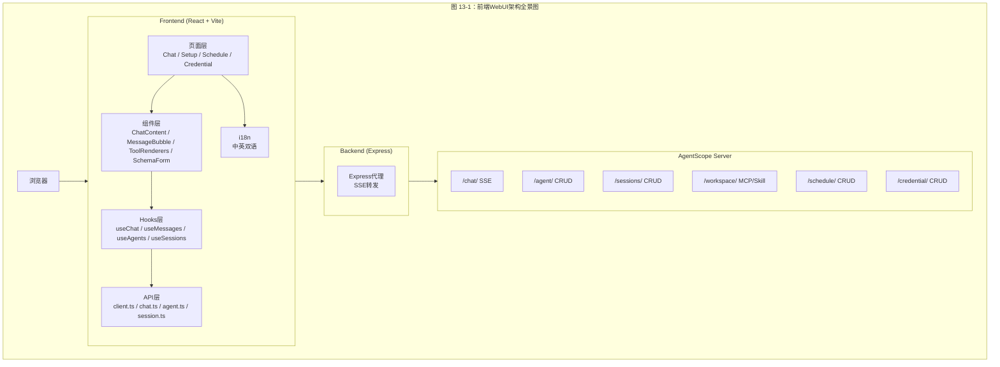
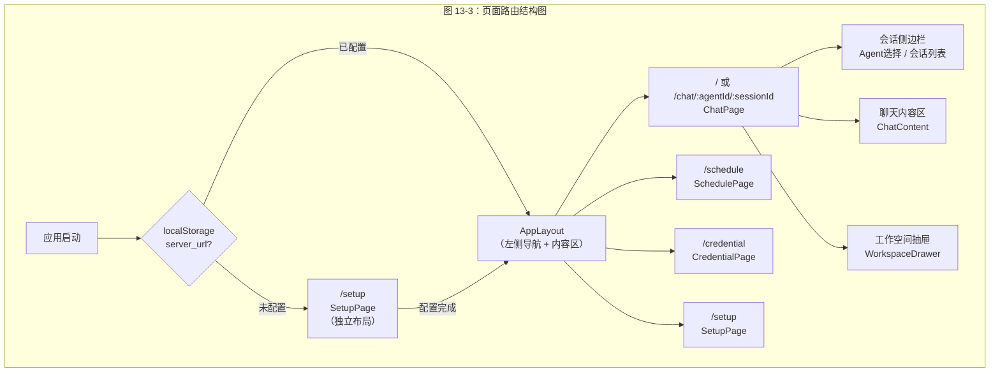
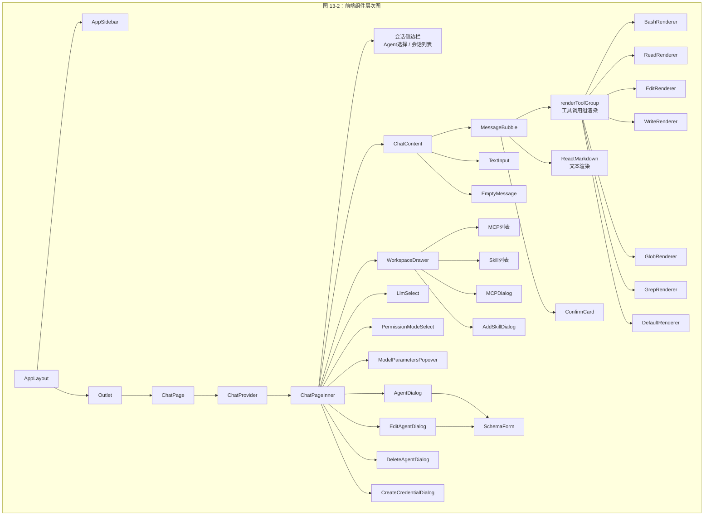
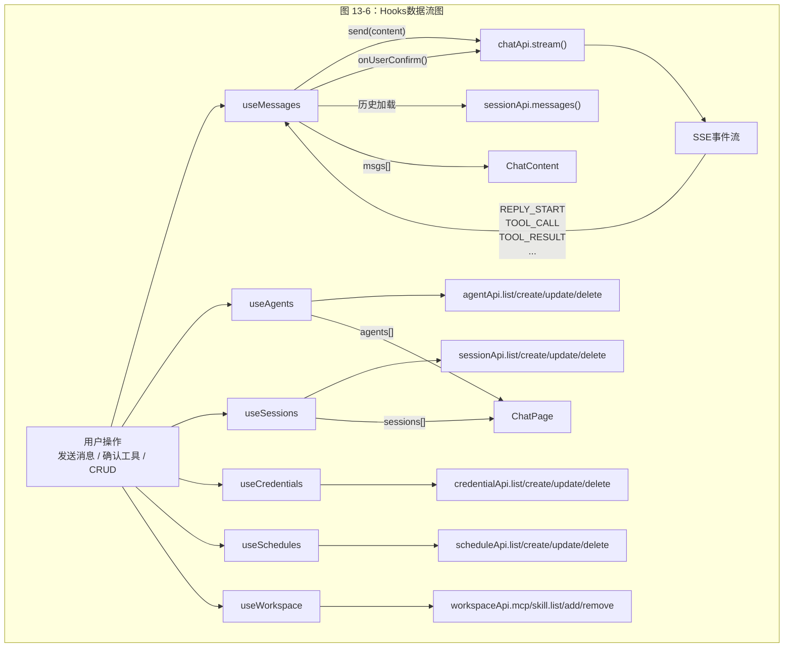
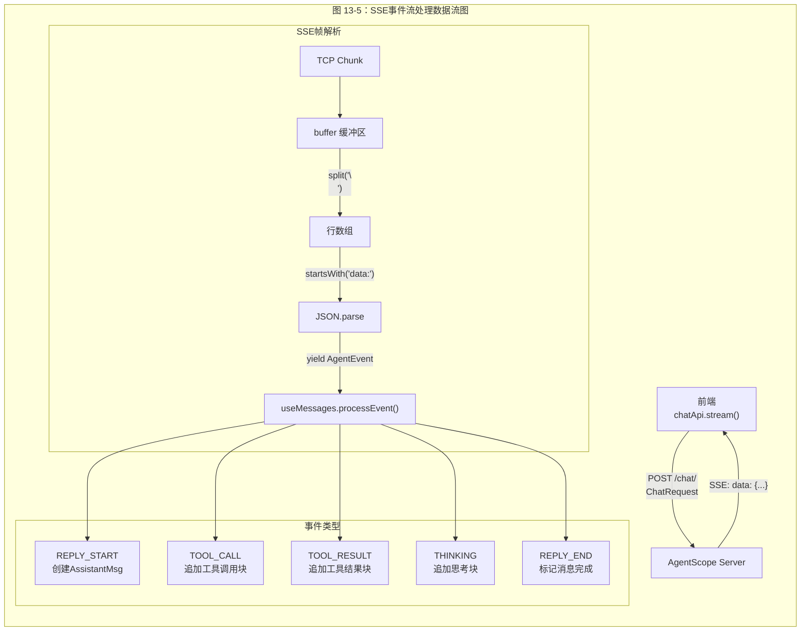
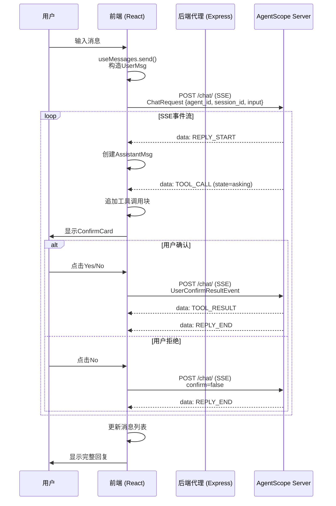
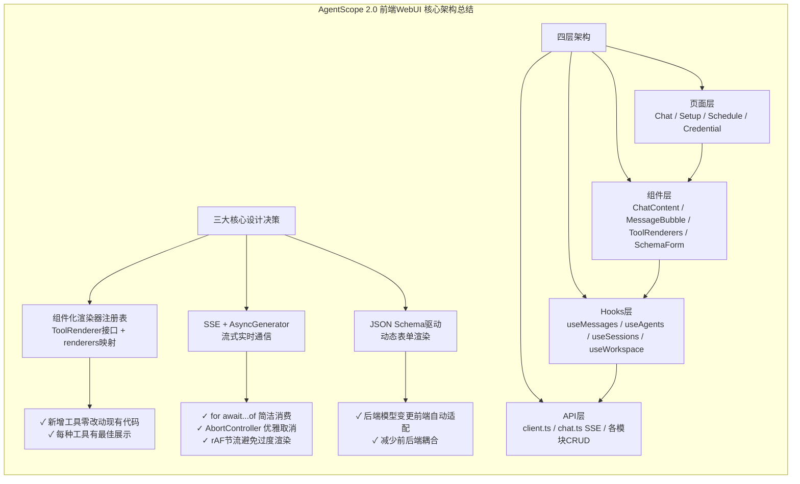

# AgentScope 2.0 前端WebUI

## 总：开篇概述

AgentScope 2.0 的前端 WebUI 是用户与 Agent 系统交互的核心界面，提供聊天式 Agent 对话、Agent 配置管理、定时任务调度、凭证管理等功能。它将底层复杂的 Agent 运行时、工具调用、权限确认等机制，封装为直观的图形化操作体验。

**解决的核心问题：**

- **可视化 Agent 管理**：通过图形界面创建、编辑、删除 Agent，替代命令行操作
- **实时聊天交互**：基于 SSE（Server-Sent Events）实现 Agent 回复的流式展示，用户可实时观察 Agent 思考与工具调用过程
- **工具结果专属渲染**：为 Bash、Read、Write、Edit、Glob、Grep 等工具提供定制化的结果展示组件，而非千篇一律的文本输出
- **权限确认交互**：将 Agent 的工具调用权限请求转化为用户可操作的选择卡片，支持键盘快捷键

**技术栈：** React 19 + TypeScript + Vite 8 + shadcn/ui（Radix UI）+ i18next（国际化）+ pnpm monorepo



---

## 分：逐层展开

### 1. 技术栈与项目结构

#### 1.1 技术栈选型

| 技术 | 版本 | 用途 |
|------|------|------|
| React | ^19.2.6 | UI框架 |
| TypeScript | ~6.0.2 | 类型安全 |
| Vite | ^8.0.12 | 构建工具 |
| shadcn/ui (Radix UI) | ^1.4.3 / ^4.7.0 | 组件库 |
| react-router-dom | ^7.15.1 | 路由管理 |
| i18next | ^26.2.0 | 国际化（中英双语） |
| react-markdown + remark-gfm | ^10.1.0 / ^4.0.1 | Markdown渲染 |
| framer-motion | ^12.40.0 | 动画 |
| onborda | ^1.2.5 | 新手引导 |
| lucide-react | ^1.16.0 | 图标库 |
| tailwindcss | ^4.3.0 | 样式 |

#### 1.2 pnpm Monorepo 结构

项目采用 pnpm workspace 管理 frontend 和 backend 两个子项目（`/workspace/examples/web_ui/pnpm-workspace.yaml`）：

```yaml
packages:
    - frontend
    - backend
```

根 `package.json`（`/workspace/examples/web_ui/package.json`）通过 `concurrently` 同时启动前后端开发服务器：

```json
"dev": "concurrently \"pnpm dev:frontend\" \"pnpm dev:backend\""
```

#### 1.3 前端目录结构

```
frontend/src/
├── api/              # API层：HTTP客户端封装、各模块API、类型定义
│   ├── client.ts     # 通用HTTP客户端（含SSE流式请求）
│   ├── chat.ts       # 聊天SSE流式API
│   ├── agent.ts      # Agent CRUD API
│   ├── session.ts    # Session CRUD API
│   ├── credential.ts # 凭证CRUD API
│   ├── workspace.ts  # MCP/Skill管理API
│   ├── schedule.ts   # 定时任务CRUD API
│   ├── model.ts      # 模型列表API
│   ├── types.ts      # 全局类型定义
│   └── index.ts      # 统一导出
├── components/       # 组件层
│   ├── chat/         # 聊天相关组件
│   │   ├── ChatContent.tsx
│   │   ├── MessageBubble.tsx
│   │   ├── ConfirmCard.tsx
│   │   ├── TextInput.tsx
│   │   ├── Empty.tsx
│   │   └── tool-renderers/  # 工具结果渲染器
│   ├── dialog/       # 对话框组件
│   ├── drawer/       # 抽屉组件
│   ├── form/         # 表单组件（SchemaForm）
│   ├── layout/       # 布局组件
│   ├── select/       # 选择器组件
│   ├── tour/         # 新手引导
│   └── ui/           # shadcn/ui基础组件
├── context/          # React Context
│   └── ChatContext.tsx
├── hooks/            # 自定义Hooks
├── i18n/             # 国际化
│   ├── index.ts
│   ├── useI18n.ts
│   └── locales/      # en.json / zh.json
├── pages/            # 页面组件
│   ├── chat/
│   ├── credential/
│   ├── schedule/
│   └── setup/
├── App.tsx           # 应用入口（路由配置）
└── main.tsx          # 渲染入口
```

### 2. 页面结构

#### 2.1 路由配置

路由在 `App.tsx`（`/workspace/examples/web_ui/frontend/src/App.tsx`，第27-38行）中定义：

```typescript
const router = createBrowserRouter([
    {
        element: <AppLayout />,
        children: [
            { path: '/', element: <ChatPage /> },
            { path: '/chat/:agentId/:sessionId', element: <ChatPage /> },
            { path: '/schedule', element: <SchedulePage /> },
            { path: '/credential', element: <CredentialPage /> },
        ],
    },
    { path: '/setup', element: <SetupPageRoute /> },
]);
```

- `/` — 默认聊天页面
- `/chat/:agentId/:sessionId` — 指定Agent和会话的聊天页面（支持URL直达）
- `/schedule` — 定时任务管理页面
- `/credential` — 凭证管理页面
- `/setup` — 初始配置页面（独立于AppLayout，无侧边栏）

#### 2.2 应用布局

`AppLayout`（`/workspace/examples/web_ui/frontend/src/components/layout/AppLayout.tsx`）采用左侧图标导航栏 + 右侧内容区的经典布局：

```typescript
export function AppLayout() {
    return (
        <div className="h-screen flex">
            <SidebarProvider>
                <AppSidebar />       {/* 左侧图标导航 */}
                <SidebarInset className="flex-1 overflow-hidden">
                    <Outlet />        {/* 页面内容 */}
                </SidebarInset>
            </SidebarProvider>
        </div>
    );
}
```

`AppSidebar`（`/workspace/examples/web_ui/frontend/src/components/layout/AppSidebar.tsx`）提供四个导航入口：Chat（聊天）、Schedule（定时任务）、Credential（凭证）、Settings（设置），以及语言切换和引导按钮。

#### 2.3 启动流程

`App.tsx`（第40-62行）在启动时检查 `localStorage` 中的 `server_url`，若未配置则直接显示 `SetupPage`：

```typescript
const [setupComplete, setSetupComplete] = useState(
    () => !!localStorage.getItem('server_url')
);

if (!setupComplete) {
    return <SetupPage onComplete={() => setSetupComplete(true)} />;
}
```



### 3. 核心组件

#### 3.1 ChatContent — 聊天内容容器

`ChatContent`（`/workspace/examples/web_ui/frontend/src/components/chat/ChatContent.tsx`）是聊天交互的核心容器，负责消息列表渲染和输入框管理：

- **消息列表渲染**：遍历 `msgs` 数组，为每条消息渲染 `MessageBubble`
- **自动滚动**：通过 `useEffect` 监听消息数量变化，仅在用户接近底部时自动滚动（第45-67行）
- **输入组件**：集成 `TextInput`，支持文本、文件上传等多种输入类型

```typescript
// ChatContent.tsx 第29-42行
interface ChatContentProps {
    msgs: Msg[];
    sending: boolean;
    disabled: boolean;
    onSend: (content: ContentBlock[]) => void;
    onUserConfirm: (toolCall: ToolCallBlock, confirm: boolean, replyId: string,
                     rules?: ToolCallBlock['suggested_rules']) => void;
    autoComplete?: (input: string) => string | null;
    className?: string;
    allowedInputTypes: string[];
    fileProcessor: (file: File) => Promise<ContentBlock | null>;
}
```

#### 3.2 MessageBubble — 消息气泡

`MessageBubble`（`/workspace/examples/web_ui/frontend/src/components/chat/MessageBubble.tsx`）是单条消息的渲染组件，核心职责包括：

- **工具调用分组**：`groupToolCalls` 函数（第30-84行）将连续的同名 `tool_call` 块合并为 `tool_call_group`，并将 `tool_result` 匹配回对应的 `tool_call`
- **内容块渲染**：`renderBlock` 函数（第92-198行）根据块类型分发渲染：
  - `tool_call_group` → 委托给 `renderToolGroup` + `ConfirmCard`
  - `text` → ReactMarkdown 渲染（支持GFM、代码块复制）
  - `thinking` → 可折叠的思考过程
  - `data` → 图片/音频/视频媒体渲染
- **状态展示**：底部显示运行状态（Loader2/CheckCircle）、耗时、Token用量（↑输入 ↓输出）

#### 3.3 ToolRenderers — 工具结果专属渲染器

这是 WebUI 最具特色的设计之一。每种工具都有专属的渲染器，通过注册表模式统一管理。

**渲染器接口定义**（`/workspace/examples/web_ui/frontend/src/components/chat/tool-renderers/types.ts`）：

```typescript
export interface ToolRenderer {
    getDisplayName?: (call: ToolCallBlock, t: TFunction) => string;
    renderCallArgs?: (call: ToolCallBlock, t: TFunction) => ReactNode;
    renderResult?: (call: ToolCallBlock, result: ToolResultBlock, t: TFunction) => ReactNode;
    renderConfirmBody?: (call: ToolCallBlock, t: TFunction) => ReactNode;
    renderGroup?: (calls: ToolCallWithResult[], t: TFunction) => ReactNode;
}
```

**渲染器注册表**（`/workspace/examples/web_ui/frontend/src/components/chat/tool-renderers/index.ts`，第19-26行）：

```typescript
const renderers: Record<string, ToolRenderer> = {
    Bash: BashRenderer,
    Read: ReadRenderer,
    Write: WriteRenderer,
    Edit: EditRenderer,
    Glob: GlobRenderer,
    Grep: GrepRenderer,
};
```

各渲染器的特色：

| 渲染器 | 特色行为 |
|--------|----------|
| **BashRenderer** | 解析 `command` 字段展示命令；确认卡片显示命令和描述 |
| **ReadRenderer** | 按文件路径分组连续读取；可折叠展示，显示行数统计 |
| **EditRenderer** | 提取 `file_path` 展示；预留 diff 视图扩展点 |
| **WriteRenderer** | 提取 `file_path` 展示写入目标 |
| **GlobRenderer** | 展示文件搜索模式 |
| **GrepRenderer** | 展示搜索模式和匹配结果 |
| **DefaultRenderer** | 通用回退，JSON格式展示参数和结果 |

未注册的工具名称自动回退到 `DefaultRenderer`（`getRenderer` 函数第28-30行）。

#### 3.4 ConfirmCard — 工具调用确认卡片

`ConfirmCard`（`/workspace/examples/web_ui/frontend/src/components/chat/ConfirmCard.tsx`）在 Agent 请求用户确认工具调用时出现：

- 三种选项：Yes / Yes with Rule / No
- 支持键盘操作：↑↓ 切换选项，Enter 确认
- `suggested_rules` 由 Agent 端提供，允许用户按规则自动授权

#### 3.5 AgentDialog — Agent配置对话框

`AgentDialog`（`/workspace/examples/web_ui/frontend/src/components/dialog/AgentDialog.tsx`）用于创建新 Agent：

- 从后端获取 JSON Schema（`useAgentSchema`）
- 使用 `AgentFormFields` + `SchemaForm` 动态渲染表单
- 表单分三个区段：identity（名称、系统提示词）、context_config、react_config

#### 3.6 WorkspaceDrawer — 工作空间抽屉

`WorkspaceDrawer`（`/workspace/examples/web_ui/frontend/src/components/drawer/WorkspaceDrawer.tsx`）以右侧抽屉形式展示当前会话的工作空间：

- **MCP Tab**：展示已挂载的 MCP 服务器列表，含健康状态指示灯、类型标签（STDIO/HTTP）、工具数量
- **Skill Tab**：展示已挂载的技能列表
- 支持搜索、添加、删除操作

#### 3.7 SchemaForm — 动态表单

`SchemaForm`（`/workspace/examples/web_ui/frontend/src/components/form/SchemaForm.tsx`）根据 JSON Schema 动态渲染表单字段：

- 自动推断字段类型：boolean → Checkbox，number/integer → 数字输入，textarea format → 多行文本，password format → 密码输入
- 支持必填标记、占位符、描述文本
- 默认跳过 `id` 和 `type` 字段



### 4. Hooks

#### 4.1 useChat — 基础聊天流

`useChat`（`/workspace/examples/web_ui/frontend/src/hooks/useChat.ts`）是最简化的聊天 Hook，直接将 SSE 事件收集到数组中：

```typescript
export function useChat() {
    const [events, setEvents] = useState<AgentEvent[]>([]);
    const [streaming, setStreaming] = useState(false);
    const [error, setError] = useState<Error | null>(null);
    const abortRef = useRef<AbortController | null>(null);

    const send = useCallback(async (body: ChatRequest) => {
        abortRef.current?.abort();
        const controller = new AbortController();
        abortRef.current = controller;
        setEvents([]);
        setStreaming(true);
        setError(null);
        try {
            for await (const event of chatApi.stream(body, controller.signal)) {
                setEvents((prev) => [...prev, event]);
            }
        } catch (e) {
            if ((e as Error).name !== 'AbortError') setError(e as Error);
        } finally {
            setStreaming(false);
        }
    }, []);

    const abort = useCallback(() => { abortRef.current?.abort(); }, []);
    return { events, streaming, error, send, abort };
}
```

特点：每次 `send` 清空旧事件、支持 `abort` 取消流。

#### 4.2 useMessages — 完整消息管理

`useMessages`（`/workspace/examples/web_ui/frontend/src/hooks/useMessages.ts`）是 Chat 页面实际使用的 Hook，在 `useChat` 基础上增加了：

- **历史消息加载**：`sessionId` 变化时从后端拉取历史消息（第51-78行）
- **事件到消息的聚合**：`processEvent` 将 SSE 事件实时追加到当前回复消息（第35-48行）
  - `REPLY_START` → 创建新的 `AssistantMsg`
  - 其他事件 → 通过 `appendEvent` 追加到当前回复
- **requestAnimationFrame 节流**：`scheduleUpdate` 使用 `rAF` 合并高频状态更新（第27-33行）
- **用户确认回调**：`onUserConfirm` 构造 `UserConfirmResultEvent` 并继续流式对话（第116-141行）

```typescript
const processEvent = useCallback((event: AgentEvent) => {
    if (event.type === EventType.REPLY_START) {
        const e = event as ReplyStartEvent;
        const msg = AssistantMsg({ id: e.reply_id, name: e.name, content: [] });
        msgsRef.current = [...msgsRef.current, msg];
        currentReplyRef.current = msg;
    } else if (currentReplyRef.current) {
        appendEvent(currentReplyRef.current, event);
    }
    scheduleUpdate();
}, [scheduleUpdate]);
```

#### 4.3 useAgents / useSessions / useCredentials / useSchedules — CRUD Hooks

这四个 Hooks 遵循统一的设计模式：

1. **状态管理**：`useState` 管理列表数据、加载状态、错误
2. **自动加载**：`useEffect` 在挂载时或依赖变化时调用 `refetch`
3. **CRUD 操作**：`create` / `update` / `remove` 在执行后自动 `refetch` 刷新列表

以 `useAgents`（`/workspace/examples/web_ui/frontend/src/hooks/useAgents.ts`）为例：

```typescript
export function useAgents() {
    const [agents, setAgents] = useState<AgentRecord[]>([]);
    const [loading, setLoading] = useState(false);
    const [error, setError] = useState<Error | null>(null);

    const refetch = useCallback(async () => { /* ... */ }, []);

    useEffect(() => { refetch(); }, [refetch]);

    const create = useCallback(async (body: CreateAgentRequest) => {
        const res = await agentApi.create(body);
        await refetch();
        return res;
    }, [refetch]);

    return { agents, loading, error, refetch, create, update, remove };
}
```

#### 4.4 useWorkspace — 工作空间管理

`useWorkspace`（`/workspace/examples/web_ui/frontend/src/hooks/useWorkspace.ts`）同时管理 MCP 服务器和 Skill 列表，依赖 `agentId` 和 `sessionId` 两个参数。添加 MCP 时会检查重名（第54-66行）。



### 5. API层

#### 5.1 HTTP客户端封装

`client.ts`（`/workspace/examples/web_ui/frontend/src/api/client.ts`）封装了统一的 HTTP 客户端：

- **基础配置**：`getBaseUrl()` 从 `localStorage` 读取服务端地址，`getUserId()` 读取用户ID（第3-4行）
- **请求头**：自动附加 `X-User-ID` 和 `Content-Type`（第30-34行）
- **错误处理**：`ApiError` 类封装非2xx响应，自动提取 `detail` 字段并弹出 toast（第10-20行、第62-67行）
- **流式请求**：`streamRequest` 返回原始 `Response`，供 SSE 解析（第73-98行）

```typescript
export const client = {
    get: <T>(path: string, params?: Record<string, string>) =>
        request<T>(path, { method: 'GET', params }),
    post: <T>(path: string, body?: unknown, params?: Record<string, string>) =>
        request<T>(path, { method: 'POST', body, params }),
    patch: <T>(path: string, body?: unknown, params?: Record<string, string>) =>
        request<T>(path, { method: 'PATCH', body, params }),
    delete: <T = void>(path: string, params?: Record<string, string>) =>
        request<T>(path, { method: 'DELETE', params }),
    stream: (path: string, options?: RequestOptions & { signal?: AbortSignal }) =>
        streamRequest(path, options),
};
```

#### 5.2 SSE事件流处理

`chat.ts`（`/workspace/examples/web_ui/frontend/src/api/chat.ts`）实现了 SSE 协议解析：

```typescript
export const chatApi = {
    stream: async function* (body: ChatRequest, signal?: AbortSignal): AsyncGenerator<AgentEvent> {
        const res = await client.stream('/chat/', { method: 'POST', body, signal });
        const reader = res.body!.getReader();
        const decoder = new TextDecoder();
        let buffer = '';

        while (true) {
            const { done, value } = await reader.read();
            if (done) break;
            buffer += decoder.decode(value, { stream: true });
            const lines = buffer.split('\n');
            buffer = lines.pop() ?? '';   // 保留不完整的行

            for (const line of lines) {
                if (line.startsWith('data: ')) {
                    const json = line.slice(6).trim();
                    if (json) yield JSON.parse(json) as AgentEvent;
                }
            }
        }
    },
};
```

关键设计：
- **AsyncGenerator**：使用 `async function*` 将 SSE 流转化为异步迭代器，消费端可用 `for await...of` 语法
- **缓冲区处理**：`buffer` 保留跨 chunk 的不完整行，确保 SSE 帧边界正确
- **AbortSignal**：支持通过 `AbortController` 取消流

#### 5.3 类型定义

`types.ts`（`/workspace/examples/web_ui/frontend/src/api/types.ts`）定义了前后端交互的全部类型，核心包括：

- **Agent 相关**：`AgentRecord`、`CreateAgentRequest`、`AgentSchemaResponse`
- **Session 相关**：`SessionRecord`、`CreateSessionRequest`、`ChatModelConfig`
- **Chat 相关**：`ChatRequest`、`AgentEvent`（从 `@agentscope-ai/agentscope` 导入）
- **MCP 相关**：`StdioMCPConfig`、`HttpMCPConfig`、`MCPClientStatus`
- **Schedule 相关**：`ScheduleRecord`、`PermissionMode`
- **Credential 相关**：`CredentialRecord`、`CredentialSchema`
- **JSON Schema**：`JSONSchema`、`JSONSchemaProperty`（用于动态表单渲染）



### 6. 后端代理服务

#### 6.1 Express代理

后端服务（`/workspace/examples/web_ui/backend/src/index.ts`）是一个极简的 Express 应用：

```typescript
import express from 'express';
import cors from 'cors';

const app = express();
const PORT = process.env.PORT || 3000;

app.use(cors());
app.use(express.json());

app.get('/api/health', (_req, res) => {
    res.json({ status: 'ok' });
});

app.listen(PORT, () => {
    console.log(`Server running on http://localhost:${PORT}`);
});
```

当前后端仅提供健康检查端点，前端的 API 请求直接发送到用户配置的 AgentScope Server 地址（存储在 `localStorage.server_url`）。这意味着后端代理层在未来可以扩展为：

- **SSE转发**：解决浏览器跨域限制
- **认证代理**：集中管理认证逻辑
- **请求聚合**：合并多个后端请求

#### 6.2 聊天交互时序



---

## 总：总结升华

### 核心设计决策

1. **组件化与渲染器注册表**：ToolRenderer 接口定义了统一的工具渲染契约，新增工具只需实现 `ToolRenderer` 接口并注册到 `renderers` 映射表即可，无需修改 `MessageBubble` 代码。这是典型的**开闭原则**实践。

2. **SSE + AsyncGenerator 实时通信**：将 SSE 流解析为 `AsyncGenerator<AgentEvent>`，消费端使用 `for await...of` 语法，代码简洁且天然支持背压。`AbortController` 的集成使得流的取消优雅而可靠。

3. **工具结果专属渲染**：不同工具的输出格式差异巨大（Bash的命令行、Read的文件内容、Grep的搜索结果），专属渲染器让每种工具都有最佳展示效果，而非退化为通用JSON展示。

4. **JSON Schema 驱动的动态表单**：`SchemaForm` 根据后端返回的 JSON Schema 自动渲染表单字段，前后端类型变更只需修改后端模型，前端自动适配。

5. **rAF 节流的消息更新**：`useMessages` 中高频 SSE 事件通过 `requestAnimationFrame` 合并渲染，避免每收到一个事件就触发一次 React 重渲染。

### 扩展点

| 扩展点 | 位置 | 说明 |
|--------|------|------|
| 新增工具渲染器 | `tool-renderers/index.ts` 的 `renderers` 映射 | 实现 `ToolRenderer` 接口并注册 |
| 新增页面路由 | `App.tsx` 的 `router` 配置 | 添加路由和页面组件 |
| 新增API模块 | `api/` 目录 | 创建模块文件并在 `index.ts` 导出 |
| 新增Hook | `hooks/` 目录 | 遵循 `useState + useCallback + useEffect + refetch` 模式 |
| 后端SSE代理 | `backend/src/index.ts` | 扩展Express路由转发SSE请求 |
| 国际化语言 | `i18n/locales/` | 添加新的语言JSON文件 |
| 新手引导步骤 | `tour/chatTourSteps.ts` | 添加引导步骤定义 |

### 总结



AgentScope 2.0 的前端 WebUI 通过清晰的分层架构、可扩展的渲染器注册表、高效的 SSE 流式通信，构建了一个既功能完整又易于扩展的 Agent 交互界面。其设计充分体现了"关注点分离"的原则——页面层负责布局与路由，组件层负责渲染与交互，Hooks层负责状态与逻辑，API层负责通信与序列化——每一层都可以独立演进而不影响其他层。
