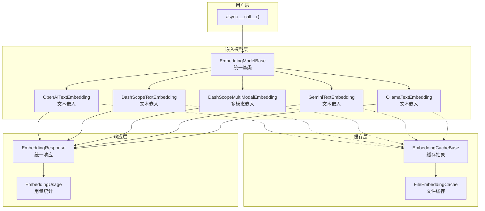
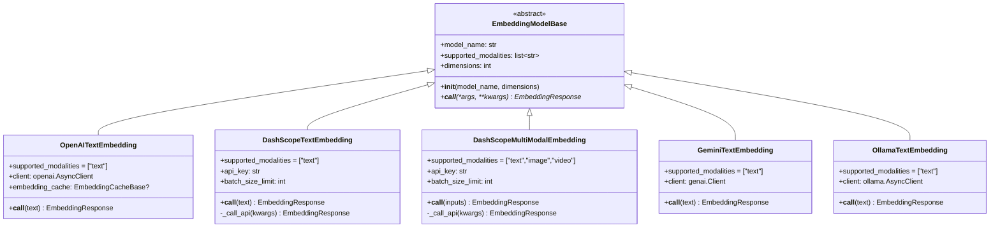
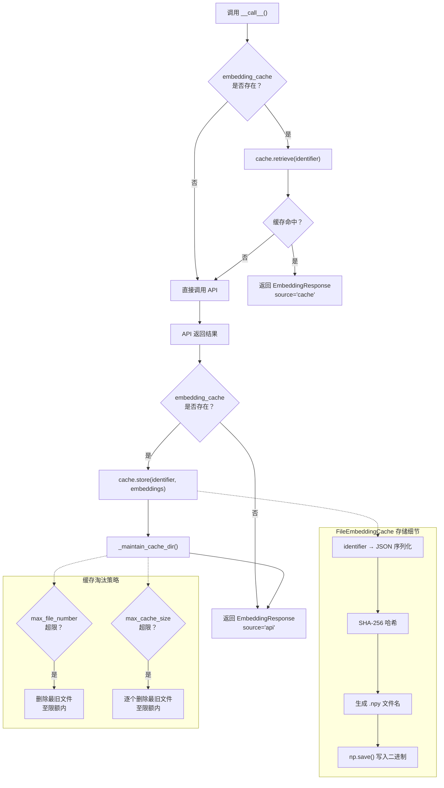
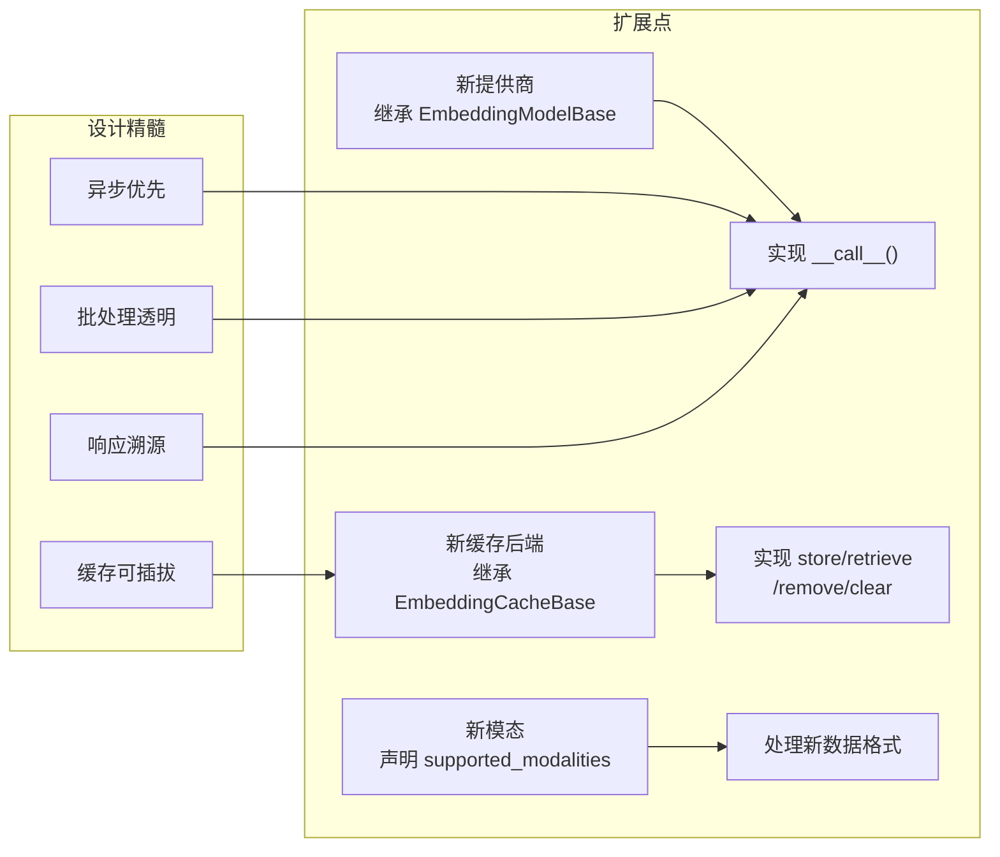

# AgentScope 2.0 嵌入与向量化

## 总：开篇概述

Embedding 模块是 AgentScope 的**向量化引擎**，为整个框架提供文本和多模态数据的嵌入能力。在 RAG、语义搜索、聚类分析等场景中，高质量的向量表示是核心基础设施。AgentScope 2.0 的 Embedding 模块围绕三个核心问题展开设计：

1. **统一嵌入接口** —— 不同提供商（OpenAI、DashScope、Gemini、Ollama）的 API 差异巨大，需要一个统一的抽象层屏蔽底层细节
2. **缓存加速** —— 嵌入 API 调用成本高、延迟大，通过可插拔的缓存机制避免重复计算
3. **多模态支持** —— 不仅支持纯文本嵌入，还支持图像、视频等多模态数据的向量化



整个模块的代码位于 `src/agentscope/embedding/` 目录下，通过 `__init__.py`（第 16-27 行）统一导出 9 个核心类，形成清晰的公共 API 边界。

---

## 分：逐层展开

### 1. 嵌入基类 EmbeddingModelBase

#### 1.1 统一接口设计

`EmbeddingModelBase`（`src/agentscope/embedding/_embedding_base.py`）是所有嵌入模型的抽象基类，定义了三个核心属性和一个调用接口：

| 属性 | 类型 | 说明 |
|------|------|------|
| `model_name` | `str` | 嵌入模型名称 |
| `supported_modalities` | `list[str]` | 支持的数据模态（如 `"text"`, `"image"`, `"video"`） |
| `dimensions` | `int` | 嵌入向量的维度 |

核心调用接口采用 `async def __call__()` 设计（第 36-44 行），返回统一的 `EmbeddingResponse` 对象。基类中该方法直接抛出 `NotImplementedError`，强制子类必须实现：

```python
# _embedding_base.py 第 36-44 行
async def __call__(
    self,
    *args: Any,
    **kwargs: Any,
) -> EmbeddingResponse:
    raise NotImplementedError(
        f"The {self.__class__.__name__} class does not implement "
        f"the __call__ method.",
    )
```

这种设计使得嵌入模型实例可以像函数一样被调用，同时保持了异步特性，适配高并发场景。

#### 1.2 响应类型体系

`EmbeddingResponse`（`src/agentscope/embedding/_embedding_response.py`）是一个 `@dataclass`，继承自 `DictMixin`（提供字典式访问能力），包含以下字段：

| 字段 | 类型 | 默认值 | 说明 |
|------|------|--------|------|
| `embeddings` | `List[Embedding]` | 必填 | 嵌入向量数据 |
| `id` | `str` | 时间戳 | 响应唯一标识 |
| `created_at` | `str` | 时间戳 | 创建时间 |
| `type` | `Literal["embedding"]` | `"embedding"` | 响应类型标记 |
| `usage` | `EmbeddingUsage \| None` | `None` | API 调用用量 |
| `source` | `Literal["cache", "api"]` | `"api"` | 数据来源标记 |

其中 `Embedding` 类型定义在 `src/agentscope/types/_object.py` 第 5 行，本质是 `List[float]`。

`EmbeddingUsage`（`src/agentscope/embedding/_embedding_usage.py`）记录 API 调用开销：

| 字段 | 类型 | 说明 |
|------|------|------|
| `time` | `float` | 调用耗时（秒） |
| `tokens` | `int \| None` | 消耗的 token 数 |
| `type` | `Literal["embedding"]` | 类型标记 |

`source` 字段的设计尤为巧妙——它明确区分了响应是来自缓存还是 API 调用，使上层逻辑可以据此做出决策（如统计真实的 API 调用量）。



### 2. 缓存机制

#### 2.1 CacheBase 抽象

`EmbeddingCacheBase`（`src/agentscope/embedding/_cache_base.py`）定义了缓存的四个核心操作，全部采用 `async` 接口：

| 方法 | 说明 |
|------|------|
| `store(embeddings, identifier, overwrite)` | 存储嵌入向量，`identifier` 为 JSON 可序列化对象 |
| `retrieve(identifier)` | 根据 `identifier` 检索嵌入向量，未找到返回 `None` |
| `remove(identifier)` | 删除指定缓存 |
| `clear()` | 清空所有缓存 |

`identifier` 参数的类型为 `JSONSerializableObject`（定义于 `src/agentscope/types/_json.py` 第 7-13 行），即 `str | int | float | bool | None | list | dict` 的递归组合。这一设计使得可以用完整的 API 调用参数作为缓存键，确保缓存命中率的准确性。

#### 2.2 FileCache 文件缓存

`FileEmbeddingCache`（`src/agentscope/embedding/_file_cache.py`）是 `EmbeddingCacheBase` 的文件系统实现，核心设计要点如下：

**文件命名策略**（第 142-146 行）：将 `identifier` 序列化为 JSON 字符串后，通过 SHA-256 哈希生成文件名，确保键的唯一性和安全性：

```python
# _file_cache.py 第 142-146 行
@staticmethod
def _get_filename(identifier: JSONSerializableObject) -> str:
    json_str = json.dumps(identifier, ensure_ascii=False)
    return hashlib.sha256(json_str.encode("utf-8")).hexdigest() + ".npy"
```

**存储格式**：使用 NumPy 的 `.npy` 二进制格式存储嵌入向量，兼顾读写效率和跨平台兼容性。

**缓存淘汰策略**（第 148-187 行）：支持两种淘汰维度，均按文件修改时间（LRU 语义）排序后删除最旧文件：

| 参数 | 说明 |
|------|------|
| `max_file_number` | 最大文件数量限制 |
| `max_cache_size` | 最大缓存大小限制（MB） |

**缓存目录管理**：`cache_dir` 属性（第 46-51 行）采用惰性创建策略，首次访问时自动创建目录。



### 3. 具体实现

#### 3.1 OpenAI 文本嵌入

`OpenAITextEmbedding`（`src/agentscope/embedding/_openai_embedding.py`）是最简洁的实现，直接使用 `openai.AsyncClient` 进行异步调用：

- **输入处理**（第 60-69 行）：统一将 `str` 和 `TextBlock`（`dict` 含 `"text"` 键）两种输入格式归一化为字符串列表
- **缓存集成**（第 79-91 行）：以完整的 API 调用参数 `kwargs` 作为缓存键，命中时直接返回，`usage` 中 `tokens=0, time=0`
- **API 调用**（第 93-94 行）：使用 `await self.client.embeddings.create()` 异步调用
- **缓存写入**（第 97-101 行）：调用成功后，将结果写入缓存

默认维度为 1024，编码格式为 `float`。

#### 3.2 DashScope 文本嵌入

`DashScopeTextEmbedding`（`src/agentscope/embedding/_dashscope_embedding.py`）相比 OpenAI 版本增加了**批处理限制**的处理：

- **批大小限制**（第 58 行）：`batch_size_limit = 10`，对应 DashScope API 对 `text-embedding-v3/v4` 的限制
- **分批调用**（第 140-160 行）：当输入文本数量超过 `batch_size_limit` 时，自动拆分为多个批次调用 `_call_api()`
- **结果聚合**（第 141-168 行）：收集所有批次的 embeddings、tokens、time，若任一批次来自 API 则 `source="api"`

这种分批聚合的设计保证了上层调用者无需关心底层 API 的批大小限制。

#### 3.3 DashScope 多模态嵌入

`DashScopeMultiModalEmbedding`（`src/agentscope/embedding/_dashscope_multimodal_embedding.py`）是模块中唯一支持多模态的实现，`supported_modalities = ["text", "image", "video"]`：

- **模型维度约束**（第 53-84 行）：不同模型有固定的维度要求，如 `tongyi-embedding-vision-plus` 必须为 1152 维，`tongyi-embedding-vision-flash` 必须为 768 维，`multimodal-embedding-v*` 必须为 1024 维
- **输入格式化**（第 109-165 行）：将 `TextBlock`、`ImageBlock`、`VideoBlock` 转换为 DashScope API 要求的格式：
  - 文本 → `{"text": "..."}`
  - 图片 base64 → `{"image": "data:media_type;base64,..."}`
  - 图片 URL → `{"image": "url"}`
  - 视频 → `{"video": "url"}`（仅支持 URL 输入）
- **批大小限制**（第 51-54 行）：`multimodal-embedding-v*` 为 1，`tongyi-embedding-vision-*` 为 8

#### 3.4 Gemini 文本嵌入

`GeminiTextEmbedding`（`src/agentscope/embedding/_gemini_embedding.py`）使用 Google 的 `genai.Client`：

- 默认维度为 3072（Gemini 嵌入模型的原生维度）
- API 调用方式为 `self.client.models.embed_content()`（第 95 行）
- 响应中通过 `_.values` 提取嵌入向量（第 101、105 行）
- 注意：当前实现为同步调用（未使用 `await`），可能存在性能瓶颈

#### 3.5 Ollama 本地嵌入

`OllamaTextEmbedding`（`src/agentscope/embedding/_ollama_embedding.py`）支持本地部署的 Ollama 嵌入模型：

- 使用 `ollama.AsyncClient` 进行异步调用
- 支持自定义 `host` 参数（第 23 行），适配不同部署地址
- 无需 `api_key`，适合本地开发场景
- 响应直接使用 `response.embeddings`（第 98、102 行），Ollama SDK 已返回列表格式

#### 3.6 各实现对比

| 特性 | OpenAI | DashScope | DashScope MM | Gemini | Ollama |
|------|--------|-----------|-------------|--------|--------|
| 模态 | text | text | text/image/video | text | text |
| 默认维度 | 1024 | 1024 | 模型固定 | 3072 | 用户指定 |
| 批处理 | 未处理 | 自动分批 | 自动分批 | 未处理 | 未处理 |
| 异步调用 | ✅ | ✅ | ✅ | ⚠️ 同步 | ✅ |
| 缓存支持 | ✅ | ✅ | ✅ | ✅ | ✅ |
| API Key | 必需 | 必需 | 必需 | 必需 | 不需要 |

---

## 总：总结升华

### 核心设计决策

1. **异步优先**：所有接口均采用 `async/await` 设计，`__call__` 方法天然适配高并发场景，与 AgentScope 的异步 Agent 框架无缝集成

2. **缓存可选注入**：缓存通过构造函数参数 `embedding_cache` 注入，而非硬编码。这使得缓存策略完全可插拔——开发者可以选择不用缓存、用文件缓存、或实现自己的缓存（如 Redis 缓存），只需继承 `EmbeddingCacheBase` 即可

3. **source 字段溯源**：`EmbeddingResponse.source` 字段区分 `"cache"` 和 `"api"`，使得上层可以精确统计 API 调用量和成本，这对生产环境的监控至关重要

4. **批处理透明化**：DashScope 系列实现自动处理 API 的批大小限制，上层调用者无需关心分批逻辑

### 扩展点

- **新增嵌入提供商**：继承 `EmbeddingModelBase`，实现 `__call__` 方法即可，如需缓存只需在构造函数中接受 `embedding_cache` 参数
- **新增缓存后端**：继承 `EmbeddingCacheBase`，实现 `store/retrieve/remove/clear` 四个异步方法，例如实现 `RedisEmbeddingCache` 用于分布式场景
- **新增模态支持**：在子类中声明 `supported_modalities`，并在 `__call__` 中处理对应的数据格式



AgentScope 2.0 的 Embedding 模块通过"基类抽象 + 缓存注入 + 统一响应"的三层架构，在保持简洁的同时提供了足够的灵活性，使得开发者可以轻松地适配新的嵌入提供商和缓存策略，为 RAG、语义搜索等上层应用提供了坚实的向量化基础设施。
