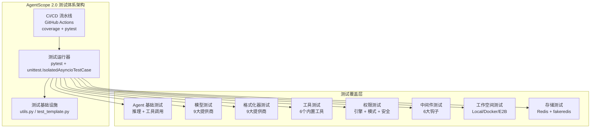
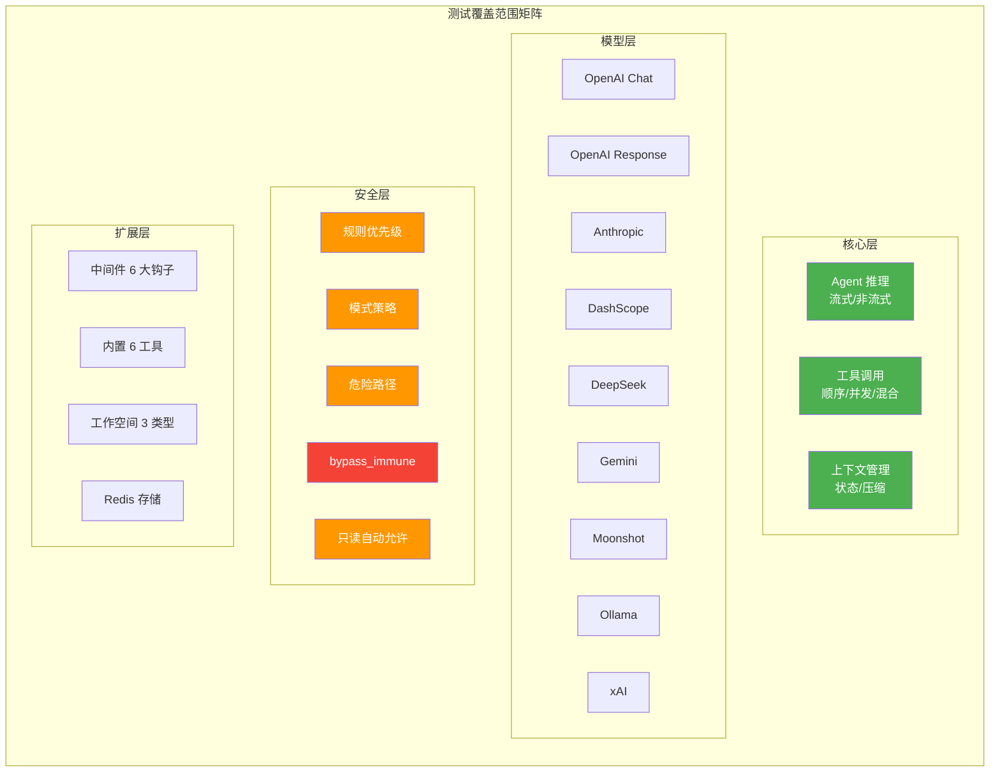
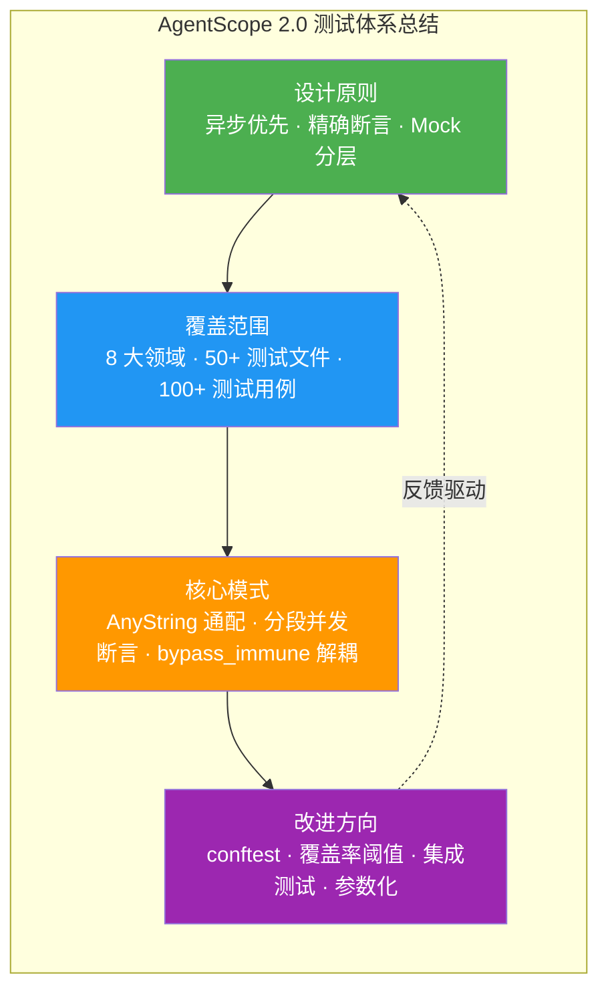

# AgentScope 2.0 测试体系

## 总：开篇概述

测试体系是 AgentScope 2.0 质量保障的基石。作为一个生产就绪型 AI Agent 框架，AgentScope 拥有涵盖 Agent 核心推理、多模型适配、工具执行、权限安全、中间件拦截、工作空间管理等关键路径的完整测试矩阵。整个测试体系以 **异步优先** 为设计原则，基于 `unittest.IsolatedAsyncioTestCase` 构建全异步测试用例，确保与框架的异步运行时模型完全对齐。

**解决的核心问题**：

- **功能验证**：确保 Agent 的流式/非流式推理、工具顺序/并发执行、中间件洋葱模型等核心行为符合设计契约
- **回归保护**：通过精确的字典断言（`assertDictEqual`/`assertListEqual`）捕获任何 API 输出的结构变化，防止静默回归
- **API 契约保证**：测试用例直接对 `model_dump()` 的完整字典输出进行断言，等效于对序列化 API 的契约测试



*图 15-1：测试体系架构全景图*

---

## 分：逐层展开

### 1. 测试框架与配置

#### 1.1 pytest 配置

AgentScope 2.0 的测试基于 **pytest** 作为测试运行器，底层使用 Python 标准库 `unittest` 的 `IsolatedAsyncioTestCase` 作为测试基类。项目在 `pyproject.toml`（`/workspace/pyproject.toml` 第 88 行）的 `dev` 可选依赖中声明了测试相关依赖：

```toml
[project.optional-dependencies]
dev = [
    "agentscope[full]",
    "pre-commit",
    "pytest",
    "pytest-forked",
    "myst_parser",
    "matplotlib",
    "fakeredis",
]
```

关键依赖说明：
- **pytest**：测试运行器，负责发现和执行测试用例
- **pytest-forked**：提供进程级隔离，防止测试间状态泄漏
- **fakeredis**：Redis 存储层的内存替代，避免外部服务依赖

#### 1.2 测试组织方式

所有测试文件统一放置在 `/workspace/tests/` 目录下，采用 **扁平化命名** 策略，文件名格式为 `{模块}_{子模块}_test.py`，便于快速定位测试对应的源码模块：

| 命名模式 | 示例 | 对应源码 |
|---------|------|---------|
| `agent_{功能}_test.py` | `agent_basic_test.py` | `src/agentscope/agent/` |
| `model_{提供商}_test.py` | `model_openai_chat_test.py` | `src/agentscope/model/_openai_chat/` |
| `formatter_{提供商}_test.py` | `formatter_anthropic_test.py` | `src/agentscope/formatter/` |
| `builtin_{工具}_test.py` | `builtin_bash_test.py` | `src/agentscope/tool/_builtin/` |
| `permission_{子模块}_test.py` | `permission_engine_test.py` | `src/agentscope/permission/` |
| `workspace_{类型}_test.py` | `workspace_local_test.py` | `src/agentscope/workspace/` |

#### 1.3 运行方式

CI 流水线配置在 `/workspace/.github/workflows/unittest.yml` 中，采用多平台矩阵策略：

```yaml
strategy:
  matrix:
    os: [ubuntu-latest, windows-latest, macos-15]
    python-version: ['3.11']
```

执行命令为：

```bash
coverage run -m pytest tests
coverage report -m
```

本地运行方式：

```bash
# 运行全部测试
pytest tests

# 运行单个测试文件
pytest tests/agent_basic_test.py

# 运行特定测试类
pytest tests/agent_basic_test.py::AgentBasicTest::test_streaming_reasoning
```

---

### 2. 测试覆盖

#### 2.1 Agent 基础测试

**文件**：`/workspace/tests/agent_basic_test.py`

Agent 基础测试是整个测试体系中最为核心的测试集，覆盖了 Agent 的完整推理生命周期。测试类 `AgentBasicTest` 继承自 `IsolatedAsyncioTestCase`，在 `asyncSetUp`（第 100-108 行）中初始化 MockModel 和 Agent 实例：

```python
async def asyncSetUp(self) -> None:
    self.model = MockModel()
    self.agent = Agent(
        name="Friday",
        system_prompt="You are a helpful assistant.",
        model=self.model,
        toolkit=Toolkit(),
    )
```

**核心测试用例**：

| 测试方法 | 行号 | 覆盖场景 |
|---------|------|---------|
| `test_streaming_reasoning` | 第 130 行 | 流式推理（纯文本），验证 reply_stream 和 reply 两个接口 |
| `test_non_streaming_reasoning` | 第 332 行 | 非流式推理（纯文本），验证事件流和上下文状态 |
| `test_streaming_sequential_tool_calls` | 第 525 行 | 流式推理 + 顺序工具调用（`is_concurrency_safe=False`） |
| `test_streaming_concurrent_tool_calls` | 第 788 行 | 流式推理 + 并发工具调用（`is_concurrency_safe=True`） |
| `test_streaming_mixed_tool_calls` | 第 1026 行 | 流式推理 + 混合工具调用（顺序 + 并发） |

**测试断言策略**：每个测试用例均对三个维度进行断言：
1. **事件流**（Events）：通过 `model_dump()` 序列化后与预期字典列表精确比较
2. **上下文状态**（Context）：验证 Agent 的 `state.context` 中消息的完整结构
3. **回复消息**（Reply Message）：验证 `reply()` 返回的 Msg 对象结构

对于并发工具调用，测试采用了 **分段断言** 策略（第 860-953 行）：将事件分为 prefix（固定顺序）、concurrent（可变顺序，用 `assertIn` 逐项验证）、suffix（固定顺序）三段，巧妙处理了并发执行结果顺序不确定的问题。

测试中还定义了两个 Mock 工具类：
- `MockSequentialTool`（第 23-57 行）：`is_concurrency_safe=False`，模拟顺序执行工具
- `MockConcurrentTool`（第 60-94 行）：`is_concurrency_safe=True`，模拟并发安全工具

#### 2.2 模型测试

**文件**：`/workspace/tests/model_{provider}_test.py`（9 个文件）

模型测试覆盖了 AgentScope 支持的所有 9 大模型提供商：

| 测试文件 | 对应模型类 | 提供商 |
|---------|----------|--------|
| `model_openai_chat_test.py` | `OpenAIChatModel` | OpenAI Chat Completions |
| `model_openai_response_test.py` | `OpenAIResponseModel` | OpenAI Responses API |
| `model_anthropic_test.py` | `AnthropicModel` | Anthropic Claude |
| `model_dashscope_test.py` | `DashScopeModel` | 阿里云 DashScope |
| `model_deepseek_test.py` | `DeepSeekModel` | DeepSeek |
| `model_gemini_test.py` | `GeminiModel` | Google Gemini |
| `model_moonshot_test.py` | `MoonshotModel` | Moonshot / Kimi |
| `model_ollama_test.py` | `OllamaModel` | Ollama 本地模型 |
| `model_xai_test.py` | `XAIModel` | xAI Grok |

模型测试的通用模式是：使用 `unittest.mock` 的 `AsyncMock` 和 `MagicMock` 模拟 API 响应，验证模型能正确解析响应并转换为统一的 `ChatResponse` 格式。以 `model_openai_chat_test.py` 为例（第 36-43 行），通过 `_make_model` 工厂函数创建测试实例：

```python
def _make_model(stream: bool = False) -> Any:
    return OpenAIChatModel(
        credential=OpenAICredential(api_key="test"),
        model="gpt-4o",
        stream=stream,
        context_size=128_000,
    )
```

测试覆盖了非流式和流式两种模式，验证：
- 非流式模式返回单个 `ChatResponse(is_last=True)`
- 流式模式产生 n 个 delta `ChatResponse(is_last=False)` + 1 个最终 `ChatResponse(is_last=True)`

#### 2.3 格式化器测试

**文件**：`/workspace/tests/formatter_{provider}_test.py`（9 个文件）

格式化器测试与模型测试一一对应，验证各提供商的消息格式转换逻辑：

| 测试文件 | 对应格式化器 |
|---------|------------|
| `formatter_openai_chat_test.py` | `OpenAIChatFormatter` / `OpenAIMultiAgentFormatter` |
| `formatter_anthropic_test.py` | `AnthropicFormatter` |
| `formatter_dashscope_test.py` | `DashScopeFormatter` |
| `formatter_deepseek_test.py` | `DeepSeekFormatter` |
| `formatter_gemini_test.py` | `GeminiFormatter` |
| `formatter_moonshot_test.py` | `MoonshotFormatter` |
| `formatter_ollama_test.py` | `OllamaFormatter` |
| `formatter_openai_response_test.py` | `OpenAIResponseFormatter` |
| `formatter_xai_test.py` | `XAIFormatter` |

格式化器测试的核心策略是 **精确真值比较**：构造固定输入消息，将格式化输出与手工编写的 ground-truth 字典进行 `assertDictEqual` 比较，确保序列化格式的每个字段都符合预期。

#### 2.4 工具测试

**文件**：`/workspace/tests/toolkit_test.py` 及 `builtin_*_test.py`

工具测试分为两大类：

**a) 工具包（Toolkit）测试** — `/workspace/tests/toolkit_test.py`

包含 4 个测试类：

| 测试类 | 行号 | 覆盖范围 |
|-------|------|---------|
| `ToolkitTest` | 第 134 行 | Toolkit 初始化、工具执行、ToolChunk 流式输出、块合并逻辑 |
| `RegisterFunctionTest` | 第 423 行 | 6 种函数注册模式（同步/异步 × 流式/非流式 × 返回类型） |
| `ToolGroupTest` | 第 1049 行 | 工具分组（ToolGroup）的创建、激活、去激活、元工具生成 |
| `RemoveTitleFieldTest` | 第 1279 行 | `_remove_title_field` 工具函数的递归清理逻辑 |

`RegisterFunctionTest` 尤其值得注意，它系统性地覆盖了 `FunctionTool` 包装器的 6 种函数签名组合：

| 测试方法 | 行号 | 函数类型 |
|---------|------|---------|
| `test_sync_non_streaming_function` | 第 426 行 | 同步非流式，返回 `ToolChunk` |
| `test_sync_function_returning_plain_string` | 第 526 行 | 同步非流式，返回 `str` |
| `test_async_function_returning_json_serializable_value` | 第 591 行 | 异步非流式，返回 `dict` |
| `test_sync_streaming_function` | 第 645 行 | 同步流式，`Generator[ToolChunk]` |
| `test_sync_streaming_function_returning_plain_values` | 第 745 行 | 同步流式，`Generator[Any]` |
| `test_async_non_streaming_function` | 第 795 行 | 异步非流式，返回 `ToolChunk` |
| `test_async_streaming_function` | 第 895 行 | 异步流式，`AsyncGenerator[ToolChunk]` |
| `test_async_streaming_function_returning_plain_values` | 第 1000 行 | 异步流式，`AsyncGenerator[Any]` |

**b) 内置工具测试** — `builtin_*_test.py`（6 个文件）

| 测试文件 | 对应工具 |
|---------|---------|
| `builtin_bash_test.py` | `Bash` — Shell 命令执行 |
| `builtin_read_test.py` | `Read` — 文件读取 |
| `builtin_write_test.py` | `Write` — 文件写入 |
| `builtin_edit_test.py` | `Edit` — 文件编辑 |
| `builtin_glob_test.py` | `Glob` — 文件模式匹配 |
| `builtin_grep_test.py` | `Grep` — 内容搜索 |

内置工具测试关注工具的属性验证、权限检查、输入输出格式，以及平台兼容性（如 Bash 工具在 Windows 上通过 `@unittest.skipIf` 跳过）。

#### 2.5 权限测试

**文件**：`/workspace/tests/permission_engine_test.py`、`permission_mode_test.py`、`permission_bash_parser_test.py`

权限测试是测试体系中最为精细的部分，覆盖了权限引擎的完整决策链路：

**a) 权限引擎测试** — `/workspace/tests/permission_engine_test.py`

包含 7 个测试类：

| 测试类 | 行号 | 覆盖范围 |
|-------|------|---------|
| `PermissionEngineRulePriorityTest` | 第 31 行 | 规则优先级：deny > ask > allow |
| `PermissionEngineBashRuleTest` | 第 141 行 | Bash 命令前缀匹配（`:*` 通配符）、子串匹配、多规则 |
| `PermissionEngineFileRuleTest` | 第 259 行 | 文件路径 glob 模式匹配（`*.py`、`/tmp/**`） |
| `PermissionEngineDangerousPathTest` | 第 343 行 | 危险路径检测（`.bashrc`、`.ssh/`、`.gitconfig`） |
| `PermissionEngineSuggestionTest` | 第 444 行 | 权限规则建议生成（Bash 前缀建议、文件目录建议） |
| `PermissionEngineReadOnlyTest` | 第 500 行 | 只读命令自动允许（`git status`、`ls`、`cat`） |
| `PermissionEngineSafetyCheckAllowRuleImmuneTest` | 第 617 行 | 安全检查免疫允许规则（`bypass_immune` 机制） |
| `PermissionEngineBypassImmuneFieldTest` | 第 716 行 | `bypass_immune` 字段的精确行为验证 |

**b) 权限模式测试** — `/workspace/tests/permission_mode_test.py`

按 `PermissionMode` 枚举值分测试类，每种模式独立验证：

| 模式 | 行为特征 |
|------|---------|
| `DEFAULT` | 最严格，所有操作默认 ASK |
| `EXPLORE` | 只读操作自动 ALLOW |
| `ACCEPT_EDITS` | 工作目录内编辑自动 ALLOW |
| `BYPASS` | 所有操作自动 ALLOW（包括安全检查） |
| `DONT_ASK` | 无法确认时默认 DENY |

**c) 安全检查免疫机制** — `bypass_immune` 字段

这是权限系统中最关键的安全设计。测试通过 `_FakeToolReturningAsk`（第 683-713 行）验证了：

- `bypass_immune=True` 的 ASK 决策不会被允许规则覆盖（第 728-748 行）
- `bypass_immune=False` 的 ASK 决策会被允许规则覆盖（第 750-771 行）
- BYPASS 模式下即使 `bypass_immune=True` 也被允许（第 773-786 行）
- DONT_ASK 模式下 `bypass_immune=True` 的 ASK 被转为 DENY（第 800-813 行）

#### 2.6 中间件测试

**文件**：`/workspace/tests/middleware_test.py`

中间件测试覆盖了 `MiddlewareBase` 的全部 6 个钩子，验证了洋葱模型的执行顺序：

| 测试方法 | 行号 | 覆盖钩子 |
|---------|------|---------|
| `test_on_reply_middleware_pre_post_yield` | 第 38 行 | `on_reply` — 前置/后置/yield 位置 |
| `test_on_reasoning_middleware_pre_yield` | 第 117 行 | `on_reasoning` — 前置/yield 位置 |
| `test_on_model_call_middleware_non_streaming` | 第 190 行 | `on_model_call` — 非流式模式 |
| `test_on_model_call_middleware_streaming` | 第 244 行 | `on_model_call` — 流式模式 |
| `test_on_system_prompt_middleware` | 第 329 行 | `on_system_prompt` — 转换器模式 |
| `test_on_acting_middleware_intercepts_tool_execution` | 第 621 行 | `on_acting` — 工具执行拦截与修改 |
| `test_on_compress_context_middleware` | 第 819 行 | `on_compress_context` — 洋葱链模式 |
| `test_on_compress_context_middleware_short_circuit` | 第 896 行 | `on_compress_context` — 短路跳过 |
| `test_on_compress_context_no_middleware` | 第 954 行 | 无中间件时直接调用实现 |
| `test_multiple_middleware_types` | 第 397 行 | 多种钩子组合 |
| `test_on_reply_middleware_modify_input` | 第 491 行 | `on_reply` 修改输入消息 |
| `test_on_reasoning_middleware_modify_input` | 第 563 行 | `on_reasoning` 修改 `tool_choice` |
| `test_on_model_call_middleware_modify_input` | 第 743 行 | `on_model_call` 注入系统消息 |

**洋葱模型验证**：以 `test_on_reply_middleware_pre_post_yield` 为例（第 38-115 行），两个中间件 `mw1` 和 `mw2` 的执行日志精确验证了洋葱顺序：

```
mw1_pre → mw2_pre → mw2_REPLY_START → mw1_REPLY_START →
mw2_MODEL_CALL_START → mw1_MODEL_CALL_START → ... →
mw2_REPLY_END → mw1_REPLY_END → mw2_msg → mw1_msg →
mw2_post → mw1_post
```

**输入修改验证**：测试还验证了中间件可以修改传递给下一层的参数，如 `ModifyMsgsMiddleware`（第 494-515 行）修改用户消息内容，`ModifyToolChoiceMiddleware`（第 566-578 行）强制 `tool_choice="none"`，`ObserveActingMiddleware`（第 682-704 行）修改工具调用输入。

#### 2.7 工作空间测试

**文件**：`/workspace/tests/workspace_local_test.py`、`workspace_docker_test.py`、`workspace_e2b_test.py`

| 测试文件 | 对应工作空间类型 |
|---------|----------------|
| `workspace_local_test.py` | `LocalWorkspace` — 本地文件系统 |
| `workspace_docker_test.py` | `DockerWorkspace` — Docker 容器隔离 |
| `workspace_e2b_test.py` | `E2BWorkspace` — E2B 云沙箱 |

工作空间测试关注文件操作（读写、编辑）、工具卸载（长结果自动存储到工作空间）、URL/Data URI 转换等场景。

#### 2.8 存储测试

**文件**：`/workspace/tests/storage_redis_test.py`

存储测试使用 `fakeredis.aioredis.FakeRedis` 替代真实 Redis 服务（第 29 行），实现了零外部依赖的存储层测试：

```python
def make_storage() -> RedisStorage:
    storage = RedisStorage.__new__(RedisStorage)
    storage._client = fakeredis.aioredis.FakeRedis(decode_responses=True)
    storage.key_ttl = None
    storage.key_config = RedisKeyConfig()
    return storage
```

覆盖了 Agent 记录、会话配置、聊天模型配置、调度记录等核心存储操作。



*图 15-2：测试覆盖范围矩阵图*

---

### 3. 测试工具与模式

#### 3.1 utils.py 辅助函数

**文件**：`/workspace/tests/utils.py`

`utils.py` 是测试体系的核心基础设施，提供了 3 个关键工具类和 1 个辅助函数：

**a) AnyString**（第 13-22 行）— 通配断言助手

```python
class AnyString(str):
    def __eq__(self, other: object) -> bool:
        return isinstance(other, str)
    def __repr__(self) -> str:
        return "<AnyString>"
```

`AnyString` 是整个测试体系中最精巧的设计。它继承自 `str`，但重写了 `__eq__` 使其与任何字符串相等。这在精确字典断言中至关重要——对于 `id`、`created_at` 等动态生成的字段，使用 `AnyString()` 作为预期值即可跳过这些字段的精确匹配，同时仍然验证字段存在且类型正确。

使用示例（`agent_basic_test.py` 第 113-116 行）：

```python
def _get_event_base(self, reply_id: str) -> dict:
    return {
        "id": AnyString(),
        "created_at": AnyString(),
        "reply_id": reply_id,
    }
```

**b) MockCredential**（第 25-31 行）— 凭证模拟

```python
class MockCredential(CredentialBase):
    @classmethod
    def get_chat_model_class(cls) -> Type["ChatModelBase"]:
        return MockModel
```

`MockCredential` 是 `CredentialBase` 的最小化实现，通过 `get_chat_model_class` 工厂方法关联到 `MockModel`，形成完整的凭证-模型模拟链。

**c) MockModel**（第 34-108 行）— 模型模拟

`MockModel` 是测试体系中使用频率最高的工具，它完整模拟了 `ChatModelBase` 的行为：

| 方法 | 行号 | 功能 |
|------|------|------|
| `__init__` | 第 40 行 | 初始化，接受 `mock_chat_responses` 和 `mock_structured_response` |
| `set_responses` | 第 60 行 | 设置模拟响应列表，自动判断流式/非流式模式 |
| `_call_api` | 第 72 行 | 按计数器返回预设响应，支持流式和非流式 |
| `set_structured_response` | 第 93 行 | 设置结构化输出响应 |
| `_call_api_with_structured_output` | 第 100 行 | 返回预设的结构化响应 |

`set_responses` 的智能模式切换（第 66-69 行）尤其巧妙：

```python
if all(isinstance(_, ChatResponse) for _ in mock_responses):
    self.stream = False
else:
    self.stream = True
```

当所有响应都是单个 `ChatResponse` 时自动切换为非流式模式，当响应是 `ChatResponse` 列表时切换为流式模式。

**d) compare_by_printing**（第 111-114 行）— 调试辅助

```python
def compare_by_printing(a: Any, b: Any) -> None:
    print(json.dumps(a, indent=4))
    print(json.dumps(b, indent=4))
```

当字典断言失败时，开发者可以临时调用此函数并排打印预期值和实际值，快速定位差异。

#### 3.2 test_template.py 模板

**文件**：`/workspace/tests/test_template.py`

`test_template.py` 定义了新测试用例的标准模板：

```python
class TemplateTest(IsolatedAsyncioTestCase):
    async def asyncSetUp(self) -> None:
        """The async setup method."""

    async def test_template(self) -> None:
        """The template test."""

    async def asyncTearDown(self) -> None:
        """The async teardown method."""
```

模板确立了 AgentScope 测试的三个约定：
1. **继承 `IsolatedAsyncioTestCase`**：确保异步测试的正确执行
2. **使用 `asyncSetUp`/`asyncTearDown`**：替代 `setUp`/`tearDown`，与异步生命周期对齐
3. **测试方法为 `async def`**：所有测试方法都是协程

#### 3.3 Mock 模式

AgentScope 测试体系采用了三种 Mock 模式：

**a) 预设响应 Mock** — `MockModel`

通过 `set_responses` 预设模型返回值，适用于 Agent 级别的集成测试。这是最主要的 Mock 模式，在 `agent_basic_test.py`、`middleware_test.py`、`workspace_local_test.py` 中广泛使用。

**b) API 层 Mock** — `unittest.mock.patch`

通过 `patch` 拦截真实的 API 调用，适用于模型和格式化器的单元测试。例如 `model_openai_chat_test.py` 中使用 `patch` 模拟 OpenAI SDK 的响应：

```python
with patch.object(client.chat.completions, "create", ...) as mock_create:
    ...
```

**c) 存储层 Mock** — `fakeredis`

通过 `fakeredis.aioredis.FakeRedis` 替代真实 Redis 连接，适用于存储层的单元测试，无需启动 Redis 服务。

```mermaid
graph TB
    subgraph "测试文件"
        direction LR
        F1["agent_basic_test.py"]
        F2["toolkit_test.py"]
        F3["permission_engine_test.py"]
        F4["middleware_test.py"]
        F5["model_*_test.py"]
        F6["formatter_*_test.py"]
        F7["builtin_*_test.py"]
        F8["workspace_*_test.py"]
        F9["storage_redis_test.py"]
    end

    subgraph "源码模块"
        direction LR
        S1["agent/_agent.py"]
        S2["tool/_toolkit.py<br/>tool/_builtin/*"]
        S3["permission/_engine.py<br/>permission/_context.py"]
        S4["middleware/_base.py"]
        S5["model/_*/_model.py"]
        S6["formatter/_*_formatter.py"]
        S7["tool/_builtin/*"]
        S8["workspace/_*_workspace.py"]
        S9["app/storage/_redis_storage.py"]
    end

    subgraph "测试基础设施"
        direction LR
        U1["utils.py<br/>AnyString / MockModel"]
        U2["test_template.py<br/>IsolatedAsyncioTestCase"]
        U3["fakeredis<br/>FakeRedis"]
    end

    F1 -->|"测试"| S1
    F2 -->|"测试"| S2
    F3 -->|"测试"| S3
    F4 -->|"测试"| S4
    F5 -->|"测试"| S5
    F6 -->|"测试"| S6
    F7 -->|"测试"| S7
    F8 -->|"测试"| S8
    F9 -->|"测试"| S9

    F1 -->|"使用"| U1
    F2 -->|"使用"| U1
    F4 -->|"使用"| U1
    F5 -->|"使用"| U1
    F8 -->|"使用"| U1
    F9 -->|"使用"| U3

    style U1 fill:#2196F3,color:#fff
    style U2 fill:#2196F3,color:#fff
    style U3 fill:#2196F3,color:#fff
```



*图 15-3：测试文件与源码模块映射图*

---

## 总：总结升华

### 核心设计决策

1. **异步优先**：全部测试基于 `IsolatedAsyncioTestCase`，与框架的异步运行时模型完全对齐，避免了同步包装带来的测试失真

2. **精确字典断言**：通过 `model_dump()` 序列化后进行 `assertDictEqual` 比较，等效于对序列化 API 的契约测试，任何字段变化都会被立即捕获

3. **AnyString 通配**：在保持断言精确性的同时，通过 `AnyString` 优雅地处理动态生成字段（`id`、`created_at`），避免了正则匹配或部分断言的脆弱性

4. **MockModel 分层**：`MockModel` 支持流式/非流式自动切换、响应计数器、结构化输出，一个类覆盖了模型模拟的全部需求

5. **并发感知断言**：对于并发工具调用，采用分段断言策略（prefix-suffix 固定顺序 + concurrent 集合验证），正确处理了异步执行顺序的不确定性

6. **安全免疫测试**：通过 `_FakeToolReturningAsk` 将 `bypass_immune` 字段机制与具体安全触发器解耦，实现了安全机制的精确单元测试

### 改进建议

1. **缺少 conftest.py**：当前没有 pytest 的 `conftest.py` 文件，无法提供全局 fixture（如自动注入 `MockModel` 实例）。添加 `conftest.py` 可以减少测试间的重复初始化代码

2. **缺少覆盖率目标**：CI 配置中运行了 `coverage report -m`，但未设置最低覆盖率阈值（`fail_under`），建议在 `pyproject.toml` 中配置 `[tool.coverage.run]` 和 `[tool.coverage.report]` 的 `fail_under` 参数

3. **集成测试缺失**：当前测试以单元测试为主，缺少端到端集成测试（如完整的 Agent 对话流程、多 Agent 协作场景），建议增加 `tests/integration/` 目录

4. **参数化测试不足**：部分测试用例存在结构重复（如 `test_streaming_reasoning` 和 `test_non_streaming_reasoning`），可使用 `@parameterized.expand` 或 pytest 的参数化机制减少重复

5. **测试隔离性**：`agent_basic_test.py` 中的 `test_streaming_reasoning` 在测试中途重置 `self.model.cnt = 0`（第 250 行），这种内部状态操作增加了测试的脆弱性，建议每个子场景使用独立的 MockModel 实例



*图 15-4：测试体系总结图*
